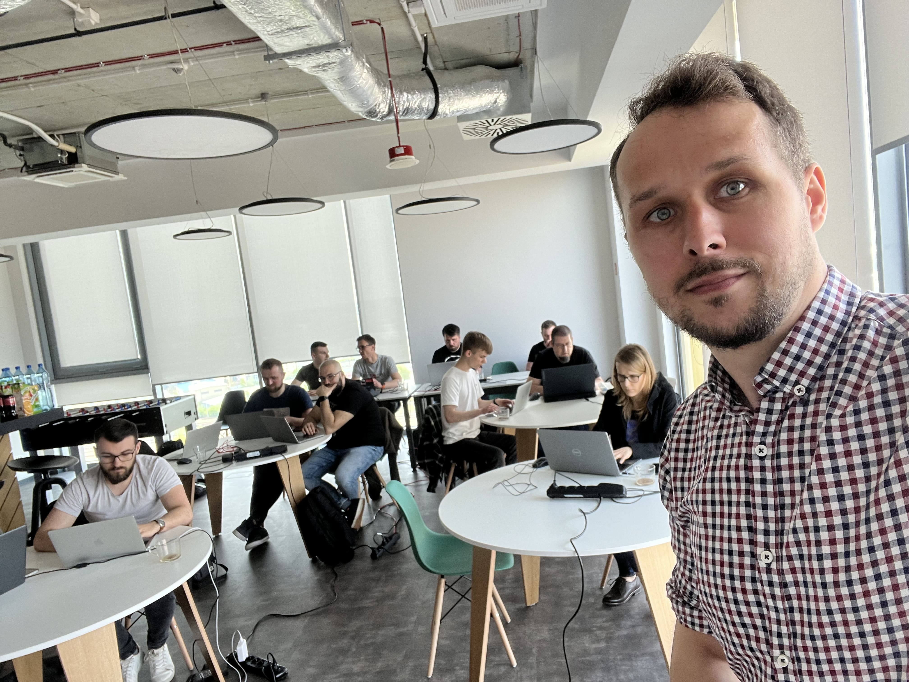

**is the most effective way to learn Event Sourcing and Event-Driven Architectures.** I designed **two workshops** that should give you good **foundations** and a set of **skills** for a **practical** and pragmatic start to your **journey**.
- [Practical Introduction to Event Sourcing](#practical-introduction-to-event-sourcing)
- [Event-Driven Architecture: The Light and the Dark Side](#event-driven-architecture-the-light-and-the-dark-side)

You'll understand the best practices and tradeoffs, being ready to apply them to your project.

**Want to have the training in your company?** Have any questions or want custom one? 

**[Contact me!](mailto:oskar@event-driven.io)**

I perfectly remember how I started my journey with Event-Driven Architecture and Event Sourcing. I was banging my head against the wall. I thought it was pointless. However, I was stubborn, and it turned out that it was not as difficult as the available materials had painted it.

The main reason is the lack of decent practical learning materials. For several years I have been trying to cover it up by documenting and sharing my path and the knowledge I have gained.

Now you also have the opportunity to take advantage of it! Without hitting your head against a wall. 

I run trainings both online and in person (in your office or a dedicated venue).

## Practical Introduction to Event Sourcing

🛠️ **Description:** Event Sourcing allows you to create business-related applications. Recording events (facts) about the business process gives a complete understanding of your workflow and reflects them in the code. It's developed a reputation for being a complicated pattern that's challenging to apply in real systems. We examine the reasons for those misconceptions, and spend the time to help you understand common traps. The workshop will be hands-on and teach you how to use Event Sourcing, giving you solid foundations. Exercises will be run in C#, Java or NodeJS.

🧑‍🎓 **Outcomes:**
- Good understanding of all the building blocks of Event Sourcing,
- When and how to use it and what benefits it brings,
- How to reflect your business logic in the code using events,
- Differences to the classical approach,
- Using tools such as Marten and EventStoreDB, and understanding the differences between them,
- How to use Event Sourcing on your system,
- Challenges related to Event Sourcing and recommended solutions.

⏱️ **Length:** 2-3 days

📅 **Plan:**
1. Introduction to Event Sourcing. Basic terminology (event, stream of events, command), differences from the classical approach.
2. What is Event Sourcing, and how is it different from Event Streaming. Advantages and disadvantages.
3. Write model and data consistency guarantees.
4. Various ways of handling business logic: Aggregates, Command Handlers, functional approach.
5. Projections and best practices for building read models.
6. Challenges in Event Sourcing and EDA: delivery guarantees, event processing order, idempotency, etc.
7. Saga, Choreography, Process Manager, handling distributed processes.
8. Event Sourcing in the context of application architecture, integration with other approaches.
9. Good and bad practices in modelling and handling events.
10. Event Sourcing in production, evolution, event versioning, etc.

📧 [Contact me for more information.](mailto:oskar@event-driven.io)

## Event-Driven Architecture: The Light and the Dark Side

🛠️ **Description:** Event-driven architectures help build predictable, scalable, and fault-tolerant systems. In addition, they improve both the technical autonomy of created systems and the teams working on them. However, like any architecture, it has distinctive features that can cause far-reaching complications if not understood well.

🧑‍🎓 **Outcomes:** The training aims to build the knowledge of the general concept and its patterns for the participants. The emphasis will be on a pragmatic understanding of architectures and tools rather than specific implementations. The acquired knowledge will allow for the conscious design of architectural solutions and the analysis of related risks. You'll also learn how tools like RabbitMQ, Kafka, and Cloud-Native messaging systems differ and how selecting them can impact your architecture.

Additionally, the training will include a workshop part (in the form of a team "Architecture Kata"), where you will practice your theoretical knowledge. The training involves:
- Interaction and discussion with participants.
- Exchanging views.
- Asking questions based on current problems.

⏱️ **Length:** 2-3 days

📅 **Plan:**
1. Introduction and basic concepts (events, commands, business flows).
2. Comparison with the classical approach of synchronous communication.
3. Message delivery guarantees: how to ensure reliable communication between services.
4. Messaging idempotency: what to do when we get messages more than once.
5. The order of events, why is it essential, and when you can live without it.
6. Types of data consistency: Strong, Eventual, Causal Consistency.
7. CQRS, facts and myths, why it is useful.
8. Projections and how to create read models based on events.
9. Distributed transactions versus patterns such as Saga, Process Manager, Choreography.
10. Auditability, metrics, tracing.
11. Basics of Event Sourcing.
12. How (not) to model events.
13. Migration (versioning) of the event schema.
14. Ways of transforming/migrating from systems based on synchronous communication to architectures based on events.

📧 [Contact me for more information.](mailto:oskar@event-driven.io)