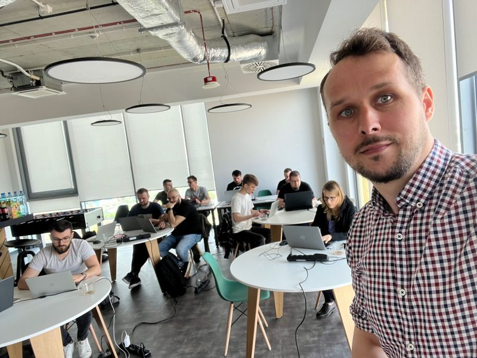

**Szkolenie jest najbardziej efektywną formą zrozumienia Event Sourcing i Architektur Opartych na Zdarzeniach.**

Pamiętam doskonale jak zaczynałem swoją drogę z Event Sourcing i Architekturami Opartymi na Zdarzeniach. Uderzałem głową w ścianę, uważałem, że jest on bez sensu. Byłem jednak uparty i okazało się, że nie takie to trudne jak go malują. 

Przyczyną główną jest brak dobrych PRAKTYCZNYCH materiałów do nauki. Od kilku lat próbuję to zasypać dokumentując i dzieląc się swoją drogą i wiedzą, którą zdobyłem.

Teraz Ty też masz okazję z niej skorzystać! Bez bicia głową w ścianę. **Przygotowałem dwa warsztaty które dadzą Ci dobre dobre fundamenty i podstawy oraz zestaw umiejętności do PRAKTYCZNEGO i pragmatycznego rozpoczęcia swojej drogi.**
- [Praktyczne Wprowadzenie do Event Sourcing]()
- [Architektury Oparte na Zdarzeniach: Ciemne i Jasne Strony]()

Zrozumiesz najlepsze praktyki, oraz konieczne kompromisy, będąc gotowym do zaaplikowania ich do swojego projektu.

**Chesz mieć trening w swojej firmie?** Masz jakieś pytania, albo chcesz bardziej dopasowany pod Ciebie? [Skontaktuj się ze mną!](mailto:oskar@event-driven.io)

## Praktyczne Wprowadzenie do Event Sourcing

**Opis:** Event Sourcing umożliwia tworzenie aplikacji bliskich biznesowi. Dzięki rejestrowaniu zdarzeń (faktów) dotyczących procesu biznesowego uzyskujemy pełne zrozumienie przepływu i odzwierciedlenie go w kodzie. Event Sourcing niesłusznie uważany jest za skomplikowany wzorzec, który trudno zastosować w praktyce. Szkolenie dzięki dużej liczbie praktycznych ćwiczeń nauczy Cię, jak korzystać z Event Sourcing, dając solidne podstawy do dalszej pracy. Ćwiczenia będą prowadzone w C#, Javie lub NodeJS.

**Wynik:**
- Dobre zrozumienie wszystkich elementów Event Sourcing,
- Kiedy i jak z niego korzystać oraz jakie przynosi korzyści,
- Jak odzwierciedlić logikę biznesową w kodzie za pomocą zdarzeń,
- Różnice w stosunku do klasycznego podejścia,
- Przedstawienie różnych nardzędzi, takich jak Marten i EventStoreDB oraz różnice między nimi,
- Jak korzystać z Event Sourcing w swoim systemie,
- Wyzwania związane z Event Sourcingi i rekomendowane rozwiązania.

**Długość:** 2-3 dni

**Plan:**
1. Wprowadzenie do Event Sourcing. Podstawowa terminologia (zdarzenie, strumień zdarzeń, komenda), różnice w stosunku do podejścia klasycznego.
2. Co to jest Event Sourcing i czym różni się od Event Streamingu. Zalety i wady.
3. Model zapisu oraz gwarancje spójności danych.
4. Różne sposoby obsługi logiki biznesowej: Agregaty, Command Handlery, podejście funkcyjne.
5. Projekcje i najlepsze praktyki tworzenia modelu odczytu.
6. Wyzwania w Event Sourcing i EDA: gwarancje dostarczalności, kolejność przetwarzania zdarzeń, idempotencja itp.
7. Saga, Choreografia, Process Manager, czyli obsługa procesów rozproszonych.
8. Event Sourcing w kontekście architektury aplikacji, integracja z innymi podejściami.
9. Dobre i złe praktyki w modelowaniu i obsłudze zdarzeń.
10. Event Sourcing na produkcji, ewolucja i wersjonowanie wydarzeń itp.

## Architektury Oparte na Zdarzeniach: Ciemne i Jasne Strony

**Opis:** Architektury oparte o zdarzeniach pomagają budować przewidywalne, skalowalne i odporne na błędy systemy. Ponadto poprawiają zarówno autonomię techniczną tworzonych systemów, jak i pracujących nad nimi zespołów. Jednak jak każda architektura ma charakterystyczne cechy, które mogą powodować daleko idące komplikacje, jeśli nie zostaną dobrze zrozumiane.

**Wynik:** Szkolenie ma na celu zbudowanie wiedzy o ogólnej koncepcji i jej wzorcach dla uczestników. Zdobyta wiedza pozwoli na świadome projektowanie rozwiązań architektonicznych i analizę zagrożeń z tym związanych. Nacisk zostanie położony na pragmatyczne zrozumienie architektur i narzędzi, a nie na konkretne implementacje. Dowiesz się również, jak różnią się narzędzia takie jak RabbitMQ, Kafka i Cloud-Native systemy przesyłania wiadomości i jak ich wybór może wpłynąć na Twoją architekturę.

Dodatkowo szkolenie będzie zawierało część warsztatową (w formie „Architekture Kata”), podczas której przećwiczysz swoją wiedzę teoretyczną. Szkolenie obejmuje:
- Interakcja i dyskusja z uczestnikami.
- Wymiana poglądów.
- Zadawanie pytań na podstawie bieżących problemów.

**Długość:** 2-3 dni

**Plan:**
1. Wprowadzenie i podstawowe pojęcia (zdarzenia, komendy, przepływy biznesowe).
2. Porównanie z klasycznym podejściem komunikacji synchronicznej.
3. Gwarancje dostarczania wiadomości: jak zapewnić niezawodną komunikację między usługami.
4. Idempotencja wiadomości: co zrobić, gdy otrzymujemy wiadomości więcej niż raz.
5. Kolejność zdarzeń, dlaczego jest niezbędna i kiedy można bez niej żyć. 
6. Rodzaje spójności danych: Strong, Eventual, Causal Consistency.
7. CQRS, fakty i mity, dlaczego jest przydatny.
8. Projekcje i tworzenie modeli odczytanych na podstawie zdarzeń.
9. Transakcje rozproszone a wzorce takie jak Saga, Process Manager, Choreografia.
10. Audytowalność, metryki, śledzenie.
11. Podstawy Event Sourcing.
12. Jak (nie) modelować zdarzeń.
13. Migracja (wersjonowanie) schematu zdarzenia.
14. Sposoby transformacji/migracji z systemów opartych na komunikacji synchronicznej do architektur opartych na zdarzeniach.