**Event-driven architecture helps you reflect the business process in code and makes it easier to work with the business. It can also reduce dependencies between parts of the system, but only if the system is split well.**

**Without good modelling, you get the worst kind of dependencies: hidden ones.** Services look independent, yet a change in one breaks another.

A good model is only half the job, though. EventStorming sticky notes won't tell you whether you need a queue, or what happens when a message arrives twice or out of order.

They won't tell you how to change a contract without breaking another team's service either. The team discusses the business process together, and then everyone goes back to the code and decides alone how to coordinate the process, which queue to use and how to ensure delivery, ordering, consistency and idempotency. The consequences of those decisions usually show up only in production, when messages get lost, duplicated or processed in the wrong order.

In this workshop, we'll go all the way from business requirements, through the process model and the technical model, to the implementation. Step by step, we'll look at how requirements shape the technical solution. How do you split a system so that the dependencies between its parts are explicit? When does a queue help, and when does it only add complexity? How do you provide the guarantees the business actually needs? How do you test a flow and catch incompatible contract changes before another team notices them?

Throughout the workshop, we work on a single distributed business process, from the first sticky note to running code. We also cover some topics with smaller, separate examples.

**No long lectures.** Instead, there are lots of small tasks and group work. EventStorming and other modelling techniques aren't the goal here. They're tools for talking about the process and about how to turn the model into a working system. Participants in previous editions most often named exactly this path, from EventStorming to code examples, as the most useful part of the workshop.

Along the way, we'll also look at where GenAI helps with modelling and implementation, and where its output needs careful checking.

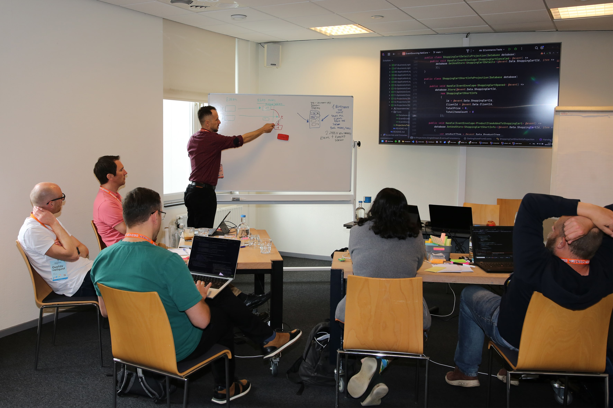

**23 and 24 November, and 30 November and 1 December 2026, online, in English, PLN 699 EUR.**

****

## What you'll learn

**After the workshop, you'll know how to:**
- understand what event-driven architecture really is, and what it isn't
- work with requirements and talk to the business so that you understand the process, not just list its features
- explore the domain step by step with EventStorming and Example Mapping instead of trying to model everything at once
- model the full process flow and draw boundaries in it so that dependencies between parts of the system are explicit
- look at the process up close and from a distance, and focus on what matters most at a given moment
- point out consistency and concurrency issues on the model and discuss them
- simulate how the system behaves on timelines and examples before any code is written
- decide whether you need a queue, and if so, which one and with what consequences
- ensure message delivery, correct ordering and idempotency, among others with the Outbox pattern
- coordinate a process in code with a Saga or a Process Manager
- test event-driven flows and catch incompatible contract changes
- fit the solution into your application architecture, for example CQRS or hexagonal architecture

## Is this workshop for you?

**Yes, if you see any of these problems in your project:**
- after an EventStorming session, you have a full board, but nobody knows how to turn it into code
- queues end up in the system because "that's how it's done", not because you need them
- services were meant to be independent, yet every bigger change requires deploying several of them at once
- messages get lost, duplicated or arrive in a different order than your code expects
- a change to one event breaks another team's service, and you find out in production
- conversations about delivery guarantees and consistency end with "it'll be fine" or "Kafka will handle it"
- the business process is split across several services, and nobody sees it as a whole

The workshop is for developers, tech leads and architects who design event-driven systems, are starting to build them or have to maintain them. I've prepared the exercises in Java, TypeScript and C#, so you'll work in a language you know.

**This workshop isn't for you** if you're looking for a course on a specific message broker or a lecture full of definitions.

## How it works

**The workshop is based on practice, not lectures.** You'll learn the theory by solving tasks. They're short, and there are plenty of them. Each one ends with a discussion and a decision that the next one builds on. For most problems, I'll show you several solutions, because in event-driven architecture there's rarely a single right one.

- **Cohort format.** We meet over two weeks, two days each week, from 9:00 to 15:00 CET. The workshop is intensive and demanding, so the break between the weeks gives you time to put everything in order and come back with questions.
- **Discord group.** Throughout the workshop, you'll have access to a group for participants. I'm there too and answer questions as they come up.
- **A small group of 5 to 12 people**, so I can work with every team. The workshop will go ahead once at least 5 people have signed up.
- **Online, on Zoom, in English.** We model on a shared Miro board. The workshop won't be recorded.
- **After the workshop, you'll get** the code repository, access to the Miro board with the results of our work, an ebook on modelling event-driven workflows and additional materials grouped by topic.

****

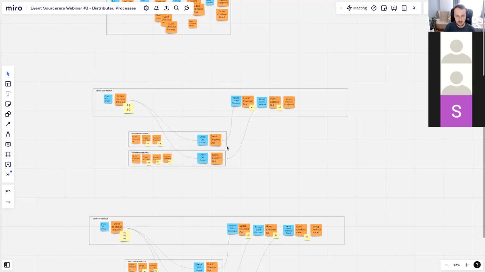

## Agenda

**Day 1: The business process**

1. Working with requirements and with the business: how to understand the process, not just list its features
2. EventStorming and Example Mapping: exploring the domain step by step and talking about the process
3. The process as the starting point for EDA: a good model makes implementation easier, and implementation shows what the model is missing

**Day 2: From process to model**

1. Modelling the full process flow
2. Drawing boundaries and coordination
3. Zooming in and out: how to focus on the process you're working on without losing sight of the whole
4. Consistency and concurrency on the model: how to show them and how to discuss them
5. Simulating how the system behaves before implementation: Temporal Modelling and working with examples

**Day 3: Implementation**

1. Process implementation styles, including Saga and Process Manager
2. Delivery guarantees, ordering and idempotency in code
3. Outbox and other technical ways to keep the guarantees
4. Types of queues (RabbitMQ, Kafka, cloud services and others), the consequences of choosing them, and topology

**Day 4: Reliability and architecture**

1. Testing event-driven flows
2. Contracts and catching incompatible changes
3. Fitting the solution into the architecture: CQRS and hexagonal architecture

## About me

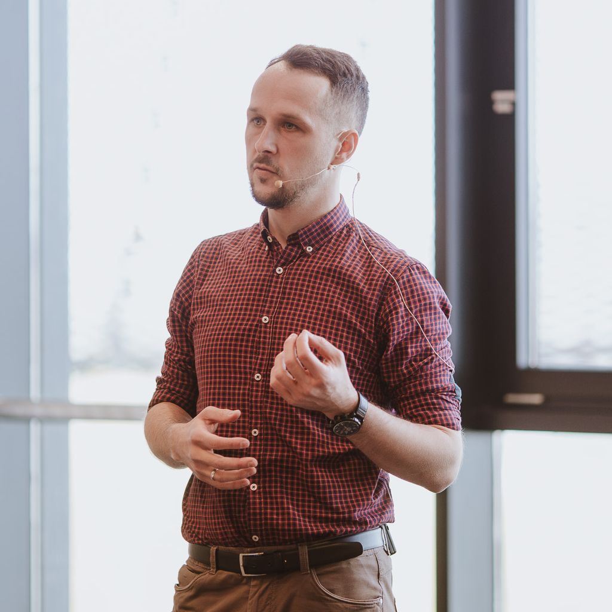

**I'm an independent architect and consultant, and I've been designing and building business systems for over 18 years.** I help teams design event-driven systems and run training on Event Sourcing, CQRS and Event-Driven Architecture. I've applied these approaches in my own projects. I've seen how they make systems easier to scale and maintain, and also where they stop paying off.

Business processes are rarely easy to understand. Knowledge about them is spread across many people, and requirements arrive in fragments. Event-driven architecture helps put them in order and reflect them in code. Even when you manage to model them well, you still have to translate the model into architecture and implementation, and that's a challenge of its own. This workshop covers both.

I also know the problems covered in this workshop from the tooling side. I created [Emmett](https://event-driven-io.github.io/emmett/), I was one of the maintainers of [Marten](https://martendb.io/) and I contributed to [EventStoreDB](https://developers.eventstore.com/). On [GitHub](https://github.com/oskardudycz/), I share samples and exercises in .NET, Node.js and Java.

I write regularly about the workshop topics on this blog and in the [Architecture Weekly](https://www.architecture-weekly.com/) newsletter, for example:
- [Outbox, Inbox patterns and delivery guarantees explained](/en/outbox_inbox_patterns_and_delivery_guarantees_explained/)
- [Saga and Process Manager: distributed processes in practice](/en/saga_process_manager_distributed_transactions/)
- [Handling Events Coming in an Unknown Order](/en/strict_ordering_in_event_handling/) and [Idempotent Command Handling](/en/idempotent_command_handling/)
- [Simple patterns for events schema versioning](/en/simple_events_versioning_patterns/) and [Announcing Strictland, a contract testing library for message compatibility](/en/announcing-strictland-contract-testing/)
- [The one where Oskar explains Example Mapping](/en/intro_to_example_mapping/)

## 📆 Dates and price

**Week 1:** 23 and 24 November 2026

**Week 2:** 30 November and 1 December 2026

All sessions run from 9:00 to 15:00 CET. The workshop is run in English.

**Price: EUR 699 + VAT.**

Limited to 12 places. The workshop will go ahead once at least 5 people have signed up.

****

## What you'll gain

**Less guesswork during implementation.** You'll read from the process model whether you need a queue, which one and with what guarantees. Those decisions get made at the design stage, not after the first outage.

**Fewer bugs that only show up in production.** Lost and duplicated messages, the wrong processing order or broken contracts between services rarely show up in unit tests. You'll learn to predict them on the model and catch them in tests.

**A model you can discuss with both the business and your team.** The outcome of EventStorming becomes a shared source of knowledge about the process. The business sees its process in it, and the team sees a starting point for implementation.

**Arguments instead of opinions.** In architecture reviews, you'll be able to explain what the team gains and loses by choosing a specific queue, coordination style or level of consistency, instead of saying "that's how it's done".

**You'll find it easier to assess what AI has generated.** When you know which guarantees the process needs, you also know where to look for problems in generated code.

**You'll leave with tools, not just notes.** You can use the workshop code and the Miro board in your own project and team straight away.

****

## Testimonials

See what participants say about [my workshops](https://www.linkedin.com/in/oskardudycz/details/recommendations/?detailScreenTabIndex=0):

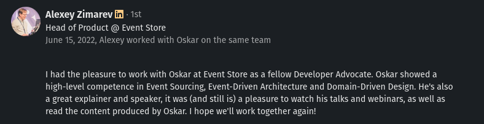

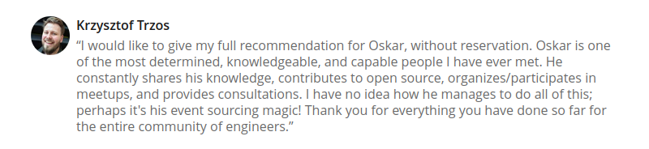

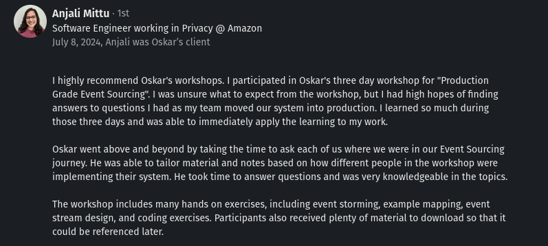

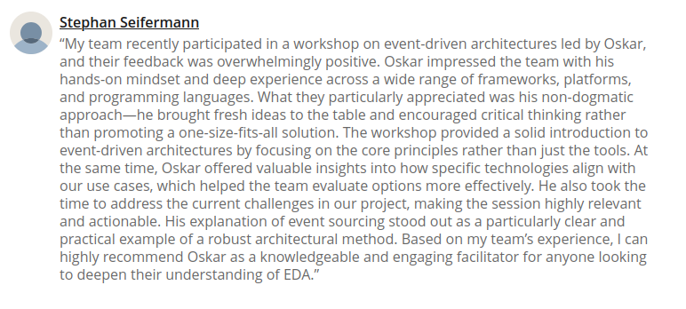

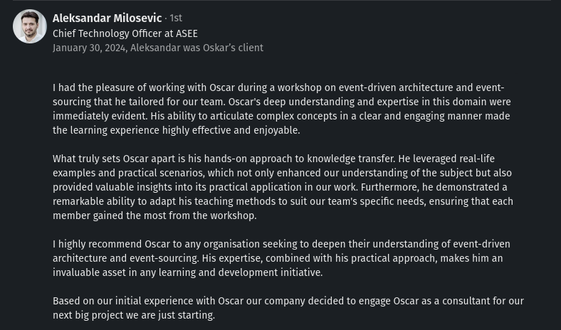

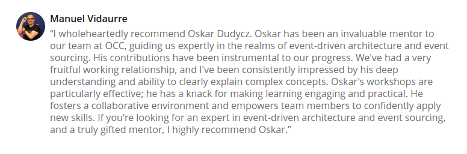

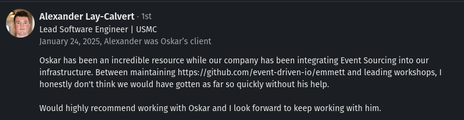

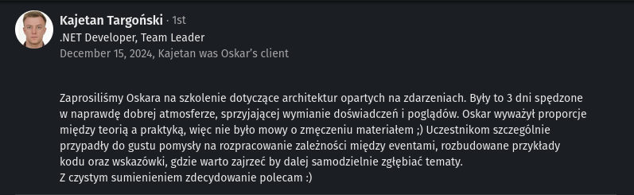

**So, have I convinced you?**

****

## Frequently asked questions

**Can I get an invoice?**

Yes. I issue VAT invoices, so you can easily put the workshop through your company.

**What language is the workshop run in?**

English. You don't need to speak it perfectly. It's enough that you can comfortably read documentation and hold your own in a discussion.

**What experience do I need?**

I designed the workshop with mid-level and senior developers in mind. If you've already built a few systems, you'll feel at home.

**Which programming language will I use?**

You pick one of three: Java, TypeScript or C#. I've prepared the exercises in each of them, so you can work in the one you use every day.

**Why does the workshop run over two weeks rather than four days in a row?**

There's a lot of material, and participants in previous editions told me they needed time to put it all in order. The break between the weeks gives you that time. You can ask any questions that come up on Discord or at the start of the second week.

**How does the online format work?**

We meet on Zoom and model together on a shared Miro board. You'll spend most of the time working in groups, and I drop in, help out and answer questions.

**Will the workshop be recorded?**

No, but you'll have plenty to come back to: the code repository, the Miro board, the ebook and additional materials.

**How many people will take part?**

Between 5 and 12. That's enough to work in groups, and few enough for me to have time for everyone.

**What happens if fewer than 5 people sign up?**

You're not taking any risk. I only collect payments once at least 5 people have signed up. If the workshop still doesn't take place, I'll refund the full amount.

**When and how do I pay?**

Sign up first. Once I confirm that the group is complete, I'll send you the payment details. You don't pay anything until then.

**Are there any discounts, for example for several people from the same company?**

No. The price is the same for everyone, whether you're signing up just yourself or your whole team.

**Can I cancel?**

Yes, if something beyond your control, such as illness, stops you from attending. Let me know, and if the reason is valid, I'll refund your payment.

**Will I get a certificate of completion?**

Yes, you'll receive it after the workshop.
