**Event Sourcing jest bardzo kuszącym wzorcem. Pozwala śledzić wszystkie fakty biznesowe. Nie tracimy żadnej informacji biznesowej.** Dzięki temu zyskujemy obserwowalność naszego przepływu biznesowego. Jesteśmy w idealnej pozycji, aby zebrać informacje na temat obecnego zachowania systemu i odpowiedzieć na pytania i wyzwania jutra.

**Jednak Event Sourcing stawia również nowe wyzwania przed zespołami programistycznymi. Pojawiają się pytania typu:**
- Jak zapewnić gwarancje trwałości danych? 
- Jak modelować zdarzenia?
- Jak implementować logikę biznesową?
- Który event store wybrać?
- Jaka jest właściwa wielkość i szczegółowość zdarzeń? 
- Czy używać "snapshoty"?
- Jak tworzyć modele odczytu?

Wszystkie te wyzwania nie są trudne same w sobie, ale ich nagromadzenie może przytłoczyć.

Event Sourcing wymaga nowego zestawu praktyk i uzyskania pewności siebie w projektowaniu, budowaniu i utrzymaniu trwałych systemów.

**Ten praktyczny warsztat ma na celu zbudowanie tej pewności, stopniowo wprowadzając uczestników do Event Sourcing poprzez działania praktyczne.**

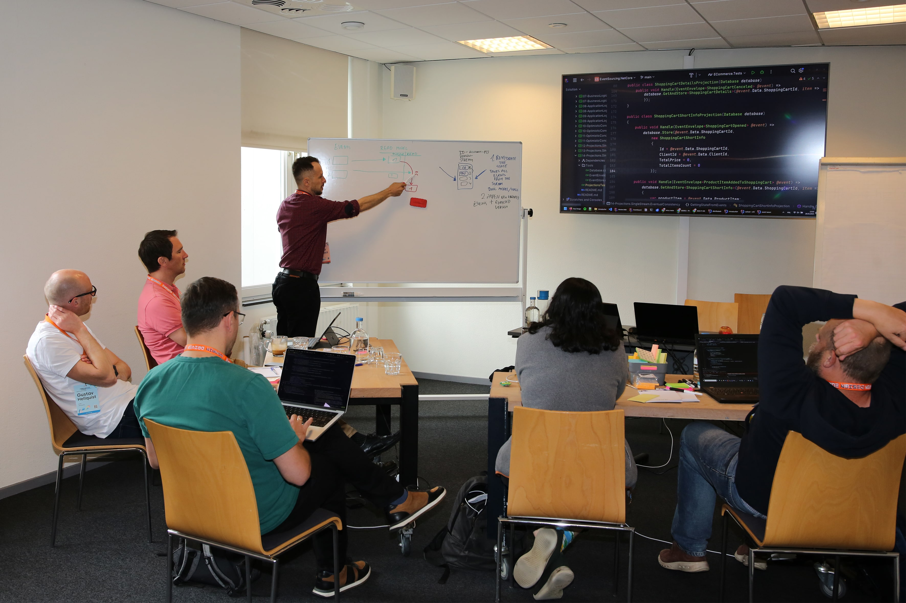

## Czego się nauczysz?

**Po warsztatach poznasz odpowiedzi na powyższe pytania, plus dowiesz się:**
- kiedy i jak używać Event Sourcing i CQRS oraz jakie korzyści to przynosi,
- jak odzwierciedlić logikę biznesową w kodzie za pomocą zdarzeń,
- jak modelować i implementować procesy biznesowe,
- różnice w stosunku do klasycznego podejścia,
- poznasz różne narzędzia, takie jak Emmett, Marten i EventStoreDB oraz różnice między nimi,
- jak wdrożyć Event Sourcing w swoim systemie,
- wyzwania związane z Event Sourcing i zalecane rozwiązania,
- Event Sourcing w połączeniu z CQRS, Vertical Slices i innymi wzorcami.

## O mnie

**Jestem niezależnym architektem i konsultantem specjalizującym się w tworzeniu systemów ściśle dostosowanych do potrzeb biznesowych.** Tworzę je od ponad 17 lat. Jestem pasjonatem projektowania solidnych systemów, narzędzi i struktur. Skupiam się na ułatwianiu ludziom życia za pomocą technologii.

**Jestem zwolennikiem Event Sourcing, CQRS i Event-Driven Architecture. Uważam, że ​​podejścia te zapewniają solidne podstawy do budowania skalowalnych i łatwych w utrzymaniu rozwiązań. Sprawdziłem to naocznie w swoich projektach.**

Oprócz doradztwa jestem aktywnym twórcą Open Source. Brałem udział w tworzeniu popularnych narzędzi Event Sourcing, takich jak [Emmett](https://event-driven-io.github.io/emmett/), [Marten](https://martendb.io/) i [EventStoreDB](https://developers.eventstore.com/). Regularnie dzielę się spostrzeżeniami, praktycznymi przykładami i osobistymi doświadczeniami na tym blogu, w newsletterze [Architecture Weekly](https://www.architecture-weekly.com/) i na [GitHub](https://github.com/oskardudycz/).

## Czy to szkolenie jest dla Ciebie?

Czy przeszło Ci kiedyś przez myśl:

> „Byłoby znacznie łatwiej, gdybyśmy mieli przeszłe dane. Łatwiej by było zrozumieć ten dziwny przypadek

Czy integrujesz już swoje systemy ze zdarzeniami i widzisz, że dłuższe ich przechowywanie może pomóc Ci poprawić obserwowalność, budować modele odczytu? 

Być może zacząłeś modelować za pomocą EventStorming i chcesz zobaczyć, jak odzwierciedlić swój model w kodzie?

Jeśli którykolwiek z tych punktów dotyczy Ciebie, zrozumienie Event Sourcing może poprawić projekt Twojego systemu i być cennym atutem.

Jeśli zbudowałeś już aplikacje w C#, Java lub Node.js i chciałbyś wynieść je na wyższy poziom, ten warsztat może być dla Ciebie.

Powinieneś mieć doświadczenie w budowaniu aplikacji przy użyciu C#, Java lub TypeScript, ale wszystkie tematy związane z Event Sourcing zostaną wprowadzone od początku. Nawet jeśli znasz Event Sourcing, wypolerowanie podstaw powinno pomóc Ci upewnić się, że niczego nie pominąłeś w nauce.

## Zasady gry

**Szkolenie będzie skupione na praktyce nie wykładach i teorii.** Dzięki praktycznym ćwiczeniom stopniowo poznasz teorię Event Sourcing poprzez praktykę. Będzie dużo zadań programistycznych, ale też modelarskich i praca w grupach. Ideą ćwiczeń jest wywołanie dyskusji, aby pogłębić zrozumienie tematów. Otrzymasz również sugerowane rozwiązania (zwykle kilka dla tego samego problemu). Zadania możesz wykonać samodzielnie lub grupowo z innymi.

Będziesz również modelować grupowe przepływy pracy biznesowej przy użyciu EventStorming i implementować ich wynik.

Warsztat koncentruje się na praktyce i doświadczeniu praktycznym, aby zapewnić Ci szybki start.

**Aby dać możliwość spokojnego przyswojenia wiedzy szkolenie będzie prowadzone metodą kohortową.** Oznacza to, że będzie odbywać się 3 tygodnie z rzędu. W każdym tygodniu dwie sesje po 4 godziny. Dzięki temu, pomiędzy tygodniami będziesz mieć czas na przemyślenie, spisanie pytań, dyskusję. **Aby to ułatwić w trakcie warsztatu będziesz mieć dostęp do dedykowanej grupy Discord dla uczestników. Ja będę również na niej starając się na bieżąco odpowiadać na Twoje pytania.**

**Szkolenie będzie się odbywało online przez platformę Zoom.**

Szkolenie nie będzie nagrywane, ale po jego zakończeniu dostaniesz mnóstwo materiałów dodatkowych z pogrupowanymi tematyką materiałami.

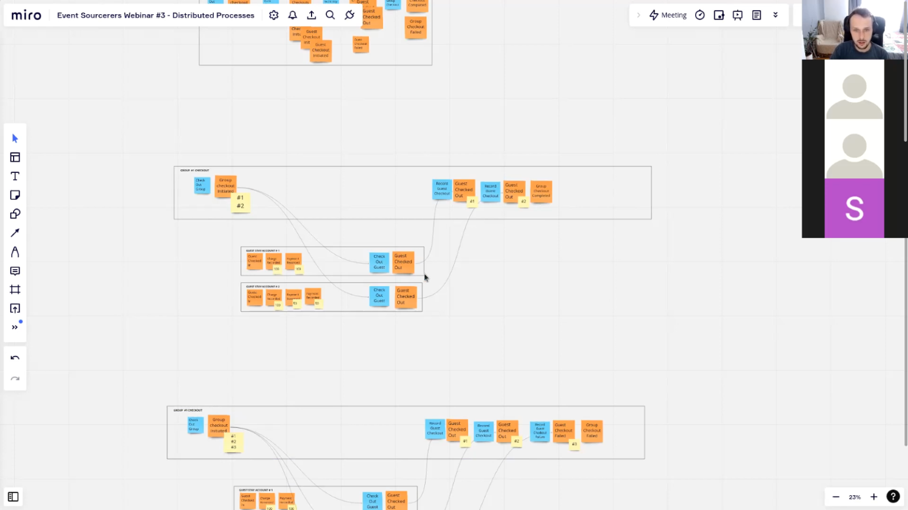

## Agenda

**Tydzień 1**

- Wprowadzenie do Event Sourcing. Podstawowa terminologia (zdarzenie, strumień zdarzeń, polecenie), różnice w stosunku do podejścia klasycznego.
- Różne sposoby obsługi logiki biznesowej: agregaty, podejście funkcyjne, itd.
- CQRS i warstwa aplikacji
- Gwarancje spójności modelu i danych.
- Dobre i złe praktyki w modelowaniu zdarzeń.
- Projekcje i najlepsze praktyki w budowaniu modeli odczytu.

**Tydzień 2**
- Modelowanie przepływów pracy Event Sourcing: Saga, Choreography, Process Manager, obsługa rozproszonych procesów.
- Wyzwania w Event Sourcing i EDA: gwarancje dostawy, kolejność przetwarzania zdarzeń, idempotentność itp.

**Tydzień 3**
- Event Sourcing na produkcji, 
- ewolucja i wersjonowanie zdarzeń,
- dokumentowanie zdarzeń,
- zaawansowane techniki modelowania i trzymania strumieni krótko żyjącymi.

## 📆 Terminy

**Sesje będą odbywały się w godzinach 9-13.**

Terminy szkoleń to:

**Tydzień 1:**
- 24.02.2025
- 25.02.2025

**Tydzień 2:**
- 3.03.2025
- 4.03.2025

**Tydzień 3:**
- 10.03.2025
- 11.03.2025

## Dlaczego warto wziąć udział w tym szkoleniu?

**Zbudujesz kompletną aplikację używając Event Sourcing.** Będzie to względnie prosta aplikacja, ale gotowa do użycia. Może być szablonem do stosowania Event Sourcing w Twoich systemach. 

Zdobędziesz przewagę konkurencyjną nad innymi, wiedząc, jak sprawić, by Twoje systemy były obserwowalne i śledzone. **Na obecnym rynku pracy taka wiedza może być cennym wyróżnikiem.**

Zrozumiesz gdzie używać i gdzie nie używać Event Sourcing. Zyskasz dobre fundamenty do podejmowania decyzji architektonicznych oraz dodatkowe materiały do dalszego poszerzenia wiedzy.

## Referencje

Jeśli powyższe Cię nie przekonało, zerknij na [opinie innych ludzi o moich warsztatach](https://www.linkedin.com/in/oskardudycz/details/recommendations/?detailScreenTabIndex=0):

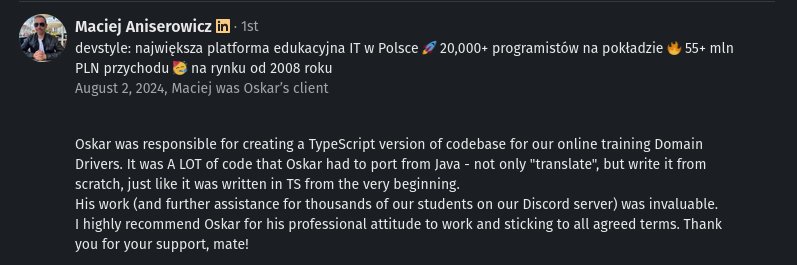

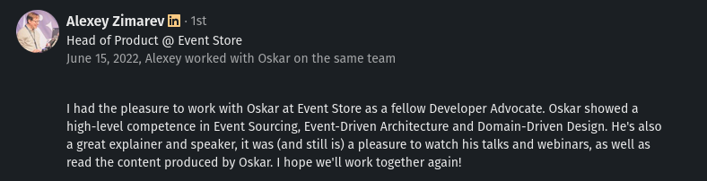

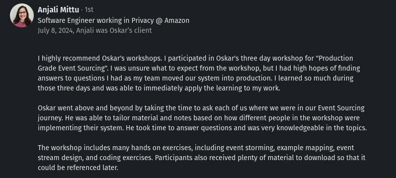

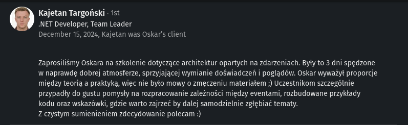

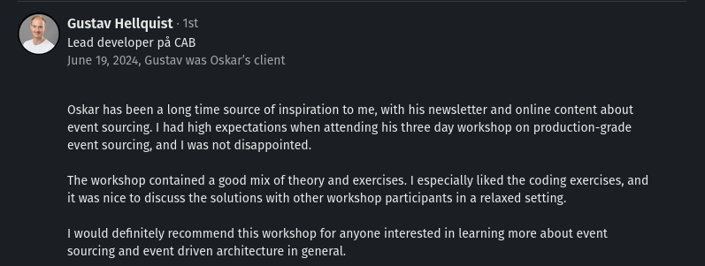

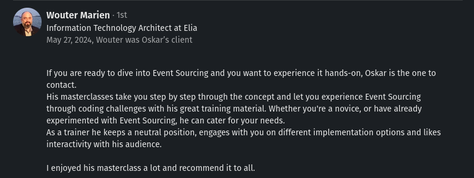

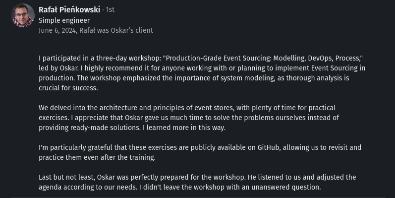

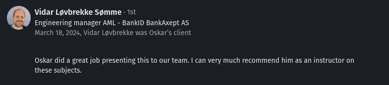

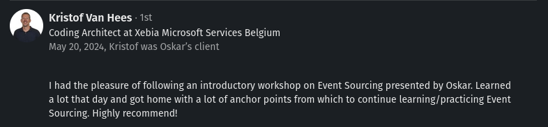

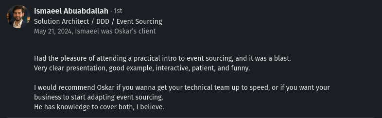

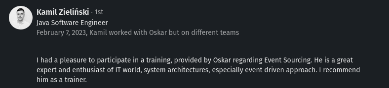

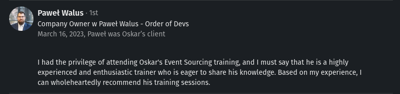

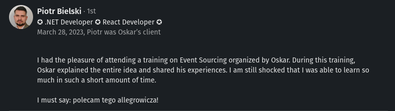

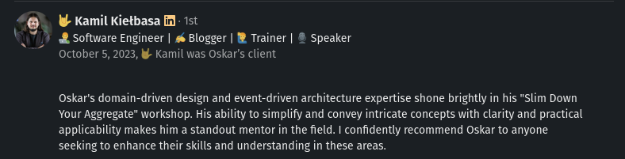

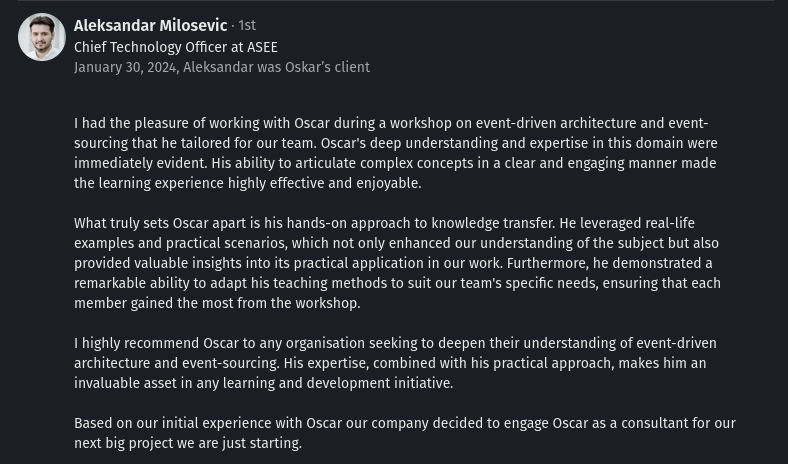

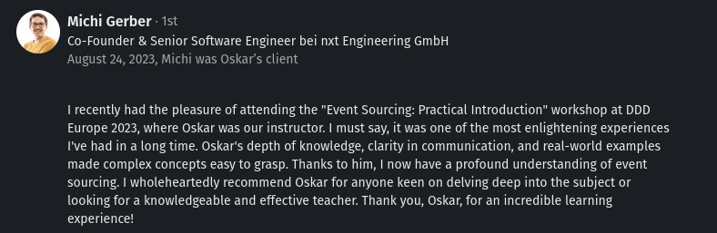

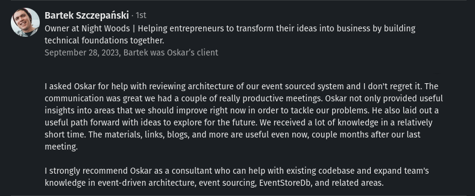

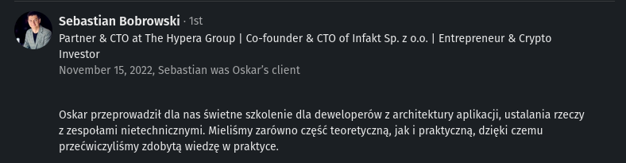

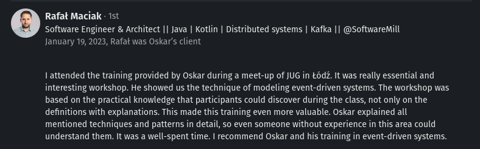

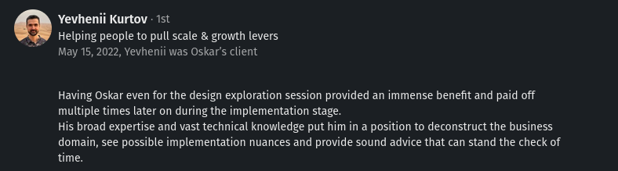

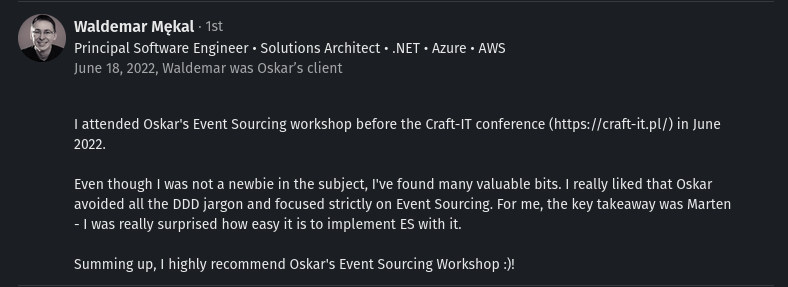