**Event Sourcing is an appealing pattern. It lets us track every business fact without losing business information.** This gives us visibility into our business processes. We can learn how the system behaves today and use that knowledge to answer tomorrow's questions and challenges.

**However, Event Sourcing also brings new challenges for development teams:**

- How can we guarantee data durability?
- How should we model events?
- How should we implement business logic?
- Which event store should we choose?
- How large and detailed should events be?
- Should we use snapshots?
- How should we build read models?

Each challenge is manageable on its own, but facing them all at once can feel overwhelming.

Event Sourcing requires a new set of practices and confidence in designing, building and maintaining durable systems.

**This practical workshop builds that confidence by introducing Event Sourcing step by step through hands-on exercises.**

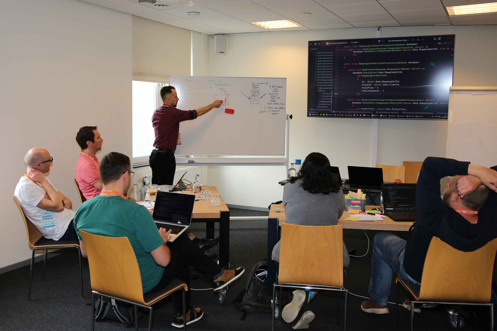

## What will you learn?

**After the workshop, you will know the answers to the questions above, as well as:**

- when and how to use Event Sourcing and CQRS, and the benefits they bring,
- how to express business logic in code using events,
- how to model and implement business processes,
- how this differs from the traditional approach,
- how tools such as Emmett, Marten and EventStoreDB work, and how they differ,
- how to introduce Event Sourcing into your system,
- common Event Sourcing challenges and recommended solutions,
- how to combine Event Sourcing with CQRS, Vertical Slices and other patterns.

**[Sign up](https://forms.gle/YxfhZ9wUQetX9iue8)**

## About me

**I am an independent architect and consultant specializing in systems that closely fit business needs.** I have been building them for over 17 years. I enjoy designing reliable systems, tools and frameworks, with a focus on making people's lives easier through technology.

**I advocate Event Sourcing, CQRS and Event-Driven Architecture. I believe these approaches provide a solid foundation for scalable, maintainable solutions, and I have seen that in my own projects.**

Alongside consulting, I actively contribute to open source. I have helped build popular Event Sourcing tools, including [Emmett](https://event-driven-io.github.io/emmett/), [Marten](https://martendb.io/) and [EventStoreDB](https://developers.eventstore.com/). I regularly share insights, practical examples and personal experiences on this blog, in [Architecture Weekly](https://www.architecture-weekly.com/) and on [GitHub](https://github.com/oskardudycz/).

## Is this workshop for you?

Have you ever thought:

> It would be much easier if we had the past data. We could understand this strange case more easily.

Are you already integrating your systems through events and noticing that keeping them longer could improve observability and help you build read models?

Perhaps you have started modelling with EventStorming and want to see how to express your model in code?

If any of these apply to you, understanding Event Sourcing can improve your system's design and become a valuable skill.

If you have built applications in C#, Java or Node.js and want to take them further, this workshop could be for you.

You should have experience building applications with C#, Java or TypeScript. All Event Sourcing topics will be introduced from the beginning. Even if you already know Event Sourcing, revisiting the fundamentals can help you check that you have not missed anything.

## How the workshop works

**The workshop focuses on practice rather than lectures and theory.** You will learn the theory of Event Sourcing gradually through practical exercises. There will be coding tasks, modelling exercises and group work. The exercises encourage discussion to deepen your understanding. You will also receive suggested solutions, usually several approaches to the same problem. You can complete the tasks individually or together with others.

You will also model business workflows as a group using EventStorming and implement the resulting models.

The workshop focuses on practical experience to help you get started quickly.

**To give you time to absorb the material, the workshop runs as a cohort over three consecutive weeks.** Each week has two four-hour sessions. Between weeks, you will have time to reflect, write down questions and discuss what you have learned. **During the workshop, you will have access to a dedicated Discord group for participants. I will also be there to answer your questions throughout the course.**

**The workshop takes place online over Zoom.**

The sessions will not be recorded. After the workshop, you will receive additional resources grouped by topic.

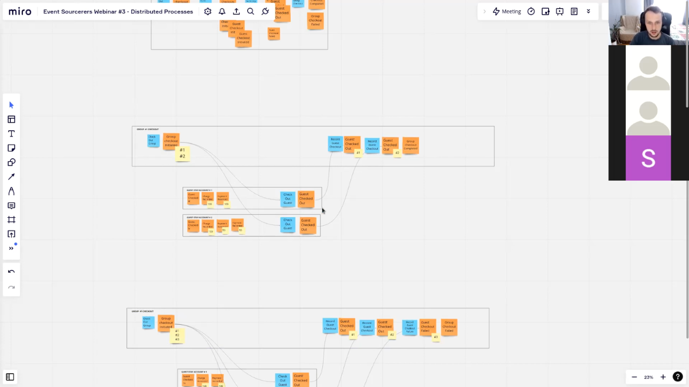

## Agenda

**Week 1**

- Introduction to Event Sourcing: basic terminology (event, event stream, command) and differences from the traditional approach.
- Different ways to handle business logic: aggregates, functional approaches and more.
- CQRS and the application layer.
- Model and data consistency guarantees.
- Good and bad practices in event modelling.
- Projections and best practices for building read models.

**Week 2**

- Modelling Event Sourcing workflows: sagas, choreography, process managers and distributed processes.
- Challenges in Event Sourcing and EDA: delivery guarantees, event processing order, idempotency and more.

**Week 3**

- Event Sourcing in production.
- Event evolution and versioning.
- Documenting events.
- Advanced modelling techniques and keeping streams short-lived.

## 📆 Dates

**Sessions run from 9:00 to 13:00.**

The workshop dates are:

**Week 1:**

- 24 February 2025
- 25 February 2025

**Week 2:**

- 3 March 2025
- 4 March 2025

**Week 3:**

- 10 March 2025
- 11 March 2025

**Workshop price: PLN 3,000 (+ VAT).**

## Why take this workshop?

**You will build a complete application using Event Sourcing.** It will be a relatively simple application, but ready to use. It can serve as a starting point for applying Event Sourcing in your own systems.

You will learn how to make your systems observable and traceable. **In today's job market, that knowledge can help you stand out.**

You will understand where to use Event Sourcing and where to avoid it. You will gain a solid foundation for architectural decisions and additional resources to continue learning.

**[Sign up](https://forms.gle/YxfhZ9wUQetX9iue8)**

## Recommendations

If you are still unsure, read [other people's recommendations of my workshops](https://www.linkedin.com/in/oskardudycz/details/recommendations/?detailScreenTabIndex=0):

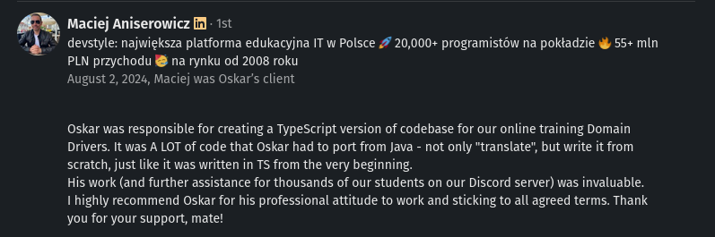

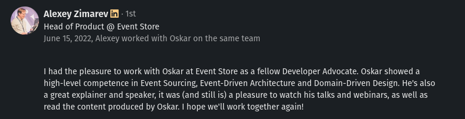

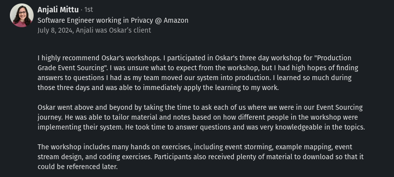

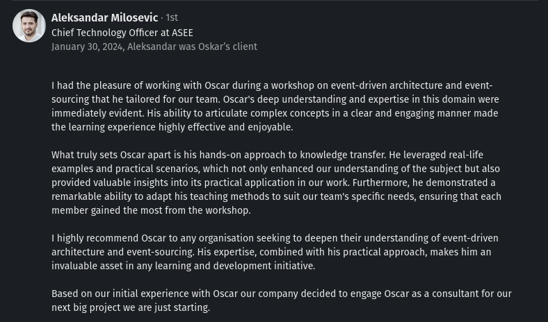

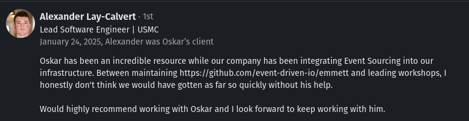

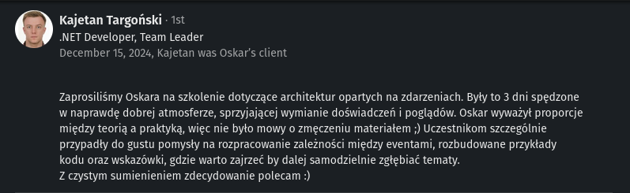

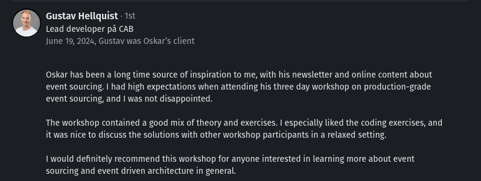

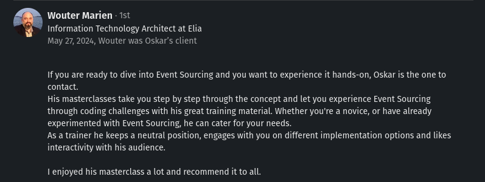

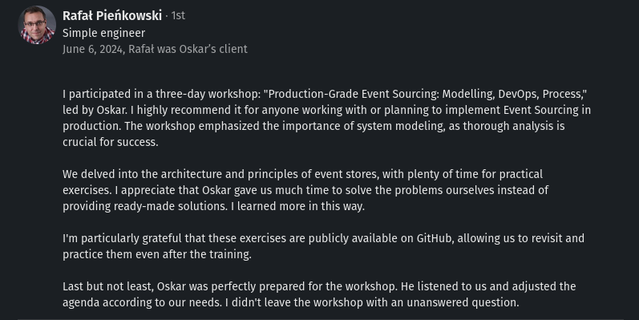

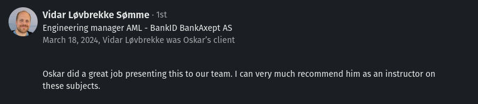

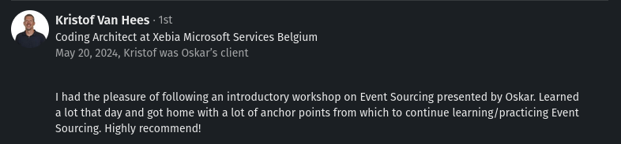

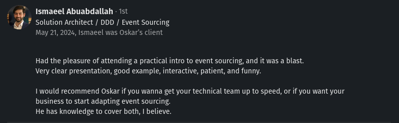

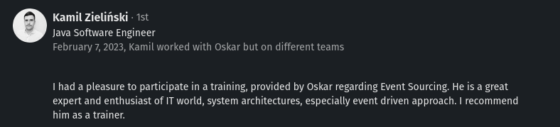

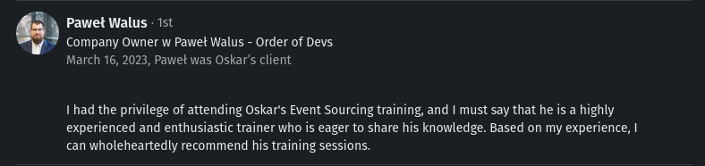

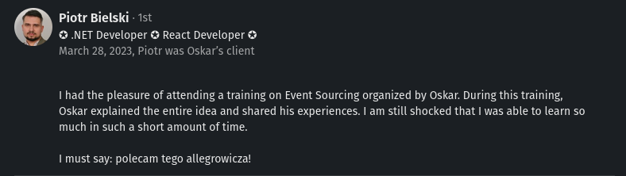

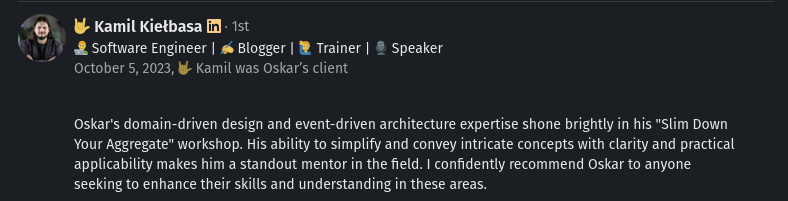

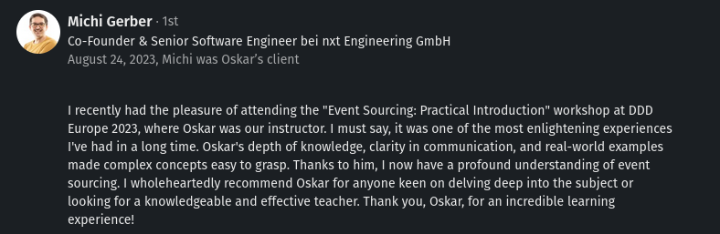

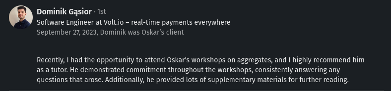

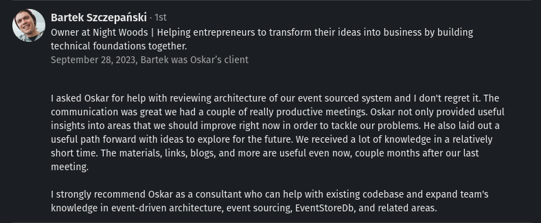

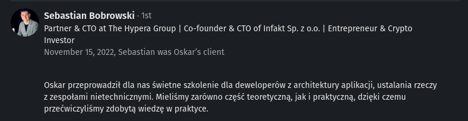

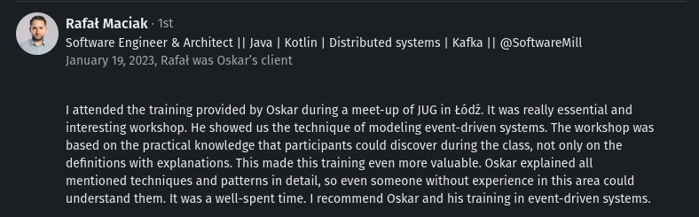

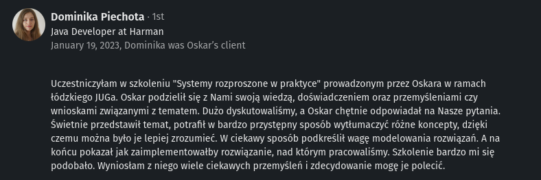

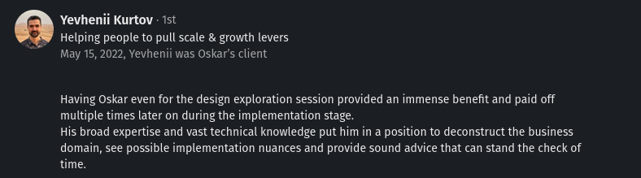

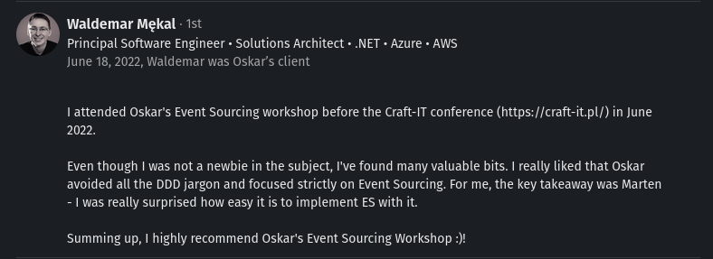

**Ready to join?**

**[Sign up](https://forms.gle/YxfhZ9wUQetX9iue8)**
