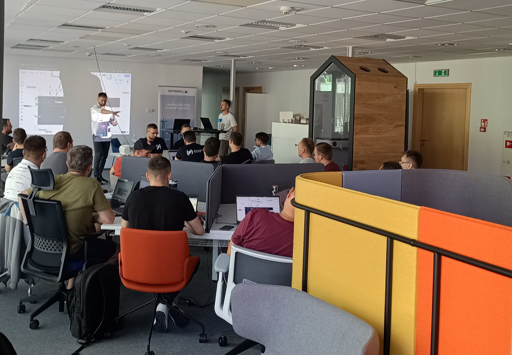
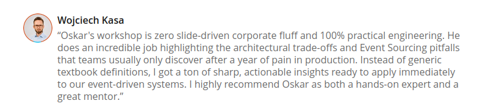
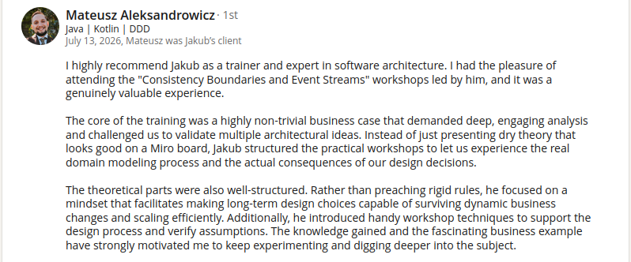
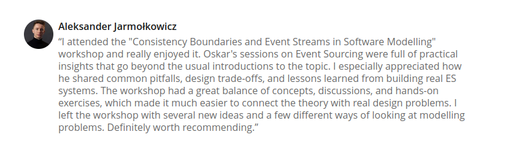
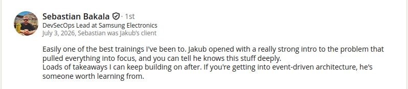
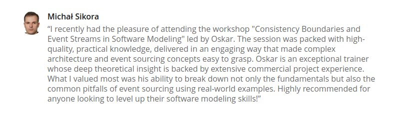

**AI can very quickly generate code that looks correct.**

**It's much harder for it to judge whether the generated model keeps the right consistency boundaries, business rules and concurrency guarantees.**

In this workshop, we'll show you how to spot problems that aren't visible at the level of a single class or method. They appear with parallel operations, at scale or when you change how data is stored, and they usually surface only in production, for example as duplicated or lost data.

We'll start with consistency boundaries: how to draw them when requirements are complex, and what happens when you get them wrong. Then we'll move on to processes and events. We'll put each element of a process, such as an order, a payment or a shipment, on its own timeline and simulate how messages flow between them. That way, race conditions and message-ordering issues become visible before any code is written. We'll check how the length of an event stream affects the model and why a snapshot isn't always the right answer.

You'll also see how to use AI as a modelling partner: not just to generate the implementation, but to challenge boundaries, find edge cases and test the model's assumptions.

**No slides with abstract examples.** Instead, you'll work in groups on complete problems and on running code, where we'll check the consequences of modelling and implementation decisions. We'll work on a complex example rather than a simplified one from a tutorial, because the problems we're talking about never show up in simple ones.

**29 and 30 October 2026, online, in Polish, PLN 2,000 + VAT.**

****

## What you'll learn

**After the workshop, you'll know how to:**
- split requirements into consistency, presentation and integration concerns instead of cramming everything into one model
- draw consistency boundaries based on lifecycle, the passage of time, concurrency and scale rather than textbook definitions
- handle cases where optimistic locking isn't enough
- avoid pitfalls around transactions, ORMs and ever-growing models
- assess how your database's capabilities shape the model, and when an extra abstraction layer only gets in the way
- model state as an event stream and keep stream length under control, also without snapshots
- model a process on timelines and simulate message flow before any code is written
- detect race conditions and consistency issues caused by the order in which messages are processed
- ensure idempotency, correct ordering and delivery guarantees
- build an AI skill that challenges your model and looks for edge cases instead of just generating code

## Is this workshop for you?

**Yes, if you see any of these problems in your project:**
- tests pass, but production ends up with duplicated or overwritten data
- the model grows with every requirement, and it's getting hard to say what must be consistent immediately and what can wait
- transactions span more and more tables, and locks are starting to slow the system down
- messages arrive in a different order than your code expects, and the system state drifts apart
- event streams keep growing, and you're not sure whether snapshots are the right answer
- you can't tell whether AI-generated code will handle concurrent requests correctly

The workshop is for developers, tech leads and architects who design business logic or review it. We've prepared examples and exercises in Java, TypeScript and C#, so you'll work in a language you know.

**What about AI?** An LLM will write code faster than you. But it doesn't know whether consistency or throughput matters more in your business. That's not a fact; it's a trade-off: more consistency means lower performance and scalability, and more coupling. In the workshop, you'll learn to recognise that trade-off, pass it to AI as context and check whether the generated code respects it.

**This workshop isn't for you** if you're looking for a lecture on DDD definitions or a tour of tools.

## How it works

**Forget textbook aggregate boundaries and definitions.** We'll draw consistency boundaries from scratch, starting with requirements and looking at lifecycle, the passage of time, performance, scalability, correctness and code readability.

- **We verify every decision in running code** in Java, TypeScript or C#.
- **There are two of us on both days.** One leads, the other works with the groups, answers questions and joins the discussions. We're both available to you throughout the workshop.
- **The group is limited to 20 people**, so we can work with every team. The workshop will go ahead once at least 8 people have signed up.
- **Online, on Zoom, in Polish.** The workshop won't be recorded.
- **After the workshop, you'll get** the code repository, access to the Miro board with our work, an AI skill for further work on your own model, an ebook on modelling event-driven workflows and additional materials grouped by topic.

****

## Agenda

**Day 1** (led by Jakub Pilimon)

1. Classes of problems in software modelling and how to spot them in complex requirements
- complex data queries and presentation, consistency, integrations
- where AI helps and where it needs good context
2. Units of consistency
- how to find the right boundaries and why the rest of the model depends on them
- modelling business rules and concurrency
3. Common modelling pitfalls that AI won't notice unless you point them out
4. Common implementation pitfalls: transactions, concurrency, ORMs, the size of your model
5. When optimistic locking isn't enough: more demanding concurrency cases
6. Persistence as part of the model: how database capabilities shape the design, and why hexagonal architecture is sometimes just marketing
7. AI as a partner in finding consistency boundaries: how to build a skill that helps rather than breaks the model

**Day 2** (led by Oskar Dudycz)

Timeline modelling draws on Event Storming and Example Mapping and is closest to Temporal Modelling. You can see it in action in [this webinar recording](https://www.architecture-weekly.com/p/webinar-3-implementing-distributed).

1. The same model, stored as events: which boundaries from day one still hold, and which need rethinking
2. Timelines instead of a canonical model: each element of the process has its own lifecycle
3. Simulating message flow on timelines
- where race conditions and ordering issues come from
- how to detect them before any code is written, and how to prevent them
4. From conceptual model to design: consistency boundaries and streams derived from lifecycles
5. Stream length, the model and performance
- why a snapshot isn't always the answer
- other strategies: shorter lifecycles, closing the books, splitting streams
6. Delivery guarantees and idempotency: how not to break consistency when a message arrives twice
7. AI in event modelling: checking quality, finding missing events and edge cases

## About the trainers

### Jakub Pilimon

**Independent software architect and consultant, specialising in architecture modernisation in very large organisations.** He advises companies and designs the architecture of strategic systems, as well as systems we all use every day.

He combines classic architecture and DDD with AI, which he uses to explore domains, run experiments and support architectural decisions. He follows a spec-driven approach: precise models, contracts and intent make AI a predictable tool rather than a random one.

He untangles legacy systems and builds architectures that can evolve without constant firefighting. He puts most of his attention into modelling and the meeting point of technology and business, because that's where architecture really shapes how an organisation works. He rescues projects that seem doomed to a rewrite (or a tragic death).

He's a mentor on the Droga Nowoczesnego Architekta and Legacy Fighter training programmes, a speaker at many developer conferences, and runs his own workshops.

### Oskar Dudycz

**Independent architect and consultant who has been designing and building business systems for over 18 years.** He helps teams design event-driven systems and runs training on Event Sourcing, CQRS and Event-Driven Architecture. He has applied these approaches in his own projects and has seen how they make systems easier to scale and maintain, and also where they stop paying off.

He also tackles the problems covered in this workshop from the tooling side. He created [Emmett](https://event-driven-io.github.io/emmett/), is one of the maintainers of [Marten](https://martendb.io/) and contributed to [EventStoreDB](https://developers.eventstore.com/). On [GitHub](https://github.com/oskardudycz/), he shares Event Sourcing samples and exercises in .NET, Node.js and Java.

He writes regularly about the workshop topics on this blog and in the [Architecture Weekly](https://www.architecture-weekly.com/) newsletter, for example:
- [Handling Events Coming in an Unknown Order](/en/strict_ordering_in_event_handling/)
- [Dealing with Race Conditions in Event-Driven Architecture with Read Models](/en/dealing_with_race_conditions_in_eda_using_read_models/)
- [Should you always keep streams short in Event Sourcing?](/en/should_you_always_keep_streams_short/) and [Implementing Closing the Books pattern](/en/closing_the_books_in_practice/)
- [Optimistic concurrency for pessimistic times](/en/optimistic_concurrency_for_pessimistic_times/) and [Idempotent Command Handling](/en/idempotent_command_handling/)

## 📆 Date and price

**29 and 30 October 2026**, from 9:00 to 15:00 CET on both days. The workshop is run in Polish.

**Price: PLN 2,000 + VAT.**

Limited to 20 places. The workshop will go ahead once at least 8 people have signed up.

****

## What you'll gain

**Writing code is getting cheaper. Decisions someone has to answer for are not.** AI will generate a handler in seconds, but someone still has to approve the PR and take responsibility for what happens in production. The workshop will help you make those decisions deliberately.

**You'll find it easier to assess what AI has generated.** When you know where the consistency boundaries are and where concurrency comes into play, you also know where to look for problems in generated code. That lets you hand bigger tasks to agents and still stay in control of the result.

**Fewer bugs that only show up in production.** Duplicated data, lost updates and deadlocks rarely surface in tests or code review. You'll learn to catch them earlier.

**A model you can discuss with the business.** Timelines and lifecycles are often closer to how the business thinks about a process than a class diagram is. They're easier to discuss and easier to turn into a design.

**Arguments instead of opinions.** In design reviews and conversations with the business, you'll be able to explain what the team gains and loses by choosing more consistency or more throughput, instead of saying "that's how it's done" or "ChatGPT said so".

**You'll leave with tools, not just notes.** You can use the workshop code, the Miro board and the AI skill in your own project and team straight away.

****

## Testimonials

See what participants say about our workshop:

**So, have we convinced you?**

****

## Frequently asked questions

**Can I get an invoice?**

Yes. We issue VAT invoices, so you can easily put the workshop through your company.

**What language is the workshop run in?**

Polish. Only some of the additional materials, such as the webinar recording, are in English.

**What experience do I need?**

We designed the workshop with mid-level and senior developers in mind. If you've already built a few systems, you'll feel at home.

**Which programming language will I use?**

You pick one of three: Java, TypeScript or C#. We've prepared the exercises in each of them, so you can work in the one you use every day.

**How does the online format work?**

We meet on Zoom and model together on a shared Miro board. You'll spend most of the time working in groups, and the two of us drop in, help out and answer questions.

**Will the workshop be recorded?**

No, but you'll have plenty to come back to: the code repository, the Miro board, the AI skill, the ebook and additional materials.

**How many people will take part?**

Between 8 and 20. That's enough to work in several groups, and few enough for everyone to get our attention.

**What happens if fewer than 8 people sign up?**

You're not taking any risk. We only collect payments once at least 8 people have signed up. If the workshop still doesn't take place, we'll refund the full amount.

**When and how do I pay?**

Sign up first. Once we confirm that the group is complete, we'll send you the payment details. You don't pay anything until then.

**Are there any discounts, for example for several people from the same company?**

No. The price is the same for everyone, whether you're signing up just yourself or your whole team.

**Can I cancel?**

Yes, if something beyond your control, such as illness, stops you from attending. Let us know, and if the reason is valid, we'll refund your payment.

**Will I get a certificate of completion?**

Yes, you'll receive it after the workshop.
