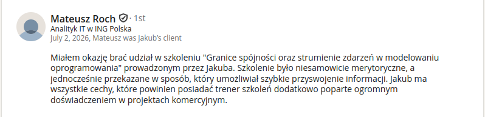

**AI potrafi bardzo szybko wygenerować kod, który wygląda poprawnie.** 

**Znacznie trudniej jest mu ocenić, czy wygenerowany model zachowuje właściwe granice spójności, reguły biznesowe i gwarancje współbieżności.**

Podczas warsztatu pokażemy, jak rozpoznawać problemy, których nie widać na poziomie pojedynczej klasy czy metody. Pojawiają się przy równoległych operacjach, dużej skali albo zmianie sposobu przechowywania danych, a ujawniają się zwykle dopiero na produkcji, na przykład jako zdublowane albo utracone dane.

Zaczniemy od granic spójności: jak je wyznaczyć, gdy wymagania są złożone, i co się stanie, gdy wyznaczymy je źle. Potem przejdziemy do procesów i zdarzeń. Każdy element procesu, na przykład zamówienie, płatność czy przesyłkę, rozrysujemy na osobnej osi czasu i zasymulujemy, jak płyną między nimi wiadomości. Dzięki temu sytuacje wyścigu (race conditions) i problemy z kolejnością przetwarzania widać, zanim powstanie kod. Sprawdzimy też, jak długość strumienia zdarzeń wpływa na model i dlaczego snapshot nie zawsze jest dobrą odpowiedzią.

Zobaczymy również, jak używać AI jako partnera w modelowaniu: nie tylko do generowania implementacji, ale do kwestionowania granic, wyszukiwania scenariuszy brzegowych i testowania założeń modelu.

**Nie będzie slajdów z abstrakcyjnymi przykładami.** Będą kompletne problemy rozwiązywane w grupach i działający kod, na którym sprawdzimy konsekwencje decyzji modelarskich i implementacyjnych. Będziemy pracować na złożonym przykładzie, a nie na uproszczonym z tutoriala, bo w takim nie pojawiają się problemy, o których mówimy.

**29 i 30 października 2026 r., online, 2000 PLN + VAT.**

****

## Czego się nauczysz?

**Po warsztatach będziesz wiedzieć, jak:**
- rozdzielić wymagania na te dotyczące spójności, prezentacji i integracji, zamiast wciskać wszystko w jeden model,
- wyznaczać granice spójności na podstawie cyklu życia, upływu czasu, współbieżności i skali, a nie definicji z książki,
- radzić sobie z przypadkami, w których optimistic locking nie wystarcza,
- unikać pułapek związanych z transakcjami, ORM-em i rozrastającym się modelem,
- ocenić, jak możliwości bazy danych wpływają na model i kiedy dodatkowa warstwa abstrakcji tylko przeszkadza,
- modelować stan jako strumień zdarzeń i panować nad długością strumienia, także bez snapshotów,
- modelować proces na osiach czasu i symulować przepływ wiadomości, zanim powstanie kod,
- wykrywać race conditions i problemy ze spójnością wynikające z kolejności przetwarzania wiadomości,
- zapewnić idempotentność, właściwą kolejność i gwarancje dostarczenia,
- zbudować skill dla AI, który podważa Twój model i szuka scenariuszy brzegowych, a nie tylko generuje kod.

## Czy to szkolenie jest dla Ciebie?

**Tak, jeśli widzisz w swoim projekcie któryś z tych problemów:**
- testy przechodzą, a na produkcji zdarzają się zdublowane lub nadpisane dane,
- model rośnie z każdym wymaganiem i trudno już powiedzieć, co musi być spójne od razu, a co może poczekać,
- transakcje obejmują coraz więcej tabel, a blokady zaczynają spowalniać system,
- wiadomości przychodzą w innej kolejności, niż zakłada Twój kod, i stan systemu się rozjeżdża,
- strumienie zdarzeń rosną i nie wiesz, czy snapshot to właściwe rozwiązanie,
- nie masz pewności, czy kod wygenerowany przez AI poprawnie obsłuży równoległe żądania.

Szkolenie jest dla programistek i programistów, tech leadów oraz architektek i architektów: wszystkich, którzy projektują logikę biznesową albo przeglądają ją w code review. Przykłady i ćwiczenia przygotowaliśmy w Javie, TypeScripcie i C#, więc pracujesz w języku, który znasz.

**A co z AI?** LLM napisze kod szybciej niż Ty. Nie wie jednak, czy w Twoim biznesie ważniejsza jest spójność, czy przepustowość. To nie fakt, tylko kompromis: im więcej spójności, tym gorsza wydajność i skalowalność oraz większy coupling. Na warsztacie nauczysz się ten kompromis rozpoznawać, przekazywać go AI jako kontekst i sprawdzać, czy wygenerowany kod go respektuje.

**To nie jest szkolenie dla Ciebie**, jeśli szukasz wykładu z definicjami DDD albo przeglądu narzędzi.

## Zasady gry

**Zapomnij o książkowych granicach agregatów i definicjach.** Granice spójności wyznaczymy od zera, zaczynając od wymagań i patrząc na cykl życia, upływ czasu, wydajność, skalowalność, poprawność i czytelność kodu.

- **Każdą decyzję sprawdzamy w działającym kodzie** w Javie, TypeScripcie lub C#.
- **Przez oba dni jest nas dwóch.** Jeden prowadzi, drugi pracuje z grupami, odpowiada na pytania i włącza się do dyskusji. Obaj jesteśmy do Twojej dyspozycji przez całe szkolenie.
- **Grupa liczy maksymalnie 20 osób**, żebyśmy mogli pracować z każdym zespołem. Szkolenie ruszy, gdy zapisze się co najmniej 8 osób.
- **Online, na Zoomie.** Szkolenie nie będzie nagrywane.
- **Po szkoleniu dostaniesz** repozytorium z kodem z warsztatu, dostęp do tablicy Miro z naszą pracą, skill dla AI do dalszej pracy z własnym modelem, ebook o modelowaniu przepływów opartych na zdarzeniach oraz materiały dodatkowe pogrupowane tematycznie.

****

## Agenda

**Dzień 1** (prowadzi Jakub Pilimon)

1. Klasy problemów w modelowaniu oprogramowania i rozpoznawanie ich w złożonych wymaganiach
- złożony odczyt i prezentacja danych, spójność, integracje
- gdzie AI pomaga, a gdzie potrzebuje dobrego kontekstu
2. Jednostki spójności 
- jak znaleźć właściwe granice i dlaczego zależy od nich reszta modelu
- modelowanie reguł biznesowych i współbieżności
3. Typowe pułapki modelowania, których AI nie zauważy, jeśli mu ich nie pokażesz
4. Typowe pułapki implementacyjne: transakcje, współbieżność, ORM, rozmiar Twojego modelu
5. Gdy optimistic locking nie wystarcza: bardziej wymagające przypadki współbieżności
6. Persystencja jako część modelu: jak możliwości bazy danych wpływają na projekt i dlaczego heksagon to czasem marketing
7. AI jako partner w szukaniu granic spójności: jak zbudować skill, który pomaga, zamiast psuć model

**Dzień 2** (prowadzi Oskar Dudycz)

Modelowanie na osiach czasu czerpie z Event Stormingu i Example Mappingu, najbliżej mu do Temporal Modellingu. Jak wygląda w praktyce, zobaczysz w [nagraniu webinaru](https://www.architecture-weekly.com/p/webinar-3-implementing-distributed) (po angielsku).

1. Ten sam model, ale zapisany jako zdarzenia: które granice z pierwszego dnia nadal się bronią, a które trzeba przemyśleć od nowa
2. Osie czasu zamiast modelu kanonicznego: każdy element procesu ma własny cykl życia
3. Symulacja przepływu wiadomości na osiach czasu
- skąd biorą się race conditions i problemy z kolejnością przetwarzania
- jak je wykryć, zanim powstanie kod, i jak im zapobiegać
4. Od modelu koncepcyjnego do designu: granice spójności i strumienie wynikające z cykli życia
5. Długość strumienia a model i wydajność
- dlaczego snapshot nie zawsze jest odpowiedzią
- inne strategie: krótsze cykle życia, zamykanie ksiąg, podział strumienia
6. Gwarancje dostarczenia i idempotentność: jak nie zepsuć spójności, gdy wiadomość przyjdzie drugi raz
7. AI w modelowaniu zdarzeń: weryfikacja jakości, szukanie brakujących zdarzeń i scenariuszy brzegowych

## O trenerach

### Jakub Pilimon

**Niezależny architekt oprogramowania i konsultant. Specjalizuje się w modernizacji architektury w organizacjach o bardzo dużej skali.** Doradza firmom i projektuje architekturę systemów strategicznych oraz takich, z których korzysta każdy z nas.

Łączy klasyczne podejście architektoniczne i DDD z AI, które wykorzystuje do eksploracji domeny, eksperymentów i wspierania decyzji architektonicznych. Stosuje podejście spec-driven: precyzyjne modele, kontrakty i intencje sprawiają, że AI staje się narzędziem przewidywalnym, a nie losowym.

Porządkuje legacy i buduje architektury, które da się rozwijać bez ciągłego gaszenia pożarów. Najwięcej uwagi poświęca modelowaniu i pracy na styku technologii i biznesu, bo tam architektura realnie wpływa na to, jak działa organizacja. Ratuje projekty pozornie skazane na rewrite (albo tragiczną śmierć).

Mentor w szkoleniach Droga Nowoczesnego Architekta i Legacy Fighter. Prelegent na wielu konferencjach programistycznych, prowadzi też własne szkolenia.

### Oskar Dudycz

**Niezależny architekt i konsultant. Od ponad 18 lat projektuje i buduje systemy biznesowe.** Pomaga zespołom projektować systemy oparte na zdarzeniach i prowadzi szkolenia z Event Sourcingu, CQRS i Event-Driven Architecture. Stosował te podejścia w swoich projektach i widział, jak ułatwiają skalowanie i utrzymanie systemów, ale też gdzie przestają się opłacać.

Problemy, o których mówimy na szkoleniu, rozwiązuje też od strony narzędzi. Jest twórcą [Emmetta](https://event-driven-io.github.io/emmett/), jednym z maintainerów [Martena](https://martendb.io/) i współtworzył [EventStoreDB](https://developers.eventstore.com/). Na [GitHubie](https://github.com/oskardudycz/) udostępnia przykłady i ćwiczenia z Event Sourcingu w .NET, Node.js i Javie.

O tematach szkolenia regularnie pisze na tym blogu i w newsletterze [Architecture Weekly](https://www.architecture-weekly.com/), na przykład o:
- [obsłudze zdarzeń przychodzących w nieznanej kolejności](/pl/strict_ordering_in_event_handling/),
- [race conditions w architekturze opartej na zdarzeniach](/pl/dealing_with_race_conditions_in_eda_using_read_models/),
- [tym, czy strumienie zawsze powinny być krótkie](/pl/should_you_always_keep_streams_short/), oraz [wzorcu zamykania ksiąg](/pl/closing_the_books_in_practice/),
- [optymistycznej współbieżności](/pl/optimistic_concurrency_for_pessimistic_times/) i [idempotentnej obsłudze komend](/pl/idempotent_command_handling/).

## 📆 Termin

**29 i 30 października 2026 r.**, w obu dniach od 9:00 do 15:00.

**Koszt: 2000 PLN + VAT.**

Liczba miejsc: 20. Szkolenie ruszy, gdy zapisze się co najmniej 8 osób.

****

## Co zyskasz?

**Pisanie kodu tanieje. Decyzje, za które ktoś odpowiada, nie.** AI wygeneruje handler w kilka sekund, ale ktoś musi zatwierdzić PR i odpowiadać za to, co stanie się na produkcji. Warsztat pomoże Ci podejmować te decyzje świadomie.

**Łatwiej ocenisz, co wygenerowało AI.** Gdy wiesz, gdzie przebiegają granice spójności i gdzie pojawia się współbieżność, wiesz też, gdzie w wygenerowanym kodzie szukać problemów. Możesz wtedy zlecać agentom większe zadania i nadal panować nad wynikiem.

**Mniej błędów, które wychodzą dopiero na produkcji.** Zdublowane dane, zgubione aktualizacje czy deadlocki rzadko ujawniają się w testach i code review. Nauczysz się je wyłapywać wcześniej.

**Model, o którym porozmawiasz z biznesem.** Osie czasu i cykle życia są często bliższe temu, jak biznes myśli o procesie, niż diagram klas. Łatwiej o nich dyskutować i łatwiej przejść od nich do designu.

**Argumenty zamiast opinii.** Na design review i w rozmowie z biznesem powiesz, co zespół zyskuje, a co traci, wybierając większą spójność albo większą przepustowość, zamiast „tak się robi” albo „tak powiedział ChatGPT”.

**Zabierzesz ze sobą narzędzia, nie tylko notatki.** Kod z warsztatu, tablicę Miro i skill dla AI możesz od razu wykorzystać we własnym projekcie i zespole.

****

## Referencje

Zobacz, co uczestnicy mówią o naszym warsztacie:

**To co, przekonaliśmy Cię?**

****

## Najczęściej zadawane pytania

**Czy mogę dostać fakturę?**

Tak. Wystawiamy faktury VAT, więc bez problemu rozliczysz szkolenie przez firmę.

**W jakim języku prowadzone jest szkolenie?**

Po polsku. Po angielsku jest tylko część materiałów dodatkowych, na przykład nagranie webinaru.

**Jakie doświadczenie jest potrzebne?**

Szkolenie przygotowaliśmy z myślą o osobach na poziomie mid i senior. Jeśli masz już za sobą budowanie systemów, odnajdziesz się bez problemu.

**W jakim języku programowania będę pracować?**

Wybierasz jeden z trzech: Javę, TypeScript lub C#. Ćwiczenia przygotowaliśmy w każdym z nich, więc pracujesz w tym, którego używasz na co dzień.

**Jak wygląda praca online?**

Spotykamy się na Zoomie, a modelujemy razem na wspólnej tablicy Miro. Większość czasu pracujesz w grupach, a my dwaj zaglądamy do nich, pomagamy i odpowiadamy na pytania.

**Czy szkolenie będzie nagrywane?**

Nie, ale zostanie Ci sporo materiałów, do których możesz wracać: repozytorium z kodem, tablica Miro, skill dla AI, ebook i materiały dodatkowe.

**Ile osób weźmie udział?**

Od 8 do 20. To wystarczająco dużo, żeby pracować w kilku grupach, i na tyle mało, żeby każdy miał naszą uwagę.

**Co się stanie, jeśli nie zbierze się 8 osób?**

Nic nie ryzykujesz. Płatności zbieramy dopiero wtedy, gdy zapisze się co najmniej 8 osób. Gdyby szkolenie mimo to się nie odbyło, oddamy całą kwotę.

**Kiedy i jak zapłacę?**

Najpierw się zapisujesz. Gdy potwierdzimy, że grupa jest skompletowana, wyślemy Ci dane do przelewu. Do tego czasu nic nie płacisz.

**Czy są zniżki, na przykład dla kilku osób z jednej firmy?**

Nie. Cena jest taka sama dla wszystkich, niezależnie od tego, czy zapisujesz tylko siebie, czy cały zespół.

**Czy mogę zrezygnować?**

Tak, jeśli coś losowego uniemożliwi Ci udział, na przykład choroba. Napisz do nas, a jeśli powód będzie zasadny, zwrócimy pieniądze.

**Czy dostanę zaświadczenie o ukończeniu szkolenia?**

Tak, dostaniesz je po szkoleniu.
