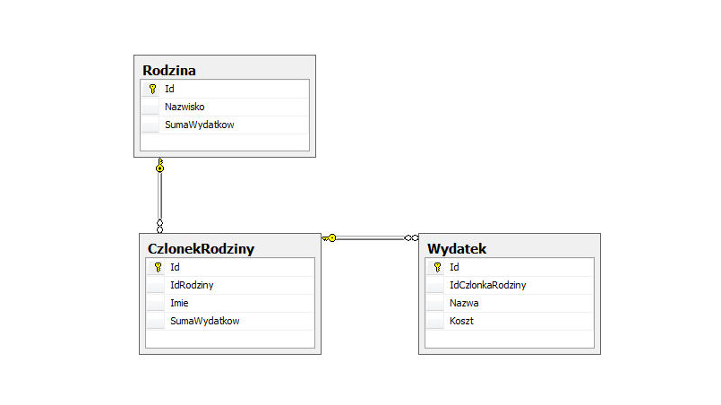

Wczoraj w pracy natknąłem się na, na pierwszy rzut oka, banalny problem, który jak to często bywa po drugim rzucie okazał się trudniejszy niż zakładałem. Ale po kolei…

Załóżmy, że mamy strukturę tabel określoną jako:



 Odwzorowuje ona bardzo uproszczoną strukturę wydatków w rodzinie. Każdy z jej członków ma swoje wydatki. Po podliczeniu wydatków każdego członka otrzymujemy sumę wydatków w tej rodzinie.

Do łączenia z bazą danych używany jest NHibernate 2 oraz FluentNHibernate. Ponieważ, zwykle wyświetlana będzie lista rodzin, lub lista członków rodziny przyjęto, że tabele będą przechowywały wartości sum podrzędnych rekordów. Do ich wczytywania użyty zostanie mechanizm leniwego wczytywania (lazy loading).

Encje są prostym odbiciem tabel:  

```csharp
public class Rodzina
{
    public virtual int    Id           { get; set; }
    public virtual string Nazwisko     { get; set; }
    public virtual int    SumaWydatkow { get; set; }

    public virtual IList CzlonkowieRodziny { get; set; }
}

public class CzlonekRodziny
{
    public virtual int     Id           { get; set; }
    public virtual Rodzina Rodzina      { get; set; }
    public virtual string  Imie         { get; set; }
    public virtual int     SumaWydatkow { get; set; }

    public virtual IList Wydatki { get; set; }
}

public class Wydatek
{
    public virtual int            Id             { get; set; }
    public virtual CzlonekRodziny CzlonekRodziny { get; set; }
    public virtual string         Nazwa          { get; set; }
    public virtual int            Koszt          { get; set; }
}
```

Dla encji zdefiniowane są mapowania klas jako:

```csharp
public class RodzinaMapowanie : ClassMap<Rodzina>
{
    public RodzinaMapowanie()
    {
        Table("Rodzina");
        Id(e => e.Id);
        Map(e => e.Nazwisko, "Nazwisko").Length(50);
        Map(e => e.SumaWydatkow, "SumaWydatkow");

        HasMany(c => c.CzlonkowieRodziny).KeyColumn("IdRodziny").LazyLoad().Cascade.DeleteOrphan().Inverse();
    }
}

public class CzlonekRodzinyMapowanie : ClassMap<CzlonekRodziny>
{
    public CzlonekRodzinyMapowanie()
    {
        Table("CzlonekRodziny");
        Id(e => e.Id);
        Map(e => e.Imie, "Imie").Length(50);
        Map(e => e.SumaWydatkow, "SumaWydatkow");
        References(e => e.Rodzina, "IdRodziny").Not.LazyLoad();

        HasMany(c => c.Wydatki).KeyColumn("IdCzlonkaRodziny").LazyLoad().Cascade.DeleteOrphan().Inverse();
    }
}

public class WydatekMapowanie : ClassMap<Wydatek>
{
    public WydatekMapowanie()
    {
        Table("Wydatek");
        Id(e => e.Id);
        Map(e => e.Nazwa, "Nazwa").Length(50);
        Map(e => e.Koszt, "Koszt");
        References(e => e.CzlonekRodziny, "IdCzlonkaRodziny").Not.LazyLoad();
    }
}
```

Tak jak wspominałem wcześniej nie ma tutaj wielkiej filozofii, zwykłe relacje jeden do wielu. Jedyną i kluczową niedogodnością jest to, że nie chcemy, aby listy zależnych obiektów były wczytywane od razu razem z obiektami nadrzędnymi (np. rodzina z jej członkami).

Jak to zrobić przy pomocy FluentNHibernate? Moją pierwszą odpowiedzią na to pytanie było stwierdzenie *"Nic prostszego, użyć kryteriów i wymusić to, żeby elementy podrzędne były pobierane z nadrzędnymi"*. Wstępna wersja mojego kodu wyglądała:

```csharp
var rodzina = Session.CreateCriteria<Rodzina>()
    .Add<Rodzina>(x => x.Id == varId)
    .SetFetchMode<Rodzina>(e => e.CzlonkowieRodziny, FetchMode.Eager)
    .SetFetchMode<CzlonekRodziny>(e => e.Wydatki, FetchMode.Eager)
    .SetResultTransformer(Transformers.DistinctRootEntity)
    .UniqueResult<Rodzina>();
```

Liczyłem na to, że poprzez wymuszenie pobierania leniwego przy pomocy SetFetchMode(…, FetchMode.Eager) sprawię, że podrzędne rekordy również zostaną pobrane. Jak się domyślacie, ten sposób nie zadziałał… Próbowałem potem na różne sposoby robić Joiny (np. przy pomocy metod takich jak CreateAlias), ale nic z tego nie wyszło. Ostatecznie sprawa okazała się trywialna. Wystarczy użyć następującego kodu.

```csharp
var rodzina = Session.CreateCriteria<Rodzina>()
    .Add<Rodzina>(x => x.Id == varId)
    .SetFetchMode<Rodzina>(e => e.CzlonkowieRodziny, FetchMode.Eager)
    .SetResultTransformer(Transformers.DistinctRootEntity)
    .UniqueResult<Rodzina>();
            
 var czlonkowieRodziny = Session.CreateCriteria<CzlonekRodziny>()
    .Add(SqlExpression.In<CzlonekRodziny>(x => x.Rodzina, rodzina.CzlonkowieRodziny.ToArray()))
    .List<CzlonekRodziny>();
            
Session.CreateCriteria<Wydatek>()
    .Add(SqlExpression.In<Wydatek>(x => x.CzlonekRodziny, czlonkowieRodziny.ToArray()))
    .List<Wydatek>();
```
Po jego wykonaniu w obiekcie rodzina znajdą się wszyscy jej członkowie, a dla każdego członka zostaną pobrane jego wydatki

Jak to się dzieje? Skąd ta magia? Wykorzystywany jest tutaj mechanizm cache’owania wyników NHibernate. W dużym uproszczeniu można powiedzieć, że dzięki niemu zapamiętywane są działania i ich wyniki wykonane w obrębie jednej sesji połączenia z bazą.

W pierwszym kroku pobrany zostaje obiekt rodziny. Następnie pobieramy jej członków,a później ich wydatki. Dzięki temu, że dokonujemy tego w obrębie jednej sesji NHibernate wie, że powinien "posklejać" odpowiednie obiekty ze sobą (na podstawie zdefiniowanych wcześniej klas mapowań). Rodzinę z jej członkami, członków z ich wydatkami.

Proste, czyż nie?

Czekam na wasze poprawki, pytania, wytknięcia niespójności i niejasności. Jeżeli pojawią się takie głosy w komentarzach to również wytłumaczę dokładniej mechanizmy NHibernate związane z pobieraniem danych. Stay tuned!

[— KODY ŹRÓDŁOWE —](https://sites.google.com/site/oskaratnet/Blog-2011-09-21.rar)

p.s. materiały, z których skorzystałem:
* http://blogs.taiga.nl/martijn/2008/11/20/nhibernate-criteria-queries-across-multiple-many-many-associations/
* http://wiki.fluentnhibernate.org/Getting_started 