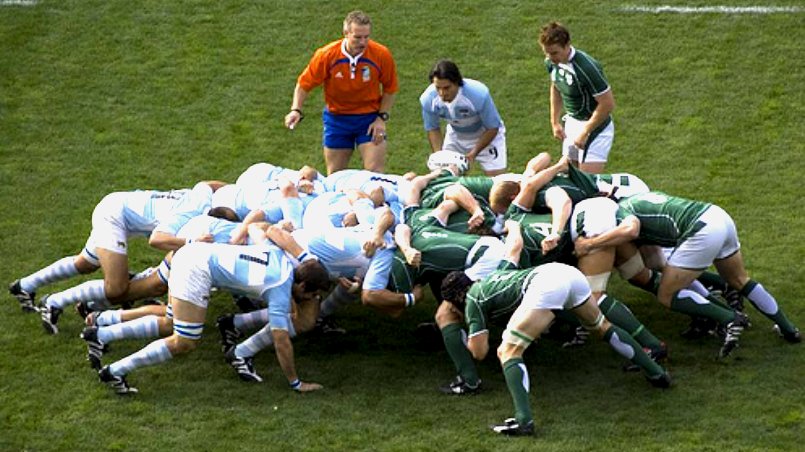
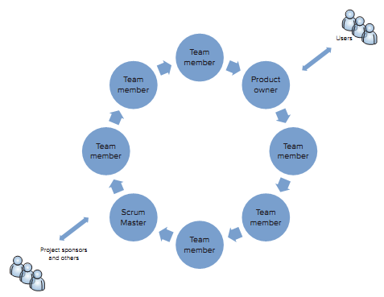
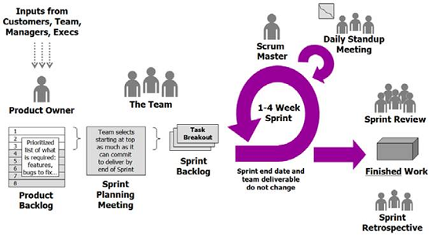

## 1. Wstęp

W kilku najbliższych postach postaram się przybliżyć ideę zarządzania projektem w metodyce Scrum przy pomocy Team Foundation Server (TFS). W tym poście opiszę zasady i cechy jakimi charakteryzuje się SCRUM. W kolejnych przedstawię jak TFS może nam pomóc w prowadzeniu projektu w tej metodyce.  Ponieważ, mimo posiadanego doświadczenia  w niej nie czuję się ekspertem będę bardzo rad z każdego, nawet najbardziej krytycznego komentarza, który pozwoli udoskonalić mi te wpisy.

## 2. Trochę historii

Pierwsze systemy komputerowe były zwykle tworzone dla organizacji rządowych, wojskowych lub dużych korporacji. Wszystkie one miały zwykle ściśle określone normy, przepisy, które miały cechować tworzone systemy. Dzięki temu można było sobie pozwolić na to, żeby przed powstaniem systemu przeprowadzić długą i kompleksową analizę biznesową, architektoniczną z tonami dokumentacji i dopiero po ukończeniu tego etapu wziąć się do prac programistycznych, a na samym końcu testerskich. Cykl życia tych projektów zwykle opierał się na [modelu kaskadowym](http://pl.wikipedia.org/wiki/Model_kaskadowy) lub [modelu spiralnym](http://pl.wikipedia.org/wiki/Model_spiralny). Popularność zdobyły takie metodyki jak [PRINCE2](http://pl.wikipedia.org/wiki/PRINCE2) lub [RUP](http://pl.wikipedia.org/wiki/RUP). Wraz z rozwojem komputerów osobistym oraz popularyzacją Internetu na przełomie XX i XXI wieku okazało się, że systemy informatyczne przestały być domeną dużych firm i organizacji – również małe i średnie przedsiębiorstwa zaczęły ich potrzebować. 

Okazało się, że metody prowadzenia projektów dla dużych przedsiębiorstw nie koniecznie są dobre dla małych. Długotrwały proces analizy, bez żadnych widocznych efektów w postaci gotowych fragmentów był nie do zaakceptowania dla firm oczekujących szybkich efektów. Często okazywało się również, że mimo długiego etapu analizy po zakończeniu implementacji i testów wewnętrznych, klient mówił, że "on inaczej to sobie wyobrażał nie działa to tak jak powinno". Prowadziło to do zmian, które jak wiadomo im później są robione tym są bardziej czasochłonne, a co za tym idzie kosztowne.

Na przeciw tym zmieniającym się realiom wyszły metodyki zwinne (Agile). W 2001 roku został ogłoszony [Manifest Agile (Agile Manifesto)](http://agilemanifesto.org/iso/pl/), w którym m.in. Martin Fowler, Ken Schwaber określili ogólne zasady dla wszystkich metody z tej grupy. Oto one:

*"Wytwarzając oprogramowanie i pomagając innym w tym zakresie,*

*odkrywamy lepsze sposoby wykonywania tej pracy.*

*W wyniku tych doświadczeń przedkładamy:*

*Ludzi i interakcje ponad procesy i narzędzia.*

*Działające oprogramowanie ponad obszerną dokumentację.*

*Współpracę z klientem ponad formalne ustalenia.*

*Reagowanie na zmiany ponad podążanie za planem.*

*Doceniamy to, co wymieniono po prawej stronie,*

*jednak bardziej cenimy to, co po lewej."*

Oprócz tego przedstawiono 12 zasad wytwarzania zwinnego oprogramowania (numeracja dodana przeze mnie):

*1. Najważniejsze dla nas jest zadowolenie Klienta wynikające z wcześnie rozpoczętego i ciągłego dostarczania wartościowego oprogramowania.*

*2. Bądź otwarty na zmieniające się wymagania nawet na zaawansowanym etapie projektu. Zwinne procesy wykorzystują zmiany dla uzyskania przewagi konkurencyjnej Klienta.*

*3. Często dostarczaj działające oprogramowanie od kilku tygodni do paru miesięcy, im krócej tym lepiej z preferencją krótszych terminów.*

*4. Współpraca między ludźmi biznesu i programistami musi odbywać się codziennie w trakcie trwania projektu.*

*5. Twórz projekty wokół zmotywowanych osób. Daj im środowisko i wsparcie, którego potrzebują i ufaj im, ze wykonają swoją pracę.*

*6. Najwydajniejszym i najskuteczniejszym sposobem przekazywania informacji do i ramach zespołu jest rozmowa twarzą w twarz.*

*7. Podstawową i najważniejszą miarą postępu jest działające oprogramowanie.*

*8. Zwinne procesy tworzą środowisko do równomiernego rozwijania oprogramowania. Równomierne tempo powinno być nieustannie utrzymywane poprzez sponsorów programistów oraz użytkowników.*

*9. Poprzez ciągłe skupienie na technicznej doskonałości i dobremu zaprojektowaniu oprogramowania zwiększa zwinność.*

*10. Prostota – sztuka maksymalizacji pracy niewykonanej – jest zasadnicza.*

*11. Najlepsze architektury, wymagania i projekty powstają w samoorganizujących się zespołach.*

*12. W regularnych odstępach czasu zespół zastanawia się jak poprawić swoją efektywność, dostosowuje lub zmienia swoje zachowanie.*

Te zasady stały są punktem wyjściowych dla metodyk Agile – w tym również dla Scrum. Jakie cechy ją charakteryzują? Dlaczego warto jej używać?

## 3. Scrum

Jako się rzekło Scrum jest zwinną, [iteracyjną metodyką](http://pl.wikipedia.org/wiki/Model_przyrostowy). Jej nazwę zaproponował wymieniony już wcześniej Ken Schwaber. Uznał, że zasady gry w rugby świetnie obrazują to jak powinien wyglądać proces wytwarzania oprogramowania. Gra w rugby wygląda tak, że co jakiś czas następuje przerwa w grze, w której ustalany jest plan tego jak rozpocząć kolejną akcję, cała drużyna ustawia się w pozycję zwaną "młynem" (z ang. scrum). Rozpoczynana jest gra, występuje próba realizacji planu, aż do momentu zatrzymania gry.

Dokładnie w ten sposób wygląda proces wytwarzania oprogramowania w metodyce Scrum. Cykl życia aplikacji podzielony jest na okresy zwane sprintami, w których występuje etap planowania, realizacji, podsumowania. No ale po kolei.

Elementy metodyki Scrum można podzielić na:
* zespół (z podziałem na role),
* zdarzenia,
* artefakty,
* reguły postępowania.

Wszystkie te elementy dają pełen obraz zasad, które kierują Scrumem. Zostaną one opisane w kolejnych punktach.

## 4. Zespół Scrumowy

W przeciwieństwie do metodyk "twardych" w Scrumie nie ma dużej ilości ról, zostały zdefiniowane tylko 3 role: 
* Właściciel Produktu,
* Scrum Master
* Zespół

4.1 **Właściciel Produktu (Product Owner)** – osoba będąca łącznikiem pomiędzy zespołem a klientem. Odpowiada za ustalenie wymagań biznesowych, nadanie im priorytetów oraz ocenę ich realizacji. Osoba ta kontaktuje się z klientem, ustala jego zapotrzebowania i oczekiwania.

4.2 **Scrum Master** – odpowiada za to, żeby proces wytwarzania i oddawania produktu przebiegał płynnie i bez zakłóceń. Czuwa nad tym, żeby wszystkie zasady były stosowane, żeby członkowie zespołu mogli skupić się tylko na swoich zadaniach, nie byli rozpraszani, rzez inne nie będące w ich kompetencjach. Nie jest zalecane, żeby Scrum Master był również  Właścicielem Produktu.

4.3 **Zespół (Team)** – tutaj sytuacja jest bardziej zamglona i trudniejsza do określenia. Liczebność Zespołu powinna się wahać od 5 do 9 osób. Zgodnie z zasadami scrum, Zespół jest odpowiedzialny za utworzenie produktu. Każdy z członków zespołu jest sobie sterem, żeglarzem, okrętem powinien pełnić funkcje analityka, testera, programisty. Aby to było możliwe projekt powinien być prowadzony zgodnie z zasadami Test Driven Development (TDD), według których funkcjonalności (szczególnie przepływy biznesowe) powinny posiadać testy pozwalające na weryfikację ich działania.

## 5. Zdarzenia

Tak jak już wspomniałem wcześniej cykl wytwarzania produktu podzielony jest na Sprinty. Sprint jest najmniejszą jednostką czasową w scrumie. Każdy sprint jest zamkniętą całością. W jego obrębie następuje planowanie, realizacja i podsumowanie prac projektowych. Po jego zakończeniu powinna zostać dodana konkretna, weryfikowalna wartość biznesowa do projektu. 
Sprinty powinny trwać taki sam przedział czasu. Dzięki temu wprowadzona do projektu zostaje większa systematyczność. Pozwala to również lepiej określić jaki zakres pracy zespół jest w stanie wykonać podczas jednego Sprinta. Sugerowany czas trwania sprinta to od dwóch do pięciu tygodni.

Oprócz tego sprint cechują następujące zasady:
* nie można dokonywać zmian mających wpływ na realizację celów sprintu,
* nie można zmieniać składu Zespołu w trakcie sprintu,
* nie można obniżać celów jakościowych,
* czas zadań nie powinien się zmieniać. Kiedy jest jednak taka potrzeba to może to być dokonane tylko po konsultacjach pomiędzy Zespołem a Właścicielem Produktu.

W obrębie sprinta występują następujące zdarzenia:
* codzienny scrum,
* planowanie sprintu,
* przegląd sprintu,
* retrospektywa sprintu.

5.1 Codzienny scrum jest spotkaniem Zespołu mającym na celu zrelacjonowanie postępów w realizacji zadań, pojawiających się problemów oraz przedstawienie swoich planów na najbliższy dzień pracy. Powinny one się odbywać z rana o jednakowej godzinie, nie trwać dłużej niż 15 minut na stojąco. Najlepiej w tym samym miejscu. Dlaczego na stojąco? Dla niewygody. Dzięki tej niezbyt przyjemnej do dyskusji pozycji zmniejszamy szansę na to, że osoby uczestniczące będą się rozwodziły bardziej nad swoimi rzeczami niż to konieczne. 

Ważne jest również to, że w trakcie Codziennego Scruma nie rozwiązujemy problemów, relacjonujemy je i ewentualnie ustalamy, czy jest ktoś kto ma pomysł na jego rozwiązanie.

Scrum Master na tych spotkaniach odgrywa rolę moderatora.

5.2 Planowanie sprintu odbywa się jak można się łatwo domyśleć na początku sprintu. Określane w nim jest to co ma zostać wykonane w jego obrębie. Nie powinno ono trwać dłużej niż 8h dla sprintu 4 tygodniowego, 4h dla dwutygodniowego. 

Pierwszym etapem planowania jest wybranie z pośród puli zadań dla całego projektu (zwanym Rejestrem Produktu lub z ang. Product Backlog) tych które zostaną w nim wykonane (zadania te zostają wrzucone do puli zwanej Rejestrem Sprintu lub z ang. Sprint Backlog). Odbywa się on poprzez dialog Zespołu z Właścicielem Produktu. Oszacowany zostaje również wstępny czas jaki jest potrzebny na zrobienie danego zadania.

Przy wyborze zadań do Sprintu powinny być brane pod uwagę takie czynniki jak:
* liczebność zespołu,
* analogie z poprzednimi sprintami, porównanie ile udało się w nich zrobić,
* oraz to, żeby zadania składały się w logiczną całość, tak, żeby po zakończeniu Sprintu została oddana konkretna wartość biznesowa.

Określony zostaje również Cel Sprintu. Jest nim zwykle kamień milowy w obrębie danego produktu np. utworzenie konkretnego modułu, funkcjonalności. 
W drugiej części planowania Zespół określa szczegóły implementacji wybranych zadań. Dekomponuje je na podzadania, tak aby odzwierciedlały one lepiej etapy programistyczne konieczne do ich wykonania. Weryfikowane są również poprzednie szacunki czasów wykonania zadań. Możliwa jest też zmiana zawartości Rejestru Sprintu, ale tylko i wyłącznie po konsultacji i akceptacji Właściciela Produktu.

5.3 Przegląd Sprintu – jest to podsumowanie dokonywane na zakończenie Sprintu. Ustalane jest na nim co się udało a co się nie udało zrobić. Określone zostaje jak duży był Przyrost (Effort) wykonany w trakcie Sprintu. Omawiane zostają również problemy na jakie natrafiono w trakcie realizacji zadań. Zadania, które nie zostały zrealizowane wracają do Rejestru Produktu.

Zwykle odbywa się prezentacja aktualnej wersji produktu dla Właściciela Produktu, który jest osobą akceptującą realizację zadań. Określana jest też wstępna wizja tego co będzie działo się w kolejnym Sprincie.

Przegląd nie powinien trwać dłużej nić 4 godziny dla Sprintu 4 tygodniowego i 2 godziny dla 2 tygodniowego.

5.4 Retrospektywa Sprintu – Odbywa się ona po przeglądzie. Jest to chwila, w której Zespół może przeanalizować to co dobrego/złego wydarzyło się w ostatnim Sprincie. Zespół powinien określić co i jak można było by poprawić, które działania, metody należało by kontynuować. Zadaniem Scrum Mastera jest przeprowadzić tak dyskusję, żeby każdy z członków zespołu aktywnie brał udział w opracowywaniu nowych zaleceń.
Spotkanie to nie powinno trwać dłużej niż 3 godziny.

## 6. Artefakty

Artefakty są to elementy, które opisują wykonywaną pracę wykonywaną podczas trwania projektu w Scrumie. Są to:
* Rejestr Produktu (Product Backlog),
* Rejestr Sprintu (Sprint Backlog),
* Przyrost (Effort)

6.1 Rejestr Produktu – jest to zbiór wymagań, zmian oraz zadań, które muszą zostać wykonane, żeby produkt został utworzony w całości. Zadania te są zwykle w postaci Historii Użytkownika (User Stories), czyli opisu tego jakie ma być zachowanie systemu w kontakcie z użytkownikiem. Każda historia użytkownika powinna zawierać kryteria akceptacji jego realizacji.

Za zarządzanie i pielęgnację Rejestru Produktu odpowiada Właściciel Produktu. Rejestr Produktu ewoluuje wraz z produktem. Na podstawie kontaktów z użytkownikami, pracami Zespołu w trakcie sprintów pojawiają się uwagi, doprecyzowania, zmiany, błędy. Rejestr Produktu pozostaje pusty dopiero gdy nie będą dokonywane żadne prace nad produktem.

6.2 Rejestr Sprintu – w trakcie realizacji produktu, wraz z kolejnymi Sprintami przenoszone zostają elementy z Rejestru Produktu do Rejestrów kolejnych Sprintów. Wszystkie te elementy wchodzą w skład zdefiniowanego celu dla danego sprintu. Ponieważ Historie Użytkownika nie są wystarczająco precyzyjną formą opisu zadań dla Zespołu, zwykle dzielone są na podzadania, wg logicznego programistycznego podejścia.

Jedynie Zespół może zadecydować o dodaniu czegoś lub usunięcia z Rejestru Sprintu. Po zakończeniu Sprintu Zespół wraz z Właścicielem Produktu decydują co zrobić z niezrealizowanymi historiami użytkowników (czy je zamknąć czy wrzucić z powrotem do Rejestru Produktu).

6.3. Przyrost – jest to wskaźnik, mówiący o tym co do tej pory udało się zrealizować. Każda historia użytkownika jest opisana przez punkty przyrostu. Poprzez sumę przyrostów poszczególnych Historii Użytkownika wyrażona jest ilość zrealizowanych funkcjonalności.

Ufff. Trochę się spisałem, a i tak wydaje mi się, że póki co przeskoczyłem tylko po łebkach przez tematy związane ze Scrumem. W kolejnych wpisach przedstawię jak Team Foundation Server może nam pomóc w codziennej pracy ze Scrumem, jak ją ułatwić i pozwolić sprawnie go prowadzić.

Tak jak wspominałem proszę Was gorąco o uwagi co do niejasności/błędów/zamglonych opisów.

[Kolejny wpis](/pl/scrum_i_team_foundation_server_01) to instalacja i wstępna konfiguracja TFS.

Źródła:
* [Resnick, Steve; Bjork, Aaron; de la Maza, Michael (2011). Professional Scrum with Team Foundation Server 2010.](http://www.amazon.com/Professional-Scrum-Foundation-Server-Programmer/dp/0470943335)
* [Schwaber, Ken; Sutherlanda, Jeff (2011) – The Scrum Guide](http://www.scrum.org/scrumguides/)
* [Agile Manifesto (2001)](http://agilemanifesto.org/)