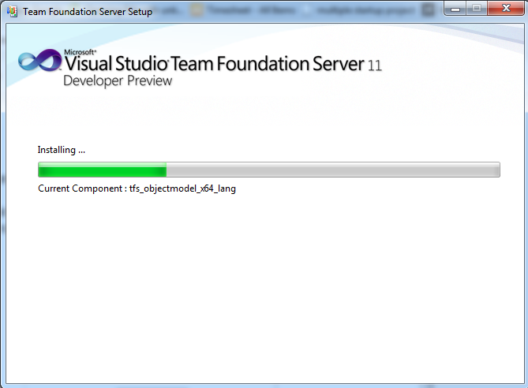

Tak jak zapowiedziałem w poprzednim wpisie, część druga mojej opowieści o Scrum i TFS będzie opisywała instalację oraz wstępną konfigurację Team Foundation Server. Po tych wpisach powinno być wiadomo co chcemy robić oraz czym, część trzecia przedstawi jak.

Przykłady będą przedstawione na podstawie Team Foundation  Server 11 Developer Preview.

## Instalacja serwera TFS

1. Pierwszym krokiem jest pobranie pliku instalacyjnego TFS 11 DP. Dostępny jest bezpłatnie pod adresem:  
* http://www.microsoft.com/download/en/details.aspx?id=27542#system-requirements
  
2. Po udanym pobraniu pliku uruchamiamy go. Pokaże nam się ekran:

Akceptujemy licencję i naciskamy przycisk "Continue".

3. W kolejnym ekranie zaznaczamy, że chcemy mieć włączone aktualizacje i rozpoczynamy proces instalacji naciskając przycisk "Install Now".

4. Rozpocznie się proces kopiowania plików instalacyjnych.

5. Po zakończeniu tego procesu pojawi nam się okno z wyborem rodzaju instalacji.

Dostępne są następujące tryby:
* *Basic* – powinniśmy ją wybrać gdy chcemy mieć skonfigurowany system kontroli wersji, zarządzanie zadaniami oraz serwisy buildów. Wybór tej instalacji pozwala nam na wybranie istniejącej już bazy danych lub instalację SQL Express, gdy nie mamy żadnej bazy na komputerze. Jeżeli chcemy mieć skonfigurowanego Share Point lub Reporting Services powinniśmy wybrać inny tryb instalacji
* *Standard Single Server* – instalacja ta różni się od instalacji podstawowej tym, że konfiguruje również Share Point
* *Advanced* – mamy w niej dostęp do wszystkich opcji konfiguracyjnych. Pozwala m.in. na konfigurację TFSa do użytkowania zewnętrznych serwerów SQL, wybór instancji baz danych, Reporting Services oraz Share Point, użycie autentykacji Kerberos
* *Application-Tier Only* – pozwala na dodanie kolejnej instancji Team Foundation Server do istniejącego i skonfigurowanego środowiska
* *Upgrade* – pozwala na uaktualnienie aktualnej wersji Team Foundation Server

Wybieramy instalację w trybie Basic i naciskamy przycisk "Start Wizard".

6. Pojawi się pierwszy ekran Basic Wizarda. Naciskamy w nim przycisk "Next"

7. Kolejny ekran pozwala na wybór czy chcemy zainstalować nową wersję bazy danych czy chcemy wybrać istniejącą instancję. W tym opisie zostanie zaprezentowana droga z zainstalowaną bazą danych. Zaznaczamy opcję "Use an existing SQL Server Instance" i naciskamy przycisk "Next".

8. W tym kroku powinniśmy wpisać nazwę instancji naszego serwera (w moim przypadku "WIN-MPMQ6E2DM0C"). Warto nacisnąć przycisk "Test", który sprawdzi, czy nasz serwer jest rzeczywiście dostępny, lub czy nie zrobiliśmy jakiejś literówki. Jeżeli po teście pojawi nam się zielona "fajka" możemy śmiało nacisnąć przycisk "Next".

9. Jeżeli wszystko przebiegło pomyślnie to powinien pojawić nam się ekran z podsumowaniem dotychczas dokonanych wyborów. Naciskamy przycisk "Next".

10. Następuje teraz proces intalacji/konfiguracji baz danych, serwera IIS oraz Firewalla. Po jego zakończeniu ekran powinien wyglądać:

Naciskamy przycisk "Next".

11. W kolejny ekranie otrzymujemy jakże przyjemny napis "Success". Udało nam się zainstalować i skonfigurować pomyślnie TFS.

Naciskamy przycisk "Close".

## Konfiguracja proxy TFS

12. Skoro udało nam się "zainstalować i skonfigurować pomyślnie TFS" to skąd kolejny punkt? OK, trochę nagiąłem prawdę. Co prawda TFS już stoi i ma się dobrze dokofigurujemy jeszcze dwie rzeczy. Proxy serwera, które pozwoli nam zmniejszyć obciążenie naszego serwera oraz serwisy Buildów. Wna głównym ekranie (przedstawionym w punkcie 5) na "Configure Team Foundation Server Proxy" . Powinien pojawić nam się ekran

Naciskamy przycisk "Next".

13. Wybieramy użytkownika, przy pomocy którego proxy będzie łączyło się z TFS. Użytkownik ten powinien kontem serwisowym oraz zostać dodany do grupy użytkowników mających uprawnienia do TFS. Co prawda nie do końca bezpiecznie, ale dla ułatwienia wybrałem konto "NT AUTHORITYLOCAL SERVICE". Po wyborze naciskamy przycisk "Next"

14. W kolejnym ekranie określamy port, na którym ma działać Proxy oraz miejsce, w którym ma być przechowywany jego Cache. Możemy pozostawić domyślne wartości oraz nacisnąć przycisk "Next".

15. Zobaczymy podsumowanie opcji, które wybraliśmy. Możemy zweryfikować ich poprawność naciskając przycisk "Verify" lub gdy ufamy sobie bezgranicznie nacisnąć od razu przycisk "Next".

16. Nastąpi proces sprawdzania konfiguracji i jeżeli wszystko poszło pomyślnie, wszystko zostanie oznaczone na zielono i będziemy mogli nacisnąć przycisk "Configure".

17. Po udanej konfiguracji powinniśmy zobaczyć ekran:

Naciskamy przycisk "Next".

18. Po raz kolejny możemy poczuć się dumni. Odnieśliśmy kolejny sukces – skonfigurowaliśmy proxy dla naszego serwera TFS. Po jego odtrąbieniu możemy zamknąć okno naciskając przycisk "Close".

## Konfiguracja serwisu Buildów

19. Tym razem darowałem sobie żart o zakończeniu procesu instalacji. Pozostało nam jeszcze bowiem skonfigurowanie serwisu Buildów. W głównym ekranie (patrz punkt 5) zaznaczamy "Configure Team Foundation Build Service" oraz naciskamy przycisk "Start Wizard". Pojawi nam się okno:

Jeżeli nie mamy na komputerze zainstalowanych innych serwerów TFS możemy bez zastanowienia nacisnąć przycisk "Next".

20. W kolejnym ekranie mamy możliwość wybrania liczbę "agentów buildów". Im więcej ich mamy tym więcej buildów będzie mogło być naraz wykonywanych. Należy wziąć jednak pod uwagę, że każdy proces budowania zużywa zasoby systemowe, więc jeżeli nie mamy mocnego komputera nie ma sensu zwiększać ich liczby. W tym tutorialu wybrałem rekomendowaną liczbę – 1. Po wybraniu liczby agentów naciskamy przycisk "Next".

21. Musimy wybrać również użytkownika, na którego koncie będzie działał serwer buildów oraz port, na którym będzie łączył się z TFS. Ja wybrałem systemowe konto "NT AUTHORITYLOCAL SERVICE" oraz sugerowany port 9191.

Przycisk "Next" będzie standardowo dobrym wyjściem by przejść do kolejnego kroku.

22. Pojawi się znany już nam ekran z podsumowaniem wybranych opcji. Jeżeli jesteśmy dokonanych wyborów możemy śmiało nacisnąć "Next".

23. Instalator przetestuje teraz czy wszystkie nasze ustawienia były poprawne. Jeżeli wszystko przebiegnie bez problemów powinniśmy zobaczyć ekran z przyjemnie zielonymi kolorami.

Pozostaje nam tylko w następnym widoku nacisnąć przycisk "Configure".

24. Nastąpi teraz instalacja i konfiguracja potrzebnych składników. Po jego zakończeniu powinniśmy mieć wszystkie paski w kolorze zielonym tak jak na screenie widocznym poniżej.

25. Na koniec powinniśmy zobaczyć jakże miły napis "Success". Gdy już się nim nacieszymy możemy nacisnąć przycisk "Finish" i zakończyć proces konfiguracji.

Udało nam się zatem zainstalować Team Foundation System. Mamy już [wiedzę teoretyczną](/pl/scrum_i_team_foundation_server_01), mamy narzędzie, w kolejnym wpisie dowiemy się jak z niego skorzystać.