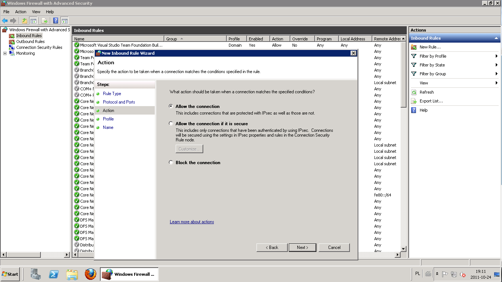

Tym razem wpis będzie poświęcony dodatkowej czynności, nie związanej bezpośrednio ze Scrum albo TFS. Pokażę prosty sposób w jaki można udostępnić swój serwer nie posiadając stałego łącza IP, łącząc się przez router. Nie uważam, że jest to opcja najlepsza, ani najbezpieczniejsza, ale jest prosta i może być punktem wyjściowym do lepszej konfiguracji.

Jak zrobić, żeby można było się połączyć z serwerem gdy nie posiada on stałego numer IP? Można to zrobić przy pommechanizmu DynDNS. Jeżeli chcemy uruchomić serwer np. ze stroną www lub podglądem kamer monitoringu dostępny z każdego miejsca w Internecie, a nie posiadamy stałego adresu IP, tylko otrzymujemy go dynamicznie z serwera DHCP (jak np. w przypadku Neostrady) musimy skorzystać z usługi DDNS (Dynamic Domain Name System) czyli usługi dynamicznego serwera nazw. 

Jak działa DDNS? Opis tego mechanizmu można znaleźć np. na stronie [dipol.com.pl](http://www.dipol.com.pl/do_czego_sluzy_ddns_dynamic_domain_name_system_i_jak_go_uzywac__bib93.htm). Oto wycinek z niego:

"Z pomocą idzie usługa DDNS, która tak jak DNS posiada bazę danych z wpisami zależności adresu domenowego z numerycznym, ale może być aktualizowana w dowolnej chwili czasu przez posiadacza domeny. Dzięki temu serwer może być osiągalny pod jedną, ustaloną nazwą niezależnie od tego, jaki adres IP w danej chwili posiada. Z tego powodu z serwerem można komunikować się tylko za pomocą adresu domenowego przetłumaczonego przez serwer DDNS (chyba, że znamy aktualny adres numeryczny serwera, ale nigdy nie wiemy jak długo będzie on obowiązywał)."

W tym tutorialu przedstawię jak skonfigurować DynDNS przy pomocy serwisu www.no-ip.com.

## Utworzenie konta i konfiguracja na Dyn.com

Tak jak zostało wspomniane wcześniej, aby móc korzystać z DynDNS konieczne jest utworzenie konta na stronie dostarczającej tą usługę. Proces ten najlepiej przeprowadzić na komputerze, który chcemy wystawić jako serwer na zewnątrz.

1. Wchodzimy na stronę www.no-ip.com/services/managed_dns/free_dynamic_dns.html. Powinna ona wyglądać następująco:

 Wpisujemy nasz adres e-mail i naciskamy przycisk "Sign Up Now!".

2. W kolejnej stronie wypełniamy naszymi danymi formularz rejestracji. Akceptujemy warunki licencyjne i naciskamy przycisk "I Accept, Create my Account".

3. Jeżeli wszystko wprowadziliśmy poprawnie pojawi nam się ekran informujący o konieczności potwierdzenia podanego przez nas adresu e-mail.

4. Wchodzimy na swoją skrzynkę pocztową i naciskamy link aktywacyjny w mailu, który otrzymaliśmy od portalu NO-IP. Po kliknięciu powinna pojawić się strona:

Naciskamy link "login".

5. W kolejnym ekranie wpisujemy swoje dane autoryzacyjne i naciskamy przycisk "Login".

6. W kolejnym widoku naciskamy przycisk "Add a Host".

7. Ukaże nam się ekran konfiguracji naszego adresu. Do celów naszej konfiguracji wystarczą nam domyślne wartości. Jedyne co musimy zrobić do wpisać unikatowy identyfikator np. "testtutorialscrumitfs" i nacisnąć przycisk "Create Host".

Udało nam się zarejestrować nasz serwer w serwisie DynDNS. Kolejnym krokiem jest:

## Skonfigurowanie routera do obsługi DynDNS

Nowe routery zwykle dają możliwość konfiguracji DynDNS. Dzięki niej po zmianie adresu IP routera powiadomi on o tym automatycznie serwis DynDNS. 
Przykładowa konfiguracja zostanie pokazana na przykładzie modelu DI-524 firmy D-Link.

1. Otwieramy stronę konfiguracyjną routera pod adresem http://192.168.0.1/ . Standardowo dane autoryzacyjne to dla niego:
* login – admin
* hasło – admin

Otworzy nam się strona:

Wchodzimy do zakładki "Advanced".

2. Na następnym ekranie naciskamy przycisk "DDNS"

3. Pojawi nam się ekran do konfiguracji DynDNS. Wybieramy w nim serwis No-IP.com. Wpisujemy nasz hostname (np. "testtutorialscrumitfs") oraz swój login i hasło. Zatwierdzamy przyciskiem "Apply".

Po tych krokach skonfigurowaliśmy nasz router do współpracy z serwisem DynDNS. Pozostało, jednak, jeszcze kilka rzeczy do zrobienia.

## Konfiguracja przekierowania portów

Team Foundation Server nasłuchuje pod portem 8080 na naszym serwerze. Gdy użytkownik będzie chciał połączyć się z Team Foundation serwer pod adresem DynDNS łączyć się będzie z routerem. Musimy skonfigurować go tak, żeby wiedział, o konieczności przekierowania połączenia z portem 8080 na nasz serwer (tzw. [port forwarding](http://pl.wikipedia.org/wiki/Przekierowanie_port%C3%B3w)). Oto jak można to skonfigurować na routerze DI-524 firmy D-Link.

Wchodzimy na stronę konfiguracji routera (http://192.168.0.1/) i przechodzimy do ustawień zaawansowanych (zakładka "Advanced").

Wpisujemy w kolejne pola:
* Name – nazwę przekierowania (np. TFS)
* Private IP – wpisujemy IP naszego serwera
* Protocol Type – TCP
* Private Port – 8080
* Public Port – 8080
* Schedule – Always

Naciskamy przycisk "Apply". _Voilà!_

## Konfiguracja Firewalla na serwerze

Pozostała nam jeszcze ostatnia rzecz. Skonfigurowanie naszego serwera tak by przyjmował połączenia z zewnątrz na porcie 8080.

Konfiguracja zostanie pokazana na przykładzie Windows Server 2008.

1. Wchodzimy do ustawień Firewalla (Start=>Administrative Tools =>Windows Firewall wih Advanced Security)

2. Zobaczymy okno konfiguracji zasad Firewalla. Będziemy ustalać zarówno regułę połączeń przychodzących (Inbound Rules) jak i wychodzących (Outbound Rules).

Naciskamy przycisk "New Rule" znajdujący się w prawym górnym rogu.

3. Otworzy nam się wizard konfiguracji reguły Firewalla.

Wybieramy opcję "Port" i naciskamy przycisk "Next"

4. W kolejnym oknie zaznaczamy opcję "TCP" i wpisujemy konkretny port – 8080 ("Specific local ports"). Klikamy "Next".

5. Pozwalamy na połączenie z tym portem ("Allow the connection") i przechodzimy dalej.

6. Zostawiamy domyślne ustawienia dostępu (Domain, Private, Public) i przechodzimy do kolejnego ekranu.

7. W ostatnim ekranie wizarda wpisujemy nazwę (np. TFS) i pełni samozadowolenia naciskamy przycisk "Finish".

8. Pozostało nam przeprowadzić analogiczny proces dla reguły połączeń wychodzących. W głównym ekranie przechodzimy do "Outbound rules" i wciskamy przycisk "New Rule". Wizard jest taki sam jak w przypadku reguły przychodzącej, więc oszczędzę Wam i sobie mojej pisaniny wierząc, że sobie poradzicie.

## Test poprawności działania konfiguracji

Najprościej przetestować konfigurację próbując się z TFS przez Visual Studio.

1. Otwieramy Visual Studio (np. wersję 11). Menu => Team => Connect To Team Foundation Server

2. W kolejnym oknie naciskamy przycisk "Servers"

3. Aby dodać połączenie do naszego serwera naciskamy przycisk "Add"

4. W popupie, który nam się pojawi wpisujemy adres naszego serwera (np. "testtutorialscrumitfs.no-ip.com"). I naciskamy OK. 

Jeżeli okno się bez problemów zamknie to znaczy, że nasza konfiguracja się powiodła. (Jeżeli pojawi się prośba o podanie loginu i hasło podajcie dane administratora systemu, na którym zainstalowany jest TFS)

Udało się? Gratuluję! 

Jeżeli nie (odpukać), to piszcie szczegóły w komentarzach.