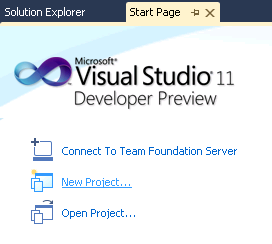

W poprzednich wpisach opisałem ogólne zasady metodyki Scrum, przedstawiłem sposób instalacji i konfiguracji – TFS. W tym wpisie pokażę podstawowe zasady jak połączyć teorię z praktyką. Podobnie jak w poprzednich wpisach bazował będę na Team Foundation Server 11 DP, konieczne również będzie Visual Studio 11 DP.

Załóżmy, że chcemy wytworzyć grę komputerową – One Card Master. Gra ta będzie niczym innym niż uproszczoną wersją gry w wojnę. Każdy z graczy otrzymuje po jednej karcie – wygrywa osoba, która ma największą kartę.
 
## 1. Połączenie z TFS
Uruchommy Visual Studio. Posiada ona specjalną sekcję odpowiedzialną za elementy zarządzania projektem. Jeżeli nie jesteśmy połączeni widzimy tylko jedną opcję – "Connect to Team Foundation Server", po połączeniu pojawi się ich więcej. Wybieramy opcję połączenia.

Ukaże nam się okno wyboru serwera, z którym chcemy się połączyć. Ponieważ jest to nasze pierwsze połączenie lista wyboru jest pusta.

Naciskamy przycisk "Servers" by zdefiniować połączenie. 

Ponieważ chcemy dodać nowe połączenie naciskamy przycisk "Add"

W pole na górze wpisujemy nazwę (lub adres) naszego serwera – w moim przypadku jest to "win-mpmq6e2dm0c". Naciskamy "OK" i w oknie wyboru serwera "Close".

Teraz w oknie wyboru serwera w liście rozwijalnej powinniśmy zobaczyć nasz serwer. Wybieramy go i naciskamy przycisk "Connect". Zostaniemy poproszeni o dane autoryzacyjne – podajmy dane administratora serwera.

## 2. Utworzenie projektu

Jesteśmy już połączeni z serwerem, możemy przejść zatem do utworzenia naszego projektu.

Do zarządzania projektem służy "Team Explorer". Można go włączyć poprzez Menu=>View=>Team Explorer.

Aby utworzyć nowy projekt naciskamy "Create New Team Project".

Wpisujemy nazwę naszego projektu i ewentualnie opis i kilkamy "Next".

Team Foundation Server pozwala na definiowanie i używanie szablonów projektów. W ich obrębie można m.in. definiować typy zadań, przepływy między nimi. TFS dostarcza od razu kilka z nich oraz pozwala na pobranie innych z MSDN. Ponieważ chcemy prowadzić nasz projekt przy pomocy metodyki Scrum, wybieramy szablon "Microsoft Visual Studio Scrum 2.0 – Preview 1" i naciskamy przycisk "Finish". Nastąpi teraz proces konfiguracji nowego projektu, po jego pomyślnym zakończeniu naciskamy przycisk "Close".

Po dodaniu projektu Visual Studio automatycznie połączy nas z nim – widoczne to będzie od razu po wyglądzie menu Team Explorera.

## 3. Utworzenie zespołu

Podobnie jak w filmach typu "Parszywa dwunastka", czy "7 wspaniałych" pierwszym krokiem w konfiguracji naszego projektu jest utworzenie zespołu. 

Konta w TFS powiązane są z kontami systemowymi. Możemy tego dokonać poprzez systemowe okno zarządzania komputerem (dostępne przez Start => All Programs => Administrative Tools=> Computer Management).

Dodajemy kilku "Janów Kowalskich" w celach testowych i zamykamy okno.

TFS przy konfiguracji serwera tworzy bardzo przydatną rzecz jaką jest strona pozwalająca na zdalny do niego dostęp. Pozwala ona w wygodny sposób zarządzać zadaniami, użytkownikami i procesami projektu. Dalszej konfiguracji będziemy dokonywać przy jego pomocy. Aby się do niej dostać naciskamy "Web Access" w Team Explorerze.

Domyślnie została utworzona grupa projektowa dla naszego projektu. Aby dodać do niej inne osoby klikamy na "My Team" oraz w kolejnym ekranie przycisk "Administration" (znajdujący się w prawym górnym rogu).

Wchodzimy do sekcji "members", w liście rozwijalnej "Actions" wybieramy "Manage Team Membership".

Aby dodać użytkownika naciskamy przycisk "add members".

W pole wpisujemy użytkownika, którego chcemy dodać, naciskamy "check name", a następnie "Save Changes".

Należy dodać jeszcze naszą grupę projektową do grupy uprawnień pozwalającej na dostęp do projektu i działanie na nim. Dokonujemy tego naciskając link z  nazwą naszego projektu znajdujący się w górnym menu strony.

Przechodzimy do zakładki "project groups" i wybieramy grupę uczestników projektu – "contributors".

W sekcji "Group membership" naciskamy przycisk "manage membership". W znanym nam już oknie wybieramy "add tfs group" i z listy wybieralnej bierzemy grupę [One Card Master]My Team. Dzięki temu, każdy nowy użytkownik, którego dołączymy do zespołu projektowego automatycznie nabędzie stosowne uprawnienia.

## 4. Przygotowania do pierwszego sprintu

Mając wybrany i utworzony zespół możemy przystąpić do planowania projektu. Zgodnie z metodyką Scrum będziemy go dzielić na Sprinty oraz pomocniczo grupować je w Release’y. Grupowanie takie jest przydatne z tego względu, że pozwala na lepszą motywację, grupowanie faz oddawania projektu klientowi (np. jeden release to utworzenie konkretnego modułu). Tak jak wspomniałem we wcześniejszym artykule długość Sprintu być w przedziale 2-4 tygodnie (z tym, że każdy Sprint powinien trwać tyle samo). Liczba sprintów w Releasie też jest kwestią ustaleń.

Dostęp do Sprintów oraz Release’ów znajduje się w sekcji Iterations.

Jak widać zostały utworzone 4 releasy, każdy po 6 sprintów. Do celów testowych tak dużo nie jest nam potrzebne. Usuńmy tak elementy by został nam jeden Release składający się z 4 Sprintów.

Każdy ze sprintów będzie trwał 2 tygodnie. Dobrą zasadą jest od razu zaplanowanie dat startu i końca kolejnych sprintów. Efekt powinie wyglądać podobnie jak na poniższym screenie:

Zwykle planując projekt dzielimy zadania na grupy np. wg biznesowych zasad (np. modułami) lub programistycznych kategorii (np. baza danych, serwer aplikacji, klient). Takie grupowanie można też dokonać w TFS poprzez zakładkę "areas".

Ja utworzyłem 3 zgodnie z planowanymi modułami:
* Administracja
* Ekran Gry
* Panel użytkownika

Oczywiście grupy można zagnieżdżać jeszcze głębiej, nie musi to być płaska struktura jak w tym przykładzie.

## 5. Planowanie zadań

Zadania planujemy poprzez zakładkę "backlog" projektu. Wychodzimy z administracji (przez link "Exit administration) i przechodzimy do niej.

W TFS przyjęto, że zadania grupowane są w historie użytkownika (Product Backlog Item, Bug) opisujące konkretny przypadek do zrealizowania. Gdy uznamy, że chcemy, żeby była realizowana powinniśmy przypisać do niej co najmniej jedno zadanie. Jest to odzwierciedlenie standardowego procesu tworzenia systemów informatycznych. Jako programiści zwykle dostajemy opis zadania w postaci przepływu biznesowego. Musimy wtedy zwykle dokonać zmian na bazie, dodać metody na serwisie i oprogramować klienta. 

Historię użytkownika (PBI) dodajemy poprzez przycisk "Add".

Posiada ono następujące główne elementy:
* Assigned To – osoba odpowiedzialna za realizację historii użytkownika
* Status – aktualny status zadania
* Reason – powód dokonania akcji
* Effort – wysiłek, który należy wykonać aby skończyć to PBI. Wyrażone to jest w story pointach (jaki czas ma jeden story point jest kwestią ustalenia w projekcie)
* Business Value – jest to wartość, jaką wniesie ta historia użytkownika do projektu
* Area – grupa zadań, do którego zalicza się PBI

Od razu przy dodawaniu historii użytkownika można zdefiniować zadania do niego. Można tego dokonać przechodząc do zakładki "Tasks" i naciśnięcie przycisku "New".

Zadanie posiada m.in. pola:
* Assigned To – użytkownik, do którego zostało przypisane zadanie
* State – aktualny status zadania
* Reason – powód dokonywanej akcji
* Blocked – czy zadanie jest zablokowane (nie powinno być aktualnie robione)
* Description – opis
* Remaining Work – effor pozostały do zakończenia zadania
* Backlog Priority – priorytet zadania
* Activity – rodzaj czynności wykonywanej w zadaniu (np. Development, Documentation)
* Area – grupa zadań, do których zalicza się ten task

Po dodaniu PBI i zadań w widoku rejestru produktu (backlog) pojawi się nowy wpis.

## 6. Realizacja sprintu

Zarządzanie realizacją sprintu można zobaczyć w zakładce "board".

Na tym ekranie widać wszystkie historie użytkownika oraz ich zadania w obrębie aktualnego sprintu. 

Tablica (dashboard) jest klasycznym Scrumowym widokiem. Zadania podzielone są na trzy grupy:
* To Do – nie rozpoczęte,
* In Progress – w trakcie robienia,
* Done – skończone.

W prostocie tego widoku tkwi jego siła. Widać na nim dokładnie, które zadania zostały już rozpoczęte, kto się czym zajmuje aktualnie oraz co zostało skończone. 

Zadania można w prosty sposób poprzez przeciągnięcie przenosić pomiędzy jednym statusem a drugim. Poprzez podwójne kliknięcie wchodzić do ich edycji. W prawym górnym rogu widoczny jest również Burndown Chart – czyli wykres postępu prac (o nim postaram się napisać w osobnym wpisie).

## 7. Dodanie projektu do kontroli wersji

Jedyną rzeczą, która pozostała nam do zrobienia by można było zacząć realizować projekt jest dodanie plików do kontroli wersji.

Wracamy do Visual Studio i Team Explorera. Naciskamy przycisk Source Control Explorer.

Wybieramy nasz projekt i naciskamy "Map to Local Folder". Wybierzemy to aby określić, w którym miejscu na naszym lokalnym komputerze będą przechowywane pliki projektu. Po dokonaniu mapowania, naciskamy przycisk "New Folder" aby dodać folder o nazwie "src" (z kodami źródłowymi).

Poprzez przycisk "New Project" w oknie "Start Page" dodajemy nowy projekt z lokacją w zmapowanym folderze. Zaznaczamy dodatkowo "Add to source control".

Wszystkie foldery i pliki, które utworzyliśmy do tego momentu znajdują się tylko lokalnie na naszym dysku. Aby zmiany zostały wrzucone na serwer należy przejść do Team Explorera, nacisnąć "My Work", a następnie "Check In".

Zobaczymy listę wszystkich naszych zmian. Dobrym zwyczajem jest podanie komentarza przy check inie. Po naciśnięciu przycisku Check In zmiany zostaną wrzucone na serwer.

Podstawowa konfiguracja TFS do pracy z projektem została dokonana. W kolejnych wpisach postaram się przybliżyć każdy z tych kroków dokładniej. 
