## 1. Trochę teorii

Każdy z nas w trakcie zawodowej kariery miał (nie)przyjemność pracować z systemami kontroli wersji. Codziennie w trakcie swojej pracy wrzucamy, pobieramy z nich pliki, rozwiązujemy konflikty. Wiemy po co je używać, ale czy wiemy jak? Tak jak w każdej dziedzinie życia pewne rzeczy można robić lepiej lub gorzej. W tym artykule postaram się pokazać kilka dobrych zasad ciągłej integracji (Continuous Integration), które pozwolą usprawnić trochę ten proces. Na koniec przedstawię przykład jak wdrożyć te zasady w Team Foundation Server.

Systemy kontroli wersji są czymś o czym powinniśmy pomyśleć na samym początku projektu. Mają wiele zalet, nie można się bez nich obyć, "ale…". Tym "ale" jest najbardziej zawodny element procesu – ludzie. 

Każdy z nas nie raz klął na kolegę, który wrzucił niebudujący się kod do repozytorium, drżał przed nadchodzącymi konfliktami przy pobraniu nowej wersji repozytorium. Myślę, że każdy z nas mógłby wymienić z imion współpracowników specjalizujących się we wrzucaniu niebudującego się kodu. 


Na bazie swoich doświadczeń uważam, że sporo z tych błędów można wyeliminować poprzez stosowanie się do kilku prostych zasad:
1. W repozytorium znajduje się tylko kompilujący się kod – przed wrzuceniem swoich zmian, poświęćmy czas i przebudujmy chociaż projekt. Nie ma nic bardziej irytującego niż niebudujący się kod. Nieszczęśliwcowi, który ściągnie rewizję w takiej sytuacji zwykle pozostaje cofnięcie się do poprzedniej działającej wersji, lub zrobienie hacku.
2. W repozytorium znajduje się tylko działający kod – jest to rozwinięcie pierwszej zasady. Sam fakt, że kod się buduje nie oznacza, że działa poprawnie. Przed wrzuceniem wersji poświęćmy chwilę na sprawdzenie czy nasz kod działa poprawnie: odpalmy testy, przeklikajmy się przez modyfikowane moduły. Często wydaje nam się to stratą czasu, bo "przecież to była tylko mała zmiana", a potem okazuje się, że zmianę zrobiliśmy na szybko i wrzuciliśmy kod, który wywala pół aplikacji. 

    Oczywiście, niektórzy powiedzą, że czasami nie da się tego zrobić, gdy więcej niż jedna osoba pracuje nad tym samym kodem i muszą się nim dzielić. Repozytoria kodu mają mechanizmy pozwalające na rozwiązanie tych problemów: tworzenie osobnych gałęzi kodu (branch), odkładanie kodu na półki (shelve). Jeżeli zastosowanie tych rozwiązań jest zbyt kłopotliwe – zróbmy wszystko by okres "zepsutego" repozytorium trwał najkrócej.
3. Wrzucajmy regularnie i często nasze zmiany – oczywiście musimy zachować pierwsze dwie zasady. Dzielmy nasz kod na małe fragmenty (units of code). Oprócz takich zysków jak lepsza jakość kodu, zmniejszamy szansę na kłopotliwe rozwiązywanie złożonych konfliktów.
4. Im częściej robimy update – tym lepiej – jest to szczególnie kluczowe, gdy robimy dużą zmianę, mającą duży wpływ na działanie systemu. Musimy przeprowadzić dużo testów, nie możemy wtedy szybko wrzucić zmian. Im częściej będziemy pobierać zmiany tym szybciej połączymy się z kodem innych i szansa na konflikty zdecydowanie zmaleje.
5. Piszmy komentarze gdy wrzucamy kod – niby drobna rzecz, ale bardzo pomaga gdy musimy znaleźć przyczynę modyfikacji fragmentu kodu. Napiszmy z jakim zadaniem nasze zmiany są związane, co zmodyfikowaliśmy, dodaliśmy, usunęliśmy tym lepiej. Krótko ale treściwie.

Niestety teoria teorią, a praktyka praktyką. Często okazuje się, że sporo ludzi podchodzi do nich nonszalancko. Czasami skomplikowanie systemu nie pozwala w prosty i szybki sposób na sprawdzenie wpływu naszych zmian na jego działanie.

Z pomocą przychodzą nam zasady i systemy Continuous Integration. Oprócz zasad dobrego używania kodu (m.in. tych, które wymieniłem powyżej) główną ideą jest to, że zmiany w kodzie powinny być ciągle integrowane ze sobą. Powinna być regularnie sprawdzana jego spójność, integralność oraz poprawność działania. 

Dokonuje się tego przez regularne buildy projektu, uruchamianie testów itd. Powinny się one odbywać w środowisku identycznym do docelowego klienckiego (eliminujemy w ten sposób błędy wynikające z tego, że programiści mają różne konfiguracje swoich systemów). Każda zmiana powinna zostać przetestowana. Jeżeli nie spełni kryteriów akceptacji to powinna nie zostać dopuszczona do repozytorium, lub zespół projektowy powinien zostać niezwłocznie powiadomiony o pojawieniu się błędnego kodu.

Postaram się pokazać jak te cele można osiągnąć przy pomocy Team Foundation Server. Pokażę jak utworzyć dwie definicje buildów, które powinny rozwiązać większość podstawowych problemów:
* build dzienny – będzie raz na dobę sprawdzał czy projekt buduje się, czy wszystkie testy przechodzą. Ponieważ może on trwać długo, uruchamiany będzie w nocy – by nie utrudniać pracy programistom.
* build wejśćiowy (gated build) – będzie sprawdzał czy kod wrzucany jest poprawny. Jeżeli nie spełni zadanych kryteriów, nie dostanie się do repozytorium. Jakie warunki będziemy sprawdzać? Pierwszym będzie kompilacja projektu, drugim przejście najważniejszych testów (uruchamianie wszystkich nie było by dobrym posunięciem, bo trwało by zdecydowanie za długo).

## 2. Trochę praktyki

Pierwszym krokiem jest utworzenie projektu i dorzucenie go do Team Foundation Server. Bazował będę na przykładzie opisanym w ["Scrum i Team Foundation Server cz.4 – Tworzymy projekt"](/pl/scrum_i_team_foundation_server_04).

Pierwszą czynnością jest utworzenie folderu, do którego będą wrzucane DLLki budowanych solucji. Na nim będzie działał serwer. Załóżmy folder na dysku C: o nazwie "BuildFolder". Konieczne jest nadanie maksymalnych uprawnień do folderu procesowi buildów TFS (dla mnie będzie to "Local Service"). Oprócz tego musimy udostępnić w sieci lokalnej ten folder.

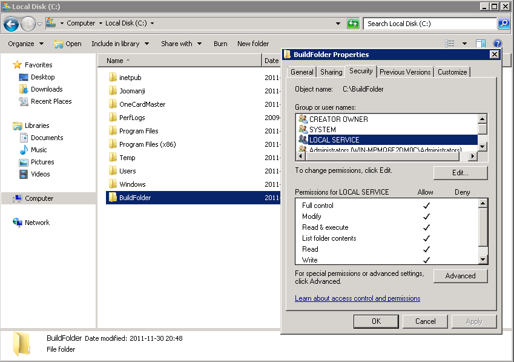

Mając już skonfigurowany folder możemy przejść do właściwej konfiguracji. Otwieramy Visual Studio i otwieramy Team Explorera (Menu => View => Team Explorer)

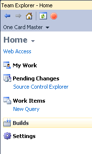

Przechodzimy do menu konfiguracji buildów naciskając przycisk "Builds". Aby dodać nową definicję naciskamy przycisk "New Build Definition". Dodajemy dwie definicje:

### Build dzienny 
W  pierwszym oknie wpisujemy jego nazwę (np. "OneCardMaster – Daily" i ustalamy, że ma być aktywny zaznaczając opcję "Enabled").

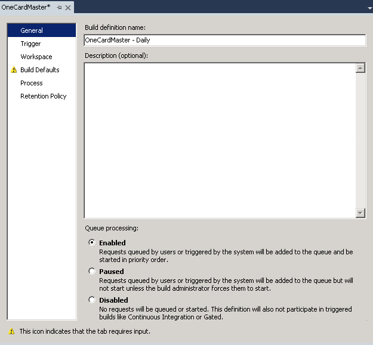

Przechodzimy do zakładki "Trigger".

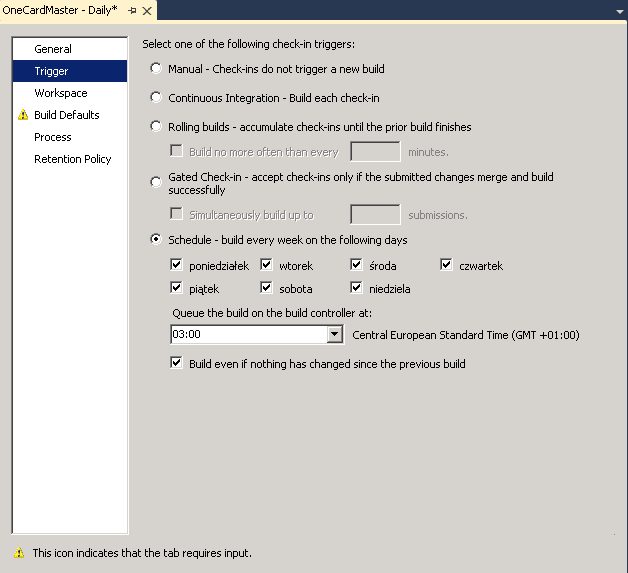

W niej definiowane wyzwalacze dla naszego buildu. Chcemy, żeby uruchamiał się codziennie o godzinie 3 w nocy, nawet jeżeli kod nie zmienił się. Zaznaczamy opcje jak na obrazku powyżej. 

Przechodzimy do zakładki Build Defaults. I podajemy w niej adres sieciowy utworzonego przez nas wcześniej katalogu do buildów.

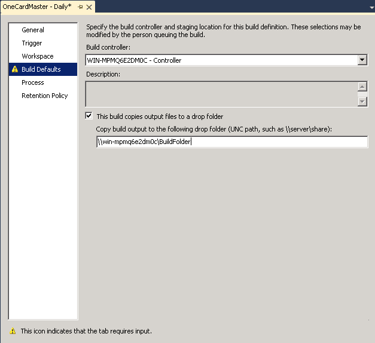

W zakładkach Workspace, Process i Retention Policy zostawiamy wartości domyślne.
Naciskamy przycisk zapisz i mamy skonfigurowany pierwszy build.

### Build wejściowy

Tworzymy kolejną definicję builda poprzez Team Explorera. Podajemy jej nazwę "One Card Master – Gated". Zakładki Workspace, Build Defaults, Retention Policy tak samo jak w przypadku builda dziennego.

Przechodzimy do zakładki Trigger i ustalamy w niej opcję "Gated Check-in".

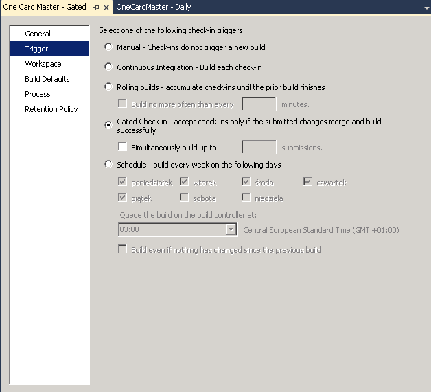

Następnie naciskamy w Process. Rozwijamy kolejno sekcje: Basic, Automated Tests, Test Assembly.

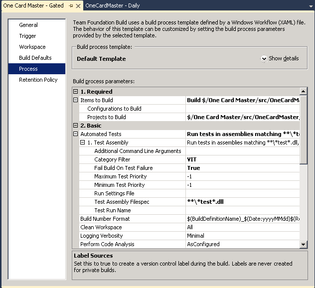

Ustalamy, że check-in ma być odrzucony jeśli wybrane przez nas testy nie przejdą ("Fail Build On Test Failure" – True). 

Aby wybrać testy, które mają być wywoływane wpisujemy w opcję "Category Filter" jej nazwę np. "VIT" (Very Important Tests).

Zapisujemy builda i "eto wsio".

## 3. Trochę przykładów

Aby zaprezentować jak działa nasz build utwórzmy projekty o strukturze.

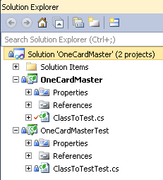

Projekt OneCardMaster jest to "Class Library", OneCardMasterTest – "Test Project".

Dodajemy klasę ClassToTest wyglądającą:

```csharp
public static class ClassToTest
{
    public static bool VeryImportantFunction()
    {
        return true;
    }

    public static bool Function1()
    {
        return true;
    }

    public static bool Function2()
    {
        return true;
    }

    public static bool Function3()
    {
        return true;
    }
}
```

Jak widać jest to prosta klasa, która jedynie symuluje działanie systemu. Mamy tutaj cztery funkcje w tym jedną bardzo ważną. Do projektu testowego dodajemy klasę sprawdzającą poprawność jej działania.

```csharp
[TestClass]
public class ClassToTestTest
{
    private TestContext testContextInstance;

    public TestContext TestContext
    {
        get
        {
            return testContextInstance;
        }
        set
        {
            testContextInstance = value;
        }
    }

    [TestMethod]
    [TestCategory("VIT")]
    public void VeryImportantFunction_ReturnsTrue()
    {
        Assert.IsTrue(ClassToTest.VeryImportantFunction());
    }

    [TestMethod]
    public void Function1_ReturnsTrue()
    {
        Assert.IsTrue(ClassToTest.Function1());
    }

    [TestMethod]
    public void Function2_ReturnsTrue()
    {
        Assert.IsTrue(ClassToTest.Function2());
    }

    [TestMethod]
    public void Function3_ReturnsTrue()
    {
        Assert.IsTrue(ClassToTest.Function3());
    }
}
```

Do każdej metody dodana została funkcja sprawdzająca jej poprawność. Jak łatwo zauważyć na ten moment wszystkie testy przechodzą.

Przechodzimy do Team Explorera i naciskamy przycisk Check In. Po zaakceptowaniu pojawi nam się nowe okno (jest to zmiana w stosunku do tego co mieliśmy przed konfiguracją builda wejściowego).

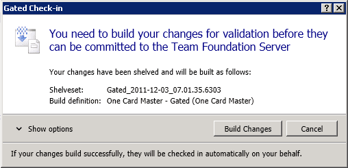

Informuje nas ono o tym, że nasze pliki zostaną wrzucone "na półkę". TFS sprawdzi poprawność zmian i jeżeli weryfikacja przebiegnie poprawnie to doda je do repozytorium. Naciskamy przycisk Build Changes.

W naszym systemie zostanie uruchomiony wątek sprawdzający czy build się nie zakończył.

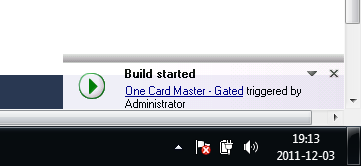

Gdy status builda się zmieni otrzymamy o tym informację w postaci wyskakującego okna. Jeżeli wszystko zrobiliśmy poprawnie powinno wyglądać następująco:

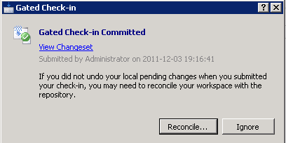

Mamy dwie opcje do wyboru:
* *Reconcile* – odświeża status naszej lokalnej kopii repozytorium, czyści zmiany z pending changes itd.
* *Ignore* – nic nie robi – nie odświeża repozytorium. Dopiero gdy zrobimy update to uaktualni nam się wersja

Spróbujmy teraz zmienić metodę VeryImportantFunction na:

```csharp
public static bool VeryImportantFunction()
{
    return false;
}
```

Po takiej zmianie nasz test z kategorii "VIT" nie będzie przechodził i build wejściowy nie powinien się udać.

Przejdźmy do Team Explorer i zróbmy Check In. Po zakończeniu builda powinniśmy zobaczyć okno informujące nas o niepowodzeniu:

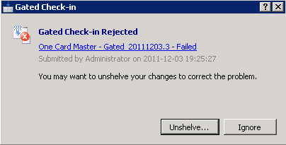

## Podsumowanie

W powyższym artykule starałem się przedstawić zasady dobrego korzystania z repozytorium, podstawy Continuous Integration oraz przykład jak zastosować to w praktyce przy użyciu TFS. Oczywiście jest to tylko wstęp, bo temat jest długi jak rzeka. Raczej nie będziecie znać po jego lekturze wszystkich odpowiedzi, ale liczę, że będziecie chociaż wiedzieć o co pytać. 