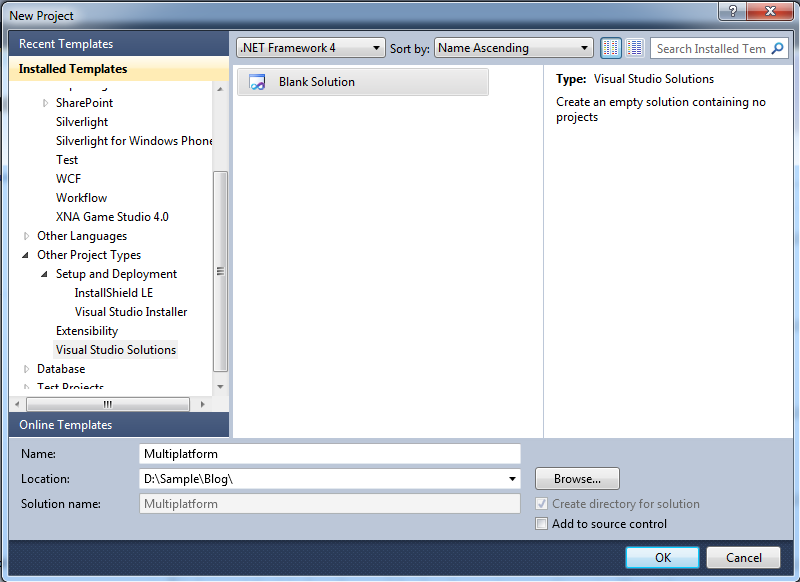
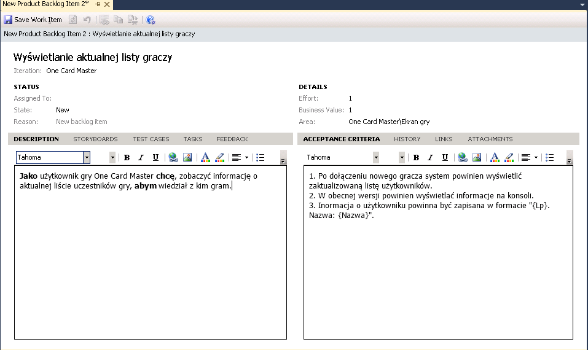
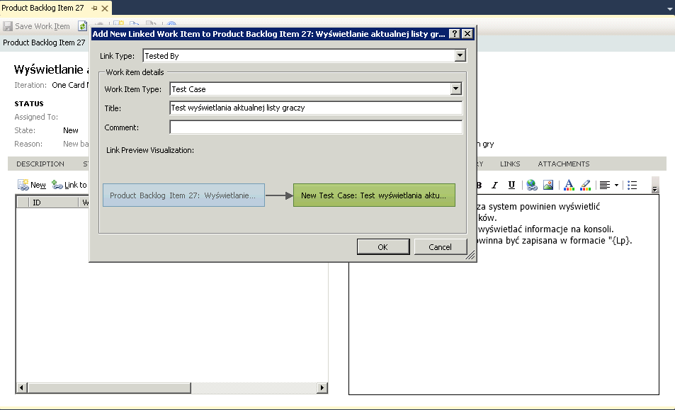
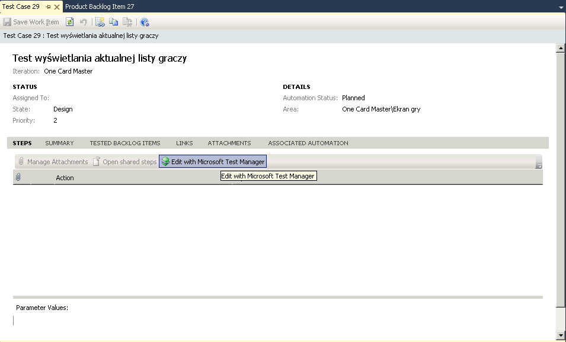
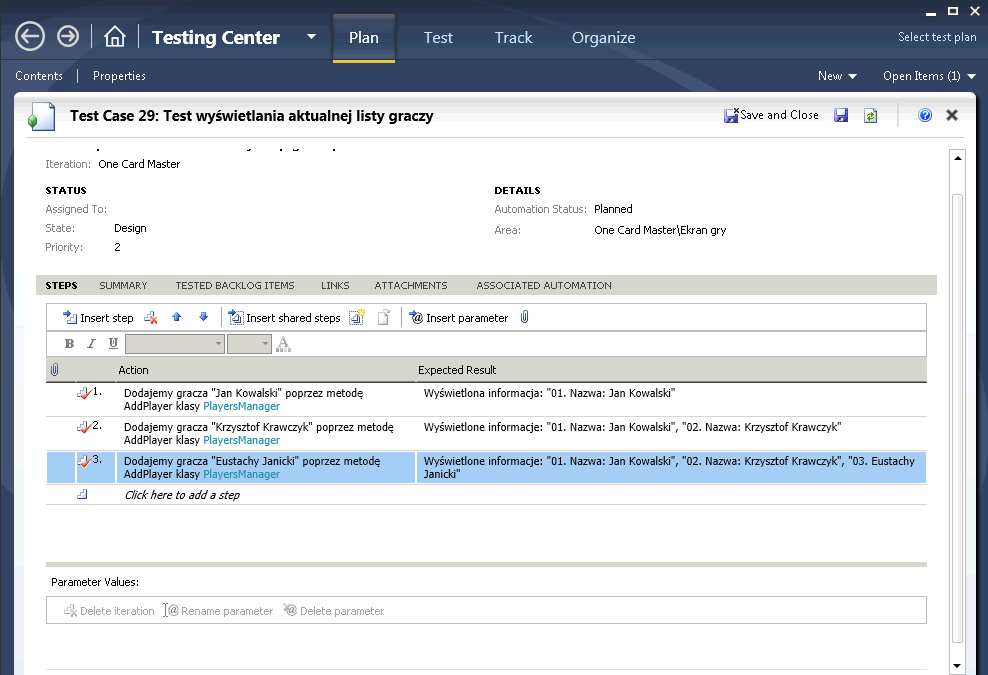
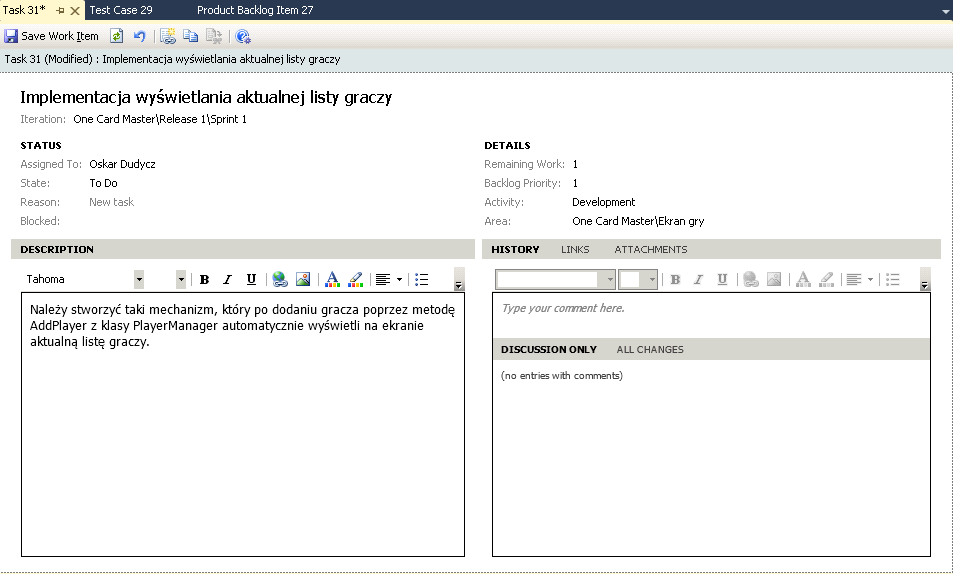
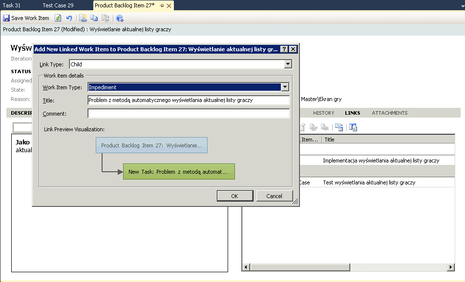
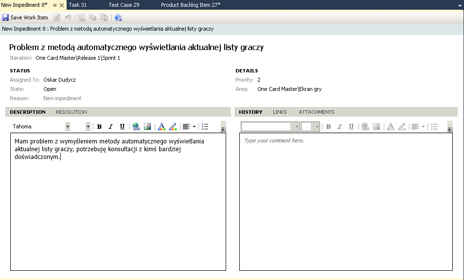
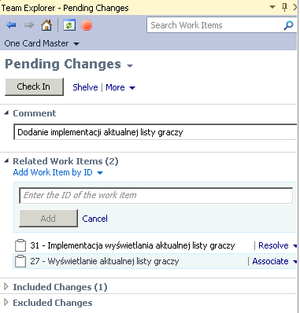
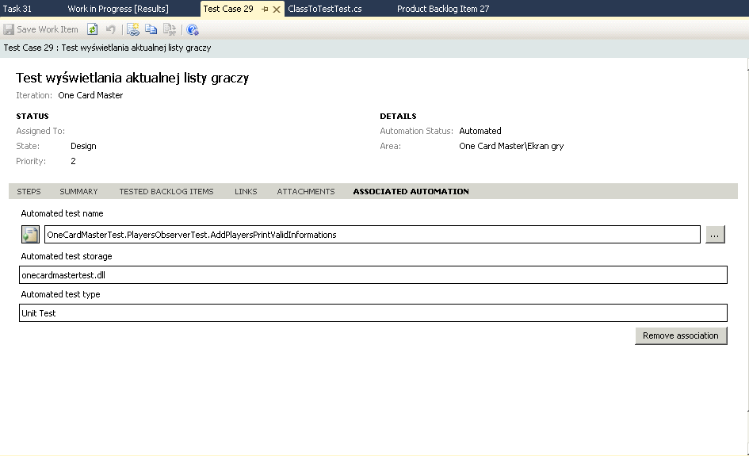

W kilku ostatnich wpisach przedstawiłem czym jest metodyka Scrum, po co i jak ją stosować przy użyciu Team Foundation Server. W teorii moglibyśmy już rozpocząć projekt i z powodzeniem go prowadzić. Możliwe, że więcej wiedzy nie było by Wam szybko potrzebne, ale podejrzewam, że całkiem szybko zaczęły się pojawiać pytania o zarządzanie i przepływ zadań, np.:
* Który rodzaj zadania jest  z czym powiązany?
* Czy jak dodamy buga to mamy dodać do niego też taska?
* do czego służy test case a do czego impediment?
* itd. itp.

Takie pytania są nieuchronne, każdy Scrum Master będzie musiał je wysłuchiwać po 100 razy. Można jednak ich częstotliwość zmniejszyć poprzez spisanie dokumentu, zawierającego przykładowy przepływ pomiędzy zadaniami oraz zasady tworzenia dokumentów. Dzięki niemu będziemy mogli w krytycznej sytuacji bez większych wyrzutów sumienia odpowiedzieć „zajrzyj sobie do dokumentacji".

W Scrum centralnym elementem opisu biznesowego przypadku jest Historia Użytkownika (User Story) zwana również „elementem rejestru produktu" (Product Backlog Item – PBI). Opisuje ona wartość biznesową, która ma zostać dodana do projektu np. "Jako użytkownik gry One Card Master chcę, zobaczyć informację o aktualnej liście uczestników gry, abym wiedział z kim gram".

Schemat można było by opisać (tak jak przedstawiono we wpisie) przez:

**JAKO** *<Osoba, rola>*

**CHCĘ** *<Funkcjonalność, czynność>*

**ABY** *<Uzasadnienie biznesowe>*

W teorii pisanie historii użytkownika wydaje się sprawą zupełnie prostą, ale w praktyce okazuje się, że jest zupełnie inaczej. Same zasady tworzenia historii użytkownika są materiałem na osobny wpis.

No ale wracając do tematu procesu. Tak jak wspomniałem we wpisie Scrum jest mocno powiązany z metodyką TDD. Podążając z jej zasadami, będzie nam dużo łatwiej prowadzić projekt, oraz zarządzać przepływem. We wspomnianym wpisie powiedziałem, że każdy PBI powinien mieć wyraźnie i dokładnie opisane kryteria akceptacji – czyli warunki, które muszą zostać spełnione, żeby zadanie zostało zaakceptowane.

Same historie użytkownika opisują jedynie ogólne aspekty realizacji biznesowego problemu. Aby kompleksowo zamodelować proces wytwarzania funkcjonalności konieczne jest dodanie do nich konkretnych elementów tj:
* Task – relacja „Implemented-By" – czyli opisuje wszystko to co jest konieczne do tego, żeby od strony programistycznej zaimplementować historię użytkownika
* Acceptance Test – relacja „Tested-By" – opisuje testy akceptacyjne, czyli to w jaki sposób historia użytkownika będzie testowana
* Bug Report – relacja „Failed – By" – opisuje co poszło nie tak przy testach akceptacyjnych
* Impediment – relacja „Impeded-By" – przeszkoda, Opisuje problemy, które wystąpiły przy implementacji historii użytkownika, może to być np. sytuacja, że przy tworzeniu algorytmu nie wzięliśmy pod uwagę jakiegoś aspektu, którego zaimplementowanie wymaga dodatkowej analizy.

Co z sytuacjami gdy odnajdziemy inne błędy, które nie zostały ujęte w testy akceptacji? Dorzucamy do rejestru produktu (ewentualnie rejestru spritu jeżeli jest on kluczowy dla jego oddania) element typu Bug.  Ma on identyczną strukturę zależności jak historia użytkownika. Powinien również posiadać zadanie, opis testów, które będą dokonywane przy weryfikacji tego buga, może zawierać Impediment oraz raport o błędzie, który mówi o tym, że rozwiązanie błędu nie zostało zaakceptowane.

Paczkę koniecznej wiedzy teoretycznej już uzyskaliśmy, możemy teraz przejść do przykładu. Będzie on pokazany na Team Foundation Server 11 DP oraz Visual Studio 11 DP. Załóżmy, że tworzymy znaną z innych wpisów grę One Card Master. Mamy już zaimplementowaną część kodu odpowiadającego za zarządzanie graczami. Dostępne już są klasy:
* informacje o graczu:
```csharp
public class Player
{
    public string Name { get; set; }
}
```

* zarządzajanie graczami, pozwalające na ich dodawanie

```csharp
public interface IPlayersManager
{
    IList<Player> GetPlayers();

    void AddPlayer(Player player);
}

public class PlayersManager : IPlayersManager
{
    private readonly IList<Player> _playersList = new Listt<Player>();
        
    public void AddPlayer(Player player)
    {
        _playersList.Add(player);
    }

    public IList<Player> GetPlayers()
    {
        return _playersList;
    }
}
```

* dostępne są również klasy pozwalające na drukowanie informacji na ekranie

```csharp
public interface IPrinter
{
    void Print(string text);
}

public class ConsolePrinter : IPrinter
{
    public void Print(string text)
    {
        Console.WriteLine(text);
    }
}
```

Klient zażyczył sobie, że musimy dodać funkcjonalność wyświetlania aktualnej listę graczy.

Załóżmy, że znajdujemy się na etapie planowania sprintu. Pierwszym krokiem, który powinniśmy zrobić jest dodanie nowej historii użytkownika. Dokonujemy tego poprzez kliknięcie menu jak na poniższym obrazku.



## Historia użytkownika

Ukaże nam się okno definicji historii użytkownika:



Nazywamy naszą historię użytkownika "Wyświetlanie aktualnej listy graczy" podajemy jego opis:

_"Jako użytkownik gry One Card Master chcę, zobaczyć informację o aktualnej liście uczestników gry, abym wiedział z kim gram"_

Podajemy kryteria akceptacji:

1. Po dołączeniu nowego gracza system powinien wyświetlić zaktualizowaną listę użytkowników.
2. W obecnej wersji powinien wyświetlać informacje na konsoli.
3. Informacja o użytkowniku powinna być zapisana w formacie "{Lp}. Nazwa:{Nazwa}".

## Przypadek testowy

Zapisujemy historię użytkownika, ale nie zamykamy okna tylko przechodzimy do zakładki "Test cases" i naciskamy przycisk "New".



Dodajemy w ten sposób test akceptacji. Nazywamy go "Test wyświetlania aktualnej listy graczy" i naciskamy "OK". Otworzy się nam widok przypadku testowego. Zapisujemy go. Dostaniemy teraz pełen dostęp do opcji tworzenia testu historii użytkownika.

Jak łatwo zauważyć cały czas postępujemy tutaj zgodnie z metodyką TDD:
* najpierw opisaliśmy co chcemy (historia użytkownika),
* następnie co musi być spełnione, żeby uznać funkcjonalność za poprawnie działającą (kryteria akceptacji),
* teraz napiszemy jak będziemy to testować.



Naciskamy przycisk "Edit with Microsoft Test Manager". Po tej akcji przejdziemy do zewnętrznego programu przygotowanego przez Microsoft specjalnie do planowania, zarządzania oraz przeprowadzania testów (postaram się go przedstawić w osobnym wpisie). Nie wgłębiając się specjalnie w szczegóły – posłuży on nam do zdefiniowania kroków naszego testu.



Dodajemy trzy kroki (poprzez uzupełnienie odpowiednich pól w tabelce "Steps"):
1. Dodajemy gracza "Jan Kowalski" poprzez metodę AddPlayer klasy PlayersManager – Wyświetlona informacja: "01. Nazwa: Jan Kowalski"
2. Dodajemy gracza "Krzysztof Krawczyk" poprzez metodę AddPlayer klasy PlayersManager – Wyświetlone informacje: "01. Nazwa: Jan Kowalski", "02. Nazwa: Krzysztof Krawczyk"
3. Dodajemy gracza "Eustachy Janicki" poprzez metodę AddPlayer klasy PlayersManager – Wyświetlone informacje: "01. Nazwa: Jan Kowalski", "02. Nazwa: Krzysztof Krawczyk", "03. Eustachy Janicki"

Przechodzimy do zakładki Summary i przeklejamy tam tekst z kryteriów akceptacji, zapisujemy zmiany i zamykamy Test Managera. Po odświeżeniu widoku Test Case'a powinny pojawić się na nim wpisane przez nas dane.

## Zadanie

Wracamy ponownie do naszej historii użytkownika. Dodamy teraz zadanie developerskie poprzez przejście do zakładki Tasks i naciśnięcie przycisku "New". Nazywamy go "Implementacja wyświetlania aktualnej listy graczy".



Wypełniamy pola zgodnie z powyższym obrazkiem (opis jako: "Należy stworzyć taki mechanizm, który po dodaniu gracza poprzez metodę AddPlayer z klasy PlayerManager automatycznie wyświetli na ekranie aktualną listę graczy.") i przypisujemy go do osoby, która będzie go realizowała (np. do siebie) poprzez "Assigned To".

Gdy zaczniemy realizację zadania ustawiamy jego status (State) na "In Progress", oraz status PBI na "Approved".

## Przeszkoda

Załóżmy, że okazało się, że nie wiemy jak coś zrobić. Specyfikacja jest niedokładna, mamy problem z wymyśleniem odpowiedniego rozwiązania,  albo problemy techniczne z komputerem.

Załóżmy, że nie mamy pojęcia jak ugryź kompletnie to zadanie, musimy przeprowadzić konsultacje. Przechodzimy wtedy do naszej historii użytkownika, do zakładki "Links" i naciskamy przycisk "New".



Uzupełniamy "Link Type" jako "Child" (bo Impediment będzie dzieckiem naszej historii użytkownika) oraz "Work Item Type" jako Impediment. Nazywamy go "Problem z metodą automatycznego wyświetlania aktualnej listy graczy" i naciskamy OK.



Pojawi się widok Impedimentu, dopisujemy opis (np. "Mam problem z wymyśleniem metody automatycznego wyświetlania aktualnej listy graczy, potrzebuję konsultacji z kimś bardziej doświadczonym."). Zapisujemy go i wracamy do widoku PBI. Musimy na nim zaznaczyć, że prace nad nim zostały wstrzymane. Dokonujemy tego poprzez oznaczenie jego pola "Blocked" na "Yes".

Załóżmy, że udało nam się ustalić, że powinniśmy rozwiązać problem automatycznego wyświetlania listy gracz przy pomocy wzorca obserwatora. Przechodzimy do utworzonej wcześniej Przeszkody, wpisujemy nasze rozwiązanie w zakładkę "Resolution" i zmieniamy status na zamknięty ("Closed").

Możemy teraz przystąpić do programowania.

## Implementacja

Implementację zaczynamy oczywiście od napisania testu akceptacyjnego (przykład będzie mocno uproszczony bo nie o to tutaj chodzi – więcej na temat testów jednostkowych możecie znaleźć we wpisach tutaj i tu). Postępujemy zgodnie z tym co zawarliśmy w testach akceptacyjnych oraz Impedimencie. Opis wzorca obserwator można znaleźć przykładowo tutaj.

Test może wyglądać następująco:

```csharp
[TestMethod]
public void AddPlayersPrintValidInformations()
{
    var mocks = new MockRepository();

    var playersManagers = new PlayersManager();
    var printer = mocks.StrictMock<Player>();
    var playersObserver = new PlayersObserver(printer);

    playersObserver.Observe(playersManagers);
            
    playersManagers.Attach(playersObserver);
            
    //Dodanie pierwszego gracza
    Expect.Call(()=> printer.Print("1: Jan Kowalski"));
            
    //Dodanie drugiego gracza
    Expect.Call(() => printer.Print("1: Jan Kowalski"));
    Expect.Call(() => printer.Print("2: Krzysztof Krawczyk"));
            
    //Dodanie trzeciego gracza
    Expect.Call(() => printer.Print("1: Jan Kowalski"));
    Expect.Call(() => printer.Print("2: Krzysztof Krawczyk"));
    Expect.Call(() => printer.Print("3: Eustachy Janicki"));

    mocks.ReplayAll();

    //Dodanie pierwszego gracza
    playersManagers.AddPlayer(new Player { Name = "Jan Kowalski" });
            
    //Dodanie drugiego gracza
    playersManagers.AddPlayer(new Player { Name = "Krzysztof Krawczyk" });
            
    //Dodanie trzeciego gracza
    playersManagers.AddPlayer(new Player { Name = "Eustachy Janicki" });

    mocks.VerifyAll();
}
```

Oczywiście przy pisząc test postępujemy zgodnie z metodologią TDD, po kolei uzupełniając definicje klas i metod. Przykładowa ich implementacja mogła by wyglądać:

```csharp
public class PlayersObserver : IPlayersObserver
{
    private readonly IPrinter _printer;
    private IPlayersManager _playersManager;

    public PlayersObserver(IPrinter printer)
    {
        _printer = printer;
    }

    public void Observe(IPlayersManager playersManager)
    {
        _playersManager = playersManager;
    }


    public void Update()
    {
        var players = _playersManager.GetPlayers();

        var i = 0;

        foreach (var player in players)
        {
            _printer.Print(
                String.Format(
                    "{0}: {1}", ++i, player.Name));
        }
    }

    public void OnPrintState(string info)
    {
        Console.WriteLine(info);
    }
}

public class PlayersManager : IPlayersManager
{
    private readonly IList<IPlayersObserver> _observers 
        = new List<IPlayersObserver>();

    private readonly IList<Player> _playersList = new List<Player>();

    public void Attach(IPlayersObserver observer)
    {
        _observers.Add(observer);
    }

    public void Detach(IPlayersObserver observer)
    {
        _observers.Remove(observer);
    }

    public void AddPlayer(Player player)
    {
        _playersList.Add(player);
        foreach(var observer in _observers)
        {
            observer.Update();
        }
    }

    public IList<Player> GetPlayers()
    {
        return _playersList;
    }
}
```
W tym momencie kończy się proces implementacji. Nasze testy przechodzą. Możemy zrobić Check in naszych zmian. Przechodzimy do Team Explorera, naciskamy "Pending Changes".



Pierwszą rzeczą jest dodanie komentarza (nie zapominajmy do tym!). Kolejną powiązanie naszych zmian z zadaniami. Naciskamy "Add Work Item by ID" i dodajemy zarówno nasze zadanie jak i PBI. Przy wiązaniu zmian mamy dwie opcje:
* Associate – po prostu "doklejamy" informację o tym, że zmiana dotyczy danego Work Itema (WI)
* Resolve – robi to samo co Associate i dodatkowo zmienia status WI na rozwiązany
* 
Ponieważ uznajemy nasze zadanie za skończone zaznaczamy je jako Resolve. Decyzję o zakończeniu historii użytkownika zgodnie z metodyką Scrum podejmuje Właściciel Produktu, dlatego też w przypadku PBI zaznaczamy tylko Associate.

Gdy nasze zmiany wejdą z sukcesem pozostaje nam tylko jedna rzecz do zrobienia – podpięcie naszego testu akceptacyjnego do zdefiniowanego Test Case'a. Otwieramy informacje o nim i przechodzimy do zakładki "Associated automation".



Wybieramy nasz test jednostkowy poprzez przycisk koło pola "Automated test name".
Poprawiamy wartość effort przy zadaniu oraz PBI i jeżeli wszystko zrobiliśmy poprawnie zakończyliśmy tym samym nasz proces implementacji.

## Testy

Po zakończeniu implementacji (zwykle na koniec Sprintu) Właściciel Produktu testuje czy wszystkie historie użytkownika zostały zrealizowane poprawnie.
W naszym przypadku okazuje się, że wystąpił błąd. W opisie testu akceptacji było napisane, że:

"Dodajemy gracza "Jan Kowalski" poprzez metodę AddPlayer klasy PlayersManager – Wyświetlona informacja: "01. Nazwa: Jan Kowalski"
 
My w trakcie implementacji nie zauważyliśmy, że numery mniejsze od 10 mają mieć zero na początku. Proces zgłaszania i rozwiązania wygląda następująco:
1. Właściciel produktu dodaje teraz błąd powiązany z naszą historią użytkownika (w sposób analogiczny jak podpinaliśmy impediment).
2. My, po analizie błędu oceniamy ile czasu zajmie jego poprawienie, uaktualniamy effort dla PBI oraz buga
3. Dodajemy zadanie-dziecko do błędu (analogicznie jak zadanie do historii użytkownika)
4. Gdy rozwiążemy błąd i wrzucamy nasze zmiany spinamy je zarówno z zadaniem,błędem jak i historią użytkownika.
5. Gdy Właściciel Produktu zaakceptuje rozwiązanie zamyka błąd i oznacza historię użytkownika za zrealizowaną.

## Podsumowanie

Mam nieodparte wrażenie, że ten artykuł jest z jednej strony za krótki, z drugiej, że za długi. Dlaczego? Za krótki gdyż temat jest tak rozległy, że można by było napisać książkę i to by było mało. Za długi, bo nie wiem czy ilość szczegółów nie zamaże obrazu całości.

Mam jednak nadzieję, że udało mi się jednak przekazać ideę oraz że lektura mojego artykułu pozwoli Wam zrozumieć jak można zamodelować proces tworzenia funkcjonalności w TFS zgodnie z TDD i metodyką Scrum.