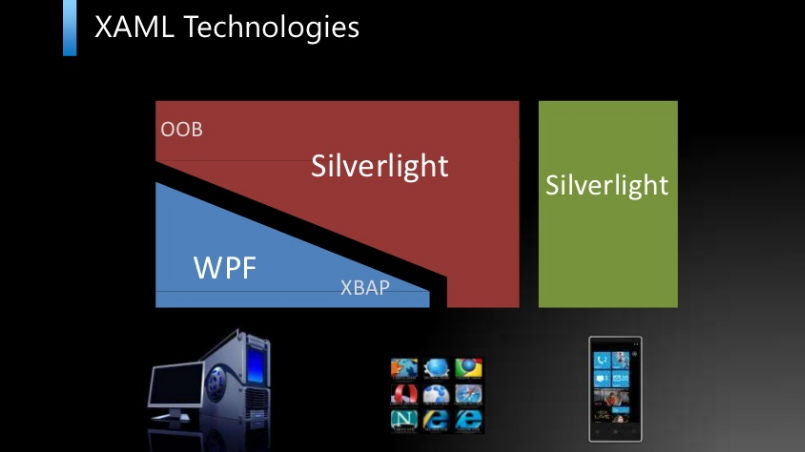

## Wstęp

W kilku najbliższych wpisach postaram się przybliżyć tematykę tworzenia aplikacji multiplatformowych. Środowisko .NET dostarcza nam rozwiązań, które pozwalają tworzyć zarówno aplikacje okienkowe (WinForms, WPF), strony internetowe (ASP.NET, Siverlight) jak i programy na telefony komórkowe (Windows Phone). W dzisiejszych czasach rozpowszechniło się tworzenie aplikacji w architekturze trójwarstwowej. Dzięki niej zostaje rozdzielony dostęp do danych, logika biznesowa oraz warstwa kliencka. Ułatwia to bardzo stworzenie systemów, które będą mogły "wystawiać" środowiska klienckie na różne platformy technologiczne. Brzmi prosto, ale w praktyce okazuje się trudniejsze. Programiści muszą cały czas się pilnować i mieć świadomość tego co się robi.Według mnie najważniejsze rzeczy, które powinniśmy mieć cały czas "w głowie" przy tworzeniu systemów wieloplatformowych są:
* możliwość wielokrotnego używania tych samych klas w różnych rodzajach projektów,
* tak jak tort, cebula i ogry, nasza aplikacja powinna posiadać warstwy. Warstwy te powinny komunikować się z sąsiednimi, nie burząc łańcucha zależności
* łatwość refaktoryzacji. Twórzmy rozwiązania w ten sposób, żeby np. zmiana typu bazy danych nie pociągała za sobą zmian w aplikacji klienckiej

Oczywiście jak we wszystkim, tutaj również trzeba kierować się rozsądkiem. Nie należy tworzyć rozwiązań, które pozwolą nam oprogramować działanie świata i rozpracować teorię wielkiego wybuchu, gdy chcemy napisać prosty kalkulator. Tak samo nie ma sensu generować kilkudziesięciu warstw, do których spamiętania będziemy potrzebowali schematu na dwie kartki A0.

.NET umożliwia nam tworzenie aplikacji w różnych platformach klienckich, ale żeby nie było tak prosto do każdego z nich ma pewne obwarowania. Silverlight, WPF i Windows Phone wywodzą się z jednego pnia, ale są osobnymi gałęziami. Z różnych powodów, głównie związanych ze specyfiką technologiczną środowiska klienckiego, oraz zaszłościami historycznymi są to tak naprawdę 3 różne frameworki .NET. Współdzielą niektóre klasy, część mają innych. W dużym uogólnieniu można by było powiedzieć:
* Silverlight jest podzbiorem WPF,
* Windows Phone jest podzbiorem Silverlight.

Oczywiście nie jest to do końca prawdą, ale całkiem dobrze oddaje rzeczywistość bez wchodzenia w większe szczegóły. No ale przejdźmy wreszcie do przykładów przykładu. Na nim powinno być łatwiej przedstawić te problemy. Graliście kiedyś w Kuku? Nie? To proszę oto i zasady (znalezione na "ABC Gier Karcianych"):

_"Kuku jest bardzo prostą grą karcianą trwającą zazwyczaj około 10 – 15 minut. Celem gry Kuku jest skompletowanie trzech takich samych kolorów albo trzech takich samych figur. W Kuku grać może nawet do kilkunastu osób. W Kuku można grać całą talią kart albo gdy w grze bierze udział mała liczba graczy można grać kartami od 9. Rozdający daje każdemu z graczy po trzy karty, zaś graczowi siedzącemu po swojej lewej stronie cztery. Gracz który ma cztery karty oddaje jedną kartę z nie pasujących mu kart graczowi który siedzi z lewej strony. Karty oddaje się zgodnie z ruchem wskazówek zegara. W przypadku powrotu do tej samej osoby i grające osoby potwierdzą taką możliwość wówczas gracz może zamienić kartę na jedną kartę z tali. Jeśli osoba która zbierze trzy jednakowe kolory lub figury nie krzyknie "kuku", a reszta graczy krzyknie wówczas osoba ta przegrywa. W sytuacji gdy wszyscy gracze poza jednym mają zebrane „kuku" wówczas gra się kończy a przegrany gracz musi odgadnąć „kuku" innych graczy może pomóc sobie jedynie własnymi kartami."_

Spróbujemy zrobić system, który pozwoli nam na zagranie w nią zarówno w "okienkach", stronie internetowej jak i telefonie komórkowym. Jest to na tyle prosta gra, że nie będzie trzeba za dużo męczyć się z oprogramowaniem jej logiki a na tyle trudna, że będę mógł traktować nasze rozważania jako punkt wyjściowy dla kolejnych artykułów (dodatkowo uprościmy sprawę i darujemy sobie zgadywanie na koniec gry, po prostu pierwszy gracz, który skompletuje kuku wygrywa).

## Przykład

Przed uruchomieniem Visual Studio polecam zainstalowanie sobie:
* [Visual Studio 2010 Service Pack 1](http://www.microsoft.com/download/en/details.aspx?id=23691)
* [Silverlight 4 SDK](http://www.microsoft.com/download/en/details.aspx?id=7335) (może być też 5)
* [Windows Phone SDK 1](http://www.microsoft.com/download/en/details.aspx?id=27570)

Gdy wszystko będzie już poinstalowane, skonfigurowane i dopięte na ostatni guziczek zapraszam do uruchomienia Visual Studio i utworzenia pustej solucji.

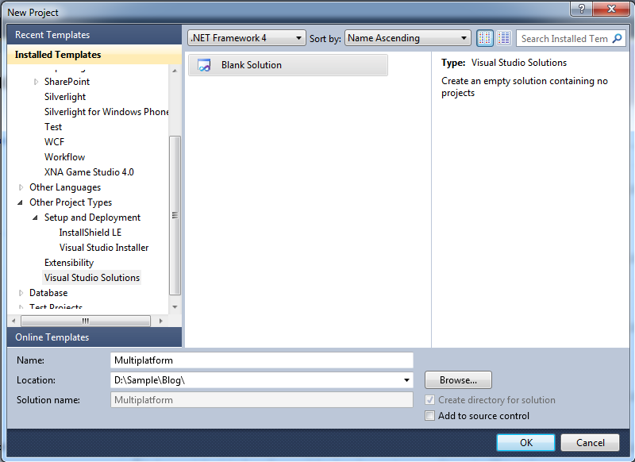

Następnie w nowej solucji utwórzmy dwa katalogi:
* Shared – na projekty ze wspólnymi klasami
* Client – na projekty klienckie

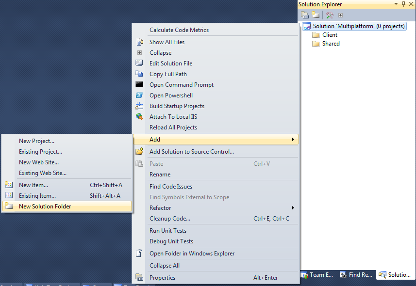

Do katalogu Client dodajmy projekty klienckie:
* WPF

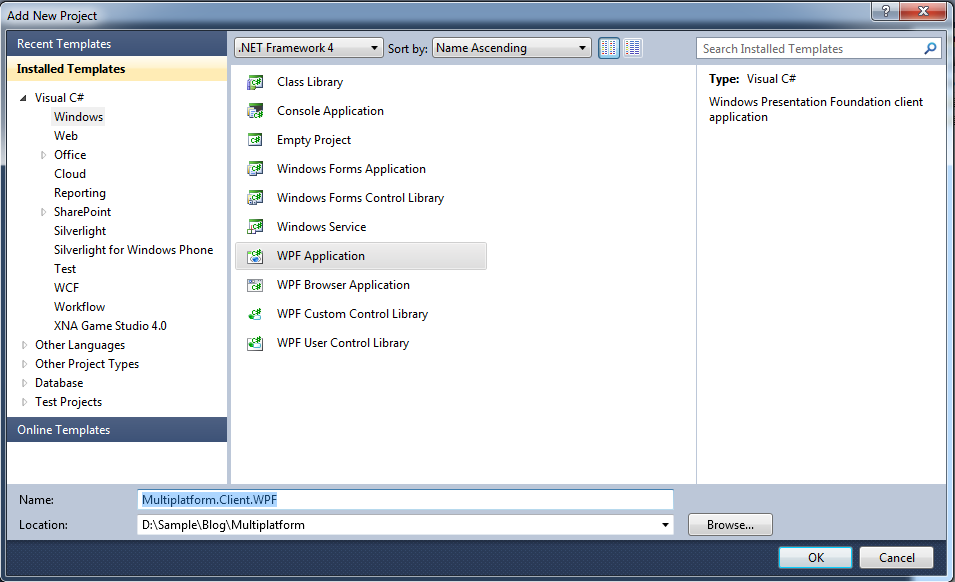

* Silverlight

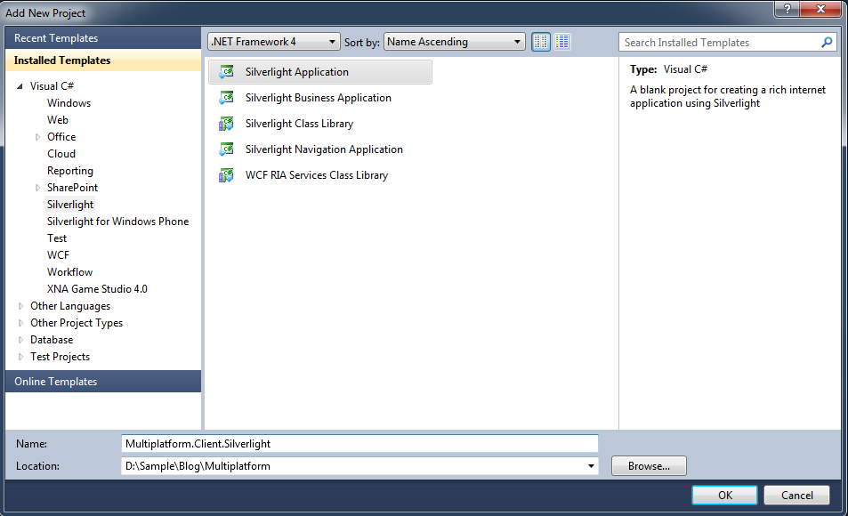

wraz z projektem hostującym na stronie www

* Windows Phone

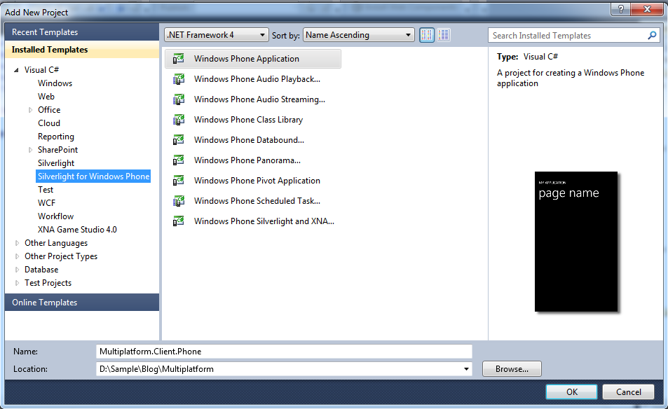

Do katalogu dodajmy projekt biblioteki klas

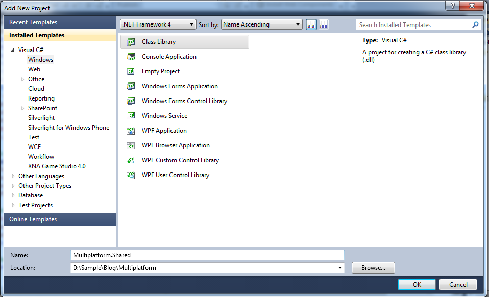

W tym projekcie będą znajdowały się klasy odpowiadające za logikę gry, które będą wspólne dla projektów klienckich. Dodajemy zatem referencję do tego niego w projekcie WPF, następnie w Silverlight i Phone. 

Udało Wam się? Mnie nie. Przy próbie dodania referencji w projekcie Silverlightowym wyskakuje komunikat:

Podobny dostaniemy przy próbie dodania referencji do projektu Phone’owego. Zatem w jaki sposób można współdzielić pliki skoro nie możemy podpiąć projektu do wszystkich typów aplikacji klienckich?

Rozwiązanie tego problemu nie jest ani eleganckie, ani najwygodniejsze, ale póki co jedyne rozsądne. Musimy utworzyć analogiczne projekty z klasami wspólnymi dla każdej z docelowych platform klienckich:

* Silverlighta

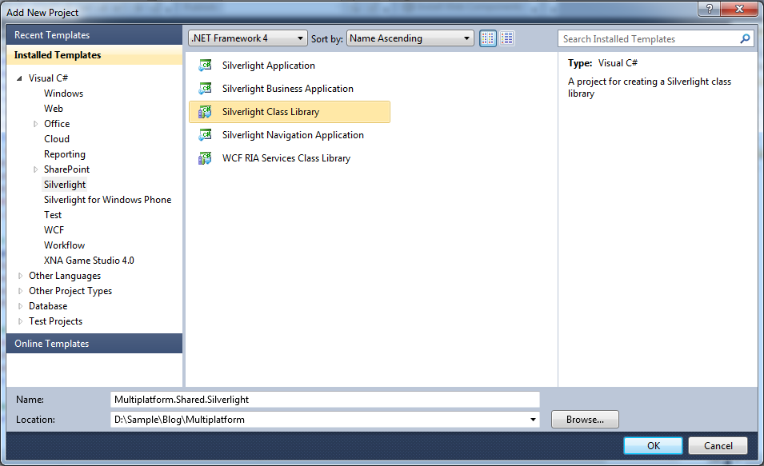

* Phone’a

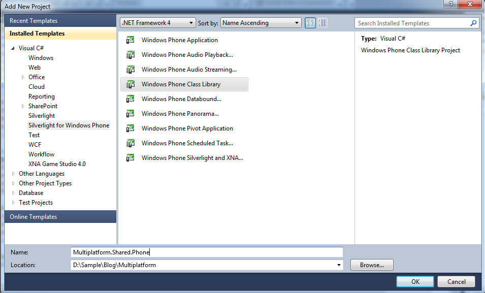

Po tym wszystkim struktura projektów powinna wyglądać następująco:

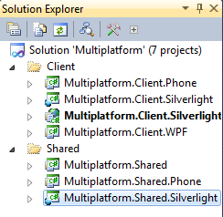

Będą one tak jakby kopiami tego co mamy w głównym projekcie ze wspólnymi klasami. Aby kopia była wierna musimy skopiować właściwości projektu i generowanej dllki. Otwórzmy informacje projektu wzorcowego:

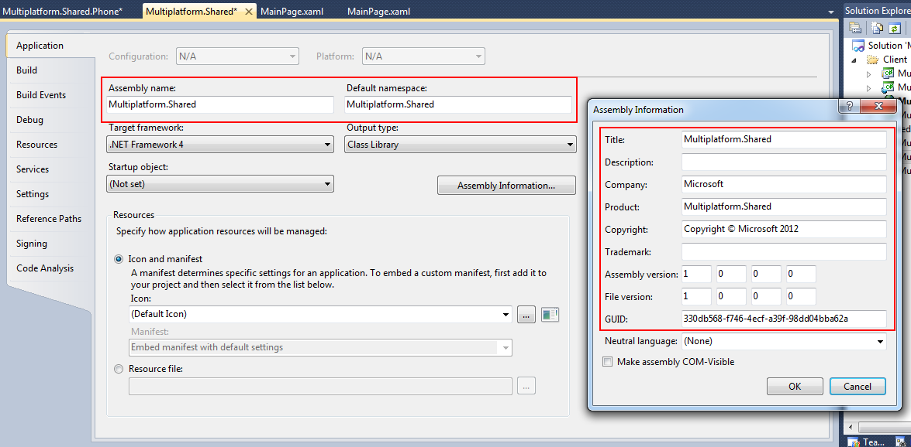

Musimy przenieść informacje:
* Assembly Name
* Default Namespace
* Assembly Information

Robimy to poprzez otworzenie właściwości projektów dla Silverlight oraz Phone i zmianę odpowiednich pól a na koniec zapisanie plików projektów.

Dzięki temu uzyskamy, to że generowane pliki będą miały ten sam namespace oraz takie same właściwości asemblatu. Będziemy mogli dzielić bez problemu klasy poprzez serwisy wcf, serializować je itd.

Domyślam się, że teraz po Waszej głowie chodzi myśl: _"Wszystko pięknie, ładnie, ale czy teraz będziemy musieli dodawać te same klasy do 3 różnych projektów i przy każdej zmianie uaktualniać w 3 miejscach?"_. Odpowiedzią jest: _"I tak, I nie"_. 

Tak, będziemy musieli dodawać plik do każdego projektu osobno. Nie, wystarczy że będziemy zmieniać je w jednym miejscu. Jak to możliwe? Visual Studio umożliwia dodawanie plików do projektu jako linków. Dzięki tym linkom VS nie tworzy nowego pliku tylko odwołuje się do lokacji w innym miejscu. Do projektu wzorcowego dodawać będziemy pliki w normalny sposób, do pozostałych linki do nich.

Aby pokazać jak to się robi utwórzmy interfejs IKukuGame w projekcie Multiplatform.Shared. Chcąc dodać plik jako link naciskamy na projekcie Multiplatform.Shared.Silverlight "Add Existing Item". Przechodzimy do lokalizacji gdzie znajduje się świeżo dodany interfejs. Zaznaczamy go i naciskamy małą strzałkę przy przycisku "Add". Pojawi nam się wtedy opcja "Add As Link". Naciskamy ją i _et voilà_!

Kody źródłowe można pobrać [tutaj](http://joomanji.no-ip.org/blog/multiplatform.zip).

## Podsumowanie

Po tym artykule powinniście już wiedzieć, że:
* zwykły .NET, Silverlight i Phone to nie to samo, 
* nie da się w prosty sposób połączyć ze sobą projektów,
* ale da się w nieco trudniejszy,
* powinniście znać zasady gry w Kuku.

W kolejnym wpisie podążymy tropem tego ostatniego punktu i zrobimy kolejny krok w stronę utworzenia gry multiplayer w Kuku.