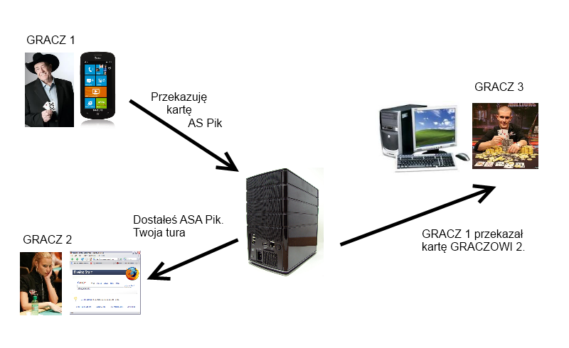
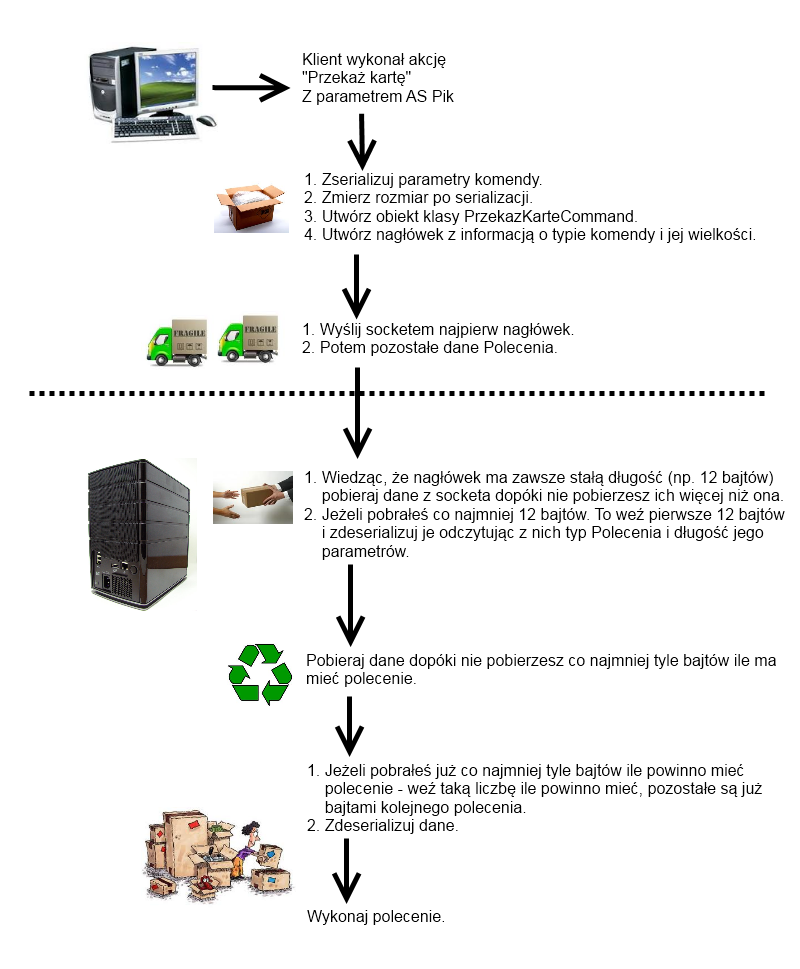

## Wstęp
W poprzednim wpisie przedstawiłem wstęp oraz kilka problemów, które napotykamy przy rozpoczęciu zabawy z aplikacji wieloplatformowych. Tak
jak zapowiedziałem, w tym wpisie przedstawię kolejny krok do utworzenia gry multiplayer w Kuku. Tym razem na warsztat wzięte zostają metody
komunikacji klient-serwer, serwer-klient przy pomocy socketów. Dlaczego przy pomocy socketów, a nie WCF? Szczegóły później. Najpierw się
zastanówmy czego tak naprawdę potrzebujemy.

Naszą wersję Kuku można opisać następująco:
* zbierają się gracze,
* każdemu z nich rozdajemy karty, pierwszy gracz dostaje 4, resta 3,
* jeżeli któryś z graczy ma 3 karty w jednym kolorze lub z tymi samymi figurami, to może krzyknąć "kuku!". Jeżeli nikt tego nie zrobił, to
* zaczyna się tura pierwszego gracza,
* wybiera on jedną kartę i przekazuje ją kolejnemu graczowi,
* zaczyna się jego tura,
* jeśli karta do niego wróci, może ją wymienić,
* kto pierwszy skompletuje kuku ten wygrywa.

Zatem nasza gra powinna:
* umożliwić dołączanie graczy,
* reagować na wybory gracza,
* powiadamiać graczy o zmianie stanu gry. 

Potrzebujemy zatem komunikacji pomiędzy graczami. Niektórym z Was od razu może się to skojarzyć z grami/programami typu P2P (Peer To Peer). Będzie to bardzo dobre skojarzenie. Implementując nasz system można by było w teorii pokusić się o to, żeby gracz, wysyłał kolejnemu graczowi informację: "Stary teraz twoja kolej!". A pozostałym o tym, że to zrobił. Niestety takie systemy są trudne do utrzymania, kontroli i rozwoju. Dodatkowo cała logika biznesowa jest przechowywana w aplikacji klienckiej, co powoduje ich nadmierny rozrost, tworząc je za dużymi do zastosowania na stronach internetowych oraz telefonach komórkowych. Według mnie lepsze jest rozwiązanie pośrednie:
* gracz przesyła informację do serwera o swoim wyborze,
* serwer decyduje o tym jaka akcja powinna być wykonana – to on mówi kolejnemu graczowi o jego turze, on rozsyła informacje do pozostałych graczy.

Komunikacja musi być zatem dwustronna:
* klient – serwer
* serwer – klient



Podejrzewam, że większość z Was miała już do czynienia z web service'ami pisanymi przy pomocy WCF. Są one dobre dla standardowych rozwiązań biznesowych, w których wysyłamy zapytanie, dostajemy odpowiedź – typowa komunikacja jednostronna. Niestety ten model komunikacji nie sprawdzi się w przypadku naszego problemu. U nas żądania wysyłane są w dwie strony, nie wiemy również kiedy dokładnie one wystąpią. Niektórzy z Was zapewne natrafili na Duplex Channel, pozwalający oprogramować w WCF komunikację dwustronną. Niestety w Silverlight dostępna jest tylko jego uboższa wersja, mając dużo ograniczeń, nie nadająca się do rozwiązań komercyjnych (więcej szczegółów na blogu Tomasza Janczuka [tutaj](http://tomasz.janczuk.org/2009/07/pubsub-sample-using-http-polling-duplex.html) i [tutaj](http://tomasz.janczuk.org/2009/11/wcf-nettcp-protocol-in-silverlight-4.html)). Z pomocą przyjdą nam stare jak świat sockety.

## Sockety

Jest to rozwiązanie znane od dawien dawna, istnieje ono zarówno w C++ jak i w Javie. Nie będę się nad tym przesadnie rozpisywał, raczej przedstawię ich ogólną zasadę.

Sockety pozwalają na bezpośrednią komunikację pomiędzy dwoma komputerami. Aby nawiązać połączenie musimy znać adres internetowy komputera oraz port, na którym on nasłuchuje. Klient znając te dane serwera łączy się z nim. Tworzone jest połączenie TCP. Połączenie jest utrzymywane cały czas, dlatego też możliwa jest komunikacja w dwie strony. Odbywa się ona przy pomocy strumienia bajtów. Zalety tego rozwiązania to szybkość i wydajność, minusem jest to, że musimy oprogramować cały mechanizm "odszyfrowywania" strumienia. Musimy sami określać, które bajty odpowiadają za co, gdzie kończy się jedno rozwiązanie, a zaczyna kolejne.

W moich rozważaniach punktem wyjściowym będzie świetny przykład Johna Papa zaprezentowany na [Silverlight TV](http://channel9.msdn.com/Shows/SilverlightTV/Silverlight-TV-70-Sockets-Unplugged). Przedstawił on tam podstawowy mechanizm przetwarzania socketów, zachęcam do przyjrzenia się mu i porównania ze zmianami, które do niego wprowadziłem.
Zaproponował on bardzo sprytny i prosty zarazem sposób przetwarzania danych przesyłanych w socketach, wykorzystał on przy tym [wzorzec projektowy Polecenie (Command)](http://pl.wikipedia.org/wiki/Polecenie_%28wzorzec_projektowy%29).

Chcąc przesłać żądanie do serwera musimy utworzyć obiekt klasy Command. Następnie serializujemy go do postaci binarnej i przesyłamy go poprzez socket do serwera. Serwer odbiera bajty i deserializuje je. Tak utworzony obiekt polecenia przetwarzamy przy pomocy klasy pomocniczej CommandHandler. Dla każdego rodzaju operacji konieczne jest utworzenie implementacji klasy Command, dzięki temu klasa pomocnicza wie w jaki sposób ma wykonać polecenie (na podstawie jej typu).

Wspominałem wcześniej, że największym problemem przy Socketach jest określenie, w jaki sposób rozdzielić jedno żądanie od innego. Tak jak już napisałem pomiędzy klientem a serwerem utworzony jest strumień TCP. Zwykle  każde żądanie jest wysyłane osobno, lecz może dość do sytuacji gdy w jednym pakiecie wysłane zostanie kilka żądań (np. gdy są opóźnienia w sieci a klient wykonał szybko kilka akcji), lub jedno żądanie zostanie podzielone na kilka pakietów (np. gdy wysyłamy sporą liczbę danych). Nie będziemy wiedzieli więc od razu po odczytaniu danych ze strumienia, czy możemy już deserializować i wykonać Polecenie. Jak zatem sobie z tym poradzić? 

John Papa zaproponował, żeby komenda posiadała nagłówek. Nagłówek ten posiadał będzie podstawowe informacje o niej (takie jak jej rozmiar). Najważniejszą jego cechą jest to, że będzie on miał stałą wielkość. Dzięki czemu będzie można go zserializować od razu gdy zorientujemy się, że mamy do czynienia z nowym żądaniem. Po jego odczytaniu będziemy wiedzieć ile jeszcze bajtów zostało nam do odczytania, wiedząc tym samym, w którym miejscu kończy się żądanie. 



## Konkrety

Klasa polecenia napisana zgodnie z tymi wytycznymi wygląda następująco:

```csharp
/// <summary>
/// Klasa wzorowana na rozwiązaniu przedstawionym
/// przez Johna Papa w Silverlight TV
/// http://channel9.msdn.com/Shows/SilverlightTV/Silverlight-TV-70-Sockets-Unplugged
/// </summary>
public class Command
{
    /// <summary>
    /// Typ polecenia
    /// 
    public int CommandType;
    /// <summary>
    /// Rozmiar nagłówka
    /// </summary>
    public int HeaderLen;
    /// <summary>
    /// Dane nagłówka
    /// </summary>
    public byte[] Header;

    /// <summary>
    /// Dane polecenia
    /// </summary>
    public byte[] Data;

    public Command()
    {
        HeaderLen = 12;
        Header = null;
        Data = null;
    }
        
    /// <summary>
    /// Metoda inicjująca nagłówek
    /// </summary>
    /// <returns></returns>
    public virtual BinaryWriter InitHeader()
    {
        Debug.Assert(CommandType != 0);
        Debug.Assert(HeaderLen >= 12);
        Header = new byte[HeaderLen];
        var bw = new BinaryWriter(new MemoryStream(Header));
        bw.Write(Htonl(HeaderLen));
        bw.Write(Htonl(Data == null ? 0 : Data.Length));
        bw.Write(Htonl(CommandType));
        return bw;
    }

    /// <summary>
    /// Metoda formatująca liczby do formatu
    /// odpowiedzniego dla socketów
    /// </summary>
    /// <param name="value"></param>
    /// <returns></returns>
    public Int32 Htonl(Int32 value)
    {
        return IPAddress.HostToNetworkOrder(value);
    }
}
```

Do zapisywania wysłania polecenia przez Socket służy klasa CommandWriter:

```csharp
/// <summary>
/// Klasa służąca do wysyłania danych poprzez socket
/// </summary>
public class CommandWriter
{
    public Socket Socket;

    public CommandWriter()
    {
    }

    public CommandWriter(Socket socket)
    {
        Socket = socket;
    }

    /// <summary>
    /// Metoda wysyłająca polecenie poprzez socket
    /// przekazany w konstruktorze
    /// </summary>
    /// <param name="command">polecenie</param>
    public void Write(Command command)
    {
        Write(Socket, command);
    }

    /// <summary>
    /// Metoda wysyłająca polecenie poprzez
    /// zadany socket
    /// </summary>
    /// <param name="socket">socket</param>
    /// <param name="command">polecenie</param>
    public void Write(Socket socket, Command command)
    {
        //utwórz nagłówek
        command.InitHeader();
        var senddata = new List<ArraySegment<byte>> { new ArraySegment<byte>(command.Header) };
        //wrzuć dane polecenia
        if (command.Data != null)
        {
            senddata.Add(new ArraySegment<byte>(command.Data));
        }
        var writeEventArgs = new SocketAsyncEventArgs();
        writeEventArgs.Completed += WriteCompleted;
        writeEventArgs.BufferList = senddata;
        //wyślij socketem bajty
        socket.SendAsync(writeEventArgs);
    }
}
```

Klasa odczytująca polecenie z socketa będzie wyglądała następująco: 

```csharp
/// <summary>
/// Klasa służaca do odczytywania danych z socketa
/// wzorowana na rozwiązaniu przedstawionym
/// przez Johna Papa w Silverlight TV
/// http://channel9.msdn.com/Shows/SilverlightTV/Silverlight-TV-70-Sockets-Unplugged
/// </summary>
public class CommandReader
{
    public Socket Socket;

    byte[] data = new byte[0];

    public CommandReader(Socket socket)
    {
        this.Socket = socket;
    }
    /// <summary>
    /// Metoda zamieniająca liczbę z formatu socketa
    /// na format standardowy
    /// </summary>
    /// <param name="value"></param>
    /// <returns></returns>
    public static Int32 Ntohl(Int32 value)
    {
        return System.Net.IPAddress.NetworkToHostOrder(value);
    }

    /// <summary>
    /// Metoda rozpoczynająca nasłuchiwanie socketu
    /// </summary>
    /// <param name="h"></param>
    public void StartListening(ICommandHandler h)
    {
        Console.WriteLine("CR: Go  : Socket {0} CR {1}", Socket, this);

        //określ parametry nasłuchiwania
        const int size = 10000;
        var e = new SocketAsyncEventArgs();
        e.Completed += OnRead;
        e.UserToken = h;
        e.SetBuffer(new byte[size], 0, size);

        //rozpocznij nasłuchiwanie
        while (Socket.ReceiveAsync(e) == false)
        {
            TransformData(e);
        }
    }

    /// <summary>
    /// Metoda wywołana po zaczytaniu paczki danych z socketa
    /// </summary>
    /// <param name="sender"></param>
    /// <param name="e"></param>
    private void OnRead(object sender, SocketAsyncEventArgs e)
    {
        //przetwarzaj dane
        TransformData(e);
        //nasłuchuj czy nie przychodzą kolejne porcje danych
        while (Socket != null && Socket.ReceiveAsync(e) == false)
        {
            TransformData(e);
            if (e.BytesTransferred == 0)
            {
                break;
            }
        }

    }
    /// <summary>
    /// Metoda przetwarzająca dane otrzymane z socketa
    /// </summary>
    /// <param name="e"></param>
    private void TransformData(SocketAsyncEventArgs e)
    {
        var oldLen = data.Length;
        var newLen = oldLen + e.BytesTransferred;
        Array.Resize<byte>(ref data, newLen);
        Array.Copy(e.Buffer, 0, data, oldLen, e.BytesTransferred);
        while (data.Length >= 12)
        {
            //pobrano już co najmniej nagłówek
            var reader = new BinaryReader(new MemoryStream(data));
            var headerLen = Ntohl(reader.ReadInt32());
            var dataLen = Ntohl(reader.ReadInt32());
            var opcode = Ntohl(reader.ReadInt32());
            var totLen = headerLen + dataLen;
            var extra = data.Length - totLen;

            //jeżeli nie pobrano jeszcze całości danych
            //zakończ przetwarzanie i czekaj na kolejną
            //paczkę z danymi
            if (extra < 0)
                break;
                
            //Pobrano już co najmniej tyle danych ile ma polecenie
            //utwórz nową tablicę do przechowywania danych polecenia
            byte[] newData = new Byte[dataLen];
            Array.Copy(data, headerLen, newData, 0, dataLen);

            //zainicjuj obiekt polecenia
            Command cmd = null;
            switch (opcode)
            {
                //tutaj wstawiamy tworzenie poszczególnych poleceń
                //w zależności od typu
                default:
                    cmd = new Command{Data = newData};
                    break;
            }

            //jeżeli pobrano więcej bajtów niż miało mieć polecenie
            //przenieś je do nowej tablicy
            if (extra > 0)
            {
                Array.Copy(data, totLen, data, 0, extra);
            }
            Array.Resize<byte>(ref data, extra);

            //wykonaj polecenie
            ICommandHandler h = (ICommandHandler)e.UserToken;
            h.DoCommand(this, cmd);
        }
    }
}
```

## Podsumowanie

W tym poście przedstawiłem ogólny zarys sposobu komunikacji dla aplikacji multiplatformowych w środowisku .NET. Pokazane zostało po co nam komunikacja dwustronna, klient – serwer, serwer – klient. Jak można zaimplementować ją przy pomocy socketów.

Popisałem się również umiejętnością czytania ze zrozumieniem i pokazałem klasy do obsługi czytania i zapisu do socketów zaprezentowane przez Johna Papa. W kolejnych postach przedstawię jak w ogóle uruchomić sockety, jak skonfigurować serwer i klienta i pokażę trochę własnej inwencji przedstawiając swoje ulepszenia do dotychczas opisanych rozwiązań.

Kody źródłowe można pobrać [tutaj](http://joomanji.no-ip.org/blog/multiplatform02.zip). 