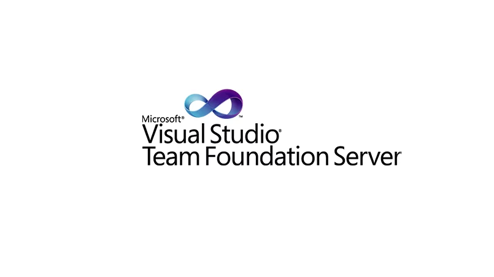

Przedwczoraj (środa 21.03) debiutowałem w roli "wykładowcy" na spotkaniu Wrocławskiej grupy .NET. Zaprezentowałem tam rozwinięcie moich wpisów związanych z połączeniem SCRUM z Team Foundation Server. 

Mnie jako prezentującemu na pewno podobało się zaangażowanie słuchaczy, za co serdecznie dziękuję. Nie wiem jak było w drugą stronę, jeżeli ktoś był i chce się podzielić swoimi wrażeniami (nawet najbardziej negatywnymi) to bardzo proszę o komentarze.

Obiecałem, że przedstawię materiały, z których dociekliwi mogliby się dowiedzieć więcej o przedstawianym przeze mnie temacie.

Jako pierwsze zareklamuje swoje wcześniejsze wpisy:

– [Opis metodyki SCRUM](https://oskar-dudycz.pl/2011/11/09/scrum-i-team-foundation-system-cz1/)

– [Instalacja TFS 11](https://oskar-dudycz.pl/2011/11/11/scrum-i-team-foundation-server-cz2/)

– [Wystawienie TFS na zewnątrz](https://oskar-dudycz.pl/2011/11/16/scrum-i-team-foundation-server-cz3/)

– [Utworzenie projektu w TFS](https://oskar-dudycz.pl/2011/11/22/scrum-i-team-foundation-server-cz4/)

– [Continuous Integration i automatyczne buildy](https://oskar-dudycz.pl/2011/11/30/scrum-i-team-foundation-server-cz5/)

– [Proces TDD w realizowanym projekcie](https://oskar-dudycz.pl/2011/12/10/scrum-i-team-foundation-server-cz6/)

A teraz linki z których korzystałem:

– [Ogólny opis nowości w TFS 11](http://blogs.msdn.com/b/visualstudioalm/archive/2011/09/20/visual-studio-team-foundation-server-11-developer-preview-what-s-new-for-team-foundation-server.aspx)

– [Tworzenie storyboardów](http://msdn.microsoft.com/en-us/library/hh409276%28v=vs.110%29.aspx)

– [Testowanie przy pomocy Test Managera](http://msdn.microsoft.com/en-us/library/hh301770%28v=vs.110%29.aspx)

– [Zarządzanie kontaktem z klientem (Feedback Manager) – tutorial](http://msdn.microsoft.com/en-us/library/hh301769%28v=vs.110%29.aspx)

– [Zmiany w Team Explorerze oraz opis Code Review](http://blogs.msdn.com/b/bharry/archive/2011/09/19/the-new-team-explorer-in-tfs-11.aspx)

– [Nowy mechanizm merge'owania plików](http://blogs.msdn.com/b/bharry/archive/2011/08/31/merge-enhancements-in-tfs-11.aspx)

– [Podsumowanie zmian w kontroli wersji](http://blogs.msdn.com/b/bharry/archive/2011/09/01/wrapping-up-tfs-11-version-control-improvements.aspx)

– [Raporty z TFS przy użyciu Excela](http://www.woodwardweb.com/vsts/getting_started.html)

– [Maszyna wirtualna z przykładową konfiguracją TFS oraz sporo tutoriali](http://blogs.msdn.com/b/briankel/archive/2011/09/16/visual-studio-11-application-lifecycle-management-virtual-machine-and-hands-on-labs-demo-scripts.aspx)

Polecam również dwie świetne książki (dotyczą one co prawda TFS 2010, ale większość porad i opisów ma również zastosowanie w przypadku nowej wersji):

– ["Professional Scrum with Team Foundation Server 2010" – S.Resnick, A. Bjork, M. de la Maza](http://www.amazon.com/Professional-Scrum-Foundation-Server-Programmer/dp/0470943335)

– ["Proffesional Team Foundation Server 2010" – E. Blankenship, M. Woodward, G. Holliday, B. Keller](http://www.amazon.com/Professional-Team-Foundation-Server-Programmer/dp/0470943327/ref=sr_1_sc_1?s=books&ie=UTF8&qid=1332490618&sr=1-1-spell)

Miłej lektury!