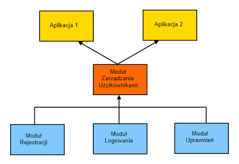
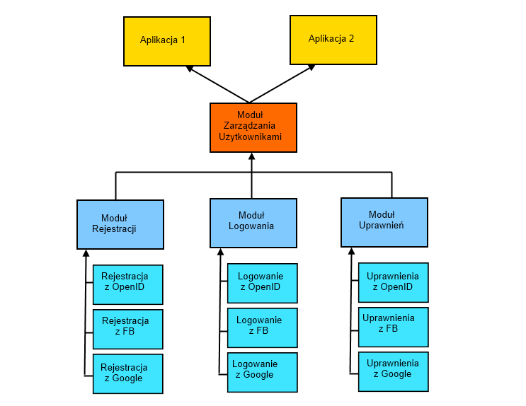
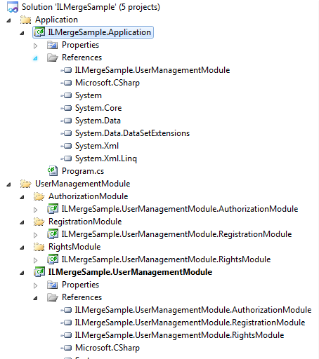
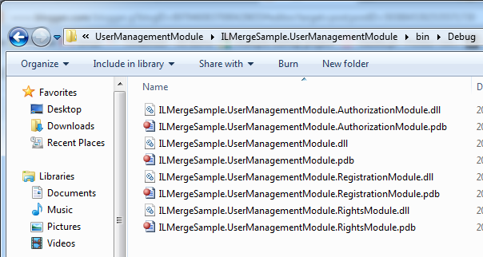
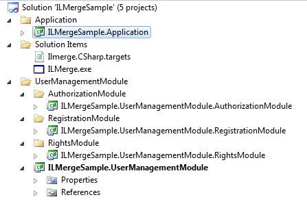
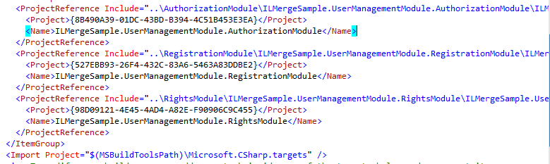
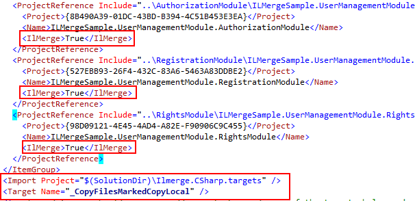
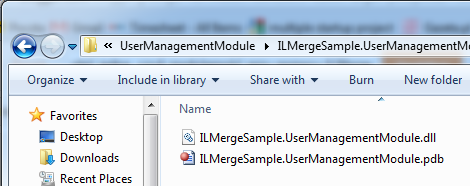

## Wstęp

Pracuję aktualnie nad strukturą pewnego projektu. Ideą, która przyświeca przy jej tworzeniu jest to, żeby była jak najbardziej modularna – tak by składała się z niezależnych, niepowiązanych ze sobą podaplikacji. 

Aby lepiej przybliżyć problem przyjrzyjmy się przykładowi:



Przyjmijmy, że chcemy stworzyć moduł zarządzania użytkownikami, który będziemy używać w kilku tworzonych przez nas aplikacjach. Nie chcemy, bowiem za każdym razem wynajdywać koła od początku.  Moduł ten składać się będzie z podmodułów odpowiadających za rejestrację, logowanie, uprawnienia. 

Standardowo do każdego z tych "klocków" utworzylibyśmy osobny projekt, chcąc dodać do naszych aplikacji musielibyśmy wrzucić 4 osobne dllki:
– główną – Modułu Zarządzania Użytkownikami
– 3 zależne – Moduł Rejestracji, Moduł Logowania, Moduł Uprawnień.

Dorzucenie 4 dllek nie wydaje się chyba wielkim problemem, prawda? 

Pójdźmy jednak dalej. Załóżmy, że nasza firma zajmuje się tworzeniem stron internetowych. Mamy kilka "żyjących" i rozwijanych stron. Każdą z nich zajmuje się osobny zespół programistów, mamy również dział geeków, którzy zajmuje się core'em. Nasi klienci stwierdzili, że chcieliby mieć możliwość logowania się i rejestracji przy pomocy otwartych systemów uwierzytelniania jak OpenID, Google, Facebook. Zespół naszych geeków czym prędzej zaczyna się tym zajmować i na koniec generuje następującą strukturę:



Przy uaktualnianiu Modułu Zarządzania Użytkownikami musimy pamiętać, że musimy dodać kolejne dziewięć dllek dla każdego z podmodułów. W sumie mamy trzynaście dllek, może i pechowa liczba, ale to dalej nie jest krytyczny problem, czyż nie? Krytycznie jednak zaczyna się robić, gdy mamy kilka używanych w wielu miejscach modułów, z których każdy składa się z podmodułów. Gdy jeszcze trzymamy się zasadom luźno powiązanych klas, inversion of control i korzystamy z kontenerów dependency injection to sytuacja robi się jeszcze bardziej problematyczna, a zapomnienie dorzucenia dllki łatwiejsze i bardziej problematyczne.

Dużym uproszczeniem byłaby sytuacja gdy każdy moduł jest osobną dllką. Dzięki temu programiści, którzy z niego korzystają nie muszą się zastanawiać z czego on dokładnie się składa, musiał by tylko wiedzieć jak się go używa.

## Co to jest ILMerge?

ILMerge jest narzędziem dostarczonym przez Microsoft, pozwalającym na łączenie kilku asemblatów w jeden (stąd jego nazwa – łączenie [ILa](http://pl.wikipedia.org/wiki/Common_Intermediate_Language)). Radzi on sobie bez większych problemów również z łączeniem plików .pdb umożliwiając tym samym debugowanie. Dostarczany jest w postaci pliku EXE (można go pobrać pod [linkiem](http://www.microsoft.com/download/en/details.aspx?displaylang=en&id=17630)), który uruchomiony z odpowiednimi parametrami pozwala nam na złączenie asemblatów. Przykładowe jego wywołanie to:

```poweshell
ilmerge /target:winexe /out:myprogram.exe yourexe.exe yourlibrary.dll
```

Gdzie:
– _ilmerge_ – nazwa pliku ilmerge'a 
– _/target_ – parametr mówiący czy nasz asemblat ma być plikiem exe (winexe) cz dllką (module) 
– _/out:_ – parametr mówiący o nazwie wynikowego pliku, podajemy też asemblaty, które chcemy złączyć.

Jak to zobaczyłem to stwierdziłem, że bardzo to fajne, tylko że wywoływanie za każdym razem polecenia z linii komend. Na szczęście znalazłem świetny [artykuł Scotta Hanselmana](http://www.hanselman.com/blog/MixingLanguagesInASingleAssemblyInVisualStudioSeamlesslyWithILMergeAndMSBuild.aspx) jak można ten proces zautomatyzować.

## Automatyczne wywołanie ILMerge

MSBuild pozwala na zdefiniowanie akcji, które będą wykonywane po procesie zbudowania projektu (tzw. Post build actions). Możemy zatem zdefiniować akcję, która będzie polegała na wywołaniu ILMerge'a z odpowiednimi parametrami dla wybranych przez nas projektów. Jak tego dokonać? Ponieważ pliki projektów są zarazem plikami MSBuilda możemy je odpowiednio zmodyfikować.

Zacznijmy od utworzenia nowej solucji i struktury projektów. Niech wygląda ona następująco:



Odpowiada ona przykładowej strukturze projektów przedstawionej wcześniej. Mamy projekt ILMergeSample.UserManagementModule, który ma referencję do trzech podmodułów. Zbudujmy teraz nasz solucję i przejdźmy do katalogu Debug dla naszego projektu modułu obsługi pracowników.



Zgodnie z przewidywaniami standardowo skopiował dllki podmodułów. Przejdźmy więc do sedna artyukułu i zacznijmy łączyć je w jedną. Rozpocznijmy od skopiowania pliku ILMerge.exe do struktury naszej solucji (domyślnie znajduje się w "C:Program Files (x86)MicrosoftILMerge"). Pozwoli nam to uniezależnić od tego czy inny developer ma go na swoim komputerze i pod jaką ścieżką się u niego znajduje.

Dodajmy również plik o nazwie "Ilmerge.CSharp.targets".

Nasza struktura solucji powinna wyglądać teraz następująco:



Otwórzmy teraz plik "Ilmerge.CSharp.targets" i wklejmy do niego następujące dane:

```xml
<Project DefaultTargets="Build" xmlns="http://schemas.microsoft.com/developer/msbuild/2003">  
    <Import Project="$(MSBuildBinPath)Microsoft.CSharp.targets" />   
    <Target Name="AfterBuild">     
    <CreateItem Include="@(ReferencePath)" Condition="'%(CopyLocal)'=='true' and '%(ReferencePath.IlMerge)'=='true'">
    
 
    <Message Text="MERGING: @(IlmergeAssemblies->'%(Filename)')" Importance="High" /> 
 
    <Exec Command="&quot;$(SolutionDir)Ilmerge.exe&quot;
        /targetplatform:v4,&quot;%ProgramFiles%Reference AssembliesMicrosoftFramework.NETFrameworkv4.0&quot; 
        /out:@(MainAssembly) &quot;@(IntermediateAssembly)&quot; @(IlmergeAssemblies->'&quot;%(FullPath)&quot;', ' ')" /> 
     </Target> 
 
     <Target Name="_CopyFilesMarkedCopyLocal"/>     
</Project>
```

Co to tak naprawdę robi? Prześledźmy to po kolei:
– _Project DefaultTargets="Build"_ – określamy tutaj, że definiujemy akcję dla builda
– _Import Project="$(MSBuildBinPath)Microsoft.CSharp.targets"_ – importujemy tutaj domyślne ustawienia builda, nie chcemy bowiem wszystko definiować od początku, tylko nadpisać część ustawień
– _CreateItem Include="@(ReferencePath)" Condition="‘%(CopyLocal)'=='true' and ‘%(ReferencePath.IlMerge)'=='true'"_ – dzięki temu warunkowi wybieramy do złączenia te asemblaty, które są dołączone do naszego projektu i mają zaznaczoną opcję "Copy Local" oraz "ILMerge" na true
– _Message Text_ – tutaj definiujemy wiadomość, która będzie informowała nas w outputcie o tym, że dokonujemy złączenia asemblatów w trakcie budowania projektu
– _Exec Command_ – tutaj definiujemy odpowiednie wywołanie ILMerge'a. Moja konfiguracja jest specyficzna dla .NET 4.0, jeżeli macie asemblaty w innej wersji .NET powinniście zmodyfikować parametr /targetplatform.

Mając konfigurację MSBuilda z ILMerge powinniśmy jeszcze poinformować nasz projekt, że ma z niej korzystać. Dokonujemy tego poprzez ręczną modyfikację pliku projektu (naciskamy na niego prawym przyciskiem i wybieramy opcję "Edit Project File").

Po otworzeniu pliku projektu naszego Modułu Zarządzania Użytkownikami powinniśmy odnaleźć następujące linijki:



Jedyne co musimy zrobić to zmodyfikować plik następująco:



Dodaliśmy tylko dla wybranych przez nas projektów zmienną &lt;IlMerger&gt; z wartością true informując o tym, że chcemy, żeby projekt został połączony i podmieniliśmy domyślną konfigurację builda przygotowaną wcześniej w pliku "Ilmerge.CSharp.targets".

Zapiszmy teraz plik projektu, przeładujmy go i przebudujmy. Ponownie zerknijmy do katalogu Debug naszego Modułu Zarządzania Użytkownikami i ujrzymy, że została wygenerowana tylko jedna dllka.



## Czy ILMerge działa dla Silverlighta i Phone'a?

Ależ owsze, czemu nie. Należy tylko odpowiednio spreparować nasz plik targets:
– dla Phone'a nasz plik wyglądał by następująco: 

```xml
<Project DefaultTargets="Build" xmlns="http://schemas.microsoft.com/developer/msbuild/2003">    
    <Import Project="$(MSBuildExtensionsPath)MicrosoftSilverlight for Phone$(TargetFrameworkVersion)Microsoft.Silverlight.$(TargetFrameworkProfile).Overrides.targets" />
    <Import Project="$(MSBuildExtensionsPath)MicrosoftSilverlight for Phone$(TargetFrameworkVersion)Microsoft.Silverlight.CSharp.targets" />
   
    <Target Name="AfterBuild">     
    <CreateItem Include="@(ReferencePath)" Condition="'%(CopyLocal)'=='true' and '%(ReferencePath.IlMerge)'=='true'">
    
 
    <Message Text="MERGING: @(IlmergeAssemblies->'%(Filename)')" Importance="High" /> 
 
    <Exec Command="&quot;$(SolutionDir)Ilmerge.exe&quot;
        /targetplatform:v4,&quot;%ProgramFiles%Reference AssembliesMicrosoftFrameworkSilverlightv4.0ProfileWindowsPhone&quot; 
        /out:@(MainAssembly) &quot;@(IntermediateAssembly)&quot; @(IlmergeAssemblies->'&quot;%(FullPath)&quot;', ' ')" /> 
    </Target> 
 
    <Target Name="_CopyFilesMarkedCopyLocal"/>     
</Project>
```
– dla Silverlight'a nasz plik wyglądał by następująco: 

```xml
<Project DefaultTargets="Build" xmlns="http://schemas.microsoft.com/developer/msbuild/2003">  
    <Import Project="$(MSBuildExtensionsPath32)MicrosoftSilverlight$(SilverlightVersion)Microsoft.Silverlight.CSharp.targets" />   
    <Target Name="AfterBuild">     
    <CreateItem Include="@(ReferencePath)" Condition="'%(CopyLocal)'=='true' and '%(ReferencePath.IlMerge)'=='true'">
    
 
    <Message Text="MERGING: @(IlmergeAssemblies->'%(Filename)')" Importance="High" /> 
 
    <Exec Command="&quot;$(SolutionDir)Ilmerge.exe&quot;
        /targetplatform:v4,&quot;%ProgramFiles%Reference AssembliesMicrosoftFrameworkSilverlightv5.0&quot; 
        /out:@(MainAssembly) &quot;@(IntermediateAssembly)&quot; @(IlmergeAssemblies->'&quot;%(FullPath)&quot;', ' ')" /> 
    </Target> 
 
    <Target Name="_CopyFilesMarkedCopyLocal"/>     
</Project>
```

Jak łatwo zauważyć podmieniliśmy tylko ścieżki do plików z domyślnymi ustawieniami buildów dla tych środowisk oraz poprawiliśmy wywołanie ILMerge'a w Exec Command tak aby dotyczyła właściwej platformy.

## ILMerge i Resharper

Jeżeli zrobiliście wszystko zgodnie z powyższym opisem to po dodaniu klas i próbie wywołania ich w projekcie Application okaże się, że Resharper nie widzi klas z podmodułów (Authorization, Registration, Login). Dzieje się tak dlatego, że projekty naszych modułów znajdują się w tej samej solucji co projekt Application. Jeżeli utworzylibyśmy osobną solucję, w której nie znajdowałyby się nasze podmoduły, a tylko projekt Application okaże się, że Resharper widzi je już bez większych problemów.

Jest to błąd Resharpera – chociaż oni [twierdzą](http://devnet.jetbrains.net/message/5253869#5253869) inaczej. Zapewne nie chce im się tego naprawiać, ale oczywiście mają na to mądre wytłumaczenie. Mówią, że jeżeli doprowadziło się do takiej sytuacji to znaczy, że układ projektów jest zły. Można by się było z nimi po części zgodzić, bo moduły powinny być traktowane jako całość i posiadać osobne solucje a nie być wepchnięte w jedną dużą. Jest to jednak spore uniedogodnienie, szczególnie na początku tworzenia systemu, gdy moduły są często zmieniane – trzeba wtedy pracować na kilku solucjach na raz, albo ignorować błędnie podświetlony przez Resharpera kod.

## Podsumowanie i linki

Mam nadzieję, że tym artykułem udało mi się przybliżyć to jak ILMerge może pomóc nam przy tworzeniu modularnych aplikacji oraz przede wszystkim ułatwić życie programistom.

Kody źródłowe przykładów z tego artykułu możecie znaleźć tutaj.

Linki do artykułów z których korzystałem przy tworzeniu tego wpisu to:
* http://www.hanselman.com/blog/MixingLanguagesInASingleAssemblyInVisualStudioSeamlesslyWithILMergeAndMSBuild.aspx
* http://blogs.msdn.com/b/jomo_fisher/archive/2006/03/05/544144.aspx
* http://blogs.clariusconsulting.net/kzu/leveraging-ilmerge-to-simplify-deployment-and-your-users-experience/
* http://awkwardcoder.blogspot.com/2011/05/using-ilmerge-for-windows-phone-7.html
* http://albao.wordpress.com/tag/ilmerge-error-documentation-exception-net/
* http://nitoprograms.blogspot.com/2010/09/using-ilmerge-with-net-40-andor-rx.html
* http://devnet.jetbrains.net/message/5253869#5253869