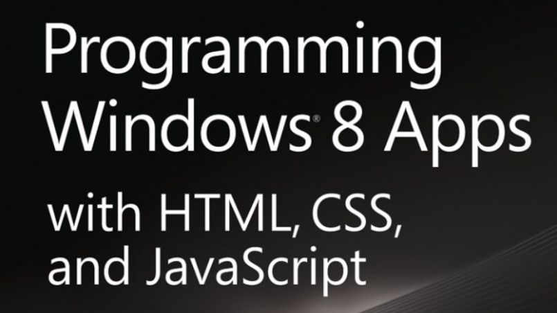

Microsoft konsekwentnie kontynuuje taktykę ściągania nie .NETowych programistów – udostępnił darmową książkę w ramach Microsoft Press: "Programming Windows 8 Apps with HTML, CSS, and JavaScript". Jest ona dostępna pod adresem:

https://download.microsoft.com/DOWNLOAD/8/E/2/8E27933F-9B1E-409E-A0A3-508A39D75E9F/MICROSOFT_PRESS_EBOOK_PROGRAMMING_WINDOWS_8_APPS_WITH_HTML_CSS_AND_JAVASCRIPT_PDF.PDF

Nie do końca jestem przekonany do tego, że HTML5, JavaScript i CSS jest tym kierunkiem, w którym powinny podążać systemy operacyjne. Wg mnie te technologie są chaotyczne, mają pełno złych zaszłości historycznych i są ciężkie w utrzymaniu. (Nie)stety nie tylko Microsoft podąża w tą stronę – Apple, Google również mocno w nią idą. 

A wy co o tym wszystkim sądzicie?
