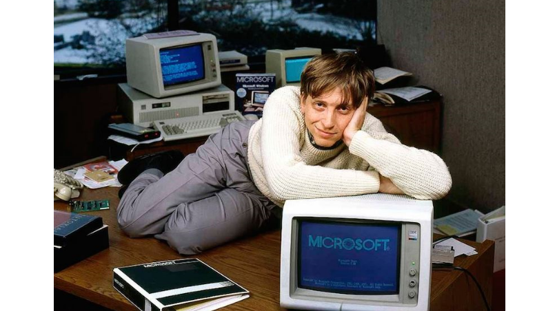

Heh. 

To już ponad 1,5 roku od poprzedniego wpisu. 

Gdzieś w między czasie uleciał trochu wolny czas, trochu zapał. Tak to już jest. Jutro się tym zajmę, może w następnym tygodniu, w weekend na pewno będę miał czas, a jak nie to już od następnego miesiąca będę królem samozaparcia i samorealizacji. Każdy to zna, każdy to przeżywa. Potem się okazuje, że to święte oburzenie zostało zamienione na czas spędzony na poobiednich drzemkach, oglądaniu 9 sezonów Dwóch i pół, czy graniu w 2048. Potem to już tylko, że jestem zarobiony, w pracy ciężko i w ogóle tyle roboty, że taczki nie ma jak załadować, a o szyby deszcz dzwoni, deszcz dzwoni jesienny.

Jakiś czas temu "popełniłem wykon" (tak bardzo nie cierpię nowomowy, że aż musiałem jej użyć) na potrzeby wewnętrznych szkoleń w firmie, w której pracuję. Programowanie w Office 2013. Temat wydaje mi się, że ciekawy i mało zagospodarowany. Przez co duże w nim pole do popisu. Z racji, że to mój debiut w tej materii to proszę o litościwość.

`youtube: https://www.youtube.com/watch?v=UIOhfYkg9BA`

Mam nadzieję, że dorównałem mistrzowi:

`youtube: https://www.youtube.com/watch?v=FNWnfM8Ney4`