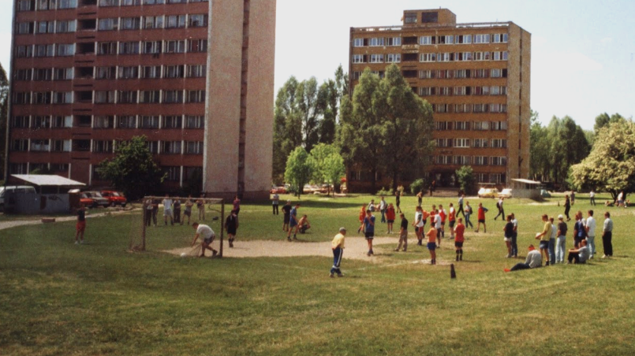

Borys had the best dribbling, Cybor bent it like Beckham, there were a few little kids who could pull off 200 keepie-uppies. My class 5B always gave 5A a hiding after a tough match. For a while now, we'd only been playing by the new rules, no back-passing to the keeper. I didn't do hundreds of tricks, I'd cap my keepie-upiess at 20–30. It didn't entertain me. I didn't need excessive ornaments. I thought that, at the end of the day, fundamentals are what matter most. Kicking the ball where you want it to go. What's the difference if it slams into the top corner, curves in like a Brazilian wonder-goal, or barely rolls over the line? What matters is that it ends up in the net. That's what counts in the end. Art for art's sake? Not for me.

In FIFA, I never picked Brazil, not even in '98 did I play as France. That would've been too easy. Better to go against the grain. What's the challenge in playing a guitar that's already in tune? Better to lose to better players than to win against worse ones. Better to be a benchwarmer at Manchester United than the captain at Miedź Legnica.

I always read the instructions. You've got to prepare. You've got to assemble it the right way.

I don't buy the first thing I see; I check price-comparison sites, read forums, and set up auction snipers on auction platforms.

Yesterday, after two years, I finally fixed the broken blinds.

- "What's your biggest weakness?" 
- "I'm a perfectionist."

Sometimes I call myself the master of unfinished ideas. Like most of us, I dream of having my own idea, my own product, my own startup. I regularly throw myself at the next brilliant (in intent) idea, and I regularly fail to finish it. Every attempt ends the same way - "the same place, different girlfriend."

Of course, every project of mine has to have solid foundations. Architecture first, then the framework. Everything has to be top-notch, the latest tech, best practices, and design patterns. I've finally got a free hand, after all, no nagging customer to worry about. Honestly, our industry is often a lot like Polish State Railways: everything would run brilliantly if it weren't for the customers. We constantly laugh at customers: what do they know, idiots, don't teach me how to do my job. Who cares about colours, a button shifted three pixels to the left, the wrong shade? What matters is that it's SOLID. The most important thing is good architecture and beautifully functioning internals. Our projects are like icebergs, massive underneath, but somehow not much visible to show for it.

Last week, a book landed in my hands, well, an ebook: ["Just Fucking Ship"](https://shop.stackingthebricks.com/just-fucking-ship) by Amy Hoy. It hit my mood of brooding over what I'm doing wrong perfectly. Why is Borys the schoolyard footballer everyone remembers, and not me? Why does my dad say I'm all gas, no follow-through, that I burn hot and burn out fast? Why are Xamarin and SignalR thriving, while my unfinished framework with similar ambitions sits at the back of my hard drive, untouched for years? You'd think I'm doing everything right. Reason. Solid foundations. Knowledge. Experience. Mr. Prim and Proper.

Maybe it's exactly because I make the same mistakes everyone (well, almost everyone) makes: 

- I focus on chasing the rabbit, not catching it. I start a project from the framework, a website from the layout, and before any of that, from picking the domain name. So I burn through my peak motivation on bullshit that's least important from a product perspective.
- I don't take notes, I don't write down plans, "why would I? I don't need to, I'm exercising my memory." 
- I don't focus on the goal, I don't set deadlines. 
- I don't follow the "start small, grow big" principle.

https://twitter.com/abt_programming/status/561488797440176128

Amy's book isn't groundbreaking; it doesn't hand you a golden recipe — it doesn't even aspire to. What it does give you is a breath of fresh air in your head, a few mental hatches popping open, and a handful of valuable, concrete, real-life advice. **The most important: set yourself a goal, a deadline, and just fucking do it.** First, the goal and the time, then the scope and the methods. Of course, we'll all say, "yeah, but it doesn't always work that way". But look at it differently: when we want to invite friends over for dinner, do we plan, "well, maybe in two weeks instead, because I won't have time to make a three-course meal, a cake, and homemade liqueur"? We don't do that. We adjust the menu or buy something pre-made. Why can't we apply the same approach to our projects?

Amy notices that we focus too much on the project as a whole. We don't set ourselves small goals — the kind that, when achieved, would give us satisfaction and motivation to keep going. We get so fixated on the grand vision that we end up abandoning the idea without doing anything at all. We're afraid it isn't cool enough, it isn't innovative enough. Why don't we let other people judge that? We stay frozen at the starting line instead of just running and seeing how far we get. We forget that to get to the upper floor, you take the stairs one step at a time. Standing on the ground floor, wondering if we can make it up, gets us nowhere. We can even take the elevator, as long as we just fucking do it.

After this read, I'm not going to turn my life upside down, I'm not suddenly going to become a different person. I'm just going to try, this time, to finally fucking deliver on my plans.

A week ago, at almost 30 years old, I picked up my first football medal. There's still hope.
