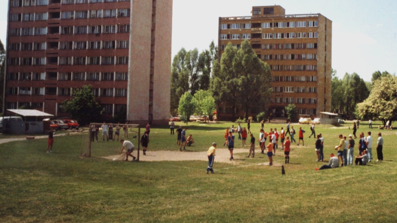

Borys najlepiej dryblował, Cybor kręcił najlepsze rogale, było kilku kajtków, robiących 200 kapek. Moja piąta B, zawsze bo ciężkim meczu dokopywała piątej A. Od jakiegoś czasu graliśmy już tylko "na nowe". Ja nie robiłem setek zwodów, robienie kapek kończyłem na 20-30. Nie bawiło mnie to. Nie potrzebne mi były nadmiarowe ozdobniki, uważałem że koniec końców najważniejsze są podstawy. Kopnięcie piłki tam gdzie się chce. Co za różnica czy walnie się w okienko, brazylianę czy piłka ledwo się wtoczy? Ważne, żeby znalazła się w bramce. Koniec końców to się liczy. Sztuka dla sztuki? Nie dla mnie. 

W Fifę nigdy nie wybierałem Brazylii, nawet w 98ym nie grałem Francją. To byłoby za proste. W końcu lepiej iść pod prąd. Co to za trudność grać na nastrojonej gitarze? Lepiej przegrywać z lepszymi niż wygrywać ze słabszymi. Lepiej być szeregowym graczem w Manchasterze Utd. niż kapitanem w Miedzi Legnica. 

Zawsze czytam instrukcje. W końcu trzeba się przygotować. Trzeba skręcić jak należy. 

Nie kupuję rzeczy pierwszych z brzegu, sprawdzam Ceneo, czytam fora, na Allegro ustawiam snajpera.

Wczoraj po dwóch latach naprawiłem zepsutą żaluzję.

– _Jaka jest Pana największa wada?_
– _Jestem perfekcjonistą._

Czasem mówię o sobie mistrz niedokończonych pomysłów. Jak większość z nas marzę o swoim własnym pomyśle, swoim własnym produkcie, startupie. Regularnie przystępuję do kolejnych błyskotliwych (w zamierzeniu) pomysłów i regularnie je nie dokańczam. Każda próba kończy się tak samo, "to samo miejsce inna dziewczyna". 

Oczywiście każdy mój projekt musi mieć solidne fundamenty. Najpierw architektura, framework. Wszystko musi być na tip top, najnowsze rozwiązania, dobre praktyki, wzorce projektowe. W końcu mam teraz wolną rękę, nie muszę się przejmować marudzącym klientem. Ogólnie to chyba u nas w branży często bywa jak w PKP, wszystko by zajebiście szło gdyby nie klienci. Często naśmiewamy się z tego, że co on tam wie, że głupek, że nie będzie uczył ojca dzieci robić. Co tam kolorki, przycisk przesunięty o 3 pixele w lewo, albo nie ten odcień? Ważne żeby było SOLID. Najważniejsze to mieć dobrą architekturę i świetnie funkcjonujące trzewia. Nasze projekty są jak góra lodowa, olbrzymie pod spodem, tylko widocznych efektów jakoś tak niedużo. 

W zeszłym tygodniu trafiła mi w ręce książka, w zasadzie ebook "Just Fucking Ship" napisana przez Amy Hoy. Świetnie trafiła w mój nastrój zadumy nad tym co robię źle. Dlaczego Borys jest tym pamiętanym przez wszystkich piłkarzem z podwórka, nie ja? Dlaczego mój tato mówi, że mam słomiany zapał? Dlaczego Xamarin i SignalR świecą sukcesy, a mój niedokończony framework z podobnymi założeniami leży gdzieś na końcu mojego dysku nie rozwijany od kilku lat? Przecież wydawałoby się, że robię wszystko jak należy. Rozsądek. Solidne podstawy. Wiedza. Doświadczenie. Mr Prim and Proper. 

Może to właśnie dlatego, że popełniam te same błędy co wszyscy (no prawie wszyscy), czyli:
– nie skupiam się na złapaniu króliczka tylko go gonieniu. Projekt zaczynam od frameworka, stronę od layoutu, a w ogóle to od wymyślenia nazwy domeny. Przez co tracę okres największego entuzjazmu na pierdoły, które z punktu widzenia produktu są najmniej ważne.
– nie notuję, nie spisuję planów – "no bo po co? Nie potrzebuję tego – ćwiczę pamięć"
– nie skupiam się na celu, nie wyznaczam sobie deadline'ów.
– nie postępuję w myśl zasady "start small, grow big". 

https://twitter.com/abt_programming/status/561488797440176128

Książka Amy nie jest wielce odkrywcza, nie da złotej recepty – nawet do tego nie aspiruje. To co na pewno da to powiew świeżości w głowie, otwarcie kilku zamkniętych zapadek i garść cennych, konkretnych, życiowych porad. Najważniejsza z nich to: wyznacz sobie cel, termin i po prostu to kurwa zrób. Najpierw cel i czas potem zakres i metody realizacji. Oczywiście, każdy z nas powie "e no, tak to się nie zawsze da zrobić. Tylko spójrzcie inaczej: czy chcąc zaprosić znajomych na obiad planujemy, że "może to za 2 tygodnie jednak, bo nie zdążę zrobić trzydaniowego obiadu, tortu i domowej nalewki". Przecież tak nie robimy. Dopasowujemy listę dań lub kupujemy coś gotowego. Czy nie da się tej polityki przenieść na grunt naszych też projektów? 

Amy zauważa, że za bardzo skupiamy się na projekcie jako całości. Nie wyznaczamy sobie małych celów, których zrealizowanie pozwoliłoby nam być osiągnąć satysfakcję i motywację do kolejnych działań. Tak bardzo skupiamy się na ogólnej wizji, że w końcu zarzucamy nasz pomysł nie robiąc niczego. Boimy się, że nie jest on wystarczająco fajny, wystarczająco innowacyjny. Czemu nie damy innym szansy tego ocenić? Zostajemy w progach startowych zamiast po prostu biec i zobaczyć gdzie dobiegniemy. Zapominamy, że aby wejść na piętro należy pokonać schody krok po kroku. Stojąc na parterze, zastanawiając czy damy radę wejść niczego nie osiągniemy. Możemy nawet wjechać windą, bylebyśmy to kurwa zrobili. 

Po tej lekturze nie wywrócę swojego życia do góry nogami, nie stanę się nagle innym człowiekiem. Po prostu tym razem spróbuję swoje plany wreszcie kurwa dowieźć. 

Tydzień temu, w wieku prawie 30 lat odebrałem swój pierwszy piłkarski medal. Jest jeszcze nadzieja.