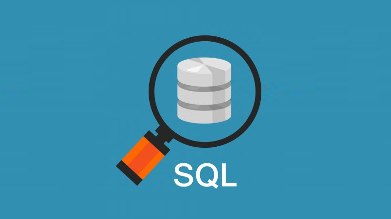

Tym razem, po serii nostalgiczno-branżowo-przemyśleniowych wpisów, będzie krótko i technicznie. Chciałbym się przed wami popisać  swoją niewiedzą. Nie ma się w zasadzie czym chwalić, ale uważam, że głupotą nie jest brak wiedzy, co raczej wstyd przed jego okazaniem… No ale nie o to, nie o to, Oskarze, do sedna, do sedna…

Wczoraj podczas godzin spędzonych na szukaniu błędu natrafiłem w pewnej procedurze na takowy kod:

```sql
if exists (
 select Kolumna
 from Tabela t
 where t.Id = @Id
)
begin
 (...)zrób coś
end
```

Kod jak kod pomyślałem. Ale zastanowił mnie komentarz: "Zrób coś"  tylko gdy Kolumna ma ustawioną wartość. Rzuciło mi się to w oczy bo z zasady jestem wyczulony na kod, który wymaga komentarzy. Okazało się, że mimo tego, że dla mojego rekordu Kolumna nie miała wartości to IF zawsze zwracał TRUE i "robił coś". Dlaczego?
 
Ano dlatego, że dla EXISTS zwrócone przez subquery wartości nie mają żadnego znaczenia . Ważna dla niego jest tylko liczba zwróconych rekordów. Niezależnie od tego czy zwrócimy wszystkie czy jedną kolumnę, czy zwrócimy NULL, czy wartość dla Exists będzie to zawsze TRUE. Bo zwróciliśmy wiersz.
 
Pusty wiersz to nie to samo co brak wierszy.
 
Brak decyzji też często bywa decyzją…

Dla zwizualizowania odpalcie sobie dwa zapytania:

```sql
SELECT 1 WHERE EXISTS(SELECT NULL)
```

i:

```sql
SELECT 1 WHERE EXISTS(SELECT NULL WHERE 1=2)
```

Mała rzecz a cieszy. Niby podstawy podstaw, a człowiek może dać się złapać. A przecież na MSDN jest jak wół [napisane](https://docs.microsoft.com/en-us/sql/t-sql/language-elements/exists-transact-sql?redirectedfrom=MSDN&view=sql-server-ver15).

Codziennie człowiek uczy się czegoś nowego. I to chyba jest fajne w naszym zawodzie, czyż nie?