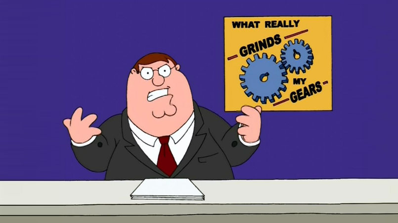

Jestem spokojnym człowiekiem, niespotykanie spokojnym. Ale… Jestem Oskar, z Polski. Miejsca urodzenia nie przeskoczę. Natura, historia, zwyczaje, pierogi, kierpce, Szopen wieczorową porą. 

I irytacja. 

Rosnąca irytacja. 

Pulsująca irytacja. 

Przechodząca w krótkie, staropolskie słowo rozpoczynające się i kończące się na W.

No co ja na to poradzę? Po prostu wiele rzeczy mnie denerwuje. Co np.? To, że gdy chcę jeździć na rowerze to jest za gorąco albo pada deszcz. To, że po piciu  wódki na drugi dzień boli głowa. To, że studentów tyle w pociągach i to, że po każdej niedzieli przychodzi poniedziałek. Co ja będę Wam mówił, nie jest łatwo być Polakiem. Wicie rozumicie, wina Tuska.

Ciężko być Polakiem, ale być Polakiem i programistą to już tylko ciężej być kibicem i sprzedawcą butów (oh wait…). Te porażki w piłkarzyki w pracy, te przymusowe przerwy od przeglądania memów, gdy nam każą popracować. Ta dojmująca, nieznośna lekkość bytu. 

I IFy. 

IIIIIIFY. 

KŁIIII KŁIII KŁIIIIIIIIIIIFY. 


Mała.

Prosta.

Rzecz.

Programistyczna.

Ala.

Ma.

Kota. 

Kot.

Ma.

Alę.

A ja jestem wmotylanogawiony.

Hej Ty! Tak, Ty!

Do Ciebie wołam Przyjacielu! Ty, który robisz mi takie rzeczy:

```csharp
public TwojTyp IIIIIIIIIIIIIIIIIFunkcja(JeszczeInnyTyp obj)
{
    TwojTyp wynik;
    if (obj != null)
    {
        if (obj.Nazwa == "Jakastam")
        {
            wynik = new TwojTyp(3);
        }
        else
        {
            int ilestam = wyliczIlestam(obj);

            wynik = new TwojTyp(ilestam);
        }
    }
    else
    {
        wynik = null;
    }

    return wynik;
}
```

Doktor Ratajczak nie jest z Ciebie dumny. Ja nie jestem z Ciebie dumny. Czy ten kod naprawdę jest wg Ciebie czytelny? Czy tylko na tyle Cię stać?

No dobra 10…9…8…7…6…5…4…3…2…1…0. Spokój. Oskar też tak pisałeś. I(IIIIIIII) to ile razy. Z Ciebie też dr R nie był dumny.

Taki kod jest niestety czymś zupełnie powszechnym. Niestety jest też czymś zupełnie złym. Zwykle w tych ifach i elsach znajduje się co najmniej kilkunastoliniowa logika biznesowa. Zwykle nie mieści się to to na ekranie. Taki kod nie da się czytać od góry do dołu. Nie da się szybko ocenić co tak naprawdę ta metoda zwraca, jaki jest oczekiwany wynik, jakie są skrajne przypadki. Zwykle chcąc zrozumieć co ta funkcja robi, trzeba przejść IF po I(IIIIIII)Fie, ELSE po ELSE, linijka po linijce. Zwykle scrollując, góra dół, dół góra. Płacz i zgrzytanie zębów.

Kod nie dość, że jest nieczytelny to jest jeszcze klasycznym czasopochłaniaczem, zdecydowanie nie czasoumilaczem, ale za to klientapieniądzoprzeżuwaczem. 

Jak go poprawić? Bardzo prosto: 
1. Stosuj odwrócone IFy.
2. Jak najszybciej zwracaj wartość.
3. Tnij i rezygnuj jak tylko można z używania ELSE.
4. Skrajne przypadki dawaj na początku, oczekiwane na końcu.

Odwracanie IF plus zwracanie jak najszybciej wartości (_Angard!_):

```csharp
public TwojTyp IIIIIIIIIIIIIIIIIFunkcja(JeszczeInnyTyp obj)
{
    TwojTyp wynik;
    if (obj == null)
    {
        return null;
    }
    else
    {    
        if (obj.Nazwa == "Jakastam")
        {
            wynik = new TwojTyp(3);
        }
        else
        {
            int ilestam = wyliczIlestam(obj);

            wynik = new TwojTyp(ilestam);
        }
    }

    return wynik;
}
```

Ucinanie ELSE (_Touche!_):

```csharp
public TwojTyp IIIIIIIIIIIIIIIIIFunkcja(JeszczeInnyTyp obj)
{
    TwojTyp wynik;
    if (obj == null)
    {
        return null;
    }
    if (obj.Nazwa == "Jakastam")
    {
        wynik = new TwojTyp(3);
    }
    else
    {
        int ilestam = wyliczIlestam(obj);

        wynik = new TwojTyp(ilestam);
    }
    
    return wynik;
}
```

No i znowu i znowu (_Adieu!_):

```csharp
public TwojTyp IIIIIIIIIIIIIIIIIFunkcja(JeszczeInnyTyp obj)
{
    if (obj == null)
    {
        return null;
    }
    if (obj.Nazwa == "Jakastam")
    {
        return new TwojTyp(3);
    }
    
    int ilestam = wyliczIlestam(obj);

    return new TwojTyp(ilestam);
}
```

Nie było tak trudno chyba, co? Paluszki nie zabolały? A główka? Och ^_^

Taki kod jest dużo łatwiejszy do przeczytania. Na początku widzimy skrajne wartości, na końcu wynik ostateczny, a pomiędzy – logikę biznesową. Chcąc zrozumieć funkcję czytamy ją od góry do dołu, jak Pana Tadeusza, jak ten wpis o irytacji. Tak jak nasz mózg by chciał to widzieć. Czytelność, konwencja, prostota.

No i nie irytuje.

Jest miło.

Spokojnie.

Cichutka letnia bryza. 

Nikt nie krzyczy:

## IIIIIIIIIIIIIIIIIIIIIF! 