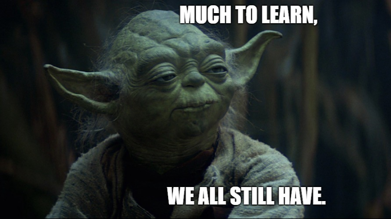

Człowiek uczy się całe życie. Słyszymy, powtarzamy ten truizm. Czasem jest to pochwała, najczęściej pocieszenie.

Wiedza, mądrość, inteligencja, czy to synonimy?

Na studiach uczymy się czy studiujemy? Po studiach jesteśmy mądrzejsi czy mamy większą wiedzę?

Czasami słyszę pytania skąd wiem to co wiem i w jaki sposób dowiaduję się co mam wiedzieć. Sam też często zadaję na rozmowach kwalifikacyjnych pytania: 

*"Skąd Pani/Pan czerpie wiedzę?"*

*"Co Pani/Pan robi gdy natrafi na problem, z którym do tej pory się nie spotkała/ł"*

*"Czy ma Pani/Pan jakieś może nie autorytety programistyczne ale po prostu ludzi na których odpowiedzi Pani/Pan często trafia?"*

Podsumowaniem odpowiedzi niech będzie miks:

*"No wie Pan, zwykle to jak wszyscy: StackOverflow, Google. A osoby? Eee… Raczej nie kojarzę teraz, najczęściej to po prostu szukam odpowiedzi i tyle"*

A Ty mój drogi czytelniku, czego szukasz na tym blogu? Rozwiązania problemu? Inspiracji? Tak sobie klikasz? Skrolujesz?
Sierpień 2007 roku był miesiącem, który nie zapisał się wielce na kartach historii, zaczął się jak każdy od 12 lat Przystankiem Woodstock. Przez Mikołajki przeszedł największy szkwał w historii. 46te urodziny obchodził pewien senator z Illinois. Wyszła pierwsza wersja jQuery. Gdzieś pomiędzy tymi wydarzeniami rozpoczął swoją zawodową karierę niżej podpisany blogger.

## Wyszukiwanie
W Google nie było jeszcze takie oczywiste dla wszystkich. Gawiedź ciągle jeszcze lubiła korzystać z wyszukiwarek na Onet, Interii i WP. W portalach branżowych królowały CodeProject, CodeGuru. Cały MSDN mieścił się na instalce Visual Studio.

Rok później, dokładnie 6 sierpnia Jeff Artwood [poprosił](http://blog.codinghorror.com/help-name-our-website/) o pomoc w wyborze nazwy dla swojego startupu. W głosowaniu trzecie miejsce zajęła nazwa dereferenced.com, drugie privatevoid.com, wygrała stackoverflow.com.

Dzikie czasy.

Rzeka czasu płynie. Technologie się zmieniają. Popularność mija. Lustra się zmieniają – na tych nowszych człowiek jakoś tak starzej wygląda. 

Nie wierzyłem kiedyś, że założę Twittera, do dzisiaj już naskrobałem 619 tweetów (i licznik [bije](https://twitter.com/oskar_at_net)). 

Ale wracając do pytania: jak zdobywam wiedzę? Czy jestem w tym oryginalny? Nieee. Pewnie to znasz, ale może coś jednak nowego podłapiesz.

## Problemy dnia codziennego

`youtube: https://www.youtube.com/watch?v=NP4lrVIpbvo`

Nie wiem jak rozwiązać jakiś problem, leci mi bug, potrzebuję przykład implementacji. Who I gonna call? Google.

Booooring! 

Zacznijmy od tego, że zawsze instaluję angielską wersję systemu oraz narzędzi z których korzystam. Kiedyś zainstalowałem omyłkowo polskie wersje, przez
co musiałem najpierw wymyślać jak treść błędu brzmiałby po angielsku. Wpisywać w google, próbować tłumaczyć to ponownie, bo pierwsza próba nie
była najlepsza. Nie muszę Wam mówić, jak kłopotliwą sprawą to było. Co charakteryzuje moje wyszukiwania? W przypadku błędu sprawdzam w debuggerze czy nie ma inner exception (zwykle ma więcej do zaoferowania). W wyszukiwarce wpisuję jego kod/numer i maksymalnie jedno zdanie z jego treści. Staram się wybrać ten fragment, który charakteryzuje najlepiej co się stało. Za długi opis ograniczy nam za bardzo listę wyników. Ważne, żeby nie wpisywać tekstu charakterystycznego dla naszego rozwiązania, czyli wyciąć np. nazwy naszych klas, nie wklejać numeru linii itd. itp.

Jakie strony uznaję zwykle za warte kliknięcia? Stack – wiadomo, MSDN – zwykle też, chociaż często brakuje tam opisu dlaczego, jest tylko jak, co bywa kłopotliwe. Blogi? Jak najbardziej. Code Project? Tak sobie. Niestety od czasu zmonopolizowania go przez Hindusów (no offence) strona poszła w ilość nie jakość. Czasem jednak da się dalej trafić na dobre artykuły. Fora internetowe i grupy dyskusyjne staram się klikać na końcu, jak już nic dobrego nie znajdę. To subiektywne, ale ciężko mi się w nich odnaleźć. Za dużo też tam dyskusji zaciemniających sytuację.

Nie muszę dodawać, że ograniczanie się do samej pierwszej strony z wynikami to błąd. Ja zwykle klikam dalej, póki widzę, że linki wydają mi się
sensowne. Gdy pojawią w wynikach linki zachęcające do obejrzenia cycków Kasi Cichopek – czas znikać. (Btw – zauważyliście też ten zalew spamerskich stron kradnących kliki treściami ze Stacka? Czemu gugiel nic z tym nie zrobi? Przecież Ceneo potrafili swego czasu wyciąć jednym sztychem…).

Co robię gdy nie znajdę ni zadowalającego? Staram się znaleźć słowa kluczowe w odpowiedziach. Zwykle piszą je osoby, które lepiej znają język dziedzinowy ode mnie i warto wpisać fragment ich odpowiedzi w wyszukiwarkę.

Ważne, żeby nie ograniczać swojego wyszukiwania do pierwszym linku ze stacka, a już tym bardziej do najlepiej punktowanej odpowiedzi. Zwykle tylko z tych minusowych nie da się nic wartościowego dowiedzieć. Warto nie kończyć szukania nawet jak pierwsza odpowiedź wydaje się sensowna. Podobno lepsze jest wrogiem dobrego, ale nie w tym przypadku.

## Źródła problemów

No i okej. Położyliśmy listek babki na bubę. Krew już nie leci. Skutki błędu usunięte. Można żyć dalej? Można. A potem człowiek idzie po tym samym chodniku, potyka się o tę samą płytę i znowu te samo kolano zdarte.

<ins>Ważne, jest likwidować źródło problemu, a nie tylko sam problem</ins> (Jasiu, możesz? Tak jest – wężykiem. Dziękuję). Jak zlikwidujemy źródło, to problem też przestanie występować. Wiadomo, krew trzeba zatamować szybko i bez zbędnych pytań, ale potem warto jednak sytuację przeanalizować.
Co więc jest tym źródłem problemu? Conradowskim jądrem ciemności? Najczęściej po prostu niewiedza, czasem lenistwo, czasem po prostu krótka pamięć. Jak można je wyeliminować?

Krótka pamięć? Robienie notatek, zapisywanie linków w posegregowanych w foldery zakładkach, zapisywanie sobie kodów źródłowych z przykładami w jednym miejscu. Z dobrze nazwanymi i pogrupowanymi katalogami.

Lenistwo? Ruszenie dupy.

Niewiedza? Jak powtarzała moja germanistka: Uczitsa, Uczitsa, Uczitsa.

Jak ja podchodzę konkretnie do tematu? No cóż, mieszam wszystkie trzy rzeczy w jedną. Gdy szukam rozwiązania problemu zapisuję sobie znalezione linki jako zakładki (tak aby mi nie przepadły). Co więcej, te które uznam za wartościowe zostawiam otwarte. Kończy się to zwykle kilkudziesięcioma zakładkami i Firefoxem zżerającym ponad giga ramu. Ale co tam, o to chodzi. Im bardziej irytuje tym bardziej nie daje o sobie zapomnieć. Samo zapisanie linku bez zostawienia niestety powoduje, że krótka pamięć i myślenie "a dobra to jutro go otworzę" zaczyna działać. Najlepsze linki staram się też wrzucać na  Twittera.

Zwykle te zapisane linki są potem źródłem do kolejnych poszukiwań. Szukam na blogach, szukam w książkach. 

Nie samym Internetem człowiek żyje. Warto zapytać też kolegów czy natrafili na podobny problem, jak go rozwiązali. Dobrze jest nawet zagaić na zasadzie:

_"Jasiu, patrz jaki jestem zajebisty, zobacz jaki kawał kodu napisałem"_

Wtedy często trafiamy na ripostę:

_"No pięknie, ładnie. Super to zrobiłeś – tylko po co? Wiesz, że jest biblioteka X co zrobi to za Ciebie?"_

Ego cierpi, wiedza rośnie.

W skrócie – warto być dociekliwym, ciekawskim, nawet czasem upierdliwym.

## GPS

Na początku chciałem być programistą Javy, uwielbiałem Eclipse. C# i Visual Studio wydawały mi się takie sobie. Dostałem się jednak na staż w .NET, spodobało mi się i przez taki pół-przypadek wyznaczyłem sobie azymut, którym podążam do do dzisiaj. Nie była to oczywista decyzja, w między czasie zarabiałem też na pisaniu aplikacji we Flashu, Ruby. Większość ofert pracy we Wrocławiu była w Javie lub C++, a te co były to zwykle w małych firmach.

Flash umarł, Java się zagubiła w rozwoju, kierunek okazał się na szczęście dobry, ale praca w innych technologiach dała mi sporo dobrego. Dzięki Javie szybko nauczyłem się C#, Flashowi asynchroniczności, Ruby wzorca MVC.

Sama praca w technologiach Microsoftu też była jak jazda rollercoasterem:
– ASP.NET WebForms,
– ASP.NET MVC (beta!)
– Win.Forms,
– MVVM w WPF,
– ASP.NET MVC z koniecznością zostania specem od JavaScript,
– Business Inteligence w MSSQL bez frontendu
 
Niby środowisko te same, a technologie kompletnie inne. Co ja będę Wam mówił, macie pewnie podobnie. Taka dola programisty. Ciężko się do czegoś przyzwyczajać. Można i trzeba wyznaczyć sobie kierunek. Meandrów się jednak nie uniknie. Co więcej nie warto chyba tego robić.

Jak żyć gdy technologie tak szybko się zmieniają? Gdy wzorce szybko robią się nieaktualne, a frameworki JavaScriptowe szybko robią się takie zeszłotygodniowe. 

Co bym radził:
– trzymać rękę na pulsie, 
– zachować zdrowy rozsądek,
– być otwartym na nowe technologie, nie łapiąc jednocześnie podjarki każdym nowym frameworkiem
– nie zasklepiać się w swoich poglądach i dobrze znanych rozwiązaniach.

Czyli być optymistycznym sceptykiem. Zamkniętym w sobie gadułą. Najlepiej schizofrenikiem. To pomaga.

Tak, wiem ["Show me the money!"](https://www.youtube.com/watch?v=mBS0OWGUidc). Czy moją tajemnicą jest bycie schizofrenikiem? Mój niewidzialny kolega mówi, że nie (uch, tak suche, że muszę popić… sorry).

Co robię? Tak jak już mówiłem, staram się szukać, analizować, zapisywać sobie linki i czytać wpisy na temat tego co mnie zaciekawi. 

Szukam innych sposobów jakie ludzie mieli na rozwiązanie mojego problemu. Wychwytuję słowa kluczowe, które rzucają. 

Nawet w głupich odpowiedziach gdy ktoś szuka rozwiązania w C#, a ktoś pisze "e stary, daj spokój zrób to w tym frameworku w Javie" jest dobre źródło inspiracji. Warto kliknąć, przeczytać ogólnie co to jest, zapamiętać – zasadzić ziarno. 

Gdy jakieś hasło powtórzy się wystarczająco dużo razu to uznaję, że warto mu się przejrzeć dokładnie.

Co jeszcze? Tak jak wspominałem, warto rozmawiać z kolegami, dopytywać się innych znajomych co robią, jakich technologii używają, czy mają jakieś rozwiązania, którymi mogą się pochwalić. 

Dobrymi miejscami na tego typu rozmowy są spotkania różnych grup tematycznych – w każdym dużym mieście jest Grupa .NET. Udział w konferencjach zawsze też zostawia jakieś dobre obserwacje, inspiracje. Warto co najmniej raz/dwa w roku wybrać się. Zobaczyć, posłuchać, pogadać. Ważne jednak, żeby z tym nie przesadzić i nie traktować głosów tam usłyszanych jako prawdy objawionej. Niestety konferencyjna społeczność często ociera się lekko o zamknięte towarzystwo wzajemnej adoracji. U prelegentów często też zauważam, że im więcej jeżdżą po konferencjach, a mniej pracują zawodowo to tym częściej głoszą oderwane od szarej rzeczywistości tezy. Warto pójść, posłuchać, przemyśleć, ale trzeba zachować zdrowy krytycyzm.

Innym, może nieco zaskakującym źródłem są dla mnie zapytania, które dostaję na LinkedIn, GoldenLine. Mogę po nich zobaczyć jaki zestaw umiejętności szukają pracodawcy. Wiadomo, należy na to patrzeć przez palce, ale jest to w pewnym sensie miernik, co akurat w innych firmach jest modne. To też nieco kontrowersyjne, ale wg mnie warto też raz na jakiś czas pójść na rozmowę kwalifikacyjną. Pomijając samą kwestię zmiany pracy, daje to nam obraz czy przypadkiem "nie zardzewieliśmy" i czego nam brakuje.

## Prawo Jazdy

No i ok, masz już zebrane wszystkie pomysły, inspiracje. Przesiałeś, wyselekcjonowałeś, nakreśliłeś priorytety. Co dalej? 

Wiadomo, najlepiej użyć ich w swoich projektach w pracy B-)

To nie jest dobry pomysł. To tak jak próbować otworzyć nóż sprężynowy nie wiedząc gdzie jest przycisk. Auć! Może się udać, ale jak się nie uda to efekt opłakany. Poza tym czy to na pewno etyczne wydawać pieniądze klientów na naszą fanaberię nauki nowej technologii, gdzie stara by mu styknęła?

Ja zwykle staram się przeczytać porcję blogów, książek, zaimplementować sobie samemu proof of concept. Jeśli się po nich okaże, że ma szansę to pomóc mojemu projektowi, albo wprowadzenie tej zmiany nie będzie dużym kosztem , a w przyszłości może zaowocować np. łatwiejszym jego utrzymaniem to też rozważam jego użycie.

Tak jak pisałem w innym wpisie – [często wymyślam sobie projekty, których potem nie kończę](/2015/01/31/borys-najlepiej-dryblowa/). Zwykle wymyślam je, bo zainspirowała mnie jakaś technologia, dla której znalazłem świetne (w moim mniemaniu) zastosowanie. To smutne, że te projekty się nie udają, ale fajne, że uczę się dużo nowych rzeczy, które potem przydają mi się w kolejnych projektach.

Jak szukam książek? To akurat proste. Szukam na Amazon.com. Wpisuję słowo kluczowe, które mnie interesuje i patrzę na opinię. Prawie zawsze zgadzam ze średnią ocen i opinii, które tam są zamieszczane. Warto szukać książek z jak największą liczbą ocen, jak najnowszych, czytać kilka opinii, zarówno tych negatywnych jak i pozytywnych. No ale to wiecie. Co potem? Często kupuję książkę i czytam ją na Kindle. 100zł na dobrą książkę raz na jakiś czas to wg mnie dobra inwestycja.

Ewentualnie zaglądam na: http://it-ebooks.info/ lub http://ebookee.org/.

Nie czytam polskich wersji, bo tłumaczenia zwykle są kiepskie. Polskie wersje kluczowych terminów i zwrotów utrudniają dalsze poszukiwania zagadnień.

No i mam ulubione blogi, ludzie których podpatruję. Oni się zmieniają w zależności od tego co aktualnie jest u mnie na topie, oraz od tego w jakiej formie są ich autorzy. Postaram się w innym wpisie wrzucić moje zestawienie.

## Piona na drogę

No i tak to u mnie wygląda. Nic wielce odkrywczego, nic wielce trudnego. Tajemnica to trochę otwartości, szczypta ciekawości i odrobina samozaparcia.

Warto przesuwać swoje granice, warto czasem wyjść z pudełka i zobaczyć co jest na zewnątrz.

Tak jak w odchudzaniu wystarczy mówić jedno słowo: 

"Nie!"

tak w uczeniu w zasadzie wystarczy powtarzać notorycznie:

Dlaczego?

*(tak Jasiu, wężykiem)*

p.s. a Ty mój drogi czytelniku jak się uczysz uczyć? Wszelkie komentarze porady z Twojej strony mile widziane!
