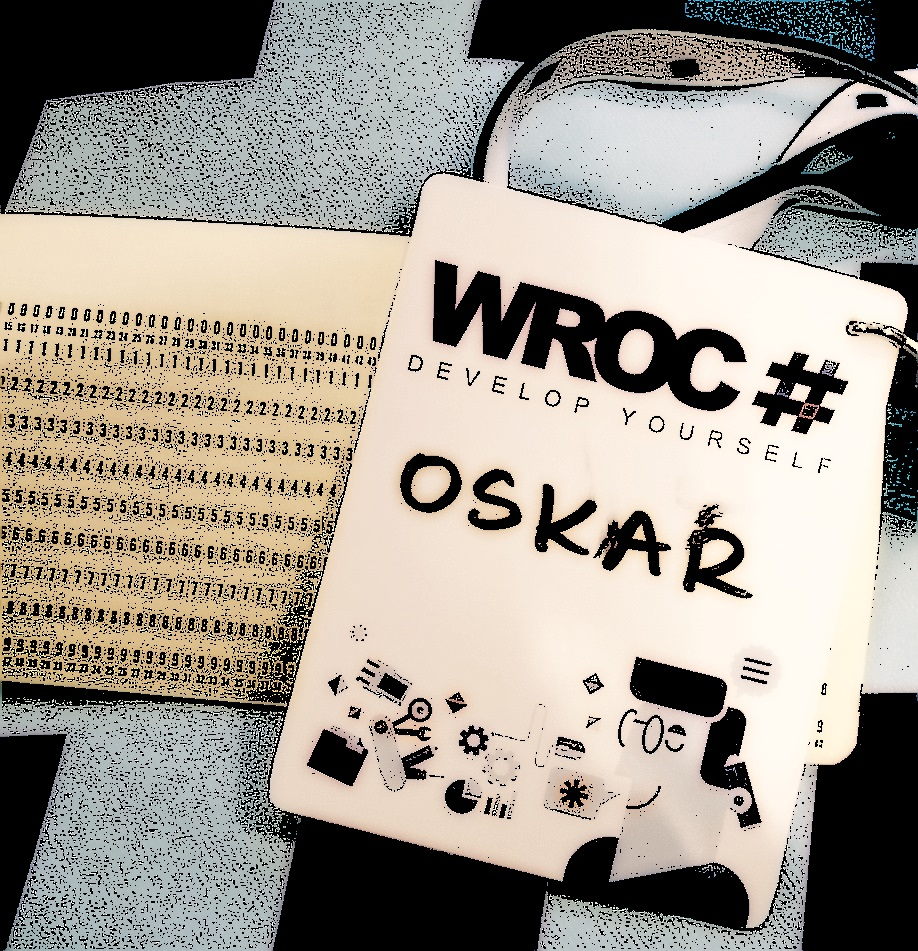

Nie bywam na konferencjach tak często jakbym chciał. Dlaczego? Myślę, że moim problemem jest nonkonformizm, przesadny indywidualizm. Będąc na konferencji trzeba się socjalizować. Uprawiać networking (nie cierpię tego słowa). Jak już się tam jest to warto by było skorzystać z okazji i zagadać do prelegentów. Porozmawiać z niewidzianymi od dawna kolegami ze studiów. Powiedzieć parę razy "zgadamy się" i kilka "będziemy w kontakcie". Czy to problem? Nie. Czy jestem osobą zamkniętą? Nie. Wręcz przeciwnie.

Byłem kiedyś na szkoleniu z asertywności. Próbowałem zdobyć hajs z unii. Kto by nie chciał? Musiałem, byłem. Nie żałuję. Tam powiedziano mi, że wszystko to co powiem, przed ALE nie ma znaczenia. Jeśli nawet powiem, że jesteś zajebisty i dodam ALE to i tak wyjdzie, że jesteś gnojek. I tutaj chcę dodać właśnie takie nieśmiałe ALE. Takie magiczne słowo.

Jestem osobą otwartą, ALE raczej (raczej dodaję na zmiększenie tego magicznego słowa), nie z tych do przodu. Lubię ludzi tych co znam. W barze nie zagaduję do kobiet. Najpierw na film, potem może dopiero do kina. Nie czuję potrzeby przyjaźnić się z sąsiadami tylko dlatego, że mieszkają koło mnie. Jadąc pociągiem nie chcę słuchać pociągowych gaduł.

No taki jestem co zrobić. Mam wątpliwość. Ona gdzieś głęboko we mnie siedzi. Nękające ambiwalentne uczucia. Niby nie chcę, a chcę. Niby nie przychodzę nigdy niezaproszony, ALE jednak czasem się wpraszam. Np. na WROC# (dzięki Ula!).

Jednak czasem bywam, czasem się pojawiam na konferencjach. Co na nich szukam? Szukam dużo CJI. Pierwiastka CJI. Motywacji, inspiracji, kontemplacji. No i właśnie czy też integracji?

Dzisiaj zdałem sobie sprawę z pewnego paradoksu. Prelegenci na konferencje przyjeżdżają słuchać, a uczestnicy mówić. Prelegenci chcieliby usłyszeć pochwały, a uczestnicy móc je wypowiedzieć.

No i ja właśnie przychodzę na konferencje mówić. Trochę z kolegami (cheers [Mateusz](http://mjendza.net/), [Rafał](http://www.spacjer.com/)!) , trochę z przygodnie poznanymi osobami. Czasem też i po to by móc koślawo przerwać Maćkowi Aniserowiczowi rozmowę, by podziękować za jego link w podsumowaniu miesiąca. No nie jestem mistrzem [pierwszego kroku](http://www.dziennik.com/images/made/uploads/news/12713110_1024_1512_80.jpg).

Człowiek w Internecie jest odważniejszy. W tym roku nawet pokusiłem się o [lajftłiting](https://twitter.com/search?q=from%3Aoskar_at_net%20since%3A2016-03-10%20until%3A2016-03-11%20include%3Aretweets).

Konferencje są jak słuchanie dobrego rapu, musi być punchline. Można by szukać dobrego refrenu jak w piosence pop. Myśl przewodnia to sprawa kluczowa. Konsekwencja.

Co jeszcze? Nie szukam odpowiedzi jak, gdzie, kiedy? Szukam odpowiedzi po co i dlaczego. No i tak jak pisałem powyżej. Dużo CJI.

Czy WROC# miał dobry punchline? Czy miał swój tłusty bit? MC był zdecydowanie Mark Rendle. Konrad Kokosa powiedział, że po jego prezentacji chce założyć startup. Ja też. W zasadzie to chciałem już wcześniej, ALE teraz tym bardziej. Była to właśnie taka prezentacja, gdzie ilość CJI była na najwyższym poziomie. Jakieś 237kg. Życiowe porady, własne doświadczenia, konkretne sugestie.

Czy inne miały dużo magicznego pierwiastka? Nie. Czy były powalające? Nie. ALE. ALE. ALE były konsekwentne. Była w nich jak w dobrej modlitwie mantra. Była myśl przewodnia i spójność. Czy to dobrze? Nie zawsze, ALE! ALE wszystko się ładnie składało. 
Najpierw [Enrico Campidoglio](http://megakemp.com/) próbował nas namówić, że jak mówisz GIT to myślisz konsola.
Potem [Julie Lerman](http://thedatafarm.com/) próbowała nieśmiało nas przekonać, że mimo niedorobienia, [Ejtiti Framework](https://twitter.com/oskar_at_net/status/682238856805105667) w konsoli i na maku nie jest taki zły.

Na koniec [Glenn Condron](https://channel9.msdn.com/Events/Speakers/glenn-condron) próbował nas przekonać, że nie jest tutaj po to by jako pracownik Microsoft zareklamować swoje produkty (mało wiarygodnie). 

Dodatkowo [Chris Klug](http://chris.59north.com/) pokazał nam, że lepiej wypada, gdy ma problemy z komputerem, dociska łokciem kabel od odtwarzacza jednocześnie próbując pokazać nam jak zrobić swojego Angulara niż gdy próbuje nam pokazać przekrojówkę przez JavaScript. [Ian Cooper](http://codebetter.com/iancooper/) pokazał z kolei, że lepiej wypada gdy nie musi pokazywać nam, że Mikroserwisy to nie Jednorożec i gdy może swobodnie rozmawiać przy piwku na panelu dyskusyjnym niż gdy przelatuje się po slajdach.

Czy pokochałem konsolę? Nie. Czy stałem się ewangelistą Mikroserwisów? Nie. Czy dowiedziałem się coś nowego o JavaScript? Nie.

ALE. ALE.

ALE i tak było warto. Czy mówiłem, że nie jestem lizusem? ALE i tak muszę pochwalić. To co mnie zauroczyło już drugi raz na WROC#. Organizację. Pisane z wielkiej litery. Jak moje imię.

To co najbardziej szanuję to przywiązanie do detali. Profesjonalizm. Drobny gest, gifcik, o którym inni nie pomyślą. A tutaj było tego w bród. Pokal czy kufel z wygrawerowanym napisem konferencji. Szybkość reakcji nawet gdy klima lub mikrofon przestaje działać. Jedzenie nie będące jedynie przywiezionym na szybko kateringiem, a zrobionym show w wokach. Specjalne piwo, o którym potem się dowiaduję, że wybierając słabsze wybieram 9% piwko z Widawy. To, że dostaję dyskietkę lub kartę perforowaną jako identyfikator. Piękny dźwięk mikrostyku. Możliwość pokazania koleżance jak wygrać w Street Fightera grając odwróconym plecami do automatu.
To są drobne rzeczy, ale właśnie takie drobne rzeczy tworzą klimat konferencji. Prelegenci mogą nie trafić tematami, niektórzy mogą mieć gorszy dzień. Nie każdemu wszystko musi się podobać. ALE konferencja to nie tylko wykłady, to również cała otoczka, którą z jednej strony się unika, ALE która również przyciąga. To jest to co wyróżnia dobre konferencje od złych. To co decyduje o sukcesie. 

Pierwsza edycja WROC# była świetną niespodzianką, druga potwierdziła ważne miejsce na mapie polskich konferencji. Jaka będzie trzecia? Nie wiem, ALE nie mogę się doczekać, by przekonać się o tym w następnym roku.
P.S. Zachęcam też do lektury innych relacji [Immora'y](http://immora.azurewebsites.net/2016/03/wrocsharp-relacja/), [Iwony Lalik](http://programistka.net/wrocsharp-moja-relacja/), [Dariusza Lenartowicza](http://blog.softio.pl/2016/03/11/slowa-o-wrocsharp/), [Pawła Klimczyka](http://blog.klimczyk.pl/2016/03/12/wroc-2016-by-engineers-for-engineers/).