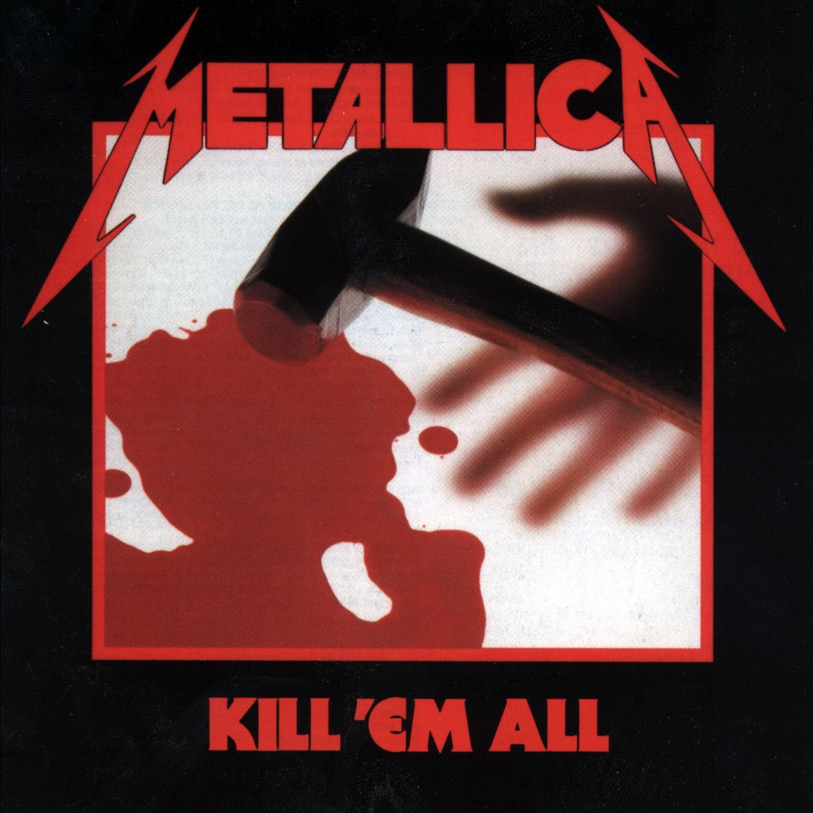
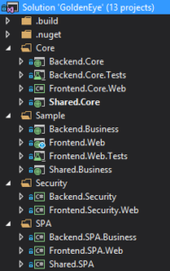
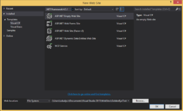
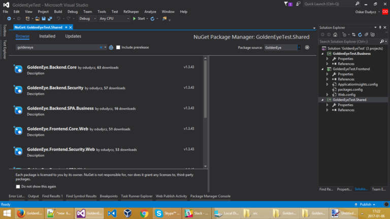

*Zapuść proszę sobie ten utwór w trakcie czytania. Wczujesz się lepiej w klimacik. Zapewniam.*

`youtube: https://www.youtube.com/watch?v=4NAww0Q9PH8`

Niektóre zespoły po kilku płytach powinny zmieniać swoje nazwy. Czy młody [Chris Martin](https://www.youtube.com/watch?v=yKNxeF4KMsY) polubiłby [starszego siebie](https://www.youtube.com/watch?v=QtXby3twMmI)? Czy rzuciłby zawczasu muzykę? Czy pewien dziwak z kaprawym okiem myślał na początku, że będzie robił później mocno odjechaną muzykę?
Czy to na pewno to ciągle Ci sami wykonawcy?

Coldplay? Raczej Hitplay. Editors? Raczej U2WannaBe.

OK, tylko czy gorsze to czy oglądanie Kazika z irokezem i brzuszkiem najebanego jak "ho ho, ciągle to mam – jak w Jarocinie!"?

Inne nie jest gorsze. Nie jest też lepsze. Jest po prostu inne. Rojek twierdzi, że [życie to surfing, więc nie bój się fal](https://www.youtube.com/watch?v=uVK0VH1NpKM).

Ja się czasem boję. Pływam tak, żeby się nie utopić. Ale pływam. I czasem się zastanawiam czy "Oskar at .NET" to ciągle jeszcze .NET? Czy może "Oskar goes Lifestyle? Who cares? Ty nie. Neither do I.

Pierwszy dzień świąt.

Rodzinne miasto.

Pub.

Kumple.

Piwko.

Wódeczka.

Pamiętasz jak Wojtuś na WFie się spierdział? Ha ha ha

A Kaśka to co teraz robi? No co Ty? Serio?!

Czy licealne przyjaźnie kończą się na Kill'em all?

Wczoraj poczułem, że  w jednej kwestii jestem już po Kill 'em all. Czasy bycia .NETowcem z krwi i kości. Czasy gdy wierzyłem we Frameworki. Gdy szukałem pierścienia, który złączy je wszystkie. Wczoraj odwiedziłem swoje dziecię. Dziecię, którym zajmowałem się jak weekendowy tatuś. Od czasu do czasu. Z sobotnio-niedzielną nadaktywnością. Z letnimi wczasami za granicą. Z pasją nadrabiania nienadrabialnego.

Te Dziecię, to mój framework. Nazwa kodowa: GoldenEye. W założeniu elegancki jak Pierce Brosnan i wystrzałowy jak Izabella Scorupco. No dobra, nie ja tę nazwę wymyśliłem. Ale zatwierdziłem.

Do meritum, jest to Framework Full Stackowy. Właśnie z tych (niedawnych) czasów, gdy wierzyłem, że da się stworzyć jeśli nie framework, to chociaż zestaw wzorców, klas. Taki bootstrap, do którego mógłbym sobie sięgnąć, szybko wystartować projekt, mieć od ręki rozwiązanie podstawowych problemów. Czyli stawiasz i masz:

– wstępną konfigurację bazy (Entity Framework),

– użytkowników,

– serwisy aplikacji wystawione (WebAPI)

– autoryzację i autentykację (OAuth)

– modularność i wstrzykiwanie zależności (Ninject)

– podpięty do niego frontend (SPA – Knockout.js + Sammy.js + Bootstrap)

Wash'n'Go. Vunderwaffe. Tajemnica mojego przyszłego sukcesu.

Kod, który pozwoli się skupić na realizacji celów biznesowych. Kod, który będzie się rozwijać z każdym projektem.

Tylko skąd ten melancholijny ton? Nie wyszło?

Wyszło.

Nugety, szablony, minifikacja, automatyzacja. Przetestowane na kilku małych projekcikach. Nie tylko przeze mnie. Ready steady. W oczekiwaniu na większy projekt, w którym będę mógł wykorzystać.

Który nie nadszedł.

Nadeszły za to projekty w Node.JS, mobilne i inne ciekawe technologie. Czas minął. Ja minąłem. Się. Wszyscy jesteśmy Chrisami Martinami.

No i .NET Core. Który się pojawił, pozmieniał wszystko i sprawił, że przepisanie na niego mojego Frameworka to coś, czego szybko się nie podejmę. Bo mnie to mniej kręci, bo .NET już taki trochę skostniały mi się wydaje. Bo gonię za tymi Node'ami, Sparkami. Bo już trochę mniej wierzę we Frameworki. No i czas, a w zasadzie jego brak.

No więc pomyślałem sobie wczoraj:

"Czemu nie? Pójdę w open source'y! Wrzucę! Skoro ja nie skorzystam, to może chociaż ktoś inny tego (nie) użyje."

To co Wam oferuję to działający kod dostępny tutaj:

https://github.com/oskardudycz/GoldenEye

Struktura jest prosta.

Wyróżnić można jej dwa główne podziały:
1. Warstwowy

    – Frontend projekty odpowiadające za kod kliencki (np. webowy, ale potencjalnie nie tylko),

    – Backend – samo się tłumaczy, kod backendowy, czyli EntityFramework, WebAPI, OAuth, te sprawy,

    – Shared – projekty które są używane zarówno przez frontend

2. Modułowy
   
    – Core – projekty, które w nie mają żadnego związku z domeną problemu biznesowego. Czyli wszelakie helpery, extensiony, ale też IoC, bazowy CRUD przy użyciu serwisów, repozytoriów, kontrolerów itp. itd.

    – Security – moduły odpowiedzialne za bezpieczeństwo, zarządzanie użytkownikami, itd.

    – Sample – czyli przykład, który można testować czy to co zrobiliśmy w innych modułach cały czas działa

    – SPA – kod odpowiadający za generowanie przykładowych apek i nugetów, które zbierają wszystkie wymienione wcześniej.

Nie chce Ci się tego przeglądać? Przejrzyj chociaż Shared.Core, jest tam sporo klas pomocniczych, zebranych przez lata, które Tobie też mogą się przydać.

Tak, wiem – Show me the money!

Jak zobaczyć, że to działa? Prosta rzecz, zrób następujące proste kroki:
1. Utwórz nową solucję "ASP.NET Empty Web Site" w .NET Framework 4.5.2

2. Dodaj dwa projekty Class Library:
– Business
– Shared
4. Zepnij je referencjami:
– Frontend – referencje do Business i Shared
– Business – referencja do Shared
5. Zainstaluj następujące Nugety dla projektów:
– Shared – GoldenEye.Shared.SPA
– Business – GoldenEye.Business.SPA
– Frontend – GoldenEye.Frontend.SPA.Web

Klikaj przy tym zawsze Yes, Ok, Yes to All. Nie bój się. Nie zaboli

6. Clean, Rebuild i odpal projekt Frontowy.
7. Działa.

Nie działa? Spieszy Ci się? To zrób po prostu clone'a repozytorium z przykładem.

https://github.com/oskardudycz/GoldenEye-Sample

Zbuduj, uruchom.

No i to tyle.

Po co o tym piszę? Po co się tym dzielę? Dla sławy? Nah… Nie mam złudzeń. Mam za to małą nadzieję, że ktoś:
– użyje to do swojego projektu, choćby poprzez podebranie kilku klas.
– będzie chciał pomóc nad ewentualnym rozwojem, np. pomóc przygotować wersję .NET Core, lub dorzuci jakiegoś pull requesta do wersji 4.5.
– Zmotywuje mnie do opisania tego dzieła, bo parę fajnych patentów tam wg mnie zostało użytych.

A najbardziej mam nadzieję, że napiszesz komentarz. Tu o – poniżej. Pozytywny mile widziany, negatywny jeszcze milej.

Na koniec, dodam, że wg mnie najlepszą rzeczą dla muzyka jest gdy jego twórczość dorasta wraz z publicznością, a przede wszystkim z nim.

Analogia? A jakże.