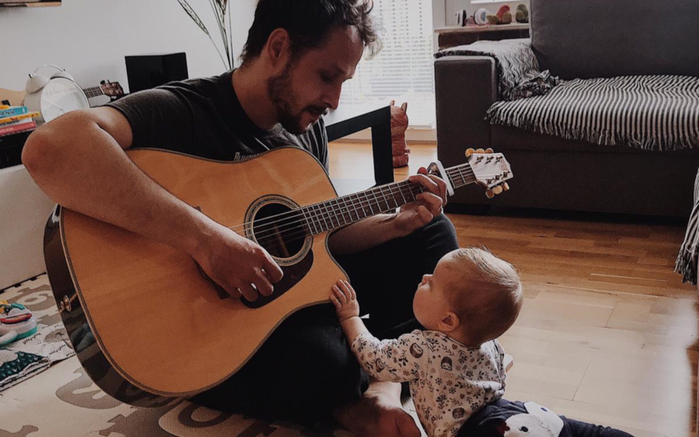

**Pierwszy raz nie zostałem muzykiem**, gdy wzięty przez Babcię do szkoły muzycznej, powiedziałem stanowczo, że nie zamierzam śpiewać i powtarzać zagranych na pianinie rzeczy.

**Pierwszy raz nie zostałem programistą gdy znalazłem dyskietkę z napisem Basic.** Znalazłem ją w używanej i kupionej przez rodzinną zrzutkę Amidze 500. Tato powiedział, że to do programowania. Wrzuciłem do pudła i włączyłem Lotusa III.

**Drugi raz nie zostałem muzykiem mimo tego, że stwierdziłem, że zacznę swoją edukację w lokalnej bibliotece muzycznej** (wtrącenie – drogie dzieci biblioteka muzyczna to było takie miejsce gdzie można było słuchać, ba nawet wypożyczać, płyty CD i uwaga, uwaga – kasety magnetofonowe. Coś jak spotify, tylko bezpłatny i na krótki czas. Bez mp3 i rodzinnych abonamentów). Zawsze lubiłem melodię, dlatego stwierdziłem, że zacznę od Czerwonych Gitar. Niestety skończyłem przez pomyłkę słuchając piosenkę o głowach Lenina znad pianina.

**Z kasetami magnetofonowymi wiąże się też sytuacja gdy nie zostałem po raz drugi programistą.** Z kasetami, które odtworzone w magnetofonie brzmiały jak Skrillex. Odtworzone jednak w magnetofonie od Commodore 64 pozwalały zagrać w Północ Południe. No więc, na tym oto sprzęcie zostałem prawie programistą. Można nim było zostać czytając książkę. A następnie ją przepisując. Miała żółtą okładkę, format A4 i wklepując ją przez 2 godziny można było pograć kilka minut w MMORPG. Pamiętam, że można było podjąć decyzję czy uciekać przed wilkiem. Podjęliśmy z Robertem decyzję, uciekliśmy przed nim i poszliśmy haratać w gałę.

Z**upełnie blisko zostania muzykiem byłem gdy, na muzyce w 3 klasie zostaliśmy przymuszeni do nauki gry na flecie.** Tak, ha ha. Trzeba było kupić taki plastikowy, składany, no i uważać na lekcji. Tego z Gabrysiem nie zamierzaliśmy robić. Zamiast grać gadaliśmy. Gorzej, że na koniec miało być granie na ocenę. Na szczęście pani się rozmyśliła. Zarówno dzisiaj jak i wtedy umiem zagrać tylko jeden numer – Karetkę. Ijo ijo.

**Prawie jak muzyk wyglądałem w roku 1991.** Pociąłem sobie dżinsy na kolanach. Do dzisiaj nie wiem jak nie dostałem za to bury i jak ojciec pozwolił 6 latkowi łazić w takich spodniach. Wtedy nie wiedziałem czemu to robię. Dzisiaj już wiem – chciałem być jak Kurt Cobain. Jak Kurt Cobain chciałem być również w liceum, gdy zostałem dzięki flanelowym koszulom i dżinsom zakwalifikowany do grona grandżersów. Dumnej drużyny Cavalierów, miłośników owoca lipy zmieszanego z miodem.

**Nie zostałem też programistą gdy w 7 klasie zadecydowałem, że pójdę do klasy Mat-Inf.** Lubiłem czytać, ale nie lubiłem wkuwać. Matma przychodziła mi luźno. Wybór był prosty. W 2 klasie liceum, w trakcie krótkiej kariery pirata komputerowego, nagrałem Żytniej Visual Studio i .NET 1.0. Nie wiedziałem po co to sobie robi. Szkoda płyty, lepiej by było ją przeznaczyć na Fifę lub Baldura.

**Tak jak pierwsza choinka napisana w Turbo Pascalu na lekcji u pani Suścickiej nie uczyniła mnie programistą, tak też akustyczna gitara kupiona na 18 urodziny nie uczyniła mnie gitarzystą.** Za to hurtowo robione animacje we Flashu oraz nauczony na pamięć, bez rytmu i techniki Cancion del Mariachi uczyniły mnie już odpowiednio: programistą – w oczach kolegów z LO oraz gitarzystą w oczach rodziny. Czy byłem już nimi? Zdecydowanie nie. Ciężko być programistą i gitarzystą będąc ciągle rozedrganym dzieciakiem z brakiem konsekwencji, ale z całym zestawem słomianego zapału.

**Nie zostałem też muzykiem gdy kupiłem sobie harmonijkę w Lidlu i zacząłem grać lekcję zwaną pociągiem.** To było za dużo dla mojej Dziewczyny. Nie zostałem nim też gdy właśnie Ona wykupiła mi lekcje gry na gitarze. Lekcje były fajne, nauczyciel był fajny, ale ja nie byłem fajny. Przemotywowałem się. Chciałem w jednym momencie nadrobić lata odkładania gitary w kąt, miesiące powrotów i tygodnie samouki. Musiałem odpuścić i ochłonąć. Przemyśleć temat i podejść spokojniej do niego.

Wtedy też zdałem sobie sprawę, że nauka gry na gitarze jest bardzo zbliżona do nauki programowania i że z jednej można wyciągnąć wnioski do drugiej. Jakie?

1. **Ciężko zostać muzykiem samoukiem.** Trudniej znaleźć kierunki rozwoju, trudniej narzucić sobie rutynę. Rutyna i konsekwencja jest tutaj najważniejsza. Nie da się zostać gitarzystą grając od święta. Nie da się też nauczyć nowej technologii raz na miesiąc siadając i witając się ze światem. Uczitsa, uczitsa, uczitsa. Wiadomo, tak jak nie każdy wykładowca jest mentorem, tak i nie każdy nauczyciel gry na gitarze będzie magikiem. Ważne aby znaleźć sobie jakiś wzór, czy też właśnie mentora, od którego się uczy, podpatruje. Dla mnie takim kimś jeśli chodzi o gitarę był i jest Assaf Levavy i jego licknriff.com. W programowaniu różnie, to w zależności od technologii, ale nikt się jeszcze nie przestrzelił polecając dzieła Martina Fowlera.

2. **Czy wspominałem o konsekwencji? **Bez konsekwencji, żmudnego trenowania chwytów, przejść, klepania formatek, projektowania klas, czytania, szukania, próbowania nic się nie osiągnie. Tak jak po przerwie bez gry na giarze palce "nie chodzą", a opuszki miękną, tak i w programowaniu, bez kodzenia, klepania mózg nie pracuje. Człowiek nabiera strachu i nawet utworzenie nowego projektu w nowej wersji frameworka, napawa obawą.

3. **Otwarta głowa i próbowanie wielu rzeczy.** Nigdy nie interesowało mnie ogniskowe granie na chwytach, chciałem od razu walić solówy jak John Petrucci. Whiskey moja żono jest dla słabych. Kumacie, melodia, Czerwone Gitary. Potem okazało się jednak, że znając akordy, jakoś tak łatwiej manewrować po gryfie i solówki jakoś tak łatwiej wchodzą. Podobnie rozgrzanie palców na solówkach rozciąga palce i ułatwia łapanie chwytów. Tak samo w programowaniu – nawet jak nienawidzisz JavaScriptu i uważasz, że aplikacje SPA to wymysł szatana, przemóż się i spróbuj. Jeśli uważasz, że programowanie funkcyjne to wymysł dla frajerów, spróbuj i wtedy oceń. Warto obserwować, testować różne koncepty programowania, różne platformy. Nawet jeśli żadnego komercyjnego projektu się w nich nie zrobi, to wracając do swojej ukochanej technologii zapewniam, że spojrzysz już na nią trochę szerzej.

4. **Zrozumienie teorii pomaga.** Teoria czasem nudzi, ale bez niej daleko się nie zajedzie. Tak jak można w programowaniu klepać formatki i w praktyce nie umieć programować tak i na gitarze można nauczyć się utworu na pamięć. Nie jest to jednak ani efektywne ani efektowne. Click pomaga. Taki co go czasem słyszysz i robisz potem takie długie Ahaaaa. I świat nabiera kolorów. Np. gdy zrozumiesz, że zamiast latać jak głupi palcami po gryfie to może lepiej po prostu układać je od razu w akord, lub jak zamiast pisać pętlę w pętli zrozumiesz, że Lambda i Linq pozwolą Ci to zrobić krócej i szybciej.

5. **Łap balans.** Tak jak od długiego grania na gitarze może rozboleć Cię obojczyk, nadgarstek i możesz naciągnąć sobie mięśnie karku (sprawdzone!), tak i przy dłuższym programowaniu może rozboleć Cię głowa, oczy, nadgarstek w sumie też. Od bólu fizycznego gorsze jest wypalenie, chęc rzucenia wszystkiego, no i po prostu zmęczenie psychiczne. Lepiej zrobić przerwę. Nie przemotywować się. Niektóre rzeczy potrzebują czasu. Muszą się ułożyć. Po przespaniu się, lub po prostu odejściu od biurka wpada się na rozwiązanie problemu, nad którym męczyło się kilka godzin. Tak samo i grając na gitarze po dniu przerwy często się okazuje, że fragment utworu, który nie mogłeś za cholerę przejść – wchodzi sam z siebie jakbyś był Van Halenem.

6. **Posiadanie manualnego hobby pomaga obniżyć poziom stresu. Jestem pewien, że twój mózg kręci się znacznie dłużej po ciężkim dniu programowania.** Teoretycznie skończysz pracę, ale nadal pracujesz w swojej głowie. Robienie rzeczy, które wymagają ćwiczeń manualnych i koncentracji, pomaga przestać myśleć. W trackie gry na gitarze musisz skupić się na rytmie i chwytach, aby robić to dobrze. Przestajesz myśleć o innych rzeczach, skupiając się na poruszaniu palcami po gryfie. Pomaga to zwolnić myśli. Nawet krótkie ćwiczenia mogą zdziałać cuda. Nie lubisz grać na gitarze? Spróbuj czegoś innego, wypieków, piekarni, cokolwiek wolisz. Po prostu znajdź coś, co będzie wymagało od twojego ciała fizycznego zaangażowania i skupienia się na innych rzeczach niż kodowanie.
7. 
8. **Hobby to świetne narzędzie do wykrywania oznak pracoholizmu.** Czy wiesz, że górnicy trzymali kiedyś kanarki w kopalni? Kanarki to delikatne ptaki, znacznie delikatniejsze od nas, ludzi. Gdyby poziom niebezpiecznych gazów (takich jak CO) w wyrobiskach kopalni wzrósł, gazy te zabiłyby kanarków, zanim zabiłyby górników. Widząc to, górnicy mogli uciec i uratować życie. Tak, bycie ludzkim dotyczy tylko ludzi. Zatem, jeśli nasze hobby umiera i nie mamy na nie wystarczająco dużo czasu, jest to wyraźny znak, że jesteśmy na śliskiej drodze do wypalenia. To odpowiedni moment, aby się zatrzymać, odnaleźć czas i zrewidować swój styl pracy.

**W dalszym ciągu regularnie nie zostaję programistą np. gdy kupuję książkę na Amazon i potem jej nie czytam.** Podobnie nie zostaję muzykiem gdy znajduję tutorial do motywu z Pełnej Chaty i przestaję się go uczyć. Bywam za to programistą gdy udaje mi się dowieźć projekt, gdy po godzinach pracy nad swoim projektem widzę gwiazdki na Githubie. Bywam też gitarzystą gdy łapię rytm i czuję, że palce "same zaczynają chodzić" lub gdy szarpiąc struny ktoś powie mi "ooo widzę, że trenowałeś".

Dziękuję za przeczytanie.