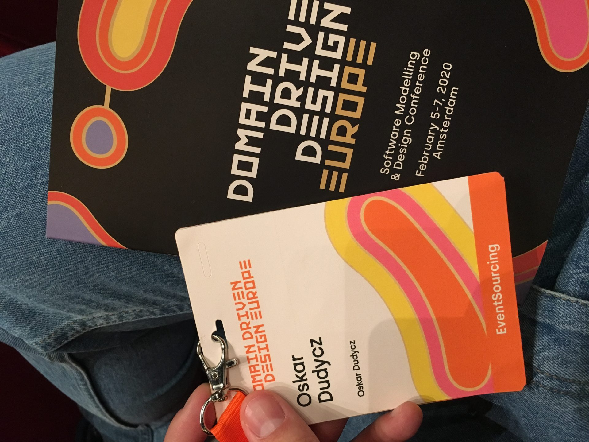
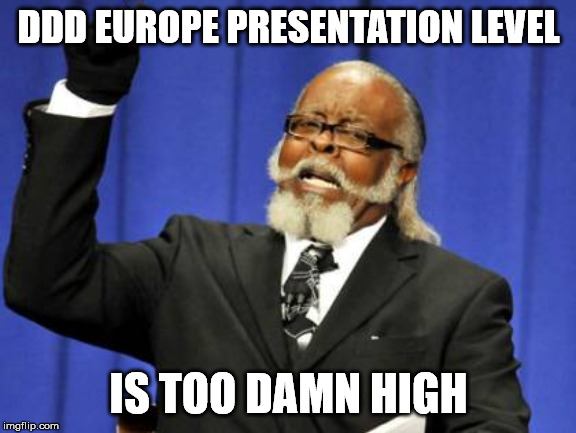
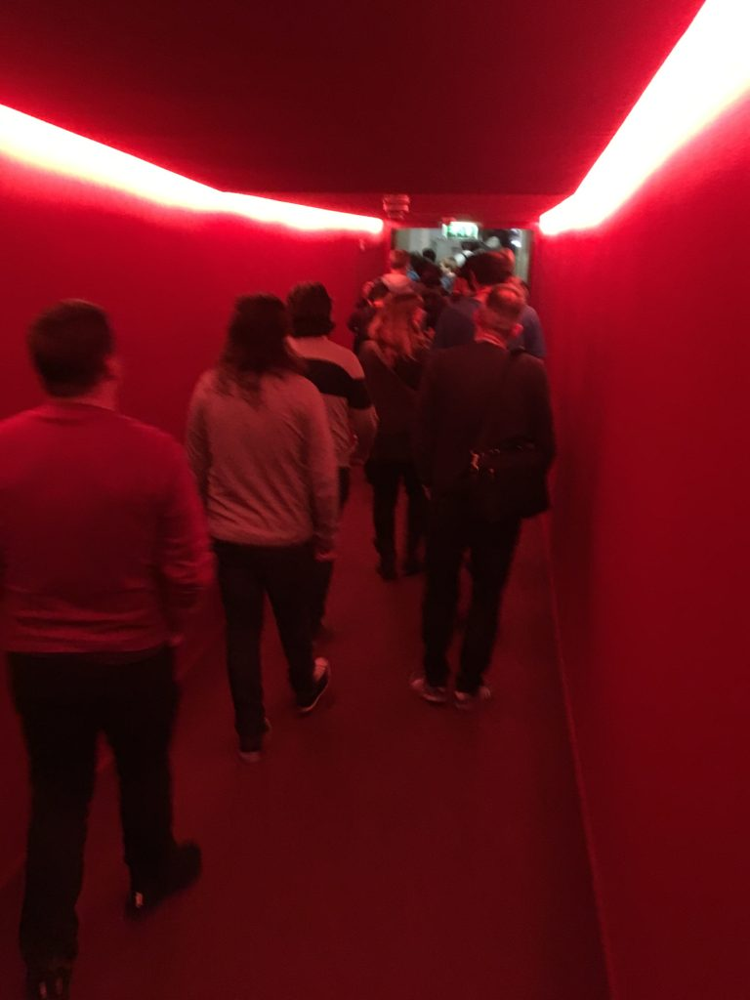
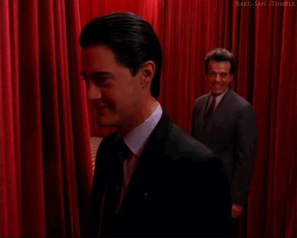

Ten wpis będzie z tych dłuższych. Zrób sobie więc kawkę, wstąp do toalety, zrób kanapki na drogę, usiądź wygodnie na kanapie, uzbrój się w cierpliwość i czytaj dalej – zapraszam!

Człowiek latami szuka Złotego Graala, szczególnie my programiści. Optymalizujemy, refaktoryzujemy, upgrade'ujemy. Nowe języki, nowe technologie, szczególnie w świecie JS wzorce i frameworki szybko robią się zeszłotygodniowe. Ja od lat szukałem czegoś co pozwoli mi robić aplikacje, które robią to co aplikacje mają robić – zapier..ają (dech w piersiach). Pierwsze kryterium takiej aplikacji to to, że są na produkcji – kodzenie dla samego kodzenia, które nie daje wymiernego efektu znudziło mnie już dawno. Drugie to, że jak już są na tej produkcji to realizują cele biznesowe klienta. Często w naszej codziennej lataninie zapominamy, że po to jesteśmy zatrudnieni, żeby realizować cele biznesowego. To nie jest tak, że jest biznes i jesteśmy my. My też jesteśmy biznesem. Trzecie, to oczywiście aplikacje powinny być łatwe w rozwijaniu. Nie powinno być tak, że w końcu dochodzimy do takiego momentu w życiu naszego oprogramowania, że dodanie jednego nowego pola będzie wiązało się z koniecznością przepisania połowy systemu.

Nawet po moich wpisach na blogu widać jaką drogę przeszedłem oraz jakie miałem inspiracje. Elementy łączące wpisy to: chęć robienia aplikacji elastycznie i zwinnie ("edżajl"), modularność i komponentowość aplikacji oraz chęć "dowożenia". Kilka lat temu zainteresowałem się Domain Driven Design. Oczywiście na początku były to książki (chociaż ze niejakim wstydem przyznaję, że jeszcze nie przeczytałem Blue Book), prezentacje z jutuba, sucha teoria. Przemawiał do mnie od początku nacisk na jedność z biznesem, włacznie z kwestią używania w kodzie tej samej terminologii, o której mówi biznes (tzw. "ubiquitous language"). Jedną z podstawowych zasad DDD jest dobre dzielnie systemu na niezależne konteksty zw. "bounded context", nacisk na dobre stawianie barier, pomiędzy którymi możemy te same terminy rozumieć różnorako (na zasadzie zamek może być to budowla jak i rozporek) – to też od razu mi się spodobało. No i zwinność, nacisk na to, że procesy się zmieniają, żeby nie przywiązywać się do swojej implementacji – aplikacje muszą być żywe i ewoluować wraz z procesami biznesowymi.

Na początku kompletnie tego nie rozumiałem. Oczywiście miałem przeświadczenie, że napakowanie głowy teorią będzie dobrą podstawą do pracy. Weryfikacja nastąpiła gdy kilka lat temu zacząłem realizować te wzorce w praktyce. Wtedy nastąpiło ciężkie zderzenie z rzeczywistością. Oczywiście pierwszym etapem było zaprzeczenie. Nie podobał mi się Marten, w którym zacząłem stosować Event Sourcing, nie podobał mi się DDD bo nie wiedziałem jak zrobić agregat. Gdyby to był side project to mógłbym to uznać, że to po prostu kolejne akademickie teorie, ale to był prawdziwy projekt, więc musiałem pływać albo utonąć. Nie utonąłem. Okazało się, że to nie DDD i ES jest złe, ale to ja byłem nieoduczony, jak zwykle okazało się, że dopiero brudząc ręce człowiek zaczyna się uczyć i rozumieć. Oczywiście społeczność DDD i ES ma też swoje wady. Jest to nieco zamknięte grono, które często za dużo posługuje się abstrakcjami, a za rzadko praktyką. Czasem mam wrażenie, że ludzie pokazujący w nim prawdziwy kod robią to z lekkim wstydem na zasadzie: "ej, no wiesz, bo mam tutaj taki… no taki malutki… kod… ale nie martwcie się, nie pokażę go za dużo…".

Koniec końców jednak okazało się, że DDD, a szczególnie Event Sourcing i Event Driven Design jest to co w dzisiejszej dobie systemów rozproszonych oraz mikroserwisów daje dobrą możliwość tworzenia dobrych skalowalnych systemów. Odpowiedni podział systemu na części jest kluczem. Dodatkowo pozwala to sprawniej modelować procesy biznesowe i zapewnić, że nasza architektura będzie luźno powiązana.

Ten ostatni czas dwóch lat zbiegł się też z moim zaangażowaniem w Open Source oraz powrót do większej działalności społecznościowej. Zauważyłem, że brakuje dobrych źródeł praktycznej wiedzy na ten temat, a ja popełniając swoje błędy, zdobyłem trochę wiedzy, którą mogę innym przekazać. Wróciłem też trochę do wystąpień i uczestnictwa w konferencjach. Wcześniej byłem nieco znudzony zawodowymi prelegentami, którzy nie kodzą, a gadają. Zeszłoroczny SegFault, na którym debiutowałem jako konferencyjny prelegent pokazał mi, że jednak konferencje potrafią być ciekawe – bez całowania się po fiutkach.

Z powyższych względów oraz tego, że wiele wiedzy, którą nabyłem wiązało się z oglądaniem prelekcji z zesłych lat z Domain Driven Design Europe postanowiłem, że pojadę w tym roku na DDD Europe. Decyzję podejmowałem w zeszłym roku, kupując tzw. "blind ticket". Czyli nie znając, kto będzie, co będzie prezentowane. Cena oczywiście była niższa, ale ryzyko większe. Prestiż jednak i obejrzane prelekcje przekonały mnie jednak, żeby się nie wahać. Oprócz właściwej konferencji wziąłem również bilety na dodatkowy dzień poświęcony Event Sourcing.

Nie przemyślałem tylko jednej rzeczy. Gdy kupowałem bilety to wiedziałem, że moja córeczka będzie już miała 4 miesiące. Stwierdziliśmy z Żoną, że "phi, to już będzie duże dziecko, damy radę". No i faktycznie daliśmy ostatecznie, ale nie przewidziałem jak ciężkie będzie zostawienie takiego małego szkraba na te 4 dni. Był strach, że po powrocie mnie nie pozna i się rozpłacze. Poznała ufff.

DDD Europe odbywa się w Amsterdamie. Tak:

(Nie)stety nie palę, nawet fajki nie zapaliłem nigdy. No cóż – każdy ma jakieś wady.

Loty oczywiście kupowałem prawie na ostatnią chwilę, plus chcąc wrócić jak najszybciej leciałem… przez Warszawę. Hotelu też nie miałem czasu za bardzo szukać, więc wybrałem ten proponowany przez organizatorów. Niezbyt tani, ale na szczęście była zniżka dla uczestników konferencji, dodatkowa zaleta, że jeździł spod niego darmowy autobus na konferencję. Kolejną zaletą było to, że… w tym samym hotelu spali również prelegenci. Skorzystałem nieco z tego dzięki znajomości "z internetów" z Kacpra Gunię, który prowadził na DDDEU warsztaty. Mój plan dnia wyglądał dosyć napięcie, bo do 16 praca, o 18:10 wylot, jeszcze o 17 z lotniska call z klientem, przesiadka w Wawie, przylot do Amsterdamu, przejażdżka kolejką, spacer do hotelu, zobaczenie po drodze dwóch czapli na trawniku, dotarcie do hotelu. Tempo tempo. Już miałem pójść spać, ale po wymianie zdań z Kacprem powiedział, żebym wpadł do baru hotelowego na górę. Piwko do snu jak złoto. Plus okazja do poznania w luźniejszej atmosferze prelegentów – osób, których do tej pory znałem tylko z Internetu. Ale spokojnie, piwko i lulu. Konferencje to nie tylko prelekcje, to też rozmowy, czy też dyskusje przy piwku czy kawce.

Z rana śniadanko, zapchany autobus – w środę jechał tylko jeden, zamiast dwóch, więc musiał pomieścić wszystkich. Ścisk jak o 7:30 we wrocławskim tramwaju linii 10 lub warszawskiej 17tce na Mordor.

Miejce konferencji oddalone dosyć od centrum, ale przy malowniczym stawie (jeziorze?). Budynek z zewnątrz niezbyt okazały, ale w środku na bogato. Duża otwarta przestrzeń "kuluarowa", gdzie można było pogadać, napić się kawki i przekąsić coś pomiędzy prelekcjami. Do tego 2 duże sale, czerwona z balkonami jak w teatrze, niebieska wysoka jak kino w multipleksie, plus mniejsze sale na piętrze gdzie odbywały się warsztaty oraz część prelekcji.

Kilka słów co do samej organizacji konferencji. Tak jak wspomniałem, przed właściwą konferencją był dodatkowy dzień konferencji, a w zasadzie 2 mini konferencje – Event Sourcingowa oraz "Fundamenty DDD". W teorii jeśli ktoś był zapisany na jedną to nie mógł pójść na drugą, ale z racji, że obdywały się w tym samym miejscu to raczej policjantów nie było. O ile były wolne miejsca to można było przeskakiwać z jednej na drugą (na wystąpienie Erica Evansa na Fundamentach, nie dało rady). Ja trzymałem się ścieżki ES – wiadomo. Dodatkowo każdy uczestnik miał gwarancję, że będzie mógł wziąć udział w co najmniej jednym warsztacie dwugodzinnym, na który można było zapisywać się przed konferencją. Potem można było się jeszcze dopisywać po rozpoczęciu konferencji, na te na które jeszcze zostały miejsca wolne.

Zanim przejdę wreszcie do sedna ostatnia dygresja. Na DDD Europe ruszyłem sam. Niestety cena DDD Europe i konieczność płacenia samemu za wyjazd bywa odstraszająca. Być może, niektórym budżet szkoleniowy w firmie jest w stanie pokryć takie przejazdy, ale niewielu znam takich szczęśliwców. Na szczęście na miejscu okazało się, że na miejsce przybyło też kilku zapaleńców czyli Maciek Szczepański (kolega ze starego projektu), Pato Architekt Szymon Warda i wrocławski Pan DDD – Mirek Prągłowski. Zawsze to raźniej, plus możliwość dyskusji z chłopakami to też wielka przyjemność.

Właśnie z Chłopakami ruszyłem na pierwszą prelekcję – Keynote Udi Dahana. Już samo wejście na salę robiło wrażenie, czerwony tunel sceneria jak z Twin Peaks albo Lśnienia.

Sama prezentacja już taka przerażająca nie była, ale również zrobiła mocne wrażenie. Udi Dahan znany jest z mocnych opinii i tym razem też w tej kwestii nie zawiódł. Pierwszy dzień konferencji był reklamowany jako pierwsza w historii konferencja poświęcona Event Sourcingowi. Keynote zwykle to motywująca mowa, która ma zainspirować, wskazać kierunki, zmusić do myślenia. Udi stwierdził, że wjedzie na dzień dobry z buta. 95% prezentacji (jak nie więcej) było o tym, że nie warto używać Event Sourcing. Ciekawe czy organizatorzy wiedzieli o tym co Udi przedstawi.

https://twitter.com/oskar_at_net/status/1224975425312579584

Od początku było grubo: "Domain Model is not the best practice. Beware the One Domain Model to rule them all". Bardzo ciekawe spostrzeżenie i podkreślenie, że najważniejszym aspektem DDD są wzorce strategiczne – czyli np. wspomniane już wcześniej Bounded Contexty. Jeżeli dobrze podzielimy nasz system na niezależne fragmenty, to w każdym z nich możemy ułożyć logikę i model danych w taki sposób jaki jest dla naszego problemu najlepszy. Czyli dla słowników możemy zrobić po prostu CRUDa, a model domenowy użyć w "core" naszego biznesu, czyli tam gdzie chcemy zarabiać pieniądze, a logika biznesowa jest najbardziej skomplikowana.

Kolejnym świetnym spostrzeżeniem było to, że Event Sourcing (podobnie zresztą jak DDD) nie jest pojedynczym wzorcem, ale de facto zbiorem wzorców. Ma w sobie zarówno aspekt modelu i logiki biznesowej, aspekt zapisu danych, podróży w czasie, audytowalności itd. Udi pokazał całą historię rozumienia słowa "zdarzenie". Począwszy od aspektów takich jak przerwanie operacji, kliknięcie przycisku czy też powiadomienie. Pokazał, że warto znać skąd to pochodzi, ale też umieć rozróżnić zdarzenie domenowe od zdarzenia technicznego. Niestety to, że zdarzenie jest słowem dosyć pojemnym prowadzi do nieporozumień.

Oczywiście nie ze wszystkimi stwierdzeniami jestem się w stanie zgodzić, choćby z tym, że Event Sourcing jest najlepszy do budowy ingrastruktury – wg mnie nie powinien być sprowadzany tylko do kwestii zapisu i odtwarzania stanu. To za daleko idące uproszczenie. Też nie do końca mi się podobało to, że Udi jednak pomieszał problemy systemów rozproszonych i systemów messagingowych z problemami Event Sourcing. No ale wiadomo, w trakcie wystąpienia trzeba jednak iść na pewne kompromisy będąc ograniczonym czasem.

Na pewno jeszcze w głowie zostało kilka bon motów. Choćby to, że już teraz drogie serwery są tańsze niż praca programisty, albo że w pewnym momencie i skali każde rozwiązanie problemu staje się "customowe". Ciekawą myślą było też to, że powinniśmy budować nasze architektury z taką myślą, że będziemy musieli je zmienić, czasem rewolucyjnie. Bardzo podobało mi się też zwrócenie uwagi na pragmatyzm i pamiętanie o podstawach. Na przykład po co np. przeciągać dane słownikowe przez szynę zdarzeń skoro można użyć po prostu replikacji. Bardzo cenię sobie pragmatyzm i racjonalne myślenie. Tego było tutaj dużo. Ważne by używać odpowiednich narzędzi do rozwiązywania konkretnych problemów.

Podsumowując – fajna, mocna prezentacja, nie ze wszystkim się zgadzam, ale na pewno pozostająca w pamięci i zmuszająca do myślenia. Takie powinny być keynote'y – pobudzające dyskusję, czasem pod prąd. O to też chodzi w konferencjach by wymieniać się poglądami oraz dyskutować.

Slajdy do zobaczenia tutaj: https://www.slideshare.net/udidahan/udi-dahan-event-sourcing-keynote-ddd-eu

Oprócz prezentacji Udiego widziałem jeszcze 4 inne. Mogę je podzielić na 2 grupy. Pierwsza: lessons learned, druga to projekcje, dobre wzorce i praktyki.

W pierwszej grupie znalazły się wystąpienia. Nata Pryce'a "Mistakes we made adopting event sourcing (and how we recovered)" (Slajdy: https://speakerdeck.com/npryce/mistakes-we-made-adopting-event-sourcing-and-how-we-recovered)

https://twitter.com/oskar_at_net/status/1224997700539686912

Oraz Thomasa Begh Fangela "Event Sourcing as the Foundation of Traceability" (slajdy: https://tech.lunarway.com/talks/DDDEurope2020_EventSourcing-as-the-foundation-of-traceability.pdf).

https://twitter.com/oskar_at_net/status/1225066240810672128

Dwa podobne tematy, ale jednak zupełnie inne prezentacje. Nat przedstawiał spokojnie, stonowanie, akademicko. Niestety prezentacja prowadzona była w nieco zbyt spokojnym i zbyt flegmatycznym tonie. Mnie nie porwało, z tego co widziałem to resztę wielkiej sali też nie wypełniły emocje.

Prezentacja Thomasa w bardziej kameralnej sali i też w takim tonie. "Bliżej ludzi", jakoś tak skromniej, ale też chyba fajniej.

Oczywiście nie można powiedzieć, że prezentacja Nata była zła, niestety sposób prezentacji zmniejszał walory, bo sama treść była ok. Najbardziej podobał mi się fragment o nazewnictwie. Często powtarzam, że wkładanie słowa "event" do nazwy każdego wzorca utrudnia ich zrozumienie. "Event Sourcing", "Event Driven Design", "Event Storming", "Event Modelling", "Event Streaming", itd. itp. No zdecydowanie za dużo zdarzeń na parkiecie. Niestety dla osób wchodzących dopiero w świat architektur opartych na zdarzeniach jest to spora bariera, żeby zrozumieć co jest co.

Poświęciłem o tym piąty rozdział mojego Ebooka "Fakty i Mity o Event Sourcing". Zachęcam do pobrania, lektury i dyskusji: https://www.szkola-event-sourcing.pl/

Thomas skupiał się z kolei na jednej z większych zalet Event Sourcingu, czyli audytowalności. Pokazywał jak pracuje nad kolejnym Revolutem (bankiem internetowym) i jak w jego kontekście wielką zaletą jest możliwość prześledzenia co i gdzie się wydarzyło. Podkreślał również pragmatycznie, że nie ma takiej opcji, żeby wytwarzając oprogramowanie na pewno popełnimy błędy. Jest to nieunikinione. Event Sourcing nie sprawi, że pozbędziemy się błędów, ale że będziemy mogli nimi lepiej zarządzać. Będziemy też mogli je lepiej przeanalizować i mieć świadomość jak one wystąpiły.

Ogólnie spoko, polecam przejrzeć slajdy, bo parę rzeczy fajnych można z nich wyciągnąć. Ja jeszcze wyciągnąłem spostrzeżenie (które tez się potwierdziło w kolejnych dniach DDDEU), że najczęściej stosowaną bazą danych w tej społeczności jest Postgres. Co mnie jako maintainera Marten niezmiernie cieszy.

Pozostałe dwie prezentacje to Yves Reynhout ze swoją już znaną prezentacją "Projections Explained" (slajdy: https://www.slideshare.net/yreynhout/projections-explained).

https://twitter.com/oskar_at_net/status/1225049751189696513

Oraz Dennis Doomen z Event Sourcing from the Trenches (slajdy: https://www.slideshare.net/dennisdoomen/event-sourcing-from-the-trenches-ddd-europe-2020)

https://twitter.com/oskar_at_net/status/1225012841549303809

No i tutaj temperatura wystąpień również porównywalna. Yves'a do Nata. Dennisa do Thomasa.
No dobra, te drugie porównanie jest niewłaściwe. Dennis zamiast krwi ma kawę. Czysta kofeina. Mega szybko mówił, mega dużo slajdów, ale treść zrozumiała – naprawdę super. To koniecznie trzeba zobaczyć. Co prawda nagrania z DDD Europe dopiero się pojawią, ale można zobaczyć jego wystąpienie z KanDDDinsky. Proszę bardzo:

`youtube: https://www.youtube.com/watch?v=r26BuahD8aM`

Yvesa styl mówienia trochę dla mnie zbyt spokojny, by nie użyć słowa na N. Warto jednak przejrzeć slajdy bo bardzo fajnie pokazywał różne aspekty projekcji. Szczególnie podobały mi się analiza problemów oraz potencjalnych rozwiązań. Fajnie, że podkreślał, że nie ma złotego środka, a część problemów dał "pod zastanowienie" dla słuchaczy. Czy już pisałem, że jestem fanem pragmatyzmu?

https://twitter.com/oskar_at_net/status/1225080829082316802

Na koniec dnia udało mi się wbić jeszcze na dodatkowe warsztaty ze Sketchnoting. Nie można się było na nie zapisać, kto pierwszy ten lepszy. Możliwe, że nie wiesz co to jest Sketchnoting, ale na pewno Doodle Google'a – czyli obrazki widoczne zamiast loga i opisujące konkretne święto – np. Boże Narodzenie.
Podobnie robi się w Sketchnotingu. Ideą jest, żeby przy pomocy prostych rysunków oraz tekstu robić notatki ze spotkań, wykładów, czy też po prostu dnia codziennego.
Dlaczego akurat obrazki, a nie po prostu tekst? Po pierwsze jeden dobry rysunek mówi więcej niż 100 słów. Po drugie, nie jesteśmy w stanie tak szybko rysować jak moglibyśmy notować. Dobry notujący jest w stanie pisać równie szybko jak osoba mówiąca. Niby fajnie mieć dobre notatki, ale czy ktoś potem do nich wraca i je czyta? To, że nie jesteśmy rysować tak szybko jak notować zmusza nas do syntezowania myśli. Dzięki czemu skupiamy się na tym co jest najważniejsze.
Sketchnoting to moim zdaniem potężne narzędzie. Ułatwia prowadzenie prezentacji, przygotowanie slajdów. Sam też w przywołanym już Ebooku "Fakty i Mity o Event Sourcing" wykonałem rysunki tą techniką.

https://twitter.com/oskar_at_net/status/1225089499664994304

Warsztaty świetnie poprowadził Michel Grootjans, który jak Mistrz Miyagi kazał nam zacząć od ~~malowania płotów~~ nauki pisania, przez podstawowe kształty aż po rysowanie bardziej zaawansowanych obiektów. Polecam też poświęcić kilka minut złapać flamaster i kartkę i obejrzeć:

`youtube: https://www.youtube.com/watch?v=gj3ZnKlHqxI`

Dlaczego Sketchnoting na DDD? Poza tym, że fajnie się łączy z konceptem sticky notesów, wizualizacji i pracy przy kartce to ma jeszcze inny bardzo prosty aspekt. Reklama. Michel zdradził też nam nieco kuchnii, że chodzi o to, by ludzie w pozostałe dni zaczęli rysować sketchnote'y z wykładów, wrzucać na media społecznościowe i dzięki temu robić też "buzz" dookoła konferencji. Żeby dodatkowo zmotywować ludzi był mini konkurs, gdzie można było wygrać notatnik i dodatkowe flamastry.

Przyjemne z pożytecznym.

Dla mnie bomba!

Potem już rozpoczęło się afterparty, które poza dobrym piwkiem i możliwością zagadania do innych uczestników i prelegentów niestety nie równa się naszym polskim afterparty. Trwało tylko 1,5h, więc ciężko było się dopchać do prelegentów, co jest bardzo ważnym aspektem konferencji.

Dlatego my zrobiliśmy sobie afterparty afterparty i poszliśmy do centrum Amsterdamu na piwko, dwa, góra pięć. Co wcale nie jest trudne, bo w Amsterdamie duże piwo ma 350ml.

Mały spacer po Amsterdamie wieczorem, sporo dyskusji w dobrym gronie, ale na spokojnie, bo na drugi dzień właściwa konferencja! Ale o tym już w kolejnym wpisie.

Jakie, więc były moje wrażenia po pierwszym dniu DDD Europe? Było fajnie, nic mnie nie zaskoczyło, dużo nowych rzeczy się nie dowiedziałem, ale za to złapałem sporo inspiracji, poznałem fajnych ludzi, podyskutowałem, dałem pożywkę umysłowi. Dupy nie urwało, ale było dobrze.

To chyba całkiem nieźle, co?