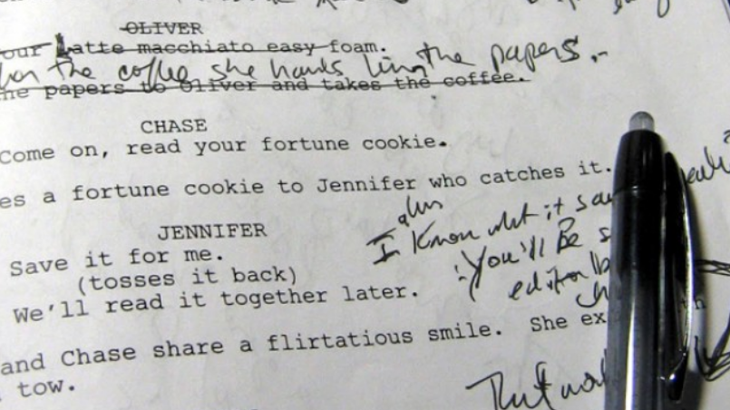

Developers that are not running a system in production might call themselves lucky. They can live in their perfect world. It is a world where there are no problems; everything is black and white. It is a world where you can debate whether it is better to use one pattern or another. Production changes everything. Until a man finds himself in such a situation, it isn't easy to imagine it. Once we're there and hear "Houston we've got a problem", all our academic discussions become almost irrelevant. 
We have to make rotten compromises, which we are often ashamed of afterwards. Of course, we're creating stories that we can tell our friends over the beer, but not necessarily during the interview. If there were a thriller movie about development, it would start at 4 PM on Friday with the hotfix on production. 

**_"How do you run Event Sourced system on production?"_**

**_"How do you version events?"_**

Those are the questions I'm asked quite often, and they're challenging questions to answer. Greg Young wrote a book about it (which I recommend to everyone https://leanpub.com/esversioning/read). 

**There are many ways to deal with versioning:**
- Data migration 
- Extending the current event schema in a non-breaking manner e.g. adding a new field 
- Adding a new event schema with a changed name or namespace
- Upcasting: plugging a middleware between the deserialization and application logic. Having that, it's possible to transform or map old event schema into the new one
- Publishing the event in both schemas. Then, listeners who need the old one will continue working until they switch to the new version. 

Each of these practices has pros and cons. Some will work better in one situation, and worse in others. **However, everyday I'm more convinced that the best option for versioning the event schema is to prevent conditions in which versioning is needed.** 

Am I joking? Not this time. Let's think for a moment about when we need versioning. It's required when we add a new schema, but still have to use the old one. If we have events in the old schema in the event store (database), it's appropriate to handle them, and this is usually associated with adding additional code. We need to support the old code to support the old schema, and support code that is part of the new business logic. 

Migration of events is technically possible, but as we know, it's not recommended by definition. Events should be immutable. Of course, the problem is related to old events that we still need to use. It would be great if we could get rid of them somehow, but how to do it? 

There are several ways: 

1. **Summary Event**: This is a snapshot event. It has the current state of the aggregate/events stream. We can append such an event and treat it as the checkpoint, or a new starting point of our stream. Thanks to this, we can ignore the events that happened before it. We are publishing a new snapshot, so from now on, all events are published using the new schema. We could even archive the old ones. What are the disadvantages of this approach? If the summary event is just a snapshot, then it won't have all the business information. If we were to archive the old events, we might have problems rebuilding the projection. Of course, you can have several such events for different occasions, but still, this is quite a rare and obscure situation.
2. **Event stream transformation:** we can take streams that have the old events schema version. We can copy events, transform them and save as a new stream. We can also add a "link event" in the new stream that will reference the old stream (Something like Redirect in HTTP). Thanks to this, we get old events migrated to the new schema. We can even archive the old ones, and we don't have to maintain two implementations. The downside is that the chronology of events is somewhat disturbed: if we republish them, then old events appear again. Where the global order of events is crucial, this can be a problem. You can check how to do it in the Marten documentation: https://martendb.io/documentation/scenarios/copyandtransformstream. 
3. **Keeping aggregates small:** I'm not talking about the code itself. Everyone knows that less code is better than more. What I am saying here is to create short-lived aggregates. For example, take the ordering process in an online store. We could model one big order aggregate. It could handle the whole process so: adding product to cart, confirmation, payment, shipment, and finally closing. We could also look at this in a different way. Instead of one gigantic aggregate, we could create several smaller one,  e.g. an order bucket, confirmed order, shipment, payment, completed order. The same is true for other cases, such as in a hotel booking. Instead of supporting the entire booking process (the guest's stay and the accounting) as one entity, we could break it down into small aggregates. We could model it as, say, tentative reservation, confirmed reservation, guest stay, paid reservation, etc. What do we get from this? If our aggregate lives shortly, a day or two, week, then these are easier to manage. If we're deploying new changes with the new events schema, then events with the old one will be living for at most a few days. Thanks to that, we can break our deployment into two phases. First, we deploy a version that supports both schemas and mark the old one as "obsolete". Then, during the next deployment, we get rid of the code responsible for old events, because there are no living aggregate instances with old schemas. Of course, this is not always possible; some entities live longer, but then we can use one of the techniques described earlier.

Versioning is not easy. The earlier we start thinking about the versioning strategy, the better. However, the best is to aim to achieve a situation when we don't need that strategy.

If you're looking on the practical examples on how to practically implement Events Schema Versioning, check [Simple patterns for events schema versioning](/pl/simple_events_versioning_patterns).

Cheers!

Oskar