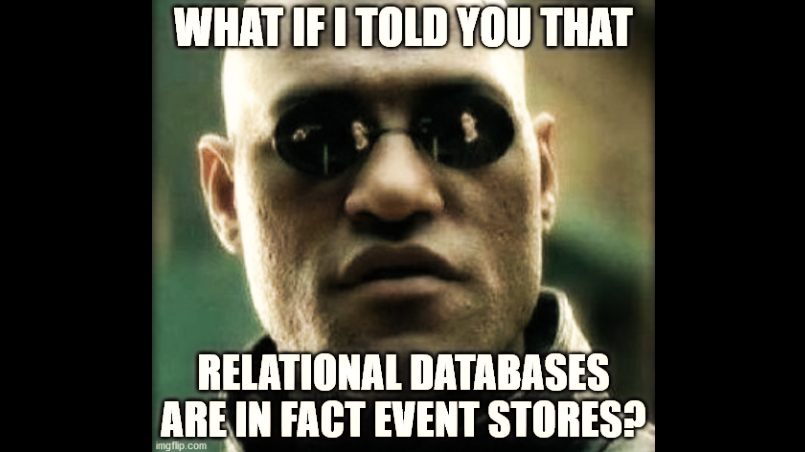

**Are you one of those people saying that Event Sourcing is detached from reality?** Do you think that you don't need such extravagance, as you have relational databases? Why go wild? What if I told you that relational databases use the Event Sourcing approach?
First, let's recall how Event Sourcing works. The source of truth lies in the event log. Every business operation results in a new set of events. When they're appended, we can rebuild our read models (projections, snapshots, etc.) on their basis. What's more, as our source of truth is the events, we might remove these read models and rebuild them based on events.

**Relational databases (and databases in general) have a concept called "Write-Ahead Log" (WAL) or "Transaction Log".** What is this? It is a data structure that stores all operations taking place in database transactions (e.g. add a record to orders table, update a shipment record, delete a user record). When we commit a transaction, the data are stored at first in the Write-Ahead Log, then they are applied to tables, indexes, etc. Hence the name "Write-Ahead": from this writing data to the log in advance of other changes. Why does it work that way?

[Let's go deeper underground](https://www.youtube.com/watch?v=WIUAC03YMlA). The data in the database is nothing but physical files stored on disk. They vary in format depending on the database type, but they have to be physically saved somewhere in the end. Even if we use a Docker, Kubernetes or Cloud, there is a physical disk somewhere that keeps the data. It may take some time to update tables and indexes based on the transaction changes. In the worst case, it might take even hours. During this time, the operating system may restart, a disk write may fail, or some other random error can occur.

**This is where "Write-Ahead Log" helps.** It is a structure optimized for appending. Each subsequent operation is added one after another at the end of the log. Because it is optimized for addition, it can accept and save operations much faster than performing them directly on tables. If we successfully added a new entry to WAL, we are safe even if applying to tables failed. Even restarting the server won't be disastrous. After the restart, the database will continue from the last processed log entry and complete the transaction (or roll it back safely).

**Therefore, in databases, the truth lies in the "Write-Ahead Log".** On this basis, read models‐tables are rebuilt (that is, records are added, updated, deleted). What's more, the operation itself also happens asynchronously (with eventual consistency maintaining the order of operations). There is a delay between appending to the WAL and the appearance of changes in the table.

**So precisely like in Event Sourcing.**

Well almost, a WAL is rather "Command Sourcing". We do not record the facts (events), but the intention to do something. WAL is also a temporal structure: it's purged after some time if the changes were applied. In the Event Store data is usually kept much longer.
The rest is correct.

Are you surprised?

Oskar

p.s. If you want to read more about it, check those links:
- https://www.postgresql.org/docs/13/wal-intro.html
- https://developers.eventstore.com/server/v20/server/indexes/#overview
- https://docs.microsoft.com/en-us/sql/relational-databases/logs/the-transaction-log-sql-server?view=sql-server-ver15
- https://www.sqlshack.com/sql-server-transaction-log-part-1-log-structure-write-ahead-logging-wal-algorithm/
- https://www.sqlite.org/wal.html
- https://medium.com/@daniel.chia/writing-a-database-part-2-write-ahead-log-2463f5cec67a 

p.s.2. Read also [how event stores are built](/en/lets_build_event_store_in_one_hour/) and why it may be worth [thinking about them as key-value stores](/en/event_stores_are_key_value_stores).