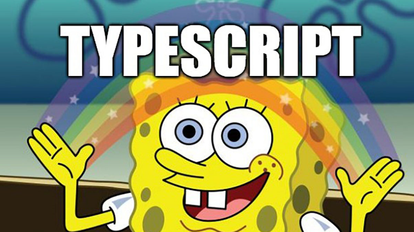

If TypeScript were a friend of mine on Facebook, then I'd mark our relation as complicated. It's a history of love & hate, or rather hate & appreciation. **I was a TypeScript hater.** It was lying in the same bucket as CoffeeScript, Dart and other weird variations of JavaScript.

That's not all. As befits a C# developer, I was also a JavaScript hater. With JavaScript, relation quickly evolved into a friendship as soon as I realised that's powerful when I use it in a functional way. I realised that I tried to apply the same coding patterns as in C#. JavaScript is a dynamic and more functional language. It was a recipe for disaster.

That's why I wasn't a TypeScript fan. Its early versions were adding too many incompatible to JavaScript specifics. TypeScript was, for me, the Troyan Horse made by imperative, compiled languages programmers.

**That changed when TypeScript was aligned to EcmaScript 6 standard.** I also read some eye-opening content about Type-Driven Development, e.g. ["Domain Modeling Made Functional"](https://pragprog.com/titles/swdddf/domain-modeling-made-functional/) by Scott Wlaschin. I realised that I could use TypeScript the same way I was using JavaScript but add more predictability and reliability related to types.

This week I was preparing the [blog post](https://www.eventstore.com/blog/nodejs-v1-release) about the v1 release of [EventStoreDB gRPC NodeJS client](https://developers.eventstore.com/clients/grpc/getting-started/?codeLanguage=NodeJS). While working on the samples, I started to play with our API and building the current aggregate state from events (_"aggregate stream"_). NodeJS client is built with TypeScript, so why not? 

I started by defining event types and aggregate data. I used the cinema ticket reservation as the sample use case.

```typescript
interface SeatReserved {
    eventType: 'SeatReserved';
    reservationId: string;
    movieId: string;
    seatId: string;
    userId: string;
}

interface SeatChanged {
    eventType: 'SeatChanged';
    reservationId: string;
    newSeatId: string;
}

type ReservationEvents = SeatReserved | SeatChanged;

interface Reservation {
    reservationId: string;
    movieId: string;
    seatId: string;
    userId: string;
}
```

As you see - nothing extraordinary. You can reserve the seat and change it. The important part is that both events have the _eventType_ property with a hardcoded event type name. We'll use it later.

**In Event Sourcing, events are logically grouped into streams.** Streams are a representation of entities. Each business operation made on the entity should end up as the persisted event. 

**Entity state is retrieved by reading all events and applying them one by one in the order of appearance.** We're translating the set of events into a single entity. This is what's the [reduce](https://developer.mozilla.org/en-US/docs/Web/JavaScript/Reference/Global_Objects/Array/Reduce) function was built for. It executes a reducer function (that you can provide) on each array element, resulting in a single output value. 

This is cool, but how can we do it with proper typing and not taking shortcuts with casting? 

**There are 3 things to cover:**
1. _reduce_ in TypeScript is a generic method. It allows to provide the result type as a parameter. It doesn't have to be the same as type of the array elements.
2. You can also use optional param to provide the default value for accumulation.
3. Use [Partial&lt;Type&gt;](https://www.typescriptlang.org/docs/handbook/utility-types.html#partialtype) as the generic reduce param. It constructs a type with all properties of Type set to optional. This utility will return a type that represents all subsets of a given type. This is extremely important, as TypeScript forces you to define all required properties. We'll be merging different states of the aggregate state into the final one. Only the first event (_SeatReserved_) will provide all required fields. The other events will just do a partial update (_SeatChanged_ only changes the _seatId_). 

Let's see how it works in practice:

```typescript
var events: ReservationEvents[] = [
    {
        eventType: 'SeatReserved',
        reservationId: 'res-homeAlone-1',
        movieId: 'homeAlone',
        seatId: '44',
        userId: 'ms_smith',
    },
    {
        eventType: 'SeatChanged',
        reservationId: 'res-homeAlone-1',
        newSeatId: '21',
    },
];

const result = events.reduce<Partial<Reservation>>((currentState, event) => {
    switch (event.eventType) {
        case 'SeatReserved':
            return {
                ...currentState,
                reservationId: event.reservationId,
                movieId: event.movieId,
                seatId: event.seatId,
                userId: event.userId,
            };
        case 'SeatChanged': {
            return {
                ...currentState,
                seatId: event.newSeatId,
            };
        }
        default:
            throw 'Unexpected event type';
    }
}, {});
```

Thanks to strong typing (_ReservationEvents_), we're sure about the events array's content. We know that both events will have the _eventType_ property. Having that, we can use _switch_ and define a custom state mutation logic for each event.

The only thing left is to make sure that our final result has a proper state and can be used as the _Reservation_ type. Remember, the result of _reduce_ will be _Partial<Reservation>_ with all required fields made optional. We can use [type guard](https://www.typescriptlang.org/docs/handbook/advanced-types.html#type-guards-and-differentiating-types) to verify if _Partial<Reservation>_ is also a valid _Reservation_.

```typescript
const reservationIsValid = 
    (reservation: Partial<Reservation>): reservation is Reservation => (
        !!reservation.reservationId &&
        !!reservation.movieId &&
        !!reservation.seatId &&
        !!reservation.userId 
    );

if(!reservationIsValid(reservation))
    throw "Reservation state is not valid!";

const reservation: Reservation = result;
```

As a bonus, let me present you the full working sample with the [EventStoreDB NodeJS gRPC client](https://developers.eventstore.com/clients/grpc/getting-started/?codeLanguage=NodeJS):

```typescript
import { EventStoreDBClient, JSONEventType, jsonEvent } from "@eventstore/db-client";

// define types
type SeatReserved = JSONEventType<
    "SeatReserved",
    {
        reservationId: string;
        movieId: string;
        userId: string;
        seatId: string;
    }
>;

type SeatChanged = JSONEventType<
    "SeatChanged",
    {
        reservationId: string;
        newSeatId: string;
    }
>;

type ReservationEvents = SeatReserved | SeatChanged;

interface Reservation {
    reservationId: string;
    movieId: string;
    userId: string;
    seatId: string;
}

const reservationIsValid = 
    (reservation: Partial<Reservation>): reservation is Reservation => (
        !!reservation.reservationId &&
        !!reservation.movieId &&
        !!reservation.seatId &&
        !!reservation.userId 
    );

// create events
const reservationId = "res-homeAlone-1";

const seatReserved = jsonEvent<SeatReserved>({
    type: "SeatReserved",
    data: {
        reservationId,
        movieId: "homeAlone",
        userId: "ms_smith",
        seatId: "44",
    },
});

const seatChanged = jsonEvent<SeatChanged>({
    type: "SeatChanged",
    data: {
        reservationId,
        newSeatId: '21',
    },
});   

// connect to EventStoreDB
const client = EventStoreDBClient.connectionString("esdb://localhost:2113?tls=false");

// append events
const appendResult = await client.appendToStream(
    reservationId, seatReserved, seatChanged);

// read appended events
const events: ReservationEvents[] = [];

for await (const resolvedEvent of eventStore.readStream(
  reservationId
)) {
  events.push(<ReservationEvents>{
    type: resolvedEvent.event!.type,
    data: resolvedEvent.event!.data,
    metadata: resolvedEvent.event?.metadata,
  });
}

// aggregate stream
const result = events.reduce<Partial<Reservation>>((acc, { event }) => {
    switch (event?.type) {
        case "SeatReserved":
            return {
                ...acc,
                reservationId: event.data.reservationId,
                movieId: event.data.movieId,
                seatId: event.data.seatId,
                userId: event.data.userId,
            };
        case "SeatChanged": {
            return {
                ...acc,
                seatId: event.data.newSeatId,
            };
        }
        default:
            return acc;
    }
}, {});

if(!reservationIsValid(result))
    throw "Reservation state is not valid!";

const reservation: Reservation = result;
```

I wrote a longer take on ["How to get the current entity state from events?"](/pl/how_to_get_the_current_entity_state_in_event_sourcing/). If you want to see how to use that pattern to build a whole NodeJS WebApi read my other article [Straightforward Event Sourcing with TypeScript and NodeJS](/pl/type_script_node_Js_event_sourcing).

Cheers!

Oskar