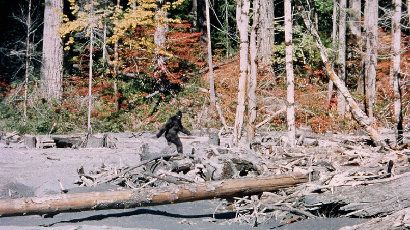
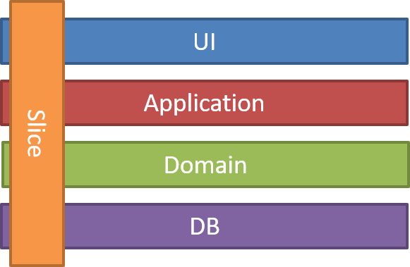

I'm sure that you know a lot of Urban Legends. They usually start with *"hey, my friend's cousin saw that..."* or *"you know, I've read such stuff on the Internet..."*. Everyone has the right to have an opinion. Unfortunately, most people use it. 

Some time ago, my colleague from the US asked me, *"What kind of strange tree is it?"*. It appeared that he was pointing a finger at a tree without any leaves (it was autumn) but covered with mistletoe. It could quickly become a story about the weird nature in Poland. 
Such things can quickly go off the rails. We all know that a lie told once remains a lie, but a lie told a thousand times becomes the truth. 

Likewise, our technical patterns are filled with myths and mishaps. Quite often, this happens to CQS and CQRS.

You can hear quite often that to use CQ(R)S:
- You need two databases.
- You have to use a messaging queue (e.g. RabbitMQ or Kafka).
- It's hard to apply and complicates the architecture.
- You'll be facing Eventual Consistency.
- You need to do Event Sourcing.

I'll tackle those myths today. But, First things, first! Let's start with these enigmatic acronyms.

**CQS** stands for **C**ommand **Q**uery **S**eparation.

**CQRS**, **C**ommand **Q**uery **R**esponsibility **S**egregation.

Do any of these names say something about two databases? Or two tables? Does it say anything about storage at all? Well, not really.

Both CQS and CQRS have Command and Query in their name. 

**Command** is a request (intention) to change.

**Query** is a request to return data.

For example:

The command to add a meeting could look like this:

```csharp
public class CreateMeeting
{
    public string Name { get; }

    public DateTime HappensAt { get; }

    public CreateMeeting (string name, DateTime happensAt)
    {
        Name = name;
        HappensAt = happensAt;
    }
}
```

A query to retrieve a specific event might look like this:

```csharp
public class GetMeeting
{
    public Guid Id { get; }

    public GetMeeting (Guid id)
    {
        Id = id;
    }
}
```

As you can see, these are ordinary DTO objects.

CQS pattern was created by Bertrand Meyer during his work on the [ Eiffel language](http://laser.inf.ethz.ch/2012/slides/Meyer/eiffel_laser_2012.pdf). He stated that:

**_"Asking a question should not change the answer"_**

and defined:

**_"A command (procedure) does something but does not return a result._**

**_A query (function or attribute) returns a result but does not change the state."_**

Simple as that. Still not talking about storage or a queue, right?

With such a distinction, processing can be made more simple and predictable. A query won't create any side-effects. A command won't be used for requesting data.

CQRS is an extension of CQS. Greg Young coined it as:

**_"Command and Query Responsibility Segregation uses the same definition of Commands and Queries that Meyer used and maintains the viewpoint that they should be pure. The fundamental difference is that in CQRS objects are split into two objects, one containing the Commands one containing the Queries."_**

Still nothing about storage, right?

CQRS can be interpreted at a higher level, more general than CQS; at an architectural level. CQS defines the general principle of behaviour. CQRS speaks more specifically about implementation.

**Using CQRS, you should have a strict separation between the Write Model and the Read Model**. Those two models should be processed by separate objects and not be conceptually linked together. Those objects are not physical storage structures but, e.g. Command Handlers and Query Handlers. They're not related to where and how the data will be stored. They're connected to processing behaviour. 

Command Handlers are responsible for handling commands, mutating state or doing other side effects. 

Query handlers are responsible for returning the result of the requested query.

**Nothing prevents the Write Model and the Read Model from having the same structure or using the same tables.** What's more, CQRS doesn't have to use any database. You can have Excel running behind the scene. You can query an external API. You can store data in a text file. Both CQS and CQRS do not tell anything about the end storage. The most important thing is to conceptually think differently about models for writing and reading data and not mixing them together.

**Nothing then stops you from using a relational database, even the same table for reading and writing. If you prefer, you can continue to use ORM.**
Nothing prevents the command from adding/modifying records and query retrieving data from the same table. As long as we keep them separated in our architecture. Even on that level, you can benefit from CQRS, e.g. disable change tracking in query handlers, knowing that the query won't change the state.

Jimmy Bogard, in his article ["Vertical slice architecture"](https://jimmybogard.com/vertical-slice-architecture/), compared traditional "Clean Architecture" (or I should say _"Onion Architecture"_):


to "Slice architecture":



In CQRS, you're also cutting your model and API into vertical slices. Each command/query handler is a separate silo. This is where you can reduce coupling between layers. Each handler can be a separated code unit, even copy/pasted. Thanks to that, you can tune down the specific method to not follow general conventions (e.g. use custom SQL query or even different storage). In a traditional layered architecture, when you change the core generic mechanism in one layer, it can impact all methods. This is a huge risk that may lead to abandoning the needed change. Having a vertical split also helps developer to focus on a particular business feature. The world is not perfect: sometimes there are more exceptions than cases following the rules. It's good to have the option to differentiate our solution as the situation calls for it.

Btw. comparing Jimmy's diagrams I have doubts as to why CQRS is perceived as the complicated one.

**Why do people think that you need to have different tables or databases in CQRS?**

CQRS allows for the refinement of the query model to suit the clients needs. It's a typical case to have a dedicated read model for each view. You don't need all the details of the records while you're just displaying a short summary. Such read models can be slightly different SQL queries selecting a different range of columns from the table. But they can also be materialised views or separate tables. You may do that for the performance optimisation; to not have writes and queries impacting each other. If you have such a case, then one of the potential solutions is to use different tables or databases and synchronise them after writing. However, this is not a general rule. You should select your strategy that suits your needs. I always suggest starting small before growing big.

**Where did the need for messaging queues come from?**

CQRS allows you to have different storages for different business cases. You can, for example, have a relational database on the write model and document database on the read model (e.g. Elastic Search for full-text search) or any other combination. Creating a read model also needs to have transformation logic. It's not one-to-one data mapping. You can have separate services responsible for the business logic modifying state and rebuilding read models for such needs. Messaging queues (e.g. RabbitMQ, Kafka) can help synchronise them by notifying the read model processors about the new change in the write model. Again, you can start smaller with the tables and database views, in-memory queue or CDC. It all depends on your scenario, [guarantees you need to have](https://event-driven.io/pl/outbox_inbox_patterns_and_delivery_guarantees_explained/) etc.

**What about Eventual Consistency in the CQRS?**

If you're using messaging queues or multiple databases, then the state coordination nature is usually asynchronous. Even materialised views or replication in the database can be eventually consistent.

When a change made in the write-model affects multiple read models in the same transaction, it's worth considering if the performance's impact is significant. One potential approach is to offload the update into the background, asynchronous process. Knowing what changes were made, you can process them one by one or, e.g. in the batch [ETL](https://en.wikipedia.org/wiki/Extract,_transform,_load) process.

Read more on that in my post about [the Outbox Pattern](https://event-driven.io/pl/outbox_inbox_patterns_and_delivery_guarantees_explained/).

**Do you need Event Sourcing?**

No, you don't. Event Sourcing is quite often conflated with CQRS. Event Sourcing, by definition, has Write and Read models. Events are stored in the append-only log. They are the source of truth. Read models are created and updated based on events. Event Sourcing and CQRS matches like tequila to salt and lime. However, they are different patterns. Event Sourcing is *"just"* one of the options you can choose as a storage implementation. You don't have to use it if you don't want to.

**To complete the tackle with CQ(R)S myths, check the following links:**
- [Greg Young - CQRS Documents](https://cqrs.files.wordpress.com/2010/11/cqrs_documents.pdf)
- [Bertrand Meyer - Eiffel: a language for software engineering](http://laser.inf.ethz.ch/2012/slides/Meyer/eiffel_laser_2012.pdf)
- [Martin Fowler - CQRS](https://martinfowler.com/bliki/CQRS.html)
- [Udi Dahan - Clarified CQRS](https://udidahan.com/2009/12/09/clarified-cqrs)
- [Jimmy Bogard - Vertical slice architecture](https://jimmybogard.com/vertical-slice-architecture/)
- [Kent Beck talk about coupling and cohesion](https://www.youtube.com/watch?v=3gib0hKYjB0)

See also my repository, where I've gathered practical samples and other resources about CQRS and Event Sourcing: https://github.com/oskardudycz/EventSourcing.NetCore.

It's always best to read the sources and verify if things told on the Internet are truth or Urban Legends. Too often, we make our decisions based on anecdotal evidence rather than research.

I hope that this helps you to sift the wheat from the chaff.

If you liked this article, also check others where I'm trying to bust similar myths:
- [Event Streaming is not Event Sourcing!](/pl/event_streaming_is_not_event_sourcing/)
- [Don't let Event-Driven Architecture buzzwords fool you](/pl/dont_let_event_driven_architecture_buzzwords_fool_you/)

Cheers!

Oskar