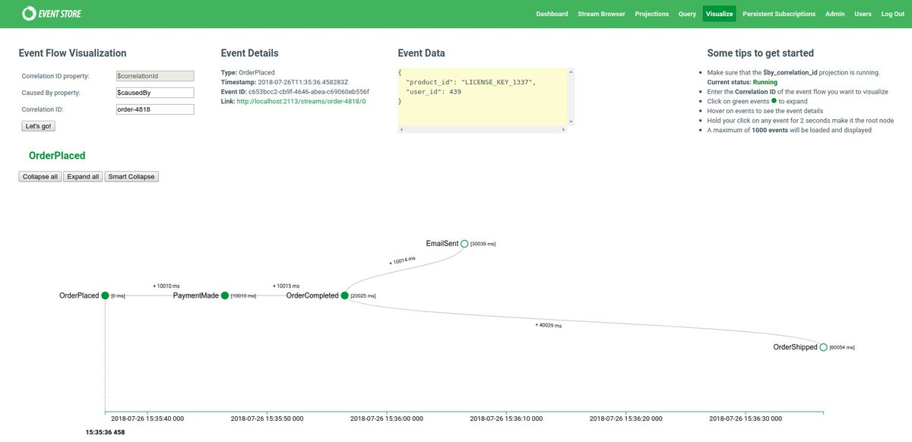

Autonomy is the Holy Grail for the management of multiple teams. At least that's how it's perceived; it's not easy to get the right balance. I've written in the past on how:
- The architect role can impact the team's autonomy in my ["Architect Manifesto"](/en/architect_manifesto/).
- ["Sociological aspects of Microservices"](/en/sociological_aspects_of_microservices/) changes teams relations.

**Today, I'm stating that using event-based systems can help in running autonomous teams.**

The days where we could locate all team members in the same office are gone. Even the most stubborn companies have had to find a way to work remotely. This distributed environment brings benefits and challenges.

Let me quote Mel Conway again:

_"Any organization that designs a system (defined broadly) will create a project whose structure is a copy of the organisation's communication structure."_

Distributed teams are more likely to create distributed systems. The emergence of microservices from this shouldn't be surprising. We no longer create applications that are running in a single region, country or even continent. Globalisation, the Butterfly Effect, someone eats a bat one day and a few months later…

In terms of communication, it can be both more difficult and more straightforward. On one hand, it's more complicated because we can't gather a team in one room to discuss an issue, or discuss a problem in the office kitchen with a hot drink. On the other hand, it's easier because this type of kitchen discussion can turn into a chit chat without a conclusion. Coffee after coffee, tea after tea, and we still don't see any result. The knowledge that it's hard to group people can motivate us to be more precise and on point. We'll be keener to provide written content like RFC or ADR.

The same thing happens with our systems. If we do not define communication rules between services, we're risking failure. Without defined boundaries, it will go wild. Some API will be created, some requests will be sent. However, we'll be getting constant random failures or misalignments. We may end up using the *"Negotiator pattern"*. We have two microservices that don't talk to each other, so we add a third one in a panic. We hope that the new one will persuade the two others to start talking to each other. You can probably imagine the typical result of those negotiations…

Events then come to the rescue. How?

**Events are concise and carry a specific business message.** We get a clear domain context from the event (via type and data). That helps us to understand what has happened.

**It is easy to describe business flows with events.** We can do it with the help of [Event Storming](https://www.eventstorming.com/). They enable both microscale and macroscale modelling on how our system should work. What's more, we can make a precise inquiry. If we send:
- correlation id - the identifier of the operation that triggered them, e.g. WebAPI call,
- causation id - the identifier indicating the order of occurrence.

We will be able to generate a graph of calls. For example, EventStoreDB commercial UI can generate a view like that:

It can be used to verify if the actual workflow reflects the business assumptions.

**Events help to make a business-friendly API.** We can inform the modules directly about what business (domain) events take place. Thanks to that, other teams will understand better what they can expect from us. Additionally, if we [use C(Q)RS](/en/cqrs_facts_and_myths_explained/), we also correlate events with business commands. Having that can show our module as a black box. So, e.g. after calling such a command, you'll get such an event. The very nature of commands and events makes it easier to view the system in business terms, not technical. Less effort is needed to explain the logic.

**Events make relations between modules more straightforward.** By using a command and an event, we can show the type of dependency between the modules. For example, we can define that the financial module should wait for the confirmation event from the reservation module to issue an invoice. We're stating that in the ticket reservation process, the financial module is streamlined to reservation one. If we send a command, then we define strict relation.

Thanks to all of that, we can also model the actual relationships between the teams. **It's an inverted Conway's law**. By modelling the business process and boundaries for the technical solution, we can get the proper communication rules and team boundaries.

Modelling with events helps on keeping the focus on the business flow without getting into nitty-gritty technical details. Using events helps to create a synergy between technology and business solutions. It also facilitates people to start discussions, which itself is attractive, isn't it?

Cheers!

Oskar

p.s. check also my [Architect Manifesto](/pl/architect_manifesto).