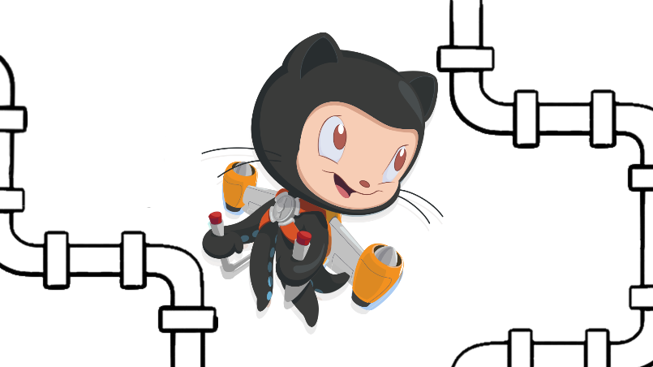

As you may know, I'm a fan of documentation. I wrote a few practical tips on this topic on the blog:
- ["How to create projections of events for nested object structures?"](/en/how_to_create_projections_of_events_for_nested_object_structures/),
- ["Architect Manifesto"](https://event-driven.io/en/architect_manifesto/),
- ["How to enhance and configure your site search with Algolia?"](/en/how_to_configure_algolia_for_your_site_search/).

**I believe that high-grade documentation lives and evolve with the project.** Documentation makes sense when it reflects the current state of the code. There is nothing worse than outdated documentation. If we have to look at the code anyway, it's a waste of time.

Today I would like to show you a little bit of our kitchen. It is euphemistic to say that the EventStoreDB documentation wasn't the best. With painstaking work, we slowly reach the place where you can say that the documentation is "OK". EventStoreDB is a large, complex project. There are many use cases to consider for each change. Until now, the documentation was created after the functionality was added. Programmers were adding a piece of information into the _Changelog_. Then someone from our DevAdvocacy team was adding docs on that. It wasn't perfect because we were not always able to keep pace.

Additionally, we might not know all the details of the implementation without asking or analyzing the code. Further, a strong focus on documentation takes our time for other initiatives (e.g. better samples, materials, etc.). Therefore, the step we wanted to do was move the documentation to the code repositories. This allows them to be included in the normal _Code Review_ process.

We had already preconfigured scripts for copying documentation from other repositories (see: https://github.com/EventStore/documentation/blob/master/import/import-client-docs.js). However, it was not as trivial as it might seem. A lot of things had to be standardized and taken into account. For example, the URL should match the previous one, so that:
- SEO was correct.
- old URLs were opening.
- Internal linking worked.

**Documentation for different versions of EventStoreDB varies.** If we wanted the documentation to be where the code was, it still had to be placed on the appropriate release branches. This raises some difficulties because our documentation (despite significant improvements) still has gaps. We do not yet have the comfort of documenting only the latest version. We often document things that touch upon several versions.

**I think that with mechanical, repetitive work, it is easy to make stupid mistakes.** We would need to remember about making cherry-picks between several branches. Additionally, issuing separate pull requests etc. I am irritated when someone says _"it's easy, a programmer should remember about it"_.  Maybe it's simple. Perhaps one could remember about it, but what for? If we sum up such cases where we have to remember something, it turns out that we do nothing else at work other than going through a checklist in our head. Boring, repetitive situations have to be automated.

**That's why we decided to implement automation.** Last week, I added a custom GitHub action, which will automatically do a _cherry-pick_ of changes from a merged pull request. For each *cherry-pick: {target_branch}* label on the pull request, it will create a separate PR with a copy of the changes.

**GitHub allows you to do your own actions** using Docker or JavaScript. I used the latter approach. The action code itself is relatively simple, but how much swearing and nerves it cost me - it's mine. GitHub actions enable a lot of scenarios, but they have terrible documentation. Hence my idea to share this example with you.

We can define our own action in the repository where the code is located. We can also create a dedicated repository that will store shared actions. We chose the latter solution because:
- It's easier to maintain.
- Changes put there will be immediately visible the next time you run the action in another repository. No additional changes needed, etc.
- You can have a code shared between different actions.

**What problems did I encounter besides the poor GitHub documentation?** For example, if we do an action using JavaScript, we have to keep *node_modules* in the repository. Currently, GitHub will not install the dependencies itself when starting the pipeline. This makes sense because we have the known dependencies on every call. Nevertheless, it is most of all a pain in the ass. As you know, *node_modules* can take up a lot of space. We have to make ourselves strict about their weight. Additionally, our .gitignore rules can play a joke on us. For example, I lost a lot of time when it turned out that the rule ignored files from one package. One of the libraries I used had a dependency on the NPM package named *debug*. Curtain.

GitHub Action code is available here:
- README - https://github.com/EventStore/Automations/tree/master/cherry-pick-pr-for-label
- code - https://github.com/EventStore/Automations/blob/master/cherry-pick-pr-for-label/index.js
- shared code - https://github.com/EventStore/Automations/tree/master/lib

As you can see, the code is relatively simple. It uses an SDK shared from GitHub called Octokit (https://docs.github.com/en/rest/overview/libraries). I am pretty happy with this action because apart from the logic, it can also comment and inform about the status. It makes the process way easier. For a sample comment, see here: https://github.com/EventStore/EventStore/pull/2903#pullrequestreview-633505402.

**How to use this action?**

Just define the workflow in the repository (https://github.com/EventStore/EventStore/blob/master/.github/workflows/cherry-pick-pr-for-label.yml):

```yaml
name: Cherry pick PR commits for label
on:
  # you can use pull_request, but...
  # pull_request_target runs with the approver permission
  # which is critical to enable also for forks
  pull_request_target:
    types: [closed]
jobs:
  cherry_pick_pr_for_label:
    name: Cherry pick PR commits for label
    runs-on: ubuntu-latest
    steps:
      - uses: actions/checkout@v2
      - name: Cherry Pick PR for label
        # you setup here the separate repository
        # where action is located:
        # - repository: EventStore/Automations
        # - relative path: /cherry-pick-pr-for-label
        # - branch: @master
        uses: EventStore/Automations/cherry-pick-pr-for-label@master
        with:
          GITHUB_TOKEN: ${{ secrets.GITHUB_TOKEN }}
```

Interestingly. I did not find it anywhere in the documentation ...

What's even more interesting: you can use this action in your repository. For example, to sync code across branches. Of course, long-lived code branches are a bane. However, it is known how it is: sometimes you cannot do without them.

Your own GitHub actions give you a lot of possibilities. You can create very interesting automations. You have to bite through these first problems. I hope this article and these examples will make it easier for you. I encourage you to play with this code. Let me know what you see potential uses of yourself.

Cheers!

Oskar