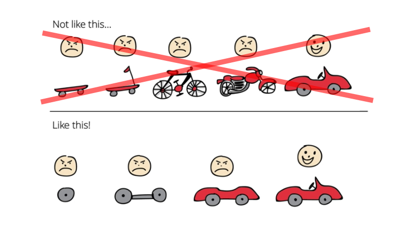

Today I want to invert [the classical pro-agile drawing](https://blog.crisp.se/wp-content/uploads/2016/01/Making-sense-of-MVP-.jpg). Let's talk about the devaluation of functionality that occurs in Agile projects.

**In the old times, the project was planned ahead. The Waterfall was the king.** First, analysts were with the client, collecting requirements and building the system vision. The next phase was functional and technical analysis.  Plans were made, steering committees were created. 
Having several hundred (thousand?) pages of documentation, you could start programming.  The developers didn't see the client face-to-face.  What's more, they sometimes did not even know what they were producing. They got requirement #284 located on page 1847 in the documentation. Just create a form that will call the service with the defined request params. Then repeat and repeat for similar specifications. After years of analysis and coding, finally, testing can be done. A lot of different tests: system, user acceptance etc. Then the long-awaited deadline. That's an optimistic scenario. Much often the project was so off the budget that it collapsed in the meantime.

At one point, the projects were so delayed and their process so difficult to handle that people wondered how the software could be delivered faster and more predictably. That is, allow working in shorter cycles. Thanks to that, the clients could get functionalities quicker, evaluate them, and give feedback faster. They could also judge that this feature is "good enough". That gave the possibility to change requirements and make the decision based on the current conditions. **That's where Agile was born.** SCRUM became the most popular Agile methodology. Right now, all projects are agile, don't they?

**By the time it appeared that using SCRUM was not solving all the issues that it was promising.** It was still hard to understand what the project state was and when the features would be delivered. However, few people remember that SCRUM in its assumptions did not mean that we stopped planning the entire product. It's not like we should only prepare for the next sprint. What is an essential element of SCRUM is Global Backlog. This is a general list of tasks that are needed to complete the whole system. 

**It's not that agile projects should go on forever (although maybe software shops would like to).** SCRUM (and Agile in general) is about tasks' re-evaluation and re-prioritization with each iteration. It's all about being flexible about the way to achieve your goal. But! That goal should still be there. We need to take an azimuth to coordinate the team and keep awareness of the requirements. With each sprint, we should better assess how much time it will take to complete the rest of the system.

It's not that agile methodologies are focused on chasing a bunny, and "heavier" like Waterfall or PRINCE2 on catching it.

**Unfortunately, in our projects, we often forget about their purpose.** We live from sprint to sprint. We forget that the effect of a single sprint does not make any sense as long as it does not bring us closer to completing the project. We have our little battles ignoring that we have the entire war to win. Moreover, we often forget that some things cannot be built iteratively. 

**It's not that when our client ordered a car, we first delivered roller skates, then a scooter, then finally a car.** If clients want a car, we have to build a car. Unfortunately, some things have to take longer. Making a chassis and attaching wheels to it will not make it something to present to the customer. Showing that we have a scooter and checking whether clients didn't change their minds and will be happy to use it instead of a car is often not the best approach. 

What do I mean by that? **We need to remember what is most important, finishing the project.** Dividing time into sprints doesn't make us agile. The fact that we completed the sprint does not matter if the project is not finished. Sometimes, it is worth accepting that certain things must last and not finish something in one sprint. We should not be trying to forcibly change the requirements or cut them into smaller pieces to fit them into the framework of these 2-3 weeks. I know that it is always motivating to finish all the stories in a sprint. Still, the most important thing is to deliver what the client is expecting. By forcefully adjusting the scope and producing our partial effects, we may waste time managing tasks and building the same thing several times.

It's also crucial to keep the fast feedback loops. Working with the client is the foundation for Agile software development. If we don't have it, it will be Waterfall hidden behind the scenes or Jira Oriented Programming.

Remember that Agile methodologies are... er... Agile! It's all about being flexible, remembering the customer's needs and what the system is supposed to do. 

Therefore, as every week, I encourage pragmatism, common sense and questioning what you hear or read. For example, what I wrote above.

Cheers!

Oskar