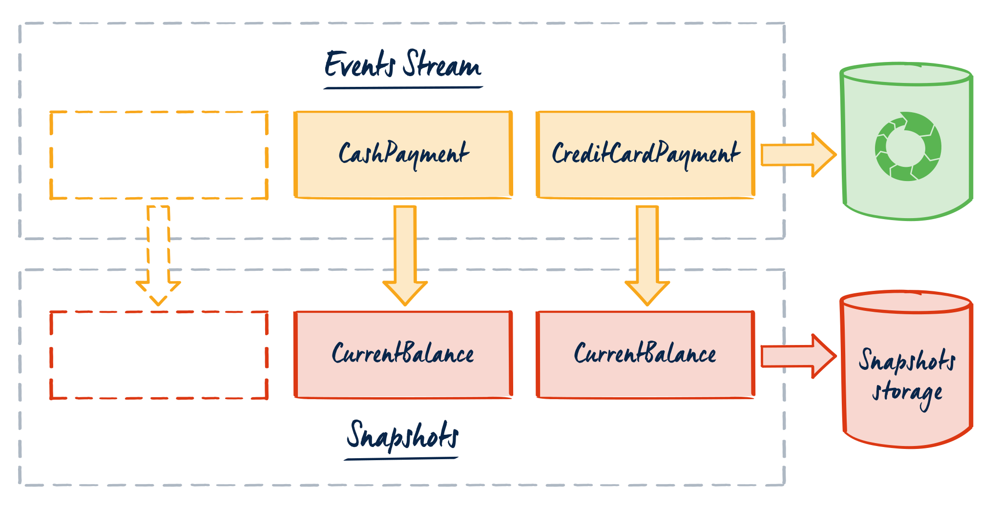
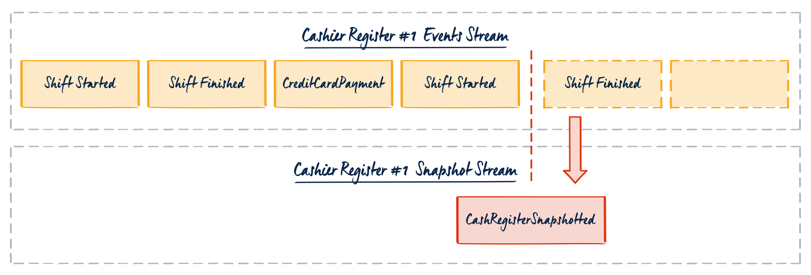
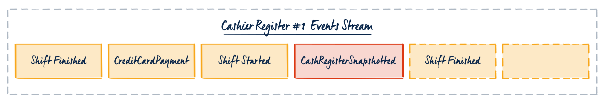
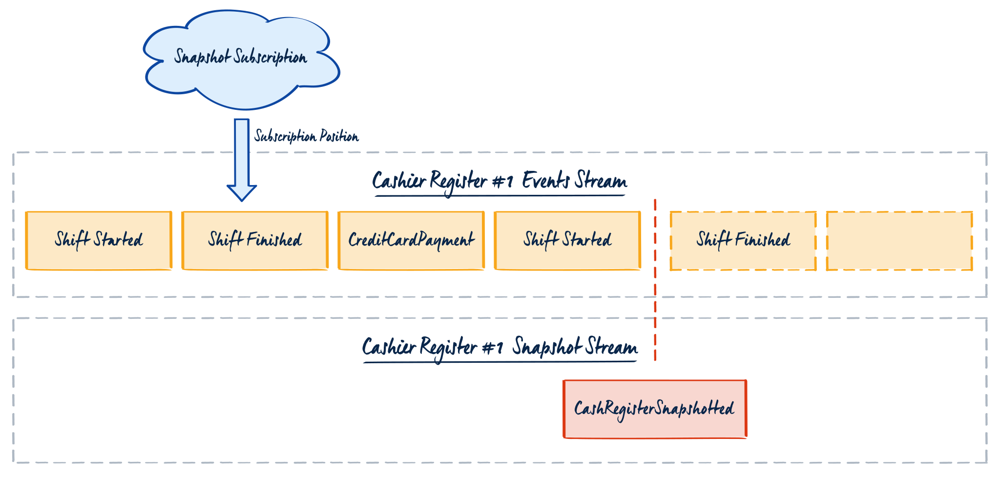

Looking at resources from the Internet, you may conclude that snapshots are an essential part of the Event Sourcing system. It may be tempting to read the current state from a single record instead of multiple events. We could store it separate database in parallel to appending a business event. You cannot deny that reading a single entry is faster than reading more of them, right?

In the [previous article](/en/snapshots-in-event-sourcing/), I explained that as inviting as it is, we should treat snapshots as a technical optimisation. As with all optimisations, if they're premature they may create more issues than they solve.

Event Sourcing brings a temporal aspect to the modelling. The size of data grows with each event. Still, that doesn't have to lead to performance issues. Event Stores can handle a vast number of streams. The most important is to keep them short-lived. You can achieve that by using the patterns like _"Complete the Books"_. For example, instead of keeping the whole history of transactions in a single stream, you can keep them in streams partitioned by month or by day. Hence, snapshots can be not needed as performance may be good enough. Before applying an optimisation, we should always gather the expected metrics and make the benchmarks. Then we can decide if we need to optimise.

Yet, for the performance-critical parts of our application, we may need to tune our solution. Quite often, we realise too late that we didn't do the best job on stream modelling. For such cases, snapshots can be an accurate tactical decision. Thus, this article. It would be best if you did not treat it as an invitation to use snapshots. My aim is to explain how to do it when you really have to.

I'll use [EventStoreDB gRPC client](https://developers.eventstore.com/clients/grpc/getting-started?codeLanguage=NodeJS), [TypeScript](https://www.typescriptlang.org/) and [NodeJS](https://nodejs.org/en/), but I think that it should be easy to translate to other dev environments.

## Storage



Snapshots are the representation of the current state at a certain _"point in time"_. I'm using quotes as it doesn't have to be a precise time. Technically, "point in time" represents the stream revision, so the last event position when the snapshot was made. The time can be correlated using event (meta)data.

We can store snapshots in any storage. It can be:

-   a record in durable storage (e.g. relational or document database, key-value store, etc.),
-   in-memory cache entry,
-   distributed cache entry (e.g. in Redis),
-   event in the event store.

All of them have pros and cons, for example:

-   using additional durable storage introduces more moving pieces, increasing the complexity of the system.
-   by using a cache, we're risking that cache will be invalidated. We need to define a fallback scenario and prepare for the peaks when we need to rebuild snapshots. When not appropriately tuned, the in-memory cache can eat your service resources and negatively impact the solution performance. Plus, if you're trying to fix an issue with a cache, you usually end with two problems.

You should choose your strategy wisely based on your use case.

## Reading

The premise of making snapshots is to speed up reading. In Event Sourcing, we retrieve the state by reading all stream events and applying them one by one on the state object. For instance, having events _BankAcocountCreated_, _DepositRecorded_, _CashWithdrawn_, we can add the amount from the deposit (100$) and subtract with amount from withdrawal (e.g. 80$). By applying events in such a way, we can calculate the current account balance (e.g. 20$).

If we created a snapshot, then in theory, we could use it as the current state. Why "in theory"? A snapshot is a representation of the state at a certain point in time. It may happen that, between creation and the next read, new events occurred. It's a common scenario. Plus, as I'll describe in the next paragraph, snapshots might not be stored after each change.

Not having the latest state doesn't have to be an issue. Depending on our scenario, we can live with that. Though, typically we want to make the business decisions using the latest state, not to make choices on obsolete information. Therefore, we usually load the snapshot and events that happened after the snapshot was created. What's more, if we represent the snapshot as an event, we can also use it in the regular state aggregation process.

If we define the event type as:

```typescript
export type Event<
  EventType extends string = string,
  EventData extends object = object,
  EventMetadata extends object = object
> = {
  type: EventType;
  data: EventData;
  metadata?: EventMetadata;
};
```

Having that, we can derive the snapshot event type:

```typescript
type SnapshotMetadata = {
  snapshottedStreamRevision: string;
};

type SnapshotEvent<
  EventType extends string = string,
  EventData extends object = object,
  EventMetadata extends SnapshotMetadata = SnapshotMetadata
> = Event<EventType, EventData, EventMetadata> & {
  metadata: Readonly<EventMetadata>;
};
```

To retrieve the snapshot follow-up events, we need to get the stream revision on which the snapshot was made. The most convenient is to store it in the metadata.

* * *

If this syntax looks weird and you are not familiar with TypeScript quirks, don't worry, I will explain it to you. TypeScript allows specifying the restrictions for the generic type parameters. `EventType extends string` means that type provided has to be `string`. TypeScript allows [types aliases](https://www.typescriptlang.org/docs/handbook/2/everyday-types.html#type-aliases) even for the primitive types. This syntax allows us to restrict the generic type param to be `string` or string type alias.

We can also assign the default type by `EventType extends string = string`. This is useful to simplify the usage and generic logic.

The above event type definition written in C# could look like:

```csharp
public abstract class Event
{
    public abstract string Type { get; set; }
    public object Data { get; set;  };
    public object Metadata { get; set; };
}

public abstract class Event<EventData>: Event
    where EventData : class
{
    public new EventData Data
    {
        get { return base.Data as EventData; }
        set { base.Data = value; }
    }
}

public abstract class Event<EventData, EventMetadata>: Event<EventData>
    where EventData : class
    where EventMetadata : class
{
    public new EventMetadata Metadata
    {
        get { return base.Metadata as EventMetadata; }
        set { base.Metadata = value; }
    }
}
```

We could make also the event type fully immutable by using [Readonly](https://www.typescriptlang.org/docs/handbook/utility-types.html#readonlytype) and defining it as:

```typescript
export type Event<
  EventType extends string = string,
  EventData extends Record<string, unknown> = Record<string, unknown>,
  EventMetadata extends Record<string, unknown> = Record<string, unknown>
> = Readonly<{
  type: Readonly<EventType>;
  data: Readonly<EventData>;
  metadata?: Readonly<EventMetadata>;
}>;
```

However, let's leave it for now and ignore read-only syntax for brevity. I don't want to focus on the TypeScript syntax but on the Snapshotting techniques.

* * *

Let's take this from the [previous article](/en/snapshots-in-event-sourcing/): a cash register domain. We modelled our stream as all the events (e.g. transactions) registered for the cash register since it was placed at the workstation. We'll use snapshots to tactically resolve performance issues related to loading streams with thousands of events.

With that, we can define the Cash Register entity and its snapshot event type (`CashRegisterSnapshoted`) as:

```typescript
type CashRegister = {
  id: string;
  float: number;
  workstation: string;
  currentCashierId?: string;
};

type CashRegisterSnapshoted = SnapshotEvent<
  'cash-register-snapshoted',
  CashRegister
>;

type CashRegisterEvent =
  | PlacedAtWorkStation
  | ShiftStarted
  | TransactionRegistered
  | ShiftFinished
  | CashRegisterSnapshoted;
```

We also defined the union type containing all the cash register events. We can use it to define our state application logic (read more details about this process in [my other article](/en/how_to_get_the_current_entity_state_in_event_sourcing/)):

```typescript
function when(
  currentState: Partial<CashRegister>,
  event: CashRegisterEvent
): Partial<CashRegister> {
  switch (event.type) {
    case 'placed-at-workstation':
      return {
        id: event.data.cashRegisterId,
        workstation: event.data.workstation,
        float: 0,
      };
    case 'shift-started':
      return {
        ...currentState,
        currentCashierId: event.data.cashierId,
      };
    case 'transaction-registered':
      return {
        ...currentState,
        float: (currentState.float ?? 0) + event.data.amount,
      };
    case 'shift-ended':
      return {
        ...currentState,
        currentCashierId: undefined,
      };
    case 'cash-register-snapshoted':
      return {
        ...event.data,
      };
    default:
      // Unexpected event type
      return {
        ...currentState,
      };
  }
}
```

Even if we don't store the snapshot as the event but into a separate database or cache, we can map it to this structure while reading. Thanks to that, our state aggregation logic will be exactly the same as we don't use snapshots.



## Reading snapshot from the separate stream

Let's define the simple read events wrapper to map the results and return an error instead of throwing an exception. We'll need that later.

```typescript
type STREAM_NOT_FOUND = 'STREAM_NOT_FOUND';

async function readFromStream<StreamEvent extends Event>(
  eventStore: EventStoreDBClient,
  streamName: string,
  options?: ReadStreamOptions
): Promise<StreamEvent[] | STREAM_NOT_FOUND> {
  try {
    const events: StreamEvent[] = [];

    for await (const resolvedEvent of eventStore.readStream(
      streamName,
      options
    )) {
      if (!resolvedEvent.event) continue;

      events.push(<StreamEvent>{
        type: resolvedEvent.event!.type,
        data: resolvedEvent.event!.data,
        metadata: resolvedEvent.event?.metadata,
      });
    }

    return events;
  } catch (error) {
    if (error.type == ErrorType.STREAM_NOT_FOUND) {
      return "STREAM_NOT_FOUND";
    }
    throw error;
  }
}

async function readLastEventFromStream<StreamEvent extends Event>(
  eventStore: EventStoreDBClient,
  streamName: string
): Promise<StreamEvent | STREAM_NOT_FOUND> {
  const events = await readFromStream<StreamEvent>(eventStore, streamName, {
    maxCount: 1,
    fromRevision: END,
    direction: 'backwards',
  });

  if (events === 'STREAM_NOT_FOUND') {
    return  'STREAM_NOT_FOUND';
  }

  return events[0];
}
```

The general logic to read the last snapshot and follow-up events can be defined as:

1.  Read the last snapshot (if it exists).
2.  Read events from the EventStoreDB.

-   If a snapshot exists, read events since the last stream revision of which snapshot was created.
-   Otherwise, read all events.

3.  Return stream events preceded by the snapshot.

Code for that can look like:

```typescript
async function readEventsFromExternalSnapshot<
  StreamEvent extends Event,
  SnapshotStreamEvent extends SnapshotEvent = StreamEvent & SnapshotEvent
>(
  getLastSnapshot: (
    streamName: string
  ) => Promise<SnapshotStreamEvent | undefined>,
  eventStore: EventStoreDBClient,
  streamName: string
): Promise<{
  events: (StreamEvent | SnapshotStreamEvent)[];
  lastSnapshotRevision?: bigint;
}> {
  const snapshot = await getLastSnapshot(streamName);

  const lastSnapshotRevision = snapshot
    ? BigInt(snapshot.metadata.snapshottedStreamRevision)
    : undefined;

  const streamEvents = await readFromStream<StreamEvent>(
    eventStore,
    streamName,
    {
      fromRevision: lastSnapshotRevision,
    }
  );

  if (streamEvents === 'STREAM_NOT_FOUND') throw 'STREAM_NOT_FOUND';

  const events = snapshot ? [snapshot, ...streamEvents] : streamEvents;

  return {
    events,
    lastSnapshotRevision,
  };
}
```

We can inject the `getLastSnapshot` function with any logic of how to get the last snapshot. We can load it from the cache, other database or the other stream.

If we want to read it from a separate stream, then the code can look like:

```typescript
function addSnapshotPrefix(streamName: string): string {
  return `snapshot-${streamName}`;
}

async function readSnapshotFromSeparateStream<
  SnapshotStreamEvent extends SnapshotEvent
>(
  eventStore: EventStoreDBClient,
  streamName: string
): Promise<SnapshotStreamEvent | undefined> {
  const snapshotStreamName = addSnapshotPrefix(streamName);

  const snapshot = await readLastEventFromStream<SnapshotStreamEvent>(
    eventStore,
    snapshotStreamName
  );

  return snapshot !== 'STREAM_NOT_FOUND' ? snapshot : undefined;
}
```

We're reading only the last event from the stream, as we're interested in the latest snapshot. If the stream does not exist, we return an empty value instead of throwing an exception. It's a valid case that means that no snapshot was stored yet.

## Reading snapshot from the same stream



We could also store and read a snapshot in the same stream as regular events. Having that, we won't be reading all stream events but only snapshot and further. To do that, we need to keep the snapshotted revision somewhere. The most convenient way is to put it at the stream level: in the stream metadata. Having that, we can read the last snapshot event position and read events from there.

To read the last snapshot revision code will look like that:

```typescript
async function readStreamMetadata<
  StreamMetadata extends Record<string, unknown>
>(
  eventStore: EventStoreDBClient,
  streamName: string,
  options?: GetStreamMetadataOptions
): Promise<StreamMetadata | undefined> {
  const result = await eventStore.getStreamMetadata<StreamMetadata>(
    streamName,
    options
  );

  return result.metadata;
}

async function getLastSnapshotRevisionFromStreamMetadata(
  eventStore: EventStoreDBClient,
  streamName: string
): Promise<bigint | undefined> {
  const streamMetadata = await readStreamMetadata<SnapshotMetadata>(
    eventStore,
    streamName
  );

  return streamMetadata
    ? BigInt(streamMetadata.snapshottedStreamRevision)
    : undefined;
}
```

Based on that, we can build the main read logic:

1.  Read the snapshot event position from the stream metadata.
2.  Return events from the last snapshot position or all if there was no snapshot made.

The code for such logic:

```typescript
async function readEventsFromSnapshotInTheSameStream<
  StreamEvent extends Event,
  SnapshotStreamEvent extends SnapshotEvent = SnapshotEvent & StreamEvent
>(
  eventStore: EventStoreDBClient,
  streamName: string
): Promise<(StreamEvent | SnapshotStreamEvent)[]> {
  const lastSnapshotRevision = await getLastSnapshotRevisionFromStreamMetadata(
    eventStore,
    streamName
  );

  const events = await readFromStream<StreamEvent>(eventStore, streamName, {
    fromRevision: lastSnapshotRevision,
  });

  if (events === 'STREAM_NOT_FOUND') throw 'STREAM_NOT_FOUND';

  return events;
}
```

## Storing snapshots to the separate stream

We already know how to read events using two methods: external storage and the same stream. Now let's discuss how to store them.

In Event Sourcing, events are logically grouped into streams that are entities' representation. All the state mutations end up persisted as events.

A snapshot should be created after the event is appended. For the external storage, it will mean making an additional call. EventStoreDB operations are atomic on the stream level, so storing a snapshot to a different stream will require a separate call.

Let's define then the simple code for storing the snapshot:

```typescript
async function appendEventAndExternalSnapshot<
  State extends object = object,
  StreamEvent extends Event = Event,
  SnapshotStreamEvent extends SnapshotEvent = StreamEvent & SnapshotEvent
>(
  tryBuildSnapshot: (
    newEvent: StreamEvent,
    currentState: State,
    newStreamRevision: bigint
  ) => SnapshotStreamEvent | undefined,
  appendSnapshot: (
    snapshot: SnapshotStreamEvent,
    streamName: string,
    lastSnapshotRevision?: bigint
  ) => Promise<AppendResult>,
  eventStore: EventStoreDBClient,
  streamName: string,
  newEvent: StreamEvent,
  currentState: State,
  lastSnapshotRevision?: bigint
): Promise<AppendResult> {
  const appendResult = await appendToStream(eventStore, streamName, [newEvent]);

  const snapshot = tryBuildSnapshot(
    newEvent,
    currentState,
    appendResult.nextExpectedRevision
  );

  if (snapshot) {
    await appendSnapshot(snapshot, streamName, lastSnapshotRevision);
  }

  return appendResult;
}
```

The function takes the current state, a new event generated by the business logic and the last snapshot revision. When the event was successfully appended, we're trying to build a snapshot.

We're also injecting two functions:

-   `tryBuildSnapshot`: responsible for constructing snapshot from the event new event and the current state.
-   `appendSnapshot`: allows injecting custom storage location logic (separate stream, database or cache).

I'll discuss the building strategies in more detail, but let's grasp the main idea first. We're using snapshots to increase the read performance by reading fewer data. However, if we would be doing them after each event, we may downgrade the writes performance. We could, for example, do a snapshot only after set event type. Then we could reduce the amount of additional data and traffic generated by snapshot creation.

For instance, code for building snapshot after each end of the cashier's shift:

```typescript
function shouldDoSnapshot(newEvent: CashRegisterEvent): boolean {
  return newEvent.type === 'shift-finished';
}

function buildCashierSnapshot(
  currentState: CashRegister,
  newStreamRevision: bigint
): CashRegisterSnapshoted {
  return {
    type: 'cash-register-snapshoted',
    data: currentState,
    metadata: { snapshottedStreamRevision: newStreamRevision.toString() },
  };
}

function tryBuildCashierSnapshot(
  newEvent: CashRegisterEvent,
  currentState: CashRegister,
  newStreamRevision: bigint
): CashRegisterSnapshoted | undefined {
  if (shouldDoSnapshot(newEvent)) return undefined;

  return buildCashierSnapshot(currentState, newStreamRevision);
}
```

If the snapshot should be created, build it and pass it to the `appendSnapshot` method. This can be any prefered storage or cache. If we'd like to do it to the separate stream in EventStoreDB, see below:

```typescript
function appendSnapshotToSeparateStream<
  SnapshotStreamEvent extends SnapshotEvent
>(
  eventStore: EventStoreDBClient,
  snapshot: SnapshotStreamEvent,
  streamName: string,
  lastSnapshotRevision?: bigint
): Promise<AppendResult> {
  const snapshotStreamName = addSnapshotPrefix(streamName);

  if (lastSnapshotRevision === undefined) {
    eventStore.setStreamMetadata(snapshotStreamName, { maxCount: 1 });
  }

  return appendToStream(eventStore, snapshotStreamName, [snapshot]);
}
```

The logic is simple. We're adding the snapshot prefix to the stream name and append snapshot event.

I also applied an additional optimisation here. Usually, we don't need to keep all snapshots, as we just care about the latest one. We can use the `$maxCount` stream metadata to ensure that there won't be more events in the stream than the defined threshold. If there is more, EventStoreDB will delete old events. Setting `$maxCount` to 1 will make sure that there is only one snapshot event.

We want to set the stream metadata only once (when the first snapshot is created). We can verify it using the last snapshot revision. If it's not set, then it means that there was no snapshot before.

## Storing snapshots to the same stream

Storing events to the same stream does not require an additional call. Well, almost. It requires a further call to update the stream metadata.

```typescript
async function appendEventAndSnapshotToTheSameStream<
  State extends object = object,
  StreamEvent extends Event = Event
>(
  tryBuildSnapshot: (
    newEvent: StreamEvent,
    currentState: State
  ) => StreamEvent | undefined,
  eventStore: EventStoreDBClient,
  streamName: string,
  newEvent: StreamEvent,
  currentState: State
): Promise<AppendResult> {
  const snapshot = tryBuildSnapshot(newEvent, currentState);

  const eventsToAppend = snapshot ? [newEvent, snapshot] : [newEvent];

  const appendResult = await appendToStream(
    eventStore,
    streamName,
    eventsToAppend
  );

  const snapshottedStreamRevision = appendResult.nextExpectedRevision.toString();

  await eventStore.setStreamMetadata<SnapshotMetadata>(streamName, {
    snapshottedStreamRevision,
  });

  return appendResult;
}
```

Accordingly to the external storage example, we're trying to build a snapshot. If the snapshot was made, we're appending it together with the new event. Note, the snapshot should be appended after the event.

Afterwards, we need to update stream metadata with the stream revision. This step may be redundant if we're always appending a snapshot after an event.

The main difference to external storage is: we don't need to store the snapshotted revision in the event metadata, as we're keeping it in the stream metadata.

## Separate stream vs the same stream considerations

As was described above, two main strategies for reading and storing snapshots:

1.  Separate storage (different database, cache, but also a separate stream).
2.  The same stream.

Both of them have design implications.

Keeping it separate makes it more vulnerable to transient errors. We need to makes additional calls. Because of that, we have to think about scenarios when one of the calls fail. _"Should I revert the previous one?"_

Nevertheless, for the snapshots, those considerations might not be critical. What worse can happen if the snapshot wasn't stored? We'll read the whole stream and store it the next time. As mentioned, we should treat snapshots as a technical performance optimisation. Our system should be designed to ensure that it's operational even if the optimisation wasn't applied.

When making a decision, we should also consider the snapshots lifetime. A snapshot's structure tends to change quite often. Each new event type or update to how the event is interpreted may change the snapshot schema. For example, initially, we just kept the transactions count in the cash register snapshot, as it was enough for the business logic. Then a new requirement came, and we'd like to keep the collection of all transactions.

Now we need to reapply the events, and the old snapshot becomes obsolete. If we keep snapshots in the same stream, then we'll need to read all events and ignore snapshots while applying the events. In the worst case, if we were storing a snapshot after each event, this can double the stream size.

In my opinion, this is much more complicated than just storing a single, latest snapshot in a separate stream. If we set the `$maxCount` metadata on the snapshot stream, we don't need to keep the redundant snapshots. Rebuild is more straightforward, as we just remove the last snapshot stream event.

The same applies to the external storage or cache. Additionally, we'll also need to consider that we're increasing complexity by adding new pieces.

I recommend using a separate stream for snapshots, but you should evaluate the strategy based on your use case.

## Storing snapshot during the command handling

The examples I explained above assume that the snapshotting happens together with appending the event. The typical flow of the event sourcing command (request) handling is:

-   read the stream events,
-   rebuild the aggregate/entity state from events,
-   perform the business logic that generates a new event,
-   store the event If we want to store the snapshot in the same processing pipeline, we should add the additional step: storing a snapshot.

* * *

As explained in [my other article](/en/how_to_get_the_current_entity_state_in_event_sourcing/). The process of rebuilding the state based on events is called stream aggregation. The generic method for that can be defined as:

```typescript
export function aggregateStream<Aggregate, StreamEvent extends Event>(
  events: StreamEvent[],
  when: (
    currentState: Partial<Aggregate>,
    event: StreamEvent
  ) => Partial<Aggregate>,
  check: (state: Partial<Aggregate>) => state is Aggregate
): Aggregate {
  const state = events.reduce<Partial<Aggregate>>(when, {});

  return assertStateIsValid(state, check);
}

function applyEvent<Aggregate, StreamEvent extends Event>(
  currentState: Aggregate,
  event: StreamEvent,
  when: (
    currentState: Partial<Aggregate>,
    event: StreamEvent
  ) => Partial<Aggregate>,
  check: (state: Partial<Aggregate>) => state is Aggregate
): Aggregate {
  return assertStateIsValid(when(currentState, event), check);
}

export function assertStateIsValid<Aggregate>(
  state: Partial<Aggregate>,
  check: (state: Partial<Aggregate>) => state is Aggregate
) {
  if (!check(state)) throw 'Aggregate state is not valid';

  return state;
}
```

Besides the stream aggregation method, I also defined two others:

-   `applyEvent` for applying the single event on the current state (to get the new state).
-   `assertStateIsValid` type check assertion to make sure that state is correct after aggregation.

I'm using the [type guards](https://www.typescriptlang.org/docs/handbook/advanced-types.html#type-guards-and-differentiating-types) TypeScript mechanism. An example of the type guard can be defined as:

```typescript
function isNotEmptyString(value: any): boolean {
  return typeof value === 'string' && value.length > 0;
}

function isPositiveNumber(value: any): boolean {
  return typeof value === 'number' && value >= 0;
}

export function isCashRegister(
  cashRegister: any
): cashRegister is CashRegister {
  return (
    cashRegister !== undefined &&
    isNotEmptyString(cashRegister.id) &&
    isPositiveNumber(cashRegister.float) &&
    isNotEmptyString(cashRegister.workstation) &&
    (cashRegister.currentCashierId === undefined ||
      isNotEmptyString(cashRegister.currentCashierId))
  );
}
```

Even if you're not programming in TypeScript and this syntax looks weird, it's always worth making sure that the rebuild state follows the business rules. It's essential to ensure that we handled all events properly. As the application evolves, our business logic changes and events schema may change. Thus, it is worth having the state check and unit tests to reduce unexpected errors related to the wrong state.

* * *

Getting back to snapshotting. Having all of that and defining the example command handling logic for closing the cashier's shift as:

```typescript
function endShift(
  events: CashRegisterEvent[],
  command: EndShift
): {
  newState: CashRegister;
  newEvent: ShiftEnded;
} {
  const cashRegister = aggregateStream(events, when, isCashRegister);

  if (cashRegister.currentCashierId === undefined) {
    throw 'SHIFT_NOT_STARTED';
  }

  const newEvent: ShiftEnded = {
    type: 'shift-finished',
    data: {
      cashRegisterId: cashRegister.id,
      finishedAt: new Date(),
    },
  };

  return {
    newState: applyEvent(cashRegister, newEvent, when, isCashRegister),
    newEvent,
  };
}
```

Then the application code for getting and storing events can be defined as:

```typescript
async function handleEndShift(command: EndShift): Promise<void> {
  const eventStore = EventStoreDBClient.connectionString(
    `esdb://localhost:2113?tls=false`
  );

  const streamName = `cashregister-${command.data.cashRegisterId}`;

  // 1. Read events and snapshot from the separate stream
  const { events, lastSnapshotRevision } = await readCashRegisterEvents(
    eventStore,
    streamName
  );

  // 2. Perform business logic handling the command
  const { newState, newEvent } = endShift(events, command);

  // 3. Append the new event and snapshot
  await storeCashRegister(
    eventStore,
    streamName,
    newEvent,
    newState,
    lastSnapshotRevision
  );
}
```

If your strategy is to store events in a separate stream, the helper functions can be defined as:

```typescript
async function readCashRegisterEvents(
  eventStore: EventStoreDBClient,
  streamName: string
) {
  return readEventsFromExternalSnapshot<CashRegisterEvent>(
    (streamName) => readSnapshotFromSeparateStream(eventStore, streamName),
    eventStore,
    streamName
  );
}

async function storeCashRegister(
  eventStore: EventStoreDBClient,
  streamName: string,
  newEvent: ShiftFinished,
  newState: CashRegister,
  lastSnapshotRevision?: bigint
) {
  return appendEventAndExternalSnapshot(
    tryBuildCashierSnapshot,
    (snapshot, streamName, lastSnapshotRevision) =>
      appendSnapshotToSeparateStream(
        eventStore,
        snapshot,
        streamName,
        lastSnapshotRevision
      ),
    eventStore,
    streamName,
    newEvent,
    newState,
    lastSnapshotRevision
  );
}
```

If we store them in the same stream, the code will look slightly different (as we don't need to pass the last snapshot revision):

```typescript
async function handleEndShiftSameSnapshotStream(
  command: EndShift
): Promise<void> {
  const eventStore = EventStoreDBClient.connectionString(
    `esdb://localhost:2113?tls=false`
  );

  const streamName = `cashregister-${command.data.cashRegisterId}`;

  // 1. Read events and snapshot from the same stream
  const events = await readCashRegisterEvents(eventStore, streamName);

  // 2. Perform business logic handling the command
  const { newState, newEvent } = endShift(events, command);

  // 3. Append the new event and snapshot
  await storeCashRegister(eventStore, streamName, newEvent, newState);
}

async function readCashRegisterEvents(
  eventStore: EventStoreDBClient,
  streamName: string
) {
  return readEventsFromSnapshotInTheSameStream<CashRegisterEvent>(
    eventStore,
    streamName
  );
}

async function storeCashRegister(
  eventStore: EventStoreDBClient,
  streamName: string,
  newEvent: ShiftFinished,
  newState: CashRegister
) {
  return appendEventAndSnapshotToTheSameStream<CashRegister, CashRegisterEvent>(
    tryBuildCashierSnapshot,
    eventStore,
    streamName,
    newEvent,
    newState
  );
}
```

It should be clear now that we can hide the implementation detail about the snapshotting strategy by adding wrapper methods. What's more, we can use snapshotting for entities with the most considerable amount of events. For the others, we can use the traditional approach. By utilising the tactic presented above, we can keep the primary code snapshotting agnostic.

## Storing snapshot asynchronously with subscriptions

Storing snapshots together in the command handling process seems to be a decent approach. However, like everything, it has pros and cons. The main benefit is that we are sure that we will have a snapshot created after successful processing. This can be useful if we're creating a snapshot after each event.

Yet, as I noted above. This may improve the read events performance but can lead to slowing down writes. Additionally, we're risking transient errors because of the multiple calls. As our intention is to increase performance, we should also consider doing that asynchronously. By that, we won't put the additional effort into the writes.

To do that, we can use [subscriptions](https://developers.eventstore.com/clients/grpc/subscribing-to-streams/). EventStoreDB provides the opportunity to subscribe to notifications about new events in either [specific stream](https://developers.eventstore.com/clients/grpc/subscribing-to-streams/) notifications or the [`$all` stream](https://developers.eventstore.com/clients/grpc/subscribing-to-streams/#subscribing-to-all). The general recommendation is to use `$all` stream subscriptions (together with a [server-side filtering](https://developers.eventstore.com/clients/grpc/subscribing-to-streams/filtering.html#filtering-out-system-events)), as they're the most performant. Stream subscriptions are also valid, but having too many of them may also impact database performance. You can also consider using subscriptions to the [event type projection stream](https://developers.eventstore.com/server/v5/docs/projections/system-projections.html#by-event-type). The biggest benefit of the EventStoreDB is that they are push-based. That enables event-driven flow and have a positive performance impact (especially comparing to traditional [Change Data Capture](https://en.wikipedia.org/wiki/Change_data_capture)).

Doing snapshots with a subscription doesn't limit us to a specific pattern. We still can do snapshots to external storage, separate and the same stream. This choice is about when we do it, not how. The general steps needed to perform are:

1.  Start a long-living or background process.
2.  Subscribe to events notifications.
3.  On a new event, check if you need to do a snapshot.
4.  If yes, then do it. Otherwise, skip the event handling.
5.  Wait for the upcoming events, and repeat points 2 and 3 when they appear.

The simplest way to run the long-living process in NodeJS is running the anonymous async block with [Promise](https://developer.mozilla.org/en-US/docs/Web/JavaScript/Reference/Global_Objects/Promise). We can pass `resolve` and `reject` methods to complete promise when task finished or failed.

```typescript
(async () => {
  return new Promise<void>(async (resolve, reject) => {
    try {
      await subscribeToAll(reject, resolve);
    } catch (error) {
      reject(error);
    }
  });
})();
```

Having that, we can define a subscription to `$all` logic as:

1.  Start an EventStoreDB connection.
2.  Read the checkpoint (last processed event position).
3.  Subscribe to $all stream excluding system events (we don't need them for snapshots processing).
4.  Try to do a snapshot when data is received from a subscription.
5.  Store new checkpoint.
6.  When the subscription finishes, complete processing.
7.  When it fails, reject with an error.

The code for that can look like:

```typescript
async function subscribeToAll(
  reject: (error: any) => void,
  resolve: () => void
) {
  const subscriptionId = 'SnapshottingSubscriptionToAll';

  const eventStore = EventStoreDBClient.connectionString(
    `esdb://localhost:2113?tls=false`
  );

  const lastCheckpoint = await loadCheckPoint(subscriptionId);

  eventStore
    .subscribeToAll({
      fromPosition: lastCheckpoint ?? START,
      filter: excludeSystemEvents(),
    })
    .on('data', async function (resolvedEvent) {
      
      await tryDoSnapshot(eventStore, resolvedEvent);

      await storeCheckpoint(subscriptionId, resolvedEvent.event!.position);
    })
    .on('error', (error) => {
      // 6. End asynchronous process with error
      reject(error);
    })
    // 7. When subscription finished end the process
    .on('close', () => resolve())
    .on('end', () => resolve());
}
```

Let's skip the considerations about checkpointing now, as subscriptions are a broader topic for another article. For now, assume that you need to store somewhere information (e.g. as the event in EventStoreDB, record in another database) of the last processed event position. That is necessary to be able to resubscribe from the previous position instead of reprocessing all events.

Snapshot creation gets a bit trickier than the command handling style. We don't have the current stream state, we need to retrieve it. The simplest way to do that is to read all events since the last snapshot and aggregate them, for example:

```typescript
async function snapshotCashRegisterOnSubscription(
  eventStore: EventStoreDBClient,
  resolvedEvent: ResolvedEvent
): Promise<void> {
  const event = {
    type: resolvedEvent.event!.type,
    data: resolvedEvent.event!.data,
    metadata: resolvedEvent.event!.metadata,
  } as CashRegisterEvent;

  if (!shouldDoSnapshot(event)) return;

  const streamName = resolvedEvent.event!.streamId;

  const { events, lastSnapshotRevision } = await readCashRegisterEvents(
    eventStore,
    streamName
  );

  const currentState = aggregateStream(events, when, isCashRegister);

  const snapshot = buildCashierSnapshot(
    currentState,
    resolvedEvent.event!.revision
  );

  await appendSnapshotToSeparateStream(
    eventStore,
    snapshot,
    streamName,
    lastSnapshotRevision
  );
}
```

We'd like to avoid reading events constantly. So, checking if a snapshot should be made needs to happen first.

Once that's done, and the event should trigger snapshotting, we have to read stream events. We're reusing the known before `readCashRegisterEvents` method that will load snapshot and following stream events. There is one thing to consider here, subscription handling happens with a delay to the time event was published. Because of that, when we read events, we may also get those that occurred after the handled event. See the image below.



If we receive the `ShiftFinished` event and try to read snapshot and all following events, then we'll also get a `ShiftStarted` event that happened later. That doesn't have to be an issue if we're assuming that it's just a technical optimisation. We'll just snapshot the latest state. However, if we make some assumptions about what we expect from the snapshot state, this may be an issue.

We should also consider the snapshotting frequency. If we're doing snapshots too often, we may degrade database performance (especially if we subscribe per stream). We'll have a continuous pattern of actions:

-   listen for an event,
-   read events,
-   append new snapshot.

It's essential to run tests with production load and tune the check condition if we store snapshots. It's a tradeoffs game.

We can also try strategies like caching the current stream state. We can apply each event from the subscription to keep the current state. Once the event comes that should trigger snapshotting, we can get the current state from the cache instead of reading the events. Beware of keeping too much in the in-memory state. It can (in the edge case) eat all the memory.

## When to do snapshots?

I described the popular tactics in the [previous article](/en/snapshots-in-event-sourcing/). Let's have a look at them once again.

1.  **Snapshot after each event.** That's the most significant optimisation for the reads we can do. We're loading the least amount of events. However, this is also the worst for writes. We can use this tactic both for command handling and subscriptions. There is no need to check if we should do a snapshot, as this happens every time.
    
2.  **Snapshot when the event of a specified type was stored.** This was presented in the samples above.
    
    ```
    function shouldDoSnapshot(newEvent: CashRegisterEvent): boolean {
      return newEvent.type === 'shift-ended';
    }
    ```
    
    It's a good pattern if there are circles of life in our stream, for example finishing the cashier's shift, ending the business day, etc. This is a similar approach to "closing the books". It can be a decent first step to migrating a long-living stream to that pattern.
    

3.  **Snapshot every N number of events.** When we know that reading at most N (e.g. 10) events is fine, we can define the threshold and do a snapshot every N events. We can calculate the difference between the last stream revision where the snapshot was made and the current one. If it's higher or equal to the threshold, then we should do a snapshot.  
    We can use the EventStoreDB resolved event metadata to get the handled event revision.
    
    ```typescript
    const snapshotTreshold = 10n;
    
    function shouldDoSnapshot(
      lastSnapshotRevision: bigint | undefined,
      resolvedEvent: ResolvedEvent
    ): boolean {
      return (
    resolvedEvent.event && 
        (resolvedEvent.event.revision ?? 0n) - (lastSnapshotRevision ?? 0n) >=
        snapshotTreshold
      );
    }
    ```
    
4.  **Every selected period.** Storing the snapshot can be scheduled, for example, once a day, every 1 hour, etc. The risk of doing that is that spikes in the event processing may occur between the snapshots storing periods. That may reduce the benefit of doing it.
    
    ```typescript
    const snapshotTreshold = 1000 * 60 * 3;
    
    function shouldDoSnapshot(
      lastSnapshotTimestamp: number | undefined,
      resolvedEvent: ResolvedEvent
    ): boolean {
      return (
        resolvedEvent.event &&
        resolvedEvent.event.created - (lastSnapshotTimestamp ?? 0) >=
          snapshotTreshold
      );
    }
    ```
    
    We can use the EventStoreDB resolved event metadata to get the handled event created timestamp. The last snapshot timestamp can be either taken from the snapshot event metadata or stored in the stream metadata the same way as storing the snapshotted stream revision.
    

Of course, you can mix those techniques or define your own. It's always recommended to tune it to your specific needs.

## Final words

Snapshots are a valid pattern but shouldn't be treated as the foundational part of the system architecture. They should be performance optimisation. As with other optimisations, we should do them for the critical business parts, not try to apply them by default.

If we have to use snapshots, we should analyse the specifics of our data and the expected traffic characteristics. Based on that, we can define our strategy. We should verify our hypothesis, make benchmarks and compare result metrics with the expected ones.

Before deciding to use snapshots, we should re-evaluate our stream design. It's essential to make sure that we cannot make our streams short-living (e.g. using the "complete the books" pattern).

Even if we're in urgent need and we have to act tactically, it's worth going back to the drawing board with the business and focus on the modelling. It may appear that we may don't need snapshotting by shaping our domain model differently.
