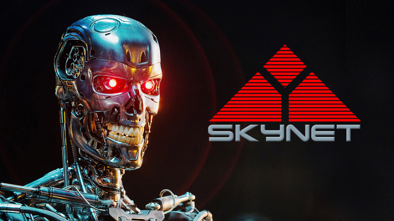

**Some time ago, I was doing a pilot project for two well-known American fast-food brands.** It was about using image processing and artificial intelligence for business analysis. The simplest case was to analyse images from two cameras. The first one would be set up at the entrance to the restaurant, the second at the checkout. By detecting the face of the paying person at the checkout, you could compare it with the moment of entry and calculate the waiting time for the order. Of course, there are potentially unlimited cases when that could be useful. For instance, displaying personalised ads based on the order history from a loyalty card. Nevertheless, let's skip this area for now.

**For our algorithm, we used image processing SDK utilised at many USA airports.** The algorithm worked very well, but only for a specific group of people: white people. The algorithm made many mistakes for others with different skin colours and was often wrong in apparent situations. It was bad enough that we decided to not use it in the end. Still, US airports do not have issues with using it... It is not surprising that white people are less often "flashed" during the strip searches than others. There is a much greater chance of making a mistake with people of colour.

**On 7 November 2019, David Heinemeier Hansson (author of Ruby on Rails) [unleashed another storm on the Internet](https://twitter.com/dhh/status/1192540900393705474).** Apple introduced its credit card. DHH, along with his wife, applied to get it. Despite having joint tax returns and similar age, it turned out that DHH got twenty times the credit limit than his wife. Apple reply can be shortened to _"It's not our fault, it's algorith decision."_

**_Computer says no!_**

`youtube: https://www.youtube.com/watch?v=0n_Ty_72Qds`

**[A recent MIT report](https://www.technologyreview.com/2021/07/30/1030329/machine-learning-ai-failed-covid-hospital-diagnosis-pandemic/) shows once again how far the journey is ahead of Artificial Intelligence.** They researched the results of several hundred projects aimed to help in the fight against COVID. Guess how many projects had a positive impact on that battle? ZERO. There were many reasons for that:
- no cooperation between teams; each team was reinventing the wheel,
- using the same set of data for validation tests as was used to train the algorithm,
- lack of cooperation between scientists and programmers. The programmers didn't have enough skills to deeply analyse the results to improve the algorithm. Scientists did not have enough programming knowledge to improve the algorithm based on the results.

**The results were comical.** The algorithm increased the chances of having COVID when someone was lying down. People with COVID were usually bedridden and had their lungs RTG took while lying down. Researchers used photos of children's lungs as an example of people who did not have COVID. Instead of learning to detect disease, the algorithm learned to detect children.

**My master's thesis is a broad topic.** I used a simple genetic algorithm called ["Simulated Annealing"](https://en.wikipedia.org/wiki/Simulated_annealing). The name comes from hardening steel, which is heated and cooled repeatedly to increase the size of its crystals and reduce their defects. In computer science, it's used to approximate the global optimum of the given function. I did not harden steel, but I used it to find if the image I generated was similar to the model photo. My goal was to create a program that would based on the 3d model and photos of the room, detect where and what lights are placed, surface parameters, etc. You could then rearrange them and see what the room looks like during the day when the photo was taken in the evening.

I conducted the tests for the medium difficulty of the model. Once the algorithm works for it, I thought that covering simple cases will be straightforward, and it will be easier to expand for the more complex ones. After the struggles, I managed to make it work. I showed it to the thesis supervisor. He said, "That looks promising, but could you check and describe how it works for simple cases like a cylinder, a tetrahedron". You probably already know where I'm going. It didn't work out for those most uncomplicated cases. It turned out that I optimised the algorithm and its parameters that only worked for this particular model. For others, it was wrong. As a consequence, the thesis defence was delayed by a year.

Of course, situations like that are more than ordinary. For example, in the Uber self-driving car, [developers forgot to handle the situation when someone runs the red light](https://www.bbc.com/news/technology-54175359).

There are more categories for the AI failures, such as [self-written research papers that link each other in a bibliography](https://www.unite.ai/ai-generated-language-is-beginning-to-pollute-scientific-literature/). The consequence is littering scientific works, reducing trust in them and making it difficult to enter the topic.

A 2018 [Gartner report](https://www.gartner.com/en/newsroom/press-releases/2018-02-13-gartner-says-nearly-half-of-cios-are-planning-to-deploy-artificial-intelligence) predicted that through 2030, 85% of AI projects will provide false results caused by bias that has been built into the data or the algorithms.

Do I want to scare you and say that _AI is fake_? Not at all. Artificial intelligence can be excellent support for people in making decisions. It can speed up data processing and reduce tedious work (yes, [also programming](https://venturebeat.com/2021/07/18/openai-codex-shows-the-limits-of-large-language-models/)). The risk, however, comes when we blindly believe in the results.

We can trust the algorithm as much as we can trust the person training it.

We, programmers, are considered magicians by other people. Our families usually don't know what we are doing, except "doing something with computers". Artificial Intelligence is a topic difficult even for us. You can imagine how hard it is for others.

**What can be done about this?** Explain to people the basic principles of artificial intelligence. Explain that this is not the fourth person of the Godhead or the only one righteous like the characters played by Clint Eastwood. Humans are often wrong, and so is AI. Algorithms will only learn as much as we teach them. They will convey our biases and our worldview. They will be just as fair as we are.

Everything in the algorithms depends on the proper selection of:
- algorithm parameters,
- a set of input data,
- test data, where we say whether black is black and white is white.

Each of these elements is prone to error.

Therefore, when the computer says no, verify if it's doing it right.

Cheers!

Oskar