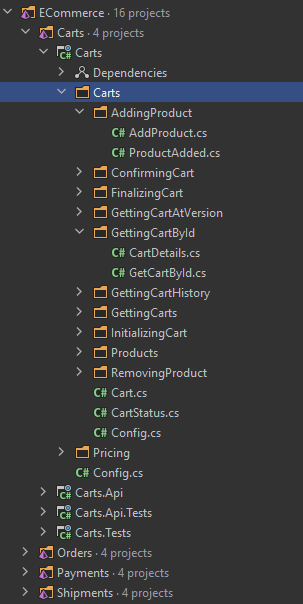

The structure of projects is as sensitive as the discussions of spaces versus tabs or indentation size. When we enter someone's apartment, even when it is decorated based on default sets from IKEA, it always looks a bit different. And it is absolutely justified. Different apartment sizes and room layouts make a difference.

It is similar to our software projects. Every has slightly different assumptions and features, but some common characteristics can be distinguished, right?

Like everyone else, I went from a strictly technical split, where I had a folder for services, contracts, mappers, data models, etc. At that time, I thought that then I had everything prim and proper. However, that assumption has changed.

[Some time ago, I changed my Event Sourcing in .NET samples](https://github.com/oskardudycz/EventSourcing.NetCore/releases/tag/5.0.0). Now they are sliced entirely by business functionality, not technical breakdown. Why did I do that?

My path leading to that decision was evolutionary. When I was creating the repository, I was at the stage when I was dividing the system into modules. Each module was a separate project. The first division in the project were aggregates, so business submodules. However, within the folder, the division was still technical. Different subfolders for commands, events, value objects etc.

It was an acceptable solution, but I still felt uneasy. The breakthrough came when...

...I worked longer with Angular. In the "new Angular", it's essential to break your codebase into components. In the same folder, we keep both the HTML view and the component TypeScript code. What's more, we also hold the unit tests together! At first, I found it strange, but then I realise that it helps in being effective.

Usually, when we work on a given functionality, we use the same template: 
- API endpoint, 
- request type, 
- some class to handle it, 
- data model. 

Classically, we spread it between different places. We have to jump between several folders, files, etc. Of course, IDEs shortcuts help us with this, but it does not change that we have to bounce continuously from one place to another. We switch the context invariably. I don't need to tell you how effective work is when we are disturbed by notifications on the phone or social media. Jumping between files can be compared to this. When we have everything nearby, and preferably in one file, we can be more efficient. We may not need even three monitors or one as wide as rugby player shoulders.

Keeping such a split works great with CQRS. It segregates our operations and slices the application code vertically instead of horizontally. Event Sourcing introduces an even more significant improvement because we do not need a unified data model (e.g. DBContext in EntityFramework). Each operation ends with an event that we can keep in the command folder.

It looks like this:

.

**Command folders contain:**

- file with command and handler, e.g. _Carts/AddingProduct/AddProduct.cs_

```csharp
namespace ECommerce.Carts.AddingProduct
{
    public class AddProduct: ICommand
    {
        public Guid CartId { get; }

        public ProductItem ProductItem { get; }

        private AddProduct(Guid cartId, ProductItem productItem)
        {
            CartId = cartId;
            ProductItem = productItem;
        }
        public static AddProduct Create(Guid cartId, ProductItem productItem)
        {
            Guard.Against.Default(cartId, nameof(cartId));
            Guard.Against.Null(productItem, nameof(productItem));

            return new AddProduct(cartId, productItem);
        }
    }

    internal class HandleAddProduct:
        ICommandHandler<AddProduct>
    {
        private readonly IRepository<Cart> cartRepository;
        private readonly IProductPriceCalculator productPriceCalculator;

        public HandleAddProduct(
            IRepository<Cart> cartRepository,
            IProductPriceCalculator productPriceCalculator
        )
        {
            this.cartRepository = cartRepository;
            this.productPriceCalculator = productPriceCalculator;
        }

        public Task<Unit> Handle(AddProduct command, CancellationToken cancellationToken)
        {
            return cartRepository.GetAndUpdate(
                command.CartId,
                cart => cart.AddProduct(productPriceCalculator, command.ProductItem),
                cancellationToken);
        }
    }
}
```

- file with an event command is creation, e.g. _Carts/AddingProduct/ProductAdded.cs_

```csharp
namespace ECommerce.Carts.AddingProduct
{
    public class ProductAdded: IEvent
    {
        public Guid CartId { get; }

        public PricedProductItem ProductItem { get; }

        private ProductAdded(Guid cartId, PricedProductItem productItem)
        {
            CartId = cartId;
            ProductItem = productItem;
        }

        public static ProductAdded Create(Guid cartId, PricedProductItem productItem)
        {
            if (cartId == Guid.Empty)
                throw new ArgumentOutOfRangeException(nameof(cartId));

            return new ProductAdded(cartId, productItem);
        }
    }
}
```

**Query folders contain:**

- query with handler, e.g. _Carts/GettingCartById/GetCartById.cs_

```csharp
namespace ECommerce.Carts.GettingCartById
{
    public class GetCartById : IQuery<CartDetails>
    {
        public Guid CartId { get; }

        private GetCartById(Guid cartId)
        {
            CartId = cartId;
        }

        public static GetCartById Create(Guid? cartId)
        {
            if (cartId == null || cartId == Guid.Empty)
                throw new ArgumentOutOfRangeException(nameof(cartId));

            return new GetCartById(cartId.Value);
        }
    }

    internal class HandleGetCartById :
        IQueryHandler<GetCartById, CartDetails>
    {
        private readonly IDocumentSession querySession;

        public HandleGetCartById(IDocumentSession querySession)
        {
            this.querySession = querySession;
        }

        public async Task<CartDetails> Handle(GetCartById request, CancellationToken cancellationToken)
        {
            var cart = await querySession.LoadAsync<CartDetails>(request.CartId, cancellationToken);

            return cart ?? throw AggregateNotFoundException.For<Cart>(request.CartId);
        }
    }
}
```

- read model with projection, e.g. _Carts/GettingCartById/CartDetails.cs_

```csharp
namespace ECommerce.Carts.GettingCartById
{
    public class CartDetails
    {
        public Guid Id { get; set; }
        public Guid ClientId { get; set; }

        public CartStatus Status { get; set; }

        public IList<PricedProductItem> ProductItems { get; set; } = default!;

        public decimal TotalPrice => ProductItems.Sum(pi => pi.TotalPrice);

        public int Version { get; set; }

        public void Apply(CartInitialized @event)
        {
            Version++;

            Id = @event.CartId;
            ClientId = @event.ClientId;
            ProductItems = new List<PricedProductItem>();
            Status = @event.CartStatus;
        }

        public void Apply(ProductAdded @event)
        {
            Version++;

            var newProductItem = @event.ProductItem;

            var existingProductItem = FindProductItemMatchingWith(newProductItem);

            if (existingProductItem is null)
            {
                ProductItems.Add(newProductItem);
                return;
            }

            ProductItems.Replace(
                existingProductItem,
                existingProductItem.MergeWith(newProductItem)
            );
        }

        public void Apply(ProductRemoved @event)
        {
            Version++;

            var productItemToBeRemoved = @event.ProductItem;

            var existingProductItem = FindProductItemMatchingWith(@event.ProductItem);

            if(existingProductItem == null)
                return;

            if (existingProductItem.HasTheSameQuantity(productItemToBeRemoved))
            {
                ProductItems.Remove(existingProductItem);
                return;
            }

            ProductItems.Replace(
                existingProductItem,
                existingProductItem.Substract(productItemToBeRemoved)
            );
        }

        public void Apply(CartConfirmed @event)
        {
            Version++;

            Status = CartStatus.Confirmed;
        }

        private PricedProductItem? FindProductItemMatchingWith(PricedProductItem productItem)
        {
            return ProductItems
                .SingleOrDefault(pi => pi.MatchesProductAndPrice(productItem));
        }
    }

    public class CartDetailsProjection : AggregateProjection<CartDetails>
    {
        public CartDetailsProjection()
        {
            ProjectEvent<CartInitialized>((item, @event) => item.Apply(@event));

            ProjectEvent<ProductAdded>((item, @event) => item.Apply(@event));

            ProjectEvent<ProductRemoved>((item, @event) => item.Apply(@event));

            ProjectEvent<CartConfirmed>((item, @event) => item.Apply(@event));
        }
    }
}
```

Of course, a project that does not have CQRS or Event Sourcing can also benefit from this. Rule of thumb: keep things together that change together. Besides reducing the context switching, such a split also improves understanding of what is happening in business, managing dependencies and ultimately even scaling out. It's easier to extract features into dedicated microservices. 

What do you think? How does it look in your project?

Cheers!

Oskar

p.s. If you liked the article, read more in:
- ["How (not) to cut microservices"](/pl/how_to_cut_microservices/)
- ["CQRS facts and myths explained"](/pl/cqrs_facts_and_myths_explained/)
- ["Generic does not mean Simple"](/pl/generic_does_not_mean_simple/)