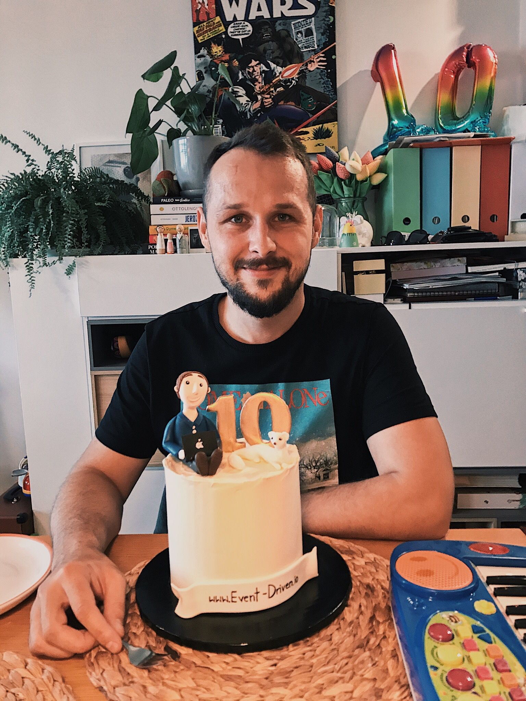

Yesterday, precisely ten years passed since I released my first blog post. It's still available in the original place (in Polish) at [BlogSpot](https://oskar-at-net.blogspot.com/2011/09/witam-jest-to-moj-pierwszy-wpis-na.html). If you know Polish and think about blogging, but you're afraid to start, check it. It should convince you that you'll be better than me.

I'm not great at dates. I would forget about it if my wife didn't remind me of this fabulous cake.

It's great to have such an anniversary, but it's even better to have a good wife.

Even though it's been ten years, I still don't feel like an expert in blogging, but let me share ten notes/suggestions for my ten years of blogging:

1.  **Write for yourself but consider the audience.** Do not try to search for topics you're not familiar with. I initially started my blog to play with new stuff and write my findings of the daily work. I'm sometimes saying that I'm writing not to forget what I learned. It's nice to go to your blog and find an answer from younger you. People will see when you try to explain something that you don't know. It's okay not to be an expert and explain your struggles, but that's much different from showing it as a best practice. Still, it's worth considering an audience and finding a middle ground. Nothing's more motivating than getting feedback. People are not great at giving feedback, so if you go crazy writing about a niche inside the niche, then the chance for the input is even lower.
2. **Done is better than perfect.** The hard truth about your first articles is that no one will read them. Maybe a wife, uncle or proud grandma. That might be not motivating, but it's also a chance to make mistakes. What you write is not put in stone. You can update the post later. Of course, you should not be shitposting and take care of the quality, especially stuff like grammar. Typos and obvious mistakes that can be fixed by spell-check tool are incredibly annoying. Other than that, publish when it's good enough. You can expand it later, rewrite or, in the worst case, throw it away. To begin, you have to begin.
3. **Build a habit.** Define a schedule, e.g. once per week or per month. It's safer to start rarely and then write more often when you find the rhythm. You won't risk putting too much pressure on yourself. If you're stressed and forcing yourself, then the outcome will also be hard for the readers. Still, building a cadence helps to motivate yourself. You can also consider putting a time limit for writing the blog post, e.g. two hours every other Monday. At least, that helps me to manage my perfectionism. I know that whatever will happen, I'm sitting in the evening and have to send it before I go to bed. It's also essential for the readers (once you get them) because they know when to expect a new post.
4. **Run a newsletter.** That helps in building the community around you. Also, if you're too shy or for some reason you don't want to share your thoughts, then writing an e-mail in the blogging form might be a good alternative for you. I managed to build a cadence when I started running my [Polish newsletter](https://www.szkola-event-sourcing.pl/). The E-mail also gives closer relation with readers, and for some can be easier to send you the feedback. It's been over two years since I sent a blog-a-like e-mail with my thoughts. Some of them get later published as my regular blog. There are mailing platforms like [Mailerlite](https://www.mailerlite.com/signup), [MailChimp](https://login.mailchimp.com/signup/?plan=free_monthly_plan_v0) or [ConverKit](https://app.convertkit.com/users/signup?plan=free-limited) that offer free plans.
5. **Store somewhere bits of advice that you're giving.** For sure, you're having a lot of internal project discussions, answering questions for your colleagues. It is an excellent source for blog topics. If someone asked you for help and you helped them, others may also benefit from that. I'm not great at making notes, but once I started to put them into the same place (private git repo with markdown) and group them by topics, it helped me build the foundations for the articles.
6. **Do not expect much.** I don't see clear signs of impact on my life made by blogging. I neither got a sponsoring job offer nor earned a penny from it. However, the implicit impact is indisputable. Learning in public helps a lot (also read my [advice about doing Open Source](https://event-driven.io/pl/how_to_start_with_open_source/)). I learned better to express my thoughts, to put the correct arguments. It helps in work and life in general. I also synthesised what I learned and had some "a-ha moments" during writing. I was finding surprising insights I didn't consider before investigating the topic. Of course, I know a few people besides my family who read my blog, but I'm far from being an Instagram celebrity. And that's cool.
7. **Use the right tooling.** I switched the tooling a few times. I started with BlogSpot, then switched to WordPress, now [I'm running it on GatsbyJS](https://github.com/oskardudycz/event-driven.io/). Tooling evolved, but I started with the simplest possible option and switched when it was blocking me for some reason. Do not build your own blog engine or try to use all sophisticated tooling. Focus on blogging and selecting tooling that will enable efficiency instead of distraction during your writing. If you want to blog in English, use [Grammarly](grammarly.com). If you're writing in your native language, find a similar tool that will help to polish your writing (e.g. [LanguageTool](https://languagetool.org/pl)). Speaking about Polish, I recommend [Ortograf.pl](https://www.ortograf.pl/) and [Jasnopis.pl](https://www.jasnopis.pl/).
8. **Read twice before posting.** Please do, at least twice. You'll be surprised how many apparent mistakes you made. Don't be lazy leaving that to your readers.
9. **Keep your language simple.** Write short sentences. [Hemingway did that and was fine](https://hemingwayapp.com/). You'll also be okay with that. I'm Oskar, but not Wilde, and you're also not. Don't try to be sophisticated just for the sake of being such. Shorter sentences are easier to read and better to keep the pace. If you want to get more theory, I recommend you two books:
- ["On Writing Well: The Classic Guide to Writing Nonfiction On Writing Well: The Classic Guide to Writing Nonfiction"](https://www.goodreads.com/book/show/53343.On_Writing_Well),
- ["Dreyer's English: An Utterly Correct Guide to Clarity and Style"](https://www.goodreads.com/book/show/40063024-dreyer-s-english).
10. **Be visible and advocate for your work**. It's not like the good work will be visible by itself. You have to promote it. For the majority (including me), promoting may sound like something terrible. However, if we believe that what we wrote is good, we should help people find it. Write it on Twitter, Facebook, Linked In, or other platforms you prefer. Of course, do not do [Rickrolling](https://www.youtube.com/watch?v=dQw4w9WgXcQ), do not spam communities, or immediately attack people with your link. Explain first, then you can link your article as an extension. Before posting a link on a user group, make sure that its moderators are okay with that. Also, be a community member, don't treat it as an advertisement platform. If you help others and, from time to time, post a link, then people will appreciate it. For the inversed proportions? Yes, they won't.

I hope that this helps you a bit. Take those as thoughts that worked for me. Your experience might be different. 

The final piece of advice is: just have fun!

Cheers!

Oskar