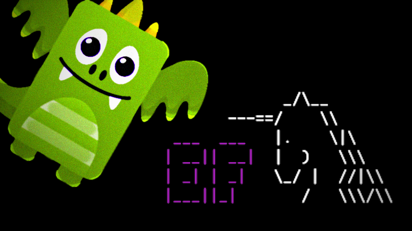

Let's assume that you're building an Event-Driven system. You may be using Event Sourcing or microservices integrated with message bus or monolith with modules triggering each other by events.

In such systems, meaningful business operations end up with related events. Those events might be stored (in Event Sourcing) or just published. They can trigger other business workflows or be used to build read models. We're going to focus today on the latter.

Read models typically are used for user queries. You get the most out of them if you design them to handle a specific query. In most of the systems, reads are much more frequent than writes. Thus, it's usually worth selecting slower writes and faster queries when you have to do the tradeoff.  You can also use them to build the local interpretation of the external state from other modules. The patterns that I describe below apply to both approaches.

Let's say that we're using an in-memory event bus defined by such interface:

```csharp
public interface IEventBus
{
    Task Publish<TEvent>(TEvent @event, CancellationToken ct);

    Task Publish(object @event, CancellationToken ct);
}
```

See sample implementations:
- [MediatR](https://github.com/oskardudycz/EventSourcing.NetCore/blob/main/Core/Events/EventBus.cs),
- [Vanilla .NET](https://github.com/EventStore/samples/blob/main/CQRS_Flow/.NET/Core/Core/Events/EventBus.cs).

Each event published to it will be handled by the event handler defined by:

```csharp
public interface IEventHandler<in TEvent>
{
    Task Handle(TEvent @event, CancellationToken ct);
}
```

Event bus can:
- be called explicitly in code,
- get event forwarded from the [EventStoreDB subscription](https://github.com/oskardudycz/EventSourcing.NetCore/blob/main/Core.EventStoreDB/Subscriptions/SubscribeToAllBackgroundWorker.cs#L124),
- get event forwarded from the [Kafka topic consumer](https://github.com/oskardudycz/EventSourcing.NetCore/blob/main/Core.Streaming.Kafka/Consumers/KafkaConsumer.cs#L86).

The critical part of the event bus call from hosted service is to ensure that event bus event handlers are resolved in the new scope. That makes sure that services that require scoping are correctly resolved and disposed.

Projection is an interpretation of the sequence of the events. Using [left fold approach](https://medium.com/@zaid.naom/exploring-folds-a-powerful-pattern-of-functional-programming-3036974205c8), we can apply events one by one to the state (read more in ["How to get the current entity state from events?"](/pl/how_to_get_the_current_entity_state_in_event_sourcing)). 

For the following set of events representing the ECommerce shopping cart lifecycle:

```csharp
public record ShoppingCartInitialized(
    Guid ShoppingCartId,
    Guid ClientId,
    ShoppingCartStatus ShoppingCartStatus
);

public record ProductItemAddedToShoppingCart(
    Guid ShoppingCartId,
    PricedProductItem ProductItem
);

public record ProductItemRemovedFromShoppingCart(
    Guid ShoppingCartId,
    PricedProductItem ProductItem
);

public record ShoppingCartConfirmed(
    Guid ShoppingCartId,
    DateTime ConfirmedAt
);
```

We could define a projection for the list view as:

```csharp
public record ShoppingCartShortInfo
{
    public Guid Id { get; set; }
    public Guid ClientId { get; set; }
    public int TotalItemsCount { get; set; }
    public decimal TotalPrice { get; set; }
    public ShoppingCartStatus Status { get; set; }
    public int Version { get; set; }
}

public class ShoppingCartShortInfoProjection
{
    public static ShoppingCartShortInfo Handle(ShoppingCartInitialized @event)
    {
        var (shoppingCartId, clientId, shoppingCartStatus) = @event;

        return new ShoppingCartShortInfo
        {
            Id = shoppingCartId,
            ClientId = clientId,
            TotalItemsCount = 0,
            Status = shoppingCartStatus,
            Version = 0
        };
    }

    public static void Handle(ShoppingCartConfirmed @event, ShoppingCartShortInfo view)
    {
        view.Status = ShoppingCartStatus.Confirmed;
        view.Version++;
    }

    public static void Handle(ProductItemAddedToShoppingCart @event, ShoppingCartShortInfo view)
    {
        view.TotalItemsCount += @event.ProductItem.Quantity;
        view.TotalPrice += @event.ProductItem.TotalPrice;
        view.Version++;
    }

    public static void Handle(ProductItemRemovedFromShoppingCart @event, ShoppingCartShortInfo view)
    {
        view.TotalItemsCount -= @event.ProductItem.Quantity;
        view.TotalPrice -= @event.ProductItem.TotalPrice;
        view.Version++;
    }
}
```

As you see, projection can be defined by a set of functions. They may either take:
- an event as a parameter and return a new read model instance,
- an event and read model instance and apply the new state to it.

Defining it as functions without reference to any infrastructure code makes testing by unit or integration tests easy. They're also cleaner, readable and, thanks to that, easier to maintain.

The more advanced, Shopping Cart details projection can be represented as:

```csharp
public static class ShoppingCartDetailsProjection
{
    public static ShoppingCartDetails Handle(ShoppingCartInitialized @event)
    {
        var (shoppingCartId, clientId, shoppingCartStatus) = @event;

        return new ShoppingCartDetails
        {
            Id = shoppingCartId,
            ClientId = clientId,
            Status = shoppingCartStatus,
            Version = 0
        };
    }

    public static void Handle(ShoppingCartConfirmed @event, ShoppingCartDetails view)
    {
        view.Status = ShoppingCartStatus.Confirmed;
        view.Version++;
    }

    public static void Handle(ProductItemAddedToShoppingCart @event, ShoppingCartDetails view)
    {
        var productItem = @event.ProductItem;
        var existingProductItem = view.ProductItems
            .FirstOrDefault(x => x.ProductId == @event.ProductItem.ProductId);

        if (existingProductItem == null)
        {
            view.ProductItems.Add(new ShoppingCartDetailsProductItem
            {
                ProductId = productItem.ProductId,
                Quantity = productItem.Quantity,
                UnitPrice = productItem.UnitPrice
            });
        }
        else
        {
            existingProductItem.Quantity += productItem.Quantity;
        }

        view.Version++;
    }

    public static void Handle(ProductItemRemovedFromShoppingCart @event, ShoppingCartDetails view)
    {
        var productItem = @event.ProductItem;
        var existingProductItem = view.ProductItems
            .Single(x => x.ProductId == @event.ProductItem.ProductId);

        if (existingProductItem.Quantity == productItem.Quantity)
        {
            view.ProductItems.Remove(existingProductItem);
        }
        else
        {
            existingProductItem.Quantity -= productItem.Quantity;
        }

        view.Version++;
    }
}
```

Above projection contains nested objects and more sophisticated logic on updating the state. However, it's still clean and self-explanatory. In general, projections shouldn't contain a lot of business logic. Its place is in the write model.

OK, but how to use them to update the data? Let's use Entity Framework as an example of how to deal with that. In general, the relational model is not ideal for the read models. By its nature, normalisation brings additional overhead with table joins, etc. Nevertheless, relational databases are the most popular storage, and ORMs are the most popular way to use them in an object-oriented world. We should also use the way that helps us to integrate with our other technology stack or our team skills.

For the majority of cases, we can use two main patterns:
- create, that can be described by code as:
```csharp
var view = handler(@event);

await dbContext.AddAsync(view, ct);
await dbContext.SaveChangesAsync(ct);
```
- update:
```csharp
var viewId = getViewId(@event);
var view = await dbContext.FindAsync<TView>(new [] {viewId}, ct);

prepare?.Invoke(dbContext.Entry(view), ct);

handler(@event, view);

await dbContext.SaveChangesAsync(ct);
```

Where for handlers are projection functions defined above. 

The DbContext is defined as:

```csharp
public class ECommerceDbContext: DbContext
{
    public ECommerceDbContext(DbContextOptions<ECommerceDbContext> options)
        : base(options)
    {

    }

    protected override void OnModelCreating(ModelBuilder modelBuilder)
    {
        modelBuilder
            .Entity<ShoppingCartShortInfo>();

        modelBuilder
            .Entity<ShoppingCartDetails>()
            .OwnsMany(e => e.ProductItems, a =>
            {
                a.WithOwner().HasForeignKey("ShoppingCardId");
                // we cannot use the ProductId here
                // we need the autogenerated id
                // to support the automatic add/update/remove
                a.Property<int>("Id").ValueGeneratedOnAdd();
                a.HasKey("Id");
            });
    }
}
```

How to connect all the dots (event bus, event handlers, projections, Entity Framework)? Let's start by defining what we'd like to achieve.

My motivations:
- easy to use and self-explanatory API for registering projections. A fluent pattern is usually helpful for that needs,
- extendible approach, with possible fallbacks,
- registering everything into regular DI containers to integrate with other application services.

Sample API could look as follows:

```csharp
public static class Configuration
{
    public static IServiceCollection AddShoppingCartsModule(this IServiceCollection services)
        => services
            .AddDbContext<ECommerceDbContext>()
            .For<ShoppingCartDetails, ECommerceDbContext>(
                builder => builder
                    .AddOn<ShoppingCartInitialized>(ShoppingCartDetailsProjection.Handle)
                    .UpdateOn<ProductItemAddedToShoppingCart>(
                        e => e.ShoppingCartId,
                        ShoppingCartDetailsProjection.Handle,
                        (entry, ct) => entry.Collection(x => x.ProductItems).LoadAsync(ct)
                    )
                    .UpdateOn<ProductItemRemovedFromShoppingCart>(
                        e => e.ShoppingCartId,
                        ShoppingCartDetailsProjection.Handle,
                        (entry, ct) => entry.Collection(x => x.ProductItems).LoadAsync(ct)
                    )
                    .UpdateOn<ShoppingCartConfirmed>(
                        e => e.ShoppingCartId,
                        ShoppingCartDetailsProjection.Handle
                    )
            )
            .For<ShoppingCartShortInfo, ECommerceDbContext>(
                builder => builder
                    .AddOn<ShoppingCartInitialized>(ShoppingCartShortInfoProjection.Handle)
                    .UpdateOn<ProductItemAddedToShoppingCart>(
                        e => e.ShoppingCartId,
                        ShoppingCartShortInfoProjection.Handle
                    )
                    .UpdateOn<ProductItemRemovedFromShoppingCart>(
                        e => e.ShoppingCartId,
                        ShoppingCartShortInfoProjection.Handle
                    )
                    .UpdateOn<ShoppingCartConfirmed>(
                        e => e.ShoppingCartId,
                        ShoppingCartShortInfoProjection.Handle
                    )
            );
}
```

It could be even more brilliant, but the key to the right design is to be careful not to overdo it. I think that it's self-explanatory, explicit. You can read it as decent documentation.

How to build such an API? Let's start with defining our generic event handlers classes. 

Add new item projection:
```csharp
public class AddProjection<TView, TEvent, TDbContext>: IEventHandler<TEvent>
    where TView: class
    where TDbContext: DbContext
{
    private readonly TDbContext dbContext;
    private readonly Func<TEvent, TView> create;

    public AddProjection(
        TDbContext dbContext,
        Func<TEvent, TView> create
    )
    {
        this.dbContext = dbContext;
        this.create = create;
    }

    public async Task Handle(TEvent @event, CancellationToken ct)
    {
        var view = create(@event);

        await dbContext.AddAsync(view, ct);
        await dbContext.SaveChangesAsync(ct);
    }
}
```

Update existing item projection:
```csharp
public class UpdateProjection<TView, TEvent, TDbContext>: IEventHandler<TEvent>
    where TView: class
    where TDbContext: DbContext
{
    private readonly TDbContext dbContext;
    private readonly Func<TEvent, object> getViewId;
    private readonly Action<TEvent, TView> update;
    private readonly Func<EntityEntry<TView>, CancellationToken, Task>? prepare;

    public UpdateProjection(
        TDbContext dbContext,
        Func<TEvent, object> getViewId,
        Action<TEvent, TView> update,
        Func<EntityEntry<TView>, CancellationToken, Task>? prepare = null)
    {
        this.dbContext = dbContext;
        this.getViewId = getViewId;
        this.update = update;
        this.prepare = prepare;
    }

    public async Task Handle(TEvent @event, CancellationToken ct)
    {
        var viewId = getViewId(@event);
        var view = await dbContext.FindAsync<TView>(new [] {viewId}, ct);

        prepare?.Invoke(dbContext.Entry(view), ct);

        update(@event, view);

        await dbContext.SaveChangesAsync(ct);
    }
}
```

Having them, we can define the main fluent API starting point to orchestrate our registration:

```csharp
public static class EntityFrameworkProjection
{
    public static IServiceCollection For<TView, TDbContext>(
        this IServiceCollection services,
        Action<EntityFrameworkProjectionBuilder<TView, TDbContext>> setup
    )
        where TView: class
        where TDbContext: DbContext
    {
        setup(new EntityFrameworkProjectionBuilder<TView, TDbContext>(services));
        return services;
    }
}
```

And the main builder that glues all together:

```csharp
public class EntityFrameworkProjectionBuilder<TView, TDbContext>
    where TView : class
    where TDbContext : DbContext
{
    public readonly IServiceCollection services;

    public EntityFrameworkProjectionBuilder(IServiceCollection services)
    {
        this.services = services;
    }

    public EntityFrameworkProjectionBuilder<TView, TDbContext> AddOn<TEvent>(Func<TEvent, TView> handler)
    {
        services.AddSingleton(handler);
        services.AddTransient<IEventHandler<TEvent>, AddProjection<TView, TEvent, TDbContext>>();

        return this;
    }

    public EntityFrameworkProjectionBuilder<TView, TDbContext> UpdateOn<TEvent>(
        Func<TEvent, object> getViewId,
        Action<TEvent, TView> handler,
        Func<EntityEntry<TView>, CancellationToken, Task>? prepare = null)
    {
        services.AddSingleton(getViewId);
        services.AddSingleton(handler);
        services.AddTransient<IEventHandler<TEvent>, UpdateProjection<TView, TEvent, TDbContext>>();

        if (prepare != null)
        {
            services.AddSingleton(prepare);
        }

        return this;
    }

    public EntityFrameworkProjectionBuilder<TView, TDbContext> QueryWith<TQuery>(
        Func<IQueryable<TView>, TQuery, CancellationToken, Task<TView>> handler
        )
    {
        services.AddEntityFrameworkQueryHandler<TDbContext, TQuery, TView>(handler);

        return this;
    }

    public EntityFrameworkProjectionBuilder<TView, TDbContext> QueryWith<TQuery>(
        Func<IQueryable<TView>, TQuery, CancellationToken, Task<IReadOnlyList<TView>>> handler
    )
    {
        services.AddEntityFrameworkQueryHandler<TDbContext, TQuery, TView>(handler);

        return this;
    }
}
```

It may look a bit scary, but if you have a look, then it's pretty straightforward. It's just a bunch of the registration to dependency injection containers. We're registering projection functions that are then injected into projection classes and registered as event handlers.

We don't have to use marker interfaces, as we're pushing the check to the edges: the registration code. We still are safe and have the compiler check if we didn't put too many params or inverted their order. If we need more sophisticated or customised logic, we can still fall back and define the custom event handler that will do the magic.

Before I finish, please have a look at the _ShoppingCartDetailsProjection_ definition. As you see, I'm not splitting projections per table. I'm breaking it per read model. For the shopping cart details, the read model is built from the cart data and added product items. It's an implementation detail that they're split into two separate tables. Thus we should still keep the centralised business logic. For more modelling bits of advice, read ["How to create projections of events for nested object structures?"](/pl/how_to_create_projections_of_events_for_nested_object_structures/).

As you see, with proper composability, we can create straightforward and maintainable code without head-scratching inheritance problems and generic or reflection magic. I hope this article will help you design better Event-Driven processing, as those patterns can be applied not only to Entity Framework but also to general projections handling.

Cheers!

Oskar

p.s. you can check the whole solution in the [Pull Request](https://github.com/oskardudycz/EventSourcing.NetCore/pull/71).