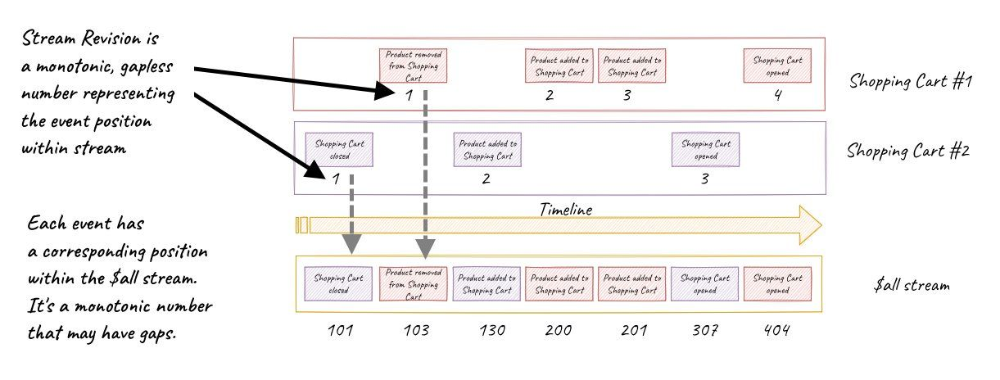

Discussions about positions can be awkward, to say the least... It is also the case with positions in Event Sourcing. Each event store implementation has its own nomenclature and specificity.

First, let's find out what is common. Each event store should have two main structures related to the events:
- _append-only log_ - a structure where all events are added. The name comes from the fact that events can only be added at the end. Thanks to this, we keep the chronology and sequence of events.
- _stream_ - it is a sequence of events. Those events are correlated by stream identifier, usually representing what facts registered for a specific entity.

Both entities can be considered as FIFO queues (First In, First Out). We always append an event to the end.

Both the append-only log and the individual streams have positions. They represent the specific relative place in the chronology. Using a position, we can walk the events in order of appearance and read history from them.

How are they implemented?

In Marten, the append-only log is one table. The primary key is the sequence field generated by a Postgres sequence with a monotonic number. There may be gaps when an event is not added for some reason (e.g. a conflict or transient error). The events stream is a virtual structure. It is simply a collection of events from the append-only log. It can be selected by the event identifier. The events within the stream have a number called version, which is also a monotonic number, but without gaps. This number can also be used to handle optimistic concurrency. Read more ["Optimistic concurrency for pessimistic times"](/en/optimistic_concurrency_for_pessimistic_times/) article.

In EventStoreDB, the design is similar.

The append-only log is called the _$all stream_. It is a specific stream representing all events stored in the database. It is a logical representation of the memory (disk) position where the event is located. The position is monotonic, and may have gaps. To be precise, it is actually composed of two such pointers: a _commit_ and a _prepare_. They are remainings from when it was possible to make transactions were supported in EventStoreDB (it is to be unified into one number in upcoming versions). For now, if you're not using transactions, you can treat the commit position as the single relevant one.

The stream version is an automatically incremented number. It is called stream position. Similarly, on its basis, EventStoreDB allows you to use it for optimistic concurrency. Then it is called stream revision.

Interestingly, in EventStoreDB, the physical structures are streams. The _$all stream_ is the secondary structure.

If you subscribe to _$all_, you will receive events from multiple streams respecting the global order in which they occur. You will need to save the position as the checkpoint of the last processed event. The position can also be used for deduplication and idempotency. You can check if an event was already processed.

It is similar also in Kafka. Although it is not a proper tool for Event Sourcing, it is similar in a way that also lies "append-only log" in its core. There, the logical structure is _topic_, split into a set of physical _partitions_. The position is named _commit offset_. This is the entry where the event has been saved on the partition.

Here's a picture of what it looks like in the Event Store!

As Phil Karlton said: _"There are only two hard things in Computer Science: cache invalidation and naming things."_ All of the names for the position seems to have their issues, but I hope that this article brought you closer to understanding what they're all about.

Cheers!

Oskar

p.s. if you liked this article, check also ["What if I told you that Relational Databases are in fact Event Stores?"](/en/relational_databases_are_event_stores/).