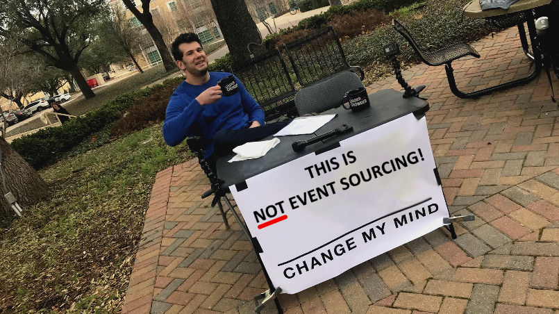

I usually don't try to fight the HackerNews or Reddit opinions. That said, I cannot deny that they're powerful platforms. The heated rants can create a significant impact on the community. Rants around Event Sourcing are appear from time to time. The leitmotiv is ["Don't Let the Internet Dupe You, Event Sourcing is Hard"](https://chriskiehl.com/article/event-sourcing-is-hard) article. 
 
As this article popped out again [here](https://news.ycombinator.com/item?id=29390483) and [there](https://www.reddit.com/r/programming/comments/r5p8qj/dont_let_the_internet_dupe_you_event_sourcing_is/), I decided to step up this time.
 
This article has some valid points, but those points are not about Event Sourcing. What's expressed in the article is not Event Sourcing. It describes Event Streaming or, in general, Event-Driven design issues. 
 
**The main misunderstanding, and source of the issues, is related to deciding on the stale data**. It brings uncertainty and the need for workarounds. It's a common mistake to use tools like Kafka and Pulsar for event stores, but they are not. You cannot read the stream events but subscribe. You don't have basic guarantees for optimistic concurrency checks. I wrote about how important this is in:
- [Optimistic concurrency for pessimistic times](/en/optimistic_concurrency_for_pessimistic_times/)
- [How to use ETag header for optimistic concurrency](/en/how_to_use_etag_header_for_optimistic_concurrency/)
 
TLDR: We assume that conflict situations will be rare. A conflict arises when two people try to change the same record at the same time. When this happens, we will only allow the first person to update the state. All other updates will be rejected. For verification, we use a record version that changes with each save.
 
Have a look at this ticket: https://issues.apache.org/jira/browse/KAFKA-2260. The minor priority states clearly, that's not the typical use case for Kafka.
 
All of the event stores that I know support strong consistency on appends, and optimistic concurrency. Most guarantee global ordering. Some have a built-in idempotency handling. All of that helps to reduce those issues. **In Event Sourcing, events are the state.** So the flow looks like this: 
1. You read the events from the stream (that represents all the facts that happened for the entity),
2. You apply it one by one in the order of appearance to build the current state,
3. You run the business logic and, as a result, create the event,
4. You append a new event.

You don't need to cache the write model state anywhere, as the state is in events. Event Sourcing has its issues and troubles, but the stuff described in the article applies to tools like Kafka, etc. They're not tools for Event Sourcing, but Event Streaming. They're designed to move things from one place to another, not to be used as durable databases. Of course, they have durable storage capabilities. However, they were not added initially to be used as databases. These features were added to make them fault-tolerant and resilient. Thanks to that, they can support scenarios where brokers went down, or consumers are not available. They also have an append-only log inside and are designed to be the central point of the event-driven design. However, none of that makes events a source of truth. At least not in the Event Sourcing meaning.

**The events are the source of truth, only if you're using them in the write model as a basis for the state rehydration.** If you're using a materialized view, even though it's built based on events, then you outsourced the truth to other storage. If you're using a pattern that means you're just using events to build up the materialized view you use for the write model logic, that can lead to using Event Streaming tools like Kafka, Pulsar, etc. And, as stated in the article, this is a dead-end. Read more in [How to get the current entity state from events?](/en/how_to_get_the_current_entity_state_in_event_sourcing/).

Of course, rebuilding a state from events each time you're processing command may sound dubious. Still, event stores (even those with relational DBs as backing storage) are optimized to read events quickly. Typically, reading 100 events is not an issue for them. It also shouldn't be a performance issue for a typical business application. The temptation to use Snapshots is strong, but it should be treated as an optimization when there are huge performance requirements. They may get out of sync with events, they may be stale, etc. I wrote about this in: [Snapshots in Event Sourcing](https://www.eventstore.com/blog/snapshots-in-event-sourcing). 

**The critical part is to keep streams short.** That's again a difference between Event Streaming and Event Sourcing. In Kafka, you may not care how long your topic is, as it's just a pipe. Event stores are databases, so the more events you have, the worse. It impacts not only performance, but also makes schema versioning harder (more on that in [How to (not) do the events versioning?](/en/how_to_do_event_versioning/)).

It's easy to fall into the trap, as using a streaming solution is tempting. They promise a lot, but eventually, you may end up having issues, as described in the article. Still, that can be said on any technology. 

Event Sourcing has some tricky parts. It's essential to highlight them, but it's dangerous to present problems from other patterns and tools as problems that have occurred due to Event Sourcing. I wrote it e.g.:
- [When not to use Event Sourcing?](/en/when_not_to_use_event_sourcing/)
- [Anti-patterns in event modelling - Property Sourcing](/en/property-sourcing/)
- [Anti-patterns in event modelling - State Obsession](/en/state-obsession/)

You can also watch my talk about The Light and The Dark Side of the Event-Driven Design:

`youtube: https://www.youtube.com/watch?v=0pYmuk0-N_4`

Event Sourcing by itself doesn't directly relate to eventual consistency, type of storage, messaging, etc. Those are implementation details and tradeoffs we're choosing. Each storage solution has its patterns and anti-patterns: relational databases have normalization, document databases are denormalized, key-value stores have strategies for key definition. Event stores also have their problems. The most important aspect is (as I mentioned) to take into account the temporal aspect of streams, which means keeping them short. I agree that there is a huge gap in knowledge sharing. I've been working on an article recently about this aspect. Here's a draft: https://gist.github.com/oskardudycz/f7864532af0db675f037b2962fe793e8.

The author of the original article confused Event Sourcing and talks about Event Streaming. **Event Streaming means:**
1. Producer pushes/produces/publishes an event to the queue. In this sense, an event stream is a pipe where you put an event at the end and receive it on the other side.
2. Then, you have a set of subscribers that can react to those events. The reaction may be triggering the next step of the workflow. It might also be updating the read model state. That happens with eventual consistency. You also cannot guarantee atomicity or optimistic concurrency, as tools such as Kafka don't support it. They have not been built for it, but they let you effectively publish and subscribe to the messages.
3. Therefore, if you want to have the write model materialized from an event (or even "populated"), then you don't have any guarantee if it's stale or not. You need to fight with out of order messages and idempotency. Thus you have all of those issues that are described in the article.

**Event Sourcing and Event Streaming are different patterns that happen to integrate with each other.** Event Sourcing is about durable state stored and read as events, and Event Streaming is about moving events from one place to another.

Event stores can integrate with streaming platforms, to publish events and move them forward. Most of them have even built-in implementation of the Outbox Pattern that allows publishing events. They're usually called subscriptions. They can be used to build read models or trigger other flows, or route events to streaming platforms.

The essential point is that for read models, you don't expect to have the same guarantees as for write models. It's fine to be facing idempotency, even out of order, as read models shouldn't be used (in general) for business logic validation. In Event Streaming, the write  models is stale. In Event Sourcing, the write model is not stale. You can be sure that you're making a decision on the current state. Thus, most of the points mentioned in the article, are just from struggles to use event streaming solutions as tools for storing events. This is not the issue of Event Sourcing or event stores per se, but using the wrong tool for the job.

**I'm sorry to say, but the author used the wrong tool for the wrong job.** If this article was titled _" Event Sourcing is hard if you're confusing it with Event Streaming"_, then it'd be an excellent article. But, in its current shape, it's just misleading and making the wrong point, repeating just common misunderstandings. It's highly misleading for people who are not aware of what Event Sourcing is and may suggest that it's much more complicated than it's in reality.

I also covered that in my talk: 

`youtube: https://www.youtube.com/watch?v=Lu-skMQ-vAw`

**I'll repeat it again: this is not Event Sourcing.**

Cheers!

Oskar

p.s.

If you liked this article, also check others where I'm trying to bust similar myths:
- [Don't let Event-Driven Architecture buzzwords fool you](/en/dont_let_event_driven_architecture_buzzwords_fool_you/)
- [CQRS facts and myths explained](/en/cqrs_facts_and_myths_explained/)

You can read more in:
- [EventStoreDB vs Kafka written by Kacper Gunia](https://domaincentric.net/blog/eventstoredb-vs-kafka)
- [A Beginner's Guide to Event Sourcing from Event Store team](https://www.eventstore.com/event-sourcing)

Check Derek's Comartin video explaining his concerns around this topic: [Don't Let the Internet Dupe You, that's NOT Event Sourcing](https://www.youtube.com/watch?v=Y7ca1--EKsg).

I've also made a list of articles with wrong perspective on Event Sourcing: https://github.com/oskardudycz/EventSourcing.NetCore#this-is-not-event-sourcing
