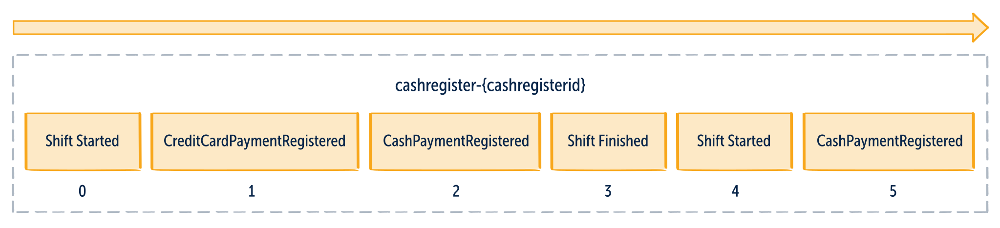
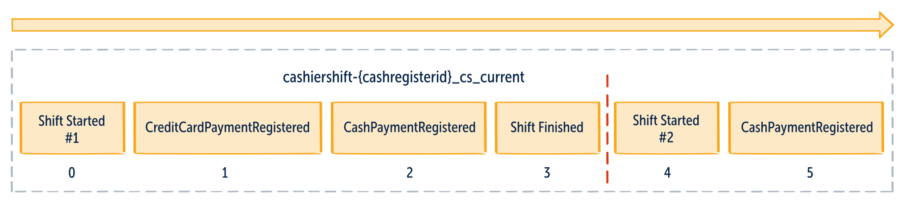
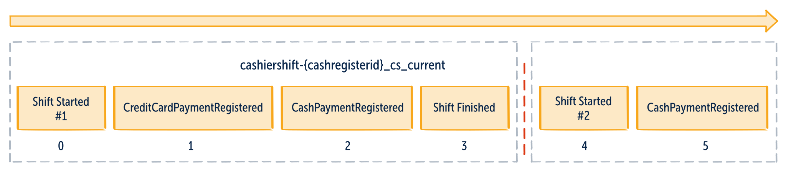
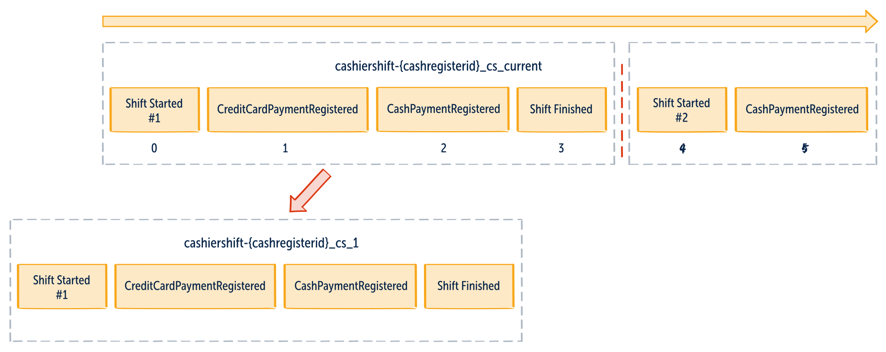
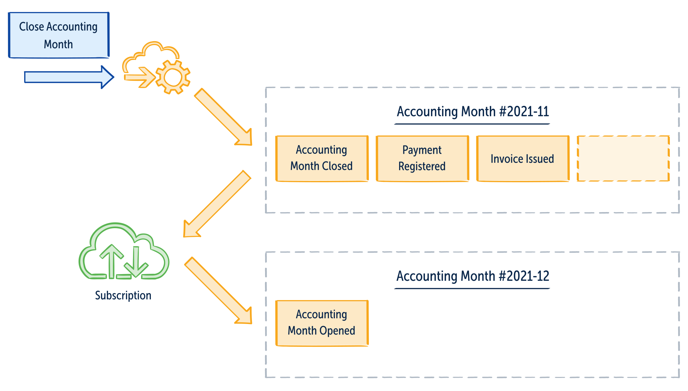
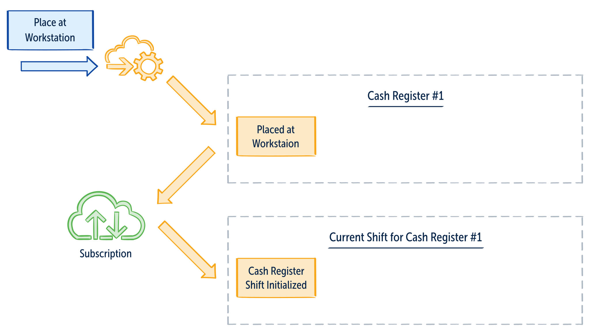
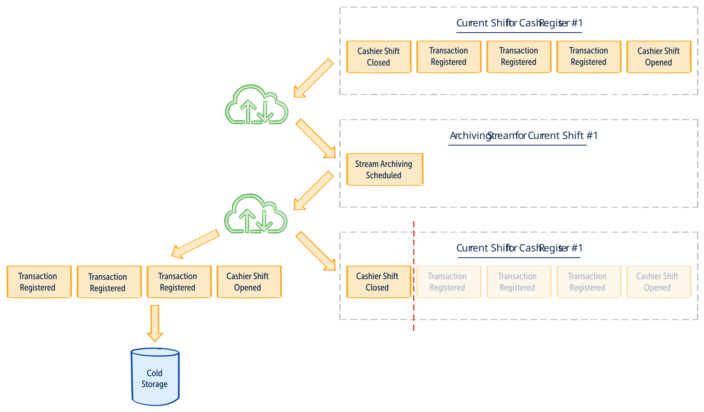
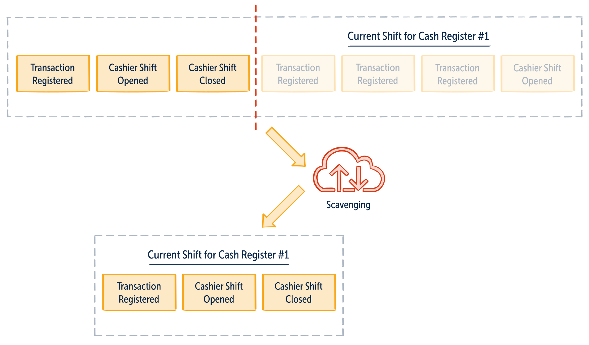
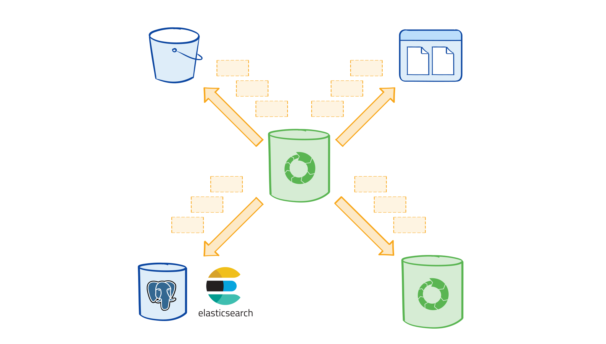

Modeling is hard. We need to take so many things into account. This article will explain the basics of temporal modeling, a foundation for keeping your stream short living. It helps you efficiently use EventStoreDB, reducing the need for schema versioning and enabling you to evolve your event model with alignment to the business workflow.

As I wrote in this [previous article](/en/snapshots-in-event-sourcing/), each data storage model has its specifics. Relational databases have normalization. Document databases are denormalized. Key-value stores have strategies for key definition. Event stores also have their specifics.

In Event Sourcing, in contrast to traditional approaches, no data is lost. Instead of changing/overwriting the current state, we store the result of each business operation as a new event. Events that happened for the specific business object or process (e.g. bank account, order, ticket reservation) are grouped into a sequence called stream. That has positive implications as we have a clear history of what has happened. It may also have other unforeseen consequences. The more operations occur on the particular object, the longer stream gets.

To get the current state of events, we need to read all of them from the specific stream. The longer it is, the longer it takes. Usually, it’s not an issue if we have ten or a hundred events, but it may become an issue if our stream continues to grow. It has not only performance implications; over time, our business process changes, which has an impact on our event model. We may need to reshape the structure (e.g. add, remove or rename properties). If our stream is long-living, we have to support the structure of the old event for as long as that stream’s events live in our store, and we have logic operating on that event in that stream. If we’re invited to the event stream birthday party, then “a long life” shouldn’t be our first wish.

It’s tempting to keep all the events in the same stream. It’s easier to deal with invariants, as you can use [optimistic concurrency](/en/optimistic_concurrency_for_pessimistic_times/) to ensure you’re always making decisions on the actual state. You could decide to [use snapshots](/en/snapshotting-strategies/) to reduce the need to read the whole stream. Those ideas sound good when you first think of them but are becoming more painful when you have to maintain the results. As the model grows, it’s getting harder to keep the consistency between the state in events and snapshots. You also have to constantly migrate or recreate them. This also takes time and becomes problematic when you want high availability. You’re also getting concurrency conflicts more often, as your model does too much, and the chance of having conflicting updates increases.

It doesn’t have to be like that if we spend more time on modeling. Let’s get back to the domain known from the previous posts: cash registers in the department store. If we approached it classically, we would likely create an aggregate for the cash register. It would contain all the transactions that were registered for the specific workstation. All of them will be stored as events in a stream per cash register. Stream identifier could be in the format of `cashregister-{cashRegisterId}`, and sample stream could look as:



This doesn’t look scary, but let’s do some math. Let’s say that we’re registering one transaction per three minutes. That gives:

-   20 transactions per hour,
-   200 transactions per 10-hour workday,
-   around 4200 transactions per month (excluding weekends). Event stores are designed to efficiently read events from a stream. Still, reading a few thousand or hundreds of events each time to build the current state is far from ideal.

If you take a closer look at the stream, you might notice life cycles in it.



The current cashier shift starts with the _ShiftOpened_ event and ends with the _ShiftClosed_ event. The pattern repeats itself, and the follow-up shift starts again with _ShiftOpened_. The next step we can take is to generate a unique identifier for each change. It turns out that the cashier register stream contains the sequence “sub-streams” for separate shifts.



We can also realize that we are only interested in the current shift, as we’re adding new transactions only to the active one. We also should not modify already closed shifts. Having applied those changes, we can observe that events from closed shifts are redundant. We don’t need them for current processing. If we were able to keep only the active one, then our stream would contain at most all the events from the single shift, making it much more manageable. The number of events is now bounded by the length of a shift. The stream will no longer grow indefinitely.



If you talk with domain experts for your domain, you’ll find that variations on this pattern are surprisingly common. For example:

-   medical clinic runs operations daily to manage patient visits.
-   the stock market is opened and closed every day.
-   accounting usually operates monthly and/or annual cycles.
-   bank accounts need to keep an active record of the current year. The rest can be accessed on-demand.
-   the hospitality industry runs an “end of business day” process every day. It checks if the guests’ stays are in a valid state, charges are accrued, etc.

We make our streams shorter by adding the temporal aspect to our stream modeling, thus working on them effectively. We can do that by:

-   keeping the current cashier shift instead of the whole cash register’s operations history.
-   accounting month instead of the whole company record.
-   tracking stock market transactions per day, per stock, etc.
-   maintaining a separate schedule of appointments for a single day of operation of a single clinic (versus keeping a single stream per clinic, per day, per year).

To effectively model the lifecycle process, we can use the “closing the books” pattern. [Its name comes from the accounting domain.](https://courses.lumenlearning.com/sac-finaccounting/chapter/journalizing-and-posting-closing-entries/) All financial numbers are summarised and verified, the final report is created at the end of each cycle (e.g. month, year). This data is used as a base for the next period. For accounting calculations, you don’t need to bring forward the entire history; it’s enough to summarise the crucial aspects to be carried forward, i.e. the opening balances, etc. The same pattern can be used for temporal modeling. I’ll explain it by example in the following paragraphs.

## Stream Definition

There are two main ways of temporal stream modeling:

-   keeping only the current/active stream, e.g. current shift for the cash register `CashierShift-{cashRegisterId}_current`.
-   keeping separate, dedicated streams, e.g. `CashierShift-{cashRegisterId}_{number}`.

As always, both approaches have pros and cons.

Separate streams have more ceremony, as you need to do orchestration to find out which stream is the active one and keep the consistency between them. For example, verify that you don’t have more than one current shift.

The single stream is easier to manage for the current operations, but it may be more challenging if you have a requirement to perform operations on closed periods. Typically you expect the old one to be frozen and immutable, but that’s not always the case. If the cashier made a wrong shift report, it might be needed to perform corrections, e.g. void some transactions.

You should decide on the strategy based on your business use case.

Nevertheless, the events’ definition and entity representing the stream state will be similar.

I’ll be using the TypeScript samples for illustration, but translating them into other languages should be straightforward. We’ll use the event type definition used in the [“Snapshotting Strategies” article](/en/snapshotting-strategies/).

```text
export type Event<
  EventType extends string = string,
  EventData extends object = object,
  EventMetadata extends object = object
> = {
  type: EventType;
  data: EventData;
  metadata?: EventMetadata;
};
```

Event is defined by its type name, data definition, plus optional metadata. For example, the `ShiftOpened` event can be defined as such:

```text
export type ShiftOpened = Event<
  'shift-opened',
  {
    shiftNumber: number;
    cashRegisterId: string;
    cashierId: string;
    declaredStartAmount: number;
    startedAt: Date;
  }
>;
```

Type for opened cashier shift can look like:

```text
type OpenCashierShift = {
  number: number;
  cashRegisterId: string;
  cashierId: string;
  float: number;

  startAmount: number;
  startedAt: Date;
  status: "Opened";

  revision: bigint;
};
```

Let’s discuss briefly how the cashier shifts work. It starts when the cashier puts a drawer and declares the starting amount of cash it contains. That’s the basis for further calculations. The current amount of money in a cash register is called the “float”. When cashiers close their shifts, they calculate the cash and declare the amount (called “tender”). Typically, it should be equal to automatically calculated float. However, as making errors is human nature, then sometimes those numbers are different. This might be sloppiness or fraud-related. Nevertheless, the shift is closed, the final report is printed. It contains information if there is overage or shortage of money that should be later on investigated and corrected.

All the events should contain information about:

-   cash register (where).
-   shift number (when).
-   cashier (who).

Closing shift event and closed shift state could be modeled as:

```text
export type ShiftClosed = Event<
  "shift-closed",
  {
    shiftNumber: number;
    cashRegisterId: string;
    declaredTender: number;
    overageAmount: number;
    shortageAmount: number;
    float: number;
    closedAt: Date;
  }
>;

export type ClosedCashierShift = {
  number: number;
  cashRegisterId: string;
  cashierId: string;
  float: number;

  startAmount: number;
  startedAt: Date;

  status: "Closed";
  declaredTender: number;
  overageAmount: number;
  shortageAmount: number;
  closedAt: Date;

  revision: bigint;
};
```

As you can see, it extends information from the opened shift state with additional pieces of information related to close operation. The final Cashier Shift can be defined as:

```text
export type CashierShift = OpenCashierShift | ClosedCashierShift;
```

_Note:_ TypeScript supports a [Union Types](https://www.typescriptlang.org/docs/handbook/2/everyday-types.html#union-types) concept. It enables us to specify a type that must be in exactly one of the defined set of states. Therefore, we can define that the cashier shift is either opened or closed. It helps keep the state more explicit (e.g. not setting the declared tender for open shift). For languages that do not directly support union types, you’d need to merge the declaration into a single type or use tricks like [OneOf](https://killalldefects.com/2019/09/22/oneof-discriminated-unions-in-c/).

Let’s also define an event used for registering transactions:

```text
export type TransactionRegistered = Event<
  "transaction-registered",
  {
    transactionId: string;
    cashRegisterId: string;
    shiftNumber: number;
    amount: number;
    registeredAt: Date;
  }
>;
```

To [get the current state from events](https://www.eventstore.com/blog/how-to-get-the-current-entity-state-from-events), we’ll use the following method:

```text
export type CashierShiftEvent =
  | ShiftOpened
  | TransactionRegistered
  | ShiftClosed;

export function when(
  currentState: Partial<CashierShift>,
  streamEvent: StreamEvent<CashierShiftEvent>
): Partial<CashierShift> {
  const { event, streamRevision } = streamEvent;
  switch (event.type) {
    case "shift-opened":
      return {
        number: event.data.shiftNumber,
        cashierId: event.data.cashierId,
        status: "Opened",
        float: event.data.declaredStartAmount,
        startAmount: event.data.declaredStartAmount,
        startedAt: event.data.startedAt,
        revision: streamRevision,
      };
    case "transaction-registered":
      return {
        ...currentState,
        float: currentState.float + event.data.amount,
        revision: streamRevision,
      };
    case "shift-closed":
      return {
        ...currentState,
        closedAt: event.data.closedAt,
        status: "Closed",
        float: event.data.declaredTender,
        overageAmount: event.data.overageAmount,
        shortageAmount: event.data.shortageAmount,
        revision: streamRevision,
      };
  }
}
```

You might have noticed that I introduced here a new type: `StreamEvent`. It’s a simple wrapper that represents the event read from EventStoreDB. It contains information about the stream name and revision.

```text
export type StreamEvent<EventType = Event> = Readonly<{
  event: EventType;
  streamRevision: bigint;
  streamName: string;
}>;
```

## Consistency

Enforcing invariants representing business rules consistently is a topic that deserves its own post. We’ll focus here on the general approach of how to solve considerations related to temporal modeling.

We can define the following rules:

-   there should not be more than one opened shift per cash register.
-   you can only close opened shifts.
-   you cannot open an already closed shift.
-   you can open/close a shift only for a valid cash register.

The easiest way to perform a uniqueness check, such as making sure that there is only a single open shift, is enforcing it by the proper stream identifier design. In EventStoreDB, you can specify while appending events that you expect the stream to not exist.

```text
await eventStore.appendToStream(streamName, [newEvent], {
  expectedRevision: NO_STREAM,
}),
```

EventStoreDB will return an error if a stream with such identifier already exists and won’t create a duplicate.

We can use stream revision also for the optimistic concurrency check. EventStoreDB keeps stream revision as the gapless number incremented on each new event. That’s also a reason why we introduced `StreamEvent` above: to be able to get current state revision. We can send this value together with the command and pass it while appending the result event. EventStoreDB will compare the expected revision with the current one and return an error if they are different. Thanks to that, we can be sure that we’re making decisions on the current state.

Let’s see how to benefit from that in our use case.

## Opening the Shift

If we keep the cashier shifts in separate streams, e.g. `CashierShift-{cashRegisterId}_{shiftNumber}` or `CashierShift-{cashRegisterId}_{shiftDay}` we can be sure that there is only a single shift with the specified number or day. We’ll end up with a sequence of streams like e.g.

-   `CashierShift-cr1_1`
-   `CashierShift-cr2_1`
-   `CashierShift-cr1_2`
-   `CashierShift-cr1_3`
-   `CashierShift-cr2_2`

This will make sure that we’re making a conscious decision about the new stream. We can validate if the shift we’re trying to close is still open with the optimistic concurrency check.

However, this stream design won’t enforce invariants for:

-   having only a single opened shift for the particular cash register.
-   making sure that we’re opening the shift for the existing cash register.

Let’s stop for a moment and discuss how the lifecycle periods can be initiated. As I mentioned above, cashier shifts are manually closed and opened by the cashier. That means that we expect commands to be sent from the UI and handled in the service.

That’s not always the case for all business scenarios. Some of them are continuous. If we’re closing the accounting month or the hotel business day, we may expect the next one to be automatically initiated to avoid gaps between them. For such a case, the command closing the period might be sent from the UI (or triggered by a cron job), but the following period will be opened automatically by the internal logic.

For that, we can use a [subscription](https://developers.eventstore.com/clients/grpc/subscriptions.html) mechanism:



EventStoreDB enables event-driven workflows by publishing notifications about new events. By subscribing to them, you can trigger the following workflow steps. In our particular case, opening the new accounting period. We can listen to the `AccountingMonthClosed` event, perform necessary calculations and start a new accounting month based on the previous one (e.g. using the final balance). The subscription mechanism will give us a guarantee that the event will be eventually handled. Of course, we need to keep in mind eventual consistency and ensure that we do not apply the event twice.

The exact mechanism can be used to enforce our cashier shift invariants. Instead of keeping the stream definition per shift number (`CashierShift-{cashRegisterId}_{shiftNumber}`), we could keep it as the current cashier shift (`CashierShift-{cashRegisterId}_current`). Such stream id design will ensure that we have only a single opened shift for the particular cash register. We can use a subscription mechanism to automatically initiate that stream when the cash register is placed at the workstation.



The event handler code could look like this:

```text
export async function handleCashRegisterPlacedAtWorkStation(
  event: PlacedAtWorkStation
): Promise<void> {
  const cashRegisterId = event.data.cashRegisterId;

  const cashierShiftInitialized: CashRegisterShiftInitialized = {
    type: 'cash-register-shift-initialized',
    data: {
      cashRegisterId,
      initializedAt: new Date(),
    },
  };

  const streamName = getCurrentCashierShiftStreamName(cashRegisterId);

  const eventStore = getEventStore();

  await appendToStream(eventStore, streamName, [cashierShiftInitialized], {
    expectedRevision: NO_STREAM,
  });
}

export type PlacedAtWorkStation = Event<
  'placed-at-workstation',
  {
    cashRegisterId: string;
    workstation: string;
    placedAt: Date;
  }
>;

export function getCurrentCashierShiftStreamName(cashRegisterId: string) {
  return `cashiershift-cr_${cashRegisterId}_cs_current`;
}
```

We’re getting the `PlacedAtWorkStation` event from subscription, taking the cash register id from it and setting up a current cashier shift stream by appending the first `CashRegisterShiftInitialized` event. We can use `NO_STREAM` expected version to indicate that we assume that there is no stream with such an id. Thanks to that, if the stream already exists, we’ll get the error, and the event won’t be appended.

Based on that, we could build the read model, storing the current stream revision. Therefore we could get it through API and send it together with the opening shift request.

Accordingly, to the current stream name, we can define the endpoint URI, as `/cash-registers/:cashRegisterId/shifts/current`. We could get the cash register id from the URI param and the rest of the command data from the body.

You can get the expected stream revision from the request ETag header. After successfully running business logic in the command handler, the result event should be appended. If it failed, then appropriate HTTP status should be returned. Read more on that in the [How to use ETag header for optimistic concurrency](/en/how_to_use_etag_header_for_optimistic_concurrency/).

```text
export const route = (router: Router) =>
  router.post(
    '/cash-registers/:cashRegisterId/shifts/current',
    async function (request: Request, response: Response, next: NextFunction) {
      try {
        const command = mapRequestToCommand(request);

        const streamName = getCurrentCashierShiftStreamName(
          command.data.cashRegisterId
        );

        const { nextExpectedRevision } = await getAndUpdate(
          handleOpenShift,
          streamName,
          command
        );

        response.set('ETag', toWeakETag(nextExpectedRevision));
        response.sendStatus(200);
      } catch (error) {
        next(error);
      }
    }
  );

function mapRequestToCommand(request: Request): OpenShift {
  if (
    !isNotEmptyString(request.params.cashRegisterId) ||
    !isNotEmptyString(request.body.cashierId)
  ) {
    throw 'INVALID_REQUEST';
  }

  const expectedRevision = getWeakETagFromIfMatch(request);

  return {
    type: 'open-shift',
    data: {
      cashRegisterId: request.params.cashRegisterId,
      cashierId: request.body.cashierId,
      declaredStartAmount: request.body.float,
    },
    metadata: {
      $expectedRevision: expectedRevision,
    },
  };
}

export function isNotEmptyString(value: any): boolean {
  return typeof value === 'string' && value.length > 0;
}

export function handleOpenShift(
  events: StreamEvent<CashierShiftEvent>[],
  command: OpenShift
): ShiftOpened {
  const cashierShift = aggregateStream<CashierShift, CashierShiftEvent>(
    events,
    when
  );

  if (cashierShift.status === 'Opened') throw 'SHIFT_ALREADY_OPENED';

  return {
    type: 'shift-opened',
    data: {
      shiftNumber: cashierShift.number + 1,
      cashRegisterId: cashierShift.cashRegisterId,
      cashierId: command.data.cashierId,
      declaredStartAmount: command.data.declaredStartAmount,
      startedAt: new Date(),
    },
  };
}
```

The `getAndUpdate` method is a simple wrapper that reads the current events from the stream, passes them together with the command to the handler, and append the result event. It uses revision from command metadata to support optimistic concurrency.

```text
export async function getAndUpdate<
  CommandType extends Command,
  StreamEventType extends Event
>(
  handle: (
    currentEvents: StreamEvent<StreamEventType>[],
    command: CommandType
  ) => StreamEventType,
  streamName: string,
  command: CommandType
): Promise<AppendResult> {
  const eventStore = getEventStore();

  const currentEvents = await readFromStream<StreamEventType>(
    eventStore,
    streamName
  );

  const newEvent = handle(currentEvents, command);

  const expectedRevision = command.metadata?.$expectedRevision
    ? BigInt(command.metadata?.$expectedRevision)
    : NO_STREAM;

  return appendToStream(eventStore, streamName, [newEvent], {
    expectedRevision,
  });
}
```

The same pattern can be applied to other methods like recording transactions, closing the cashier shift.

The other viable scenario is to relax the invariants and live with the check made on stale data. We may not listen to the `PlacedAtWorkstation` event and automatically create the current cashier shift. Instead of that, while opening cashier shift, we can:

-   append a new event doing an optimistic check if the stream exists.
-   start the stream if the stream does not exist, doing a check if the cashier register stream exists.

Of course, we can be hit by the race condition, when, e.g. workstation was broken and cannot be used. However, pragmatically we can decide that such a race condition where the workstation becomes damaged, and still someone tries to start, the shift won’t happen realistically. If that happens, then we can either live with that or define some compensating operation.

In both scenarios, the following operations like registering transactions and closing cashier shifts can use optimistic concurrency to ensure that decisions are based on the latest state. Therefore, we can guarantee that we won’t have more than one shift opened for the specific cash register. We can also enforce other invariants like gapless cashier numbers, etc.

But wait a moment… Didn’t we make a full circle and get back to the single, long-living stream design that we wanted to avoid? Well, almost. Let’s discuss that part in detail.

## Closing the shift

I wrote at the beginning that in Event Sourcing, no data is lost. It doesn’t mean that we need to always keep it active. A lot of business objects have a relatively short life cycle. For instance, a support ticket rarely lasts longer than one month. Usually, it lives a day or two, sometimes a few weeks. After it’s closed, its data is frozen, and we can use it for read-only access or statistical calculations.

The same happens for other cases, e.g. we don’t need all company lifetime data to run current accounting books. We have a legal obligation to keep this data in case of an audit, but we’re not changing them and don’t access it daily.

The process of moving our frozen data to other (_cold_) storage is called archiving. It’s used to move unused data from one place to another. Can Event Sourcing help with this? Quite possibly, for example:

-   a file system if we don’t need to access this data besides the on-demand audit.
-   another type of database that will help us access data in read-only mode (e.g. Elastic Search with its full-text search indexing capabilities).
-   a separate EventStoreDB cluster if we want to operationally be able to do, e.g. projections rebuild using the exact mechanism. We could then subscribe our read model both to _cold_ and regular storage.
-   a separate stream if we want to have direct access within the same cluster. Then we can still use them as regular events in projections and subscriptions, making the operations part easier.

Take our cashier shift example. When cashiers close their shifts, they calculate summaries used later as the base for the new shift. Also, the next one is started manually by the following cashier. When the shop is closed, then there are no open shifts. Sometimes cash registers also remain empty in the periods when there are fewer clients.

In this case, we have to put the summary in the `ShiftClosed` event. This will be a bit bigger event than a typical granular one. It may look similar to snapshot, but conceptually it’s a different thing. It’s not a technical event or copy of the latest entity state. It represents the result of the specific business operation that may not contain the complete information of the stream. It has just the summary data for the closed process that can be a basis for the next period. For example, you may not need all details of registered transactions but just split based on the payment type, final balance and amount of cash in the drawer.

Using the design with streams per cashier shift, we have to load the last summary event from the previous shift to start a new one. We’ll use the data in the opening shift logic and store the result as the `ShiftOpened` event in a different stream. Using the design with the single stream, the process will be the same, but we’ll append the `ShiftOpened` event to the same _“current shift”_ stream.

Once we open the new shift, we may not need the data from the previous shift anymore. We can start the archiving process.

## Archiving process

As I explained before, archiving differs from removal. We want to keep the old data, but… somewhere else. We can break down the archiving process into a few general steps:

-   trigger process.
-   copy events from the stream before a particular point in time (represented by stream position) to the cold storage.
-   delete this set of events from the stream.



The best option to trigger the process is subscribing to EventStoreDB and listening for the event. In the cashier shift process, we would listen for the `ShiftOpened` event. Knowing its position in the stream, we could decide to copy all the previous events.

In the subscription handler, we can read all events from the stream and copy them into the specific cold storage (e.g. store them in other databases, file storage, S3 bucket, etc).

```text
export async function archiveClosedShift(
  streamEvent: StreamEvent<ShiftOpened:>
): Promise<void> {
  const { streamRevision: archiveBeforeRevision, streamName } = streamEvent;

  const eventStore = getEventStore();

  const fromRevision = await getStreamRevisionOfTheFirstEvent(
    eventStore,
    streamName
  );

  const events = await readFromStream(eventStore, streamName, {
    fromRevision,
    maxCount: archiveBeforeRevision - fromRevision,
  });

  await copyEventsToColdStorage(events);

  await eventStore.setStreamMetadata(streamName, {
    truncateBefore: Number(archiveBeforeRevision),
  });
}

async function copyEventsToColdStorage(_events: StreamEvent[]): Promise<void> {
  console.log('copy them somewhere nice and let them rest in peace');
}

export async function getStreamRevisionOfTheFirstEvent(
  eventStore: EventStoreDBClient,
  streamName: string
): Promise<bigint> {
  const firstEvent = (
    await readFromStream(eventStore, streamName, {
      maxCount: 1,
      direction: FORWARDS,
      fromRevision: START,
    })
  )[0];

  return firstEvent.streamRevision;
}
```

This may be a good solution if our streams are short and our end storage allows efficient batching. If there are many events within the lifecycle, it may be necessary to do it as a separate process to increase reliability and fault tolerance. To have that, we’d need to use a scheduled job approach. Let’s see how we could tackle that with EventStoreDB.

We’ll start with the subscription as described above. We could use a subscription to $all or dedicated subscriptions filtered by event type (read more in [documentation](https://developers.eventstore.com/clients/grpc/subscriptions.html#filtering-by-event-type)). After receiving the business event triggering the archiving process (e.g. `ShiftOpened`), we won’t start copying immediately. We’ll append the event schedule to the process. This event can be made more generic, e.g. `StreamArchivingScheduled`. It will contain the stream name and stream revision before which we want to archive events. In TypeScript, it could look like that:

```text
export type StreamArchivingScheduled = Event<
  'stream-archiving-scheduled',
  {
    streamName: string;
    beforeRevision: string;
    scheduledAt: Date;
  }
>;
```

If we have a design with dedicated streams (so, e.g. streams per cashier shift), then we may not provide the position, as we’ll probably just want to archive the whole stream.

Having such an event, we can provide unified logic of archiving stream events. We can store all of those events in the same stream, but as we want to keep our streams short, then the best would be to store it in the stream with an `archivingFor-${streamName}` identifier. We’ll have the whole history of the stream archiving process. We could even split events into batches adding `fromRevision` information.

```text
export async function scheduleStreamBatchArchivisation(
  event: StreamArchivingScheduled
): Promise<void> {
  const { streamName, beforeRevision } = event.data;

  const eventStore = getEventStore();

  const fromRevision = await getStreamRevisionOfTheFirstEvent(
    eventStore,
    streamName
  );

  const scheduledBatches: StreamBatchArchivingScheduled[] = getNumberRanges(
    fromRevision,
    BigInt(beforeRevision)
  ).map(({ from, to }) => {
    return {
      type: 'stream-batch-archiving-scheduled',
      data: {
        streamName,
        fromRevision: from.toString(),
        beforeRevision: to.toString(),
        scheduledAt: new Date(),
      },
    };
  });

  const archivingStreamName = getArchivingStreamName(streamName);

  await appendToStream(eventStore, archivingStreamName, scheduledBatches);
}

export type StreamBatchArchivingScheduled = Event>
  'stream-batch-archiving-scheduled',
  {
    streamName: string;
    fromRevision: string;
    beforeRevision: string;
    scheduledAt: Date;
  }
>;

export function getArchivingStreamName(streamName: string) {
  return `archivingFor-${streamName}`;
}

export type Range = Readonly<{
  from: bigint;
  to: bigint;
}>;

export function getNumberRanges(
  from: bigint,
  to: bigint,
  chunkSize: number = 100
): Range[] {
  const difference = to - from;

  if (to < 0 || from < 0 || difference < 0) throw 'WRONG_RANGE';

  if (chunkSize < 0) throw 'WRONG_CHUNK_SIZE';

  const chunkSizeBI = BigInt(chunkSize);
  let currentFrom = from;

  const ranges: Range[] = [];

  do {
    const nextTo = currentFrom + chunkSizeBI;
    const currentTo = nextTo < to ? nextTo : to;

    ranges.push({
      from: currentFrom,
      to: currentTo,
    });

    currentFrom = currentTo;
  } while (currentFrom < to);

  return ranges;
}
```

How do we process the scheduled archiving? If we’re okay with starting it right after, we can again use a subscription filtered by the archiving stream name prefix (`archivingFor`). If we’d like to do it only at a specific time, e.g. during the night when you have less traffic, you can use a cron job. This job could read the archiving streams and check if there are new events since the last time job was run. In both cases, you need to keep track and maintain checkpoints for the last processed position. Currently, EventStoreDB doesn’t provide a built-in cron-based solution. It may come in the future.

After successfully copying events to cold storage, we have to delete them. EventStoreDB provides a few options to deal with that:

-   truncate before (`$tb`) stream metadata: this allows you to mark all the events before the specific stream revision as _“to-be-deleted”_,
-   soft delete: uses internally `$tb` and marks the whole stream as _“to-be-deleted”_. This operation is reversible. You can also reuse the stream name in the further business logic.
-   tombstoning (a.k.a “hard delete”): appends a tombstone event to the stream, permanently deleting it. You cannot recreate the stream or append an event to it again. Tombstone events are appended with the event type `$streamDeleted`.

```text
export async function archiveStreamBatch(
  streamEvent: StreamEvent<StreamBatchArchivingScheduled>
): Promise<void> {
  const {
    event,
    streamRevision: archiveStreamRevision,
    streamName: archivingStreamName,
  } = streamEvent;

  const streamName = event.data.streamName;
  const fromRevision = BigInt(event.data.fromRevision);
  const beforeRevision = BigInt(event.data.beforeRevision);

  const eventStore = getEventStore();

  const events = await readFromStream(eventStore, streamName, {
    fromRevision,
    maxCount: beforeRevision - fromRevision,
  });

  await copyEventsToColdStorage(events);

  // truncate original stream
  await eventStore.setStreamMetadata(streamName, {
    truncateBefore: Number(fromRevision),
  });

  // truncate archiving schedule stream
  await eventStore.setStreamMetadata(archivingStreamName, {
    truncateBefore: Number(archiveStreamRevision),
  });
}
```

EventStoreDB has a built-in process called [scavenging](https://developers.eventstore.com/server/v21.10/operations/scavenge.html). It allows cleaning up unused data, e.g. “to-be-deleted” events. Once a scavenge has run, you cannot recover any deleted events. The process is not run automatically. It has to be either manually triggered or with the cron-based job. The best is to call it in the less busy time (e.g. during the night) to not have the performance impact on the system operations.



Depending on the stream design, we may choose a different deletion strategy. If we’re using the single stream, we have to delete only old events, keeping the current period (e.g. current shift). For that, setting truncate before metadata is the best option. We could consider using either soft delete or tombstoning (depending on the need to reuse that stream name). We can mark events as _“to-be-deleted”_ in the same job, as they’re atomic operations. We can also split it into a separate workflow step similar to what we did for archiving. You could post an event `StreamTruncationScheduled` and handle that in a different subscription logic. That could be useful if we do something more than just deletion or trigger other processes.

The important note is that for those operations, it’s crucial to respect the order of operations. We can parallelize archiving of multiple streams, but if we don’t respect the order within the stream, we may get into trouble, e.g. trying to copy data that was already deleted. Having that, I recommend using regular catch-up subscriptions, not persistent ones, as they do not guarantee ordering.

We can also go even further. If most of our module’s processes share the same lifecycle (e.g. accounting month), we can do a full database copy and transform approach.

After we finished and closed the period, we could copy opening events and key data into the new cluster. Once that’s done, we can point the system to the new location. We could keep the old database for read-only access or just archive it. This approach allows the clean removal of old data. By that, we can get rid of the obsolete schemas and work in the new period only with new ones.

Archiving periods should be aligned with the business workflow lifecycle. This approach can be a base for disaster recovery or high availability processes. Read also more in the chapter [“Versioning Bankruptcy”](https://leanpub.com/esversioning/read#leanpub-auto-versioning-bankrupty) from Greg’s Young book “Versioning in an Event Sourced System”.

## Cold storage considerations

The idea to archive events may seem contrary to the _“no data loss!”_ phrase told while advocating Event Sourcing. However, as I mentioned, there is a significant difference between archiving and removal. It’s similar to putting our winter clothes deep into our closets during summer, taking out tools from the toolbox only when we need to fix it, or keeping our documents in folders instead of frivolously keeping them on our desk. It’s about the pragmatic ergonomy viewpoint. We could still keep the data in the event store, but to be efficient, we may want to optimize and move the data somewhere else, still using it on demand when needed.



Let’s discuss scenarios for cold storage access.

## Rare access for audit needs or read-only checks

For that, the cheapest and convenient option is to use file storage. You could export archived data via subscription and store it serialized in files. Those files could be put into reliable file storage (e.g. S3, Azure Blob Storage, Google Cloud Storage). When you need to read it, e.g. for audit needs, you could just read it and deserialize data.

## Reporting and read-only access to summaries

A typical scenario is that we need to only access summaries of what had happened for the old data. Once I tried to persuade the client to migrate to the new version of the system. That was a significant change, as it was a giant legacy software. We spent at least several days discussing internally how to perform data migration. Once we came up with the idea and presented it to the client, the answer was: _“we don’t need data migration. Just turn on the new system on Sunday night, leave all working in read-only mode, so we could query the data and that’s all”_. It was a helpdesk system, where at the end of the day, all cases were usually closed. During the migration, they could just reopen outstanding ones in the new system.

If we need it for read-only access or reporting, then during the archiving process, aggregation may be calculated and/or raw events stored in another database. We could use databases dedicated to querying and sophisticated queries like Elastic Search. This will work and should be enough if we don’t need to rebuild the read models based on the event data in the future. If we’re unsure, we can take the risk, and in the worst case, try to use aggregations during the rebuild process. Of course, it’s risky as we might not have all the needed information as the aggregation process flattens event data.

If we copy and store events in the cold storage, we can also bring them back if we need them again. We can read from the cold storage and append them to the existing cluster. After that, we could use them to rebuild read models. However, as they’re appended to the end of the log, the order will be different from the initial one.

As mentioned earlier, we can also treat the current event store as cold storage and copy new period events together with other data to survive. After that, we can use the new database as a working one and treat the old one as cold storage. It won’t be used for transactional usage and be read-only. Thus we could even limit its resources and reduce the maintenance cost. We can repeat that process every cycle and maintain only the most recent events schema.

## Read models rebuilds

We might not need events in the daily operations. Even if our write model doesn’t reread events, we may still need them for read model rebuilds.

In Event Sourcing, events are the source of truth. It’s a common practice to rebuild read models when logic change or we provide bugfix. We may even erase them and create them from scratch from events’ data. We may also do a blue-green update keeping the old one while the updated read model is being generated. After that’s done, we switch them and can remove the old one. To do that, we might need the complete history, not only the active data.

In the same way, we may want to republish events to other modules that are subscribing to our logic to trigger their workflows. This may be useful if we had a bug and some events were lost, not delivered, or listeners had malformed business logic.

We may try to overcome that by using Summary Events. When we’re closing the period, we may gather all information needed to read models/other modules and put it into the event. This may look similar to the snapshot, but conceptually it’s a different thing. Snapshots are a reflection of the current state. Summary Events reflect the business operation results but are extended to provide complete information about the process phase. They may not gather information about all intermediate steps or entire stream state, only needed ones. If we include all the summary data from the past shifts (e.g. total transactions count, etc.) in the `ShiftOpened` event, we could archive old events and rebuild read models from the existing ones.

Yet, usually, it’s not the best approach. Staffing events with additional data quite often end up blurring the essence of the business operations. Such events are also highly vulnerable to a schema change. It is better to keep events focused on merit. A potential solution for that is to target the archiving process to another EventStoreDB cluster.

Therefore, we can use the subscription mechanism to feed our read models. Of course, it comes with a cost. If we’re rebuilding the read model, we need to process events from the cluster with archived data, then from the regular one. If we try to process events in parallel, then we’ll lose the ordering guarantees. This may be fine if we have logic to be able to recover from that. Typically, though, we’d like to process the events in the order of appearance.

We also cannot use the EventStoreDB metadata directly. Archived events will get new positions and new timestamps. While archiving, we may need to store them in the metadata, e.g., `$originalPosition`, `$originalStreamPosition`, `$originalTimestamp`, etc. Personally, for these reasons, I prefer to not relate to the internally generated data. I keep all the business-related information, like timestamps, user ids, etc., in the event data. It makes migration and integration easier.

Last but not least, we may get duplicates or race conditions. For instance, we already archived some events but didn’t remove them yet from the regular cluster. We may get doubled events when we try to rebuild read models in the middle of the archiving process. Typically that’s not a severe issue, as we should be handling idempotency, but we may be surprised if we didn’t foresee that upfront.

## The need to modify old data

There are cases where probably the data won’t be accessed anymore once the period is closed, but we have a business flow that allows us to change them in the future, for example:

-   we may want to verify the cashier shift report and add corrections if, for example, cash was wrongly calculated.
-   generate the invoice correction if the initial one had wrong data.
-   retrofit data that we got with a delay. Also some, entities just have a longer lifetime.

EventStoreDB scales well really well with the number of streams. If they’re not actively accessed and are not long, then it’s okay to keep them. Of course, as long as we have enough storage on disk.

We can consider keeping the streams with a longer lifetime or delaying their archiving using a multi-stream approach. It’s worth noting that you don’t need to have a uniform archiving strategy for all. We can select different ones case by case.

If we’re using a single _“current”_ stream design. Then we can use the current cluster as cold storage. If the streams are short, then we can simplify our databases management. Having a single cluster is always easier than multiple ones.

For that, we can again use a subscription and copy the events on the fly. Our read models can subscribe to those _“follow-up”_ streams instead of the _“current”_ one. As those streams are regular streams, then we can still append new events there in the future. We’re using the current stream only for write model purposes. We can safely delete old events when the period is closed, and we “replicated” them to other streams.

Of course, this solution has downsides. There is a redundancy in the storage. Not huge, if our periods are short and we’re running scavenging, but it may be a decision-making factor. We’re also putting more traffic into the database by appending more events. Coordination of this replication may become tricky if we have a lot of archiving processes. As always, it’s a tradeoff game.

## Summary

So you got to the last point, congratulations! You’re a patient person. Let’s wrap it up and give you an actionable checklist of how to keep your streams short.

### Understand the business workflow

Talk with the business experts and ask enough whys to understand the lifecycle of your business use case. Listen for the keywords like open/close/end, summary, daily, monthly, etc. For business experts, lifecycle may be so apparent that they won’t mention it straight away, but if you dig and ask enough questions, they’re typically more than happy to reveal it. Workshops like [Event Storming](https://www.eventstorming.com/) or [Event Modeling](https://eventmodeling.org/) can help you with that.

Also check out my article [“Bring me problems, not solutions!”](/en/bring_me_problems_not_solutions/) for more guidance on how to make the proper relationship with the business.

### Define invariants

Once you know the assumptions and business flow, get all the invariants. Ask a lot of questions like:

-   _“What will happen if this invariant is not met?”_,
-   _“How are you dealing with it nowadays?”_,
-   _“Does best effort approach with corrective operation is good enough?”_,

All of those questions will help you measure the risk of failure and pragmatically the stream design (e.g. “stream per period” or “current stream”).

### Join the pieces together

Having the stream design check how the periods are opened and closed. Is it a manual operation (like for cashier shift) or automatic follow-up (like for accounting month). Based on that, you can define what APIs or workflows you need to define. Still, the event-driven approach is your friend, as it enables a composable approach using, e.g. subscriptions mechanism.

### Define the lifetime of your data

Discuss with the business and legal department how long you’re required to keep the data. Find out if you need to use all data daily. Define how often do you expect to rebuild the read models or republish events to external services. Measure the expected amount of events within the lifecycle period.

You can decide on the archivisation strategy and cold storage you want to put your data with all that information.

Remember that you don’t need to select one strategy to rule them all. You can tune it and choose based on the specific use case.

And finally, don’t assume that what you did is set in stone. The business world is changing, technologies are changing. Embrace that you’ll need to continuously work on the data model. Work with your business, state your thesis, verify them and learn from it. Then repeat.
