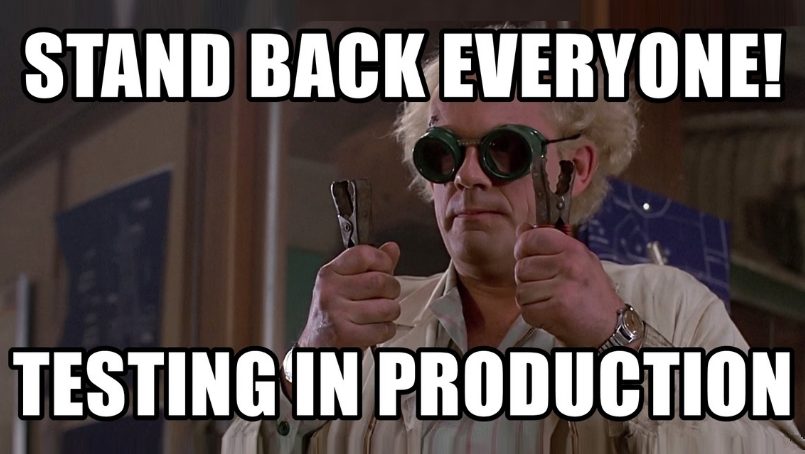

**Testing on production usually appears in ridiculous stories.** They may be only annoyances like getting questions from customers why they see the entry called _"Your momma wears Prada"_. The sad truth is that our users learned to live with mediocrity. The worst is if customers data get broken because of our clumsiness. [Even huge companies have a history of such accidents](https://about.gitlab.com/blog/2017/02/01/gitlab-dot-com-database-incident/). 

The more experience we have, the more we know that life is not black and white. We're starting to embrace different shades of grey. We see that being SOLID police is not always the best idea. Sometimes you have to be pragmatic double-cautious to limit the number of side effects in case of failure. That sometimes means going rogue on the _"best practices". When we see the idea to go by the books, we often start to say, _"that's cool and smart, BUT..."_.

**The whole movement related to CI, CD, and TDD aims to minimise the risk of failure.** I support these approaches, but looking from the side, I see that often (especially tests) are used quite dogmatically. Some people even think that they could entirely prevent bugs.

**Let's take the Code Coverage example. Does having 100% test code coverage mean that all scenarios are covered?** Nope, it means that we mechanically covered all ifs, thrown exceptions, etc. This metric verifies whether the tests check what our code is doing. They don't necessarily ensure if it's doing what it should. If the author didn't consider some scenario, they wouldn't catch that. Not every case ends up as tragically as [Uber's self-steering car killing pedestrians](https://www.nbcnews.com/tech/tech-news/self-driving-uber-car-hit-killed-woman-did-not-recognize-n1079281). I'm sure that Uber had tests, but if developers did not come up with the fact that someone could be jaywalking...

Often our situations are more trivial. We don't know how the interface implementation or external library method works, and we write code and tests for our idea of ​​it, not its actual behaviour. Or the classic example. Some people want to cut the time the tests run using in-memory mocks instead of running them against the real database. It may turn out that the unit tests were all green, but the feature does not work in running it through UI. 

**At Marten, we encourage running all Marten tests against the database. Running Docker isn't a massive effort these days.** The Postgres image is so lightweight that these tests should be quick enough. Preference to run unit tests over integration tests became obsolete. These assumptions were made when setting up the local test environment was a hassle. Plus, many services, like databases, added significant overhead—Times change. We are in the 21st century. Let's start revising old views. Read more in [A simple way to configure integration tests pipeline](/en/configure_ci_for_integration_tests/).

Clouds, distributed systems, Kubernetes and other toys add a degree of complexity. We can indeed run a Kubernetes cluster locally on our laptop. We can even run a cloud emulator, but this is still not the same environment as production. It's like buying shoes. I wear (in general) 43 in European size. Still, I better try that with the specific model, as size differs significantly between producers.

**Until we run it on the target environment, we won't know how our system behaves.** There is a lot of differences to consider:
- hosting (bare metal vs VM), 
- disk type,
- network topology,
- OS or runtime versions, 
- load balancers and reverse proxies, 
- API gateways, 
- etc. 

We'll also get a different type of load and traffic. Do we test spikes locally in traffic (e.g. for Black Friday)? We cannot fully predict our end-users behaviour until we see it.

**The classic recipe was "pre-prod".** We try to mimic the production environment, deploy there and run User Acceptance Tests. Sounds reasonable? Kinda, but it's not. Somehow it always turned out that this environment was slightly different from production. And those slight differences are usually the weakest points. Usually, at some point, we realise that it does not help us at all and just adds maintenance overhead.

**It is important to be reactive, taking action when something breaks.** However, it's even more important to be proactive. To constantly verify what's going on. By that, I mean defining the proper tracing, metrics and alerts. That's essential to see the flaws. But this is also often not enough.

**In my past project, we used synthetic tests.** They simulate the operation of real system users. Think of them as the end to end tests, but run on prod. We had them trying to stress production with a schedule (e.g. every 5 minutes). Thanks to that, it was possible to detect system anomalies by combining the test results with metrics. For example, after deploying a new feature, we caught that we had performance regression in a set scenario. Thanks to this, it was possible to see issues before the client reported them. Of course, the preparation of such a set of tests requires thought, time and configuration, but it gives us quick and reliable information about our system. As an example of that process, check [article from Raygun](https://raygun.com/blog/synthetic-testing/).

**Netflix has also popularised another way of testing systems. They called it [Chaos Monkey](https://github.com/Netflix/chaosmonkey).** A monkey that randomly disables our services in production and allows us to check how resistant our system is to errors. That information can tell us whether we have a distributed monolith or not. Cloud providers [started even to offer that as a service](https://aws.amazon.com/blogs/devops/chaos-engineering-on-amazon-eks-using-aws-fault-injection-simulator/). Still, you don't need a fancy infrastructure for that. You could [try it even with Docker](https://www.gremlin.com/chaos-monkey/chaos-monkey-alternatives/docker/).

If I didn't convince you, and you're into podcasts, check [Corecursive podcast episode with Charity Majors on that topic](https://corecursive.com/019-test-in-production-with-charity-majors/) or read [her article](https://increment.com/testing/i-test-in-production/). She's one of the major advocates of the "test on prod" movement. 

What's your experience with that? Are you in the Testing-on-prod-is-a-blasphemy team? 

Read also:
- [A simple way to configure integration tests pipeline](/en/configure_ci_for_integration_tests/)
- [Behaviour-Driven Design is more than tests](/en/behaviour_driven_design_is_not_about_tests/)
- [How to test event-driven projections](/en/testing_event_driven_projections/)

Cheers!

Oskar