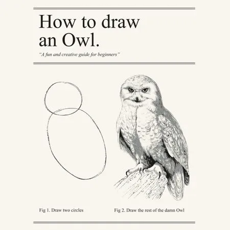
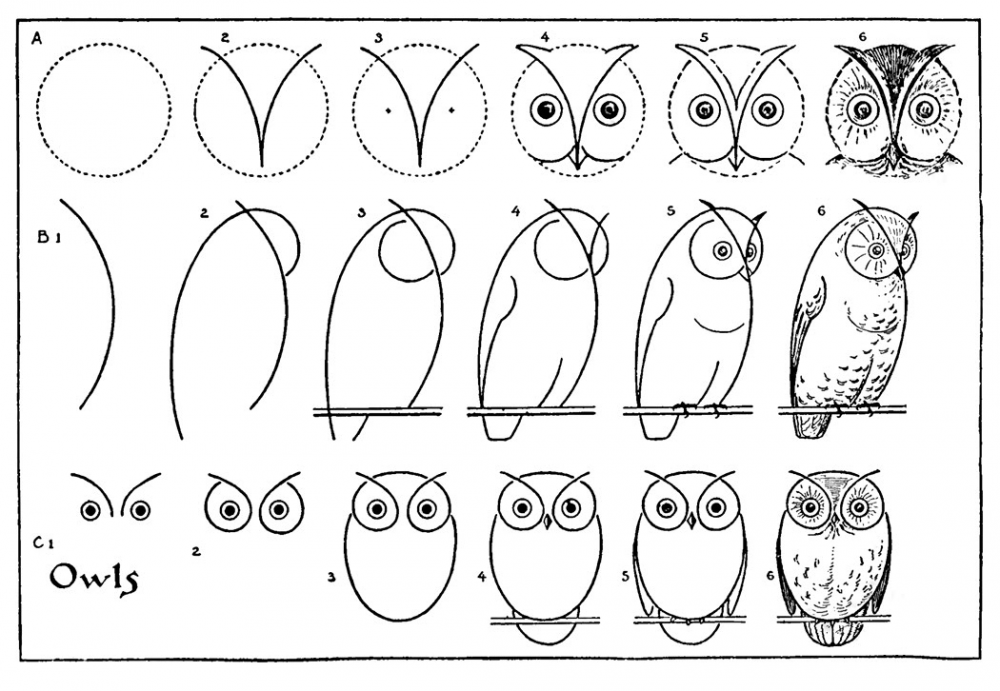

Some time ago, I listened to an enlightening episode of Scott Hanselman's podcast on how to teach computer science. The guest was Maria Naggaga - Senior Program Manager at Microsoft. Among others, she told about why in recent versions of .NET they insist on making it lighter and more straightforward. I highly recommend this episode not only to .NET programmers because it explains well how to look at the product we produce through the eyes of the user. You can listen it here: https://hanselminutes.com/797/new-ways-to-teach-computer-science-with-maria-naggaga.

By product, I mean not only the software we produce. Not only the UI on which the target user will work. I also mean our colleagues who will use the classes, API or architecture we have designed.

I think I told you this before, but I did architecture that I was very proud of. I thought it was a solid "enterprise" architecture. My perspective changed when, during one of the team-building meetings, a coworker told me that he did not understand anything about it at the beginning. But after a few months, when he understood it, it was great. Even though the intention was to compliment me, it was not the best thing I wanted to hear. I realised that upon reflection.

Unfortunately, our design often looks like the picture above. We throw a do-this-and-do-that a couple of times and then goes the rest. However, this is not an effective way to teach others about our architecture, API or product. We should enable users to learn about more advanced uses and concepts gradually. Until they need them, we should not force them to do so. Learning to draw a damned owl should look like this:

Development experience should not be optimised for edge cases or people doing something wrong. We often avoid simplifying code or architecture because we are afraid someone will abuse it. We require a much larger entry threshold from the user and understand everything simultaneously. We do not provide the appropriate default behaviour. Even on a microscale, we rarely think about giving the parameters of our methods meaningful default values.

Of course, we shouldn't prevent anyone from comfortably using advanced concepts or [living on the edge](https://www.youtube.com/watch?v=7nqcL0mjMjw). Yet, enabling advanced scenarios must not be at the expense of accessibility. We should not do this at the cost of users satisfied with the default behaviour. There are simple techniques to help with that, e.g. grouping advanced features into dedicated group/package/module/section. By doing that, we're not "poluting" our regular approach and still enable more advanced people to be efficient.

[Having decent documentation is always a good thing.](/pl/how_to_successfully_do_documentation_without_maintenance_burden/) Yet, it's not easy to create such, and even if we manage to have one, it's not easy to push people to use it. It's more effective to provide accessible API and document advanced cases than the other way round. Advanced people facing an edge case are usually much more motivated to find the solution for their use case. That's why optimising for accessibility is more sustainable in the long term.

Each step new users have to take to use your tool may be the last one. The single _"ah, you just have to do this"_ is no problem, but if we stack too many of them together, it won't be a satisfactory user experience.

Design should be like a joke. The more you need to explain it, the worse it gets.

Cheers!

Oskar

p.s. **Ukraine is still under brutal Russian invasion. A lot of Ukrainian people are hurt, without shelter and need help.** You can help in various ways, for instance, directly helping refugees, spreading awareness, putting pressure on your local government or companies. You can also support Ukraine by donating e.g. to [Red Cross](https://www.icrc.org/en/donate/ukraine), [Ukraine humanitarian organisation](https://savelife.in.ua/en/donate/). You may also consider joining [Tech for Ukraine](https://techtotherescue.org/tech/tech-for-ukraine) initiative.
