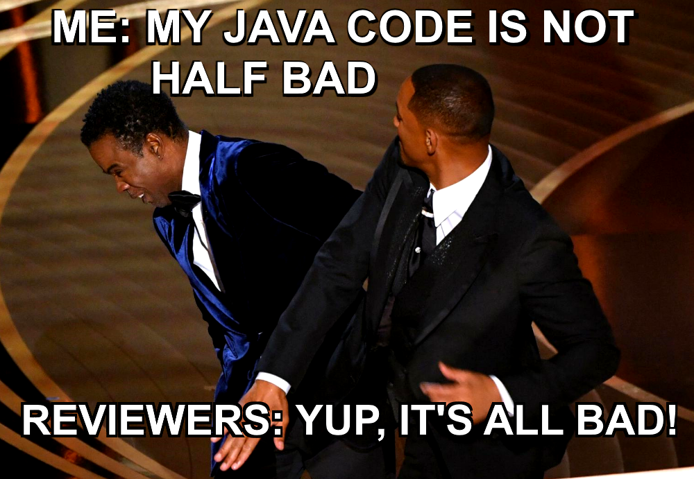

As I have mentioned to you many times, I like to test different approaches, technologies and solutions. I may not have told you yet that I once wanted to be a Java developer. I became a .NET developer only because I couldn't get any job as Java Developer. 
After long looking for a job, I was finally hired as a C# developer, and it stayed like that for a long time. I don't regret it, as .NET moved forward, C# language evolved a lot, and Java stagnated at some point. I'm talking about the language because the community, especially the OSS, has always been strong and vibrant. I have always envied the maturity of Java tools, especially those for "enterprise" and production-ready solutions. From time to time, I participated in Java projects (probably the longest in Android), now I also contributed to the [Java EventStoreDB client](https://github.com/EventStore/EventStoreDB-Client-Java). I recently checked how my Java skills held up and did an Event Sourcing example.  

I decided to port [my C# sample](https://github.com/oskardudycz/EventSourcing.NetCore/tree/main/Sample/EventStoreDB/Simple). My main assumptions were:
- explain the basics of Event Sourcing, both from the write model ([EventStoreDB](https://developers.eventstore.com/)) and read model part ([PostgreSQL](https://www.postgresql.org/) and [Spring Data JPA](https://spring.io/projects/spring-data-jpa)),
- present that you can join the classical approach with Event Sourcing without making a massive revolution,
- [CQRS](/pl/cqrs_facts_and_myths_explained/) architecture is sliced by business features, keeping code that changes together simultaneously. Read more in [How to slice the codebase effectively?](/pl/how_to_slice_the_codebase_effectively/).
- Composable functions for command handlers, events, projections, query handling, minimising the need for marker interfaces. Thanks to that testability and easier maintenance.

The presented use case is Shopping Cart flow and is modelled as Web API written in [Spring Boot](https://spring.io/projects/spring-boot) and [Java 17](https://www.oracle.com/java/technologies/downloads/).

After I finished the initial version (https://github.com/oskardudycz/EventSourcing.JVM/pull/1), I decided to ask the "community" for a review. I wanted to make sure that what I did, was not just a dumb port but the code that's idiomatic and similar to what typically is done in the Java World. That's especially important, as I was doing so far mostly infrastructure code in Java, and business-related may differ from it. I wanted to get sharp but honest feedback. 

Well, I got what I asked for!



Okay, it wasn't that bad, but it cost me "a bit" of work. And that's awesome, as my code and my skill improved by that!

**Let me share what I learned:**

1. In Java, the type Optional should only be used as the result of a method. It was created to reduce the _void_ type confusion. It should not be used as a parameter or input field for a method. It makes sense because generics in Java are basically templates that exist before compilation (https://www.baeldung.com/java-generics). After that they're just wiped out. See more about the initial _Optional_ type design at: https://nipafx.dev/design-java-optional/.

2. I've already used [sealed interfaces](https://openjdk.java.net/jeps/360) to get a sweet pattern matching when rebuilding the state from events. However, it turned out that they allow the full use of union types! Thanks to the suggestions, I went further and created this shopping cart definition: 

```java
sealed public interface ShoppingCart {
  UUID id();
  UUID clientId();
  ProductItems productItems();

  record PendingShoppingCart(
    UUID id,
    UUID clientId,
    ProductItems productItems
  ) implements ShoppingCart {
  }

  record ConfirmedShoppingCart(
    UUID id,
    UUID clientId,
    ProductItems productItems,
    LocalDateTime confirmedAt
  ) implements ShoppingCart {
  }

  record CanceledShoppingCart(
    UUID id,
    UUID clientId,
    ProductItems productItems,
    LocalDateTime canceledAt
  ) implements ShoppingCart {
  }

  enum Status {
    Pending,
    Confirmed,
    Cancelled;
  }

  default boolean isClosed() {
    return this instanceof ConfirmedShoppingCart || this instanceof CanceledShoppingCart;
  }

  default ShoppingCart.Status status() {
    return switch (this) {
      case PendingShoppingCart pendingShoppingCart:
        yield Status.Pending;
      case ConfirmedShoppingCart confirmedShoppingCart:
        yield Status.Confirmed;
      case CanceledShoppingCart canceledShoppingCart:
        yield Status.Cancelled;
    };
  }

  static ShoppingCart when(ShoppingCart current, ShoppingCartEvent
    event) {
    return switch (event) {
      case ShoppingCartOpened shoppingCartOpened:
        yield new PendingShoppingCart(
          shoppingCartOpened.shoppingCartId(),
          shoppingCartOpened.clientId(),
          ProductItems.empty()
        );
      case ProductItemAddedToShoppingCart productItemAddedToShoppingCart:
        yield new PendingShoppingCart(
          current.id(),
          current.clientId(),
          current.productItems().add(productItemAddedToShoppingCart.productItem())
        );
      case ProductItemRemovedFromShoppingCart productItemRemovedFromShoppingCart:
        yield new PendingShoppingCart(
          current.id(),
          current.clientId(),
          current.productItems().remove(productItemRemovedFromShoppingCart.productItem())
        );
      case ShoppingCartConfirmed shoppingCartConfirmed:
        yield new ConfirmedShoppingCart(
          current.id(),
          current.clientId(),
          current.productItems(),
          shoppingCartConfirmed.confirmedAt()
        );
      case ShoppingCartCanceled shoppingCartCanceled:
        yield new CanceledShoppingCart(
          current.id(),
          current.clientId(),
          current.productItems(),
          shoppingCartCanceled.canceledAt()
        );
      case null:
        throw new IllegalArgumentException("Event cannot be null!");
    };
  }
}
```

See full sample in [ShoppingCart.java](https://github.com/oskardudycz/EventSourcing.JVM/blob/main/samples/event-sourcing-esdb-simple/src/main/java/io/eventdriven/ecommerce/shoppingcarts/ShoppingCart.java). I miss such a possibility in C# because I believe that it enables concise and precise modelling of data structures.

3. I'm a big fan of slicing architecture into vertical pieces (read more [in my other article](/pl/how_to_slice_the_codebase_effectively/)). I also believe that composition = simplicity. [Nevertheless, "simplicity" means something different to each of us.](https://www.infoq.com/presentations/Simple-Made-Easy) Sometimes it is better to group smaller things to provide a more readable structure, such as the application service. Instead of going into many tiny slices, I decided to add [ShoppingCartService](https://github.com/oskardudycz/EventSourcing.JVM/blob/main/samples/event-sourcing-esdb-simple/src/main/java/io/eventdriven/ecommerce/shoppingcarts/ShoppingCartService.java) that shows what's possible to do with Shopping Cart. It made things clearer, especially for newcomers trying to understand my sample.

4. Spring Boot has a  built-in [ApplicationEventPublisher](https://reflectoring.io/spring-boot-application-events-explained/), so you don't need to build your event bus in memory. I had to go full circle and remove my "great" but totally redundant implementation. Remember: learn the tools before moving on to custom, custom implementations.

5. Java requires defining exceptions explicitly that our method can throw. However, there is no point in pushing up all possible exceptions. It is like being holier than the Pope. If you don't want to handle them in your code, it's better to make them runtime exceptions and catch them in a global mechanism. Read more about the breakdown of exceptions to checked/unchecked: https://baeldung-cn.com/java-checked-unchecked-exceptions.

6. The _ControllerAdvice_ and _ExceptionHandler_ annotations can be used to handle global exception handling. They enable automatic mapping of exceptions to HTTP statuses; see how I did that in [GlobalExceptionHandler.java](https://github.com/oskardudycz/EventSourcing.JVM/blob/main/samples/event-sourcing-esdb-simple/src/main/java/io/eventdriven/ecommerce/core/http/GlobalExceptionHandler.java).

7. Since I'm not a big fan of annotations/attributes/decorators, I manually register dependencies as Java Beans. I stand by my decision, but I think I have gone too far. It is better to compose stateless code than to delegate it to DI.

8. The reviewers also motivated me to finish what I started instead of postponing it to additional Pull Requests. For example, thanks to their comments, I came up with a nice test syntax for Given / When / Then API:

```java
@SpringBootTest(classes = ECommerceApplication.class,
  webEnvironment = SpringBootTest.WebEnvironment.RANDOM_PORT)
public class AddProductItemToShoppingCartTests extends ApiSpecification {
  public final UUID clientId = UUID.randomUUID();
  private UUID shoppingCartId;
  private ETag eTag;

  public AddProductItemToShoppingCartTests() {
    super("api/shopping-carts");
  }

  @BeforeEach
  public void openShoppingCart() {
    var result =
      ShoppingCartRestBuilder.of(restTemplate, port)
        .build(cart -> cart.withClientId(clientId));

    shoppingCartId = result.id();
    eTag = result.eTag();
  }

  @Test
  public void addProductItem_succeeds_forValidDataAndExistingShoppingCart() {
    given(() ->
      new AddProduct(new ProductItemRequest(
        UUID.randomUUID(),
        2
      )))
      .when(POST("%s/products".formatted(shoppingCartId), eTag))
      .then(OK);
  }

  @Test
  public void addProductItem_succeeds_forValidDataAndNonEmptyExistingShoppingCart() {
    var result =
      ShoppingCartRestBuilder.of(restTemplate, port)
        .build(cart -> cart
          .withClientId(clientId)
          .withProduct(new ProductItemRequest(UUID.randomUUID(), 10))
        );

    given(() ->
      new AddProduct(new ProductItemRequest(
        UUID.randomUUID(),
        2
      )))
      .when(POST("%s/products".formatted(result.id()), result.eTag()))
      .then(OK);
  }

  // (...)
}
```

Check more in:
- [ApiSpecification.java](https://github.com/oskardudycz/EventSourcing.JVM/blob/main/samples/event-sourcing-esdb-simple/src/test/java/io/eventdriven/ecommerce/testing/ApiSpecification.java),
- [AddProductItemToShoppingCartTests.java](https://github.com/oskardudycz/EventSourcing.JVM/blob/main/samples/event-sourcing-esdb-simple/src/test/java/io/eventdriven/ecommerce/api/controller/AddProductItemToShoppingCartTests.java).

I even got thrilled about how cool is that! I think that I'll port that to my C# samples.

9. Instead of manually blocking threads, waiting with _Thread.sleep_ to ensure the EventStoreDB subscription restarted, I found a spring Retry mechanism (https://docs.spring.io/spring-batch/docs/current/reference/html/retry.html). I used it to build a retry policy: [EventStoreDBSubscriptionToAll.java](https://github.com/oskardudycz/EventSourcing.JVM/blob/main/samples/event-sourcing-esdb-simple/src/main/java/io/eventdriven/ecommerce/core/subscriptions/EventStoreDBSubscriptionToAll.java#L63). Again, throwing away the handcrafted code helped me improve the solution.

10. I have also used Spring Boot Retry to implement [long-polling](/pl/long_polling_and_eventual_consistency/). It is a technique that allows us to simulate the synchronisation of the API with eventual consistency at the data recording level. The If-None-Match header (https://developer.mozilla.org/en-US/docs/Web/HTTP/Conditional_requests) can help with this. See more in an example: [ShoppingCartService.java](https://github.com/oskardudycz/EventSourcing.JVM/blob/main/samples/event-sourcing-esdb-simple/src/main/java/io/eventdriven/ecommerce/shoppingcarts/ShoppingCartService.java).

11. I also added Log4J instead of _System.out.println_ for logs. Yes, Log4J. By the way, I believe that the famous Log4J security issue was not a Log4J problem. The problem would not reach this scale if companies (especially big corporations) had an appropriate dependency management strategy. Anyone can be breached, primarily such a popular tool, but we must be prepared for it as architects.

12. I also added a Continuous Integration process using Docker images for EventStoreDB and Postgres to run end-to-end integration tests. [We don't live in caves anymore.](/pl/i_tested_on_production/) You can run tests on real databases. See more: [samples_event-sourcing-esdb-simple.yml](https://github.com/oskardudycz/EventSourcing.JVM/blob/main/.github/workflows/samples_event-sourcing-esdb-simple.yml).

Finally, some numbers:
- 143 comments in discussions in PR,
- 47 commits,
- I changed 80 files,
- 3906 lines of code.

It's been a long way! But it was worth it, and thanks to the community's help, I eventually came up with a much sounder solution. Plus, I was able to share with you what I have learned. I hope that it may save you some mistakes. You don't have to learn on your own constantly!

Cheers.

Oskar

p.s. **Ukraine is still under brutal Russian invasion. A lot of Ukrainian people are hurt, without shelter and need help.** You can help in various ways, for instance, directly helping refugees, spreading awareness, putting pressure on your local government or companies. You can also support Ukraine by donating e.g. to [Red Cross](https://www.icrc.org/en/donate/ukraine), [Ukraine humanitarian organisation](https://savelife.in.ua/en/donate/) or [donate Ambulances for Ukraine](https://www.gofundme.com/f/help-to-save-the-lives-of-civilians-in-a-war-zone).
