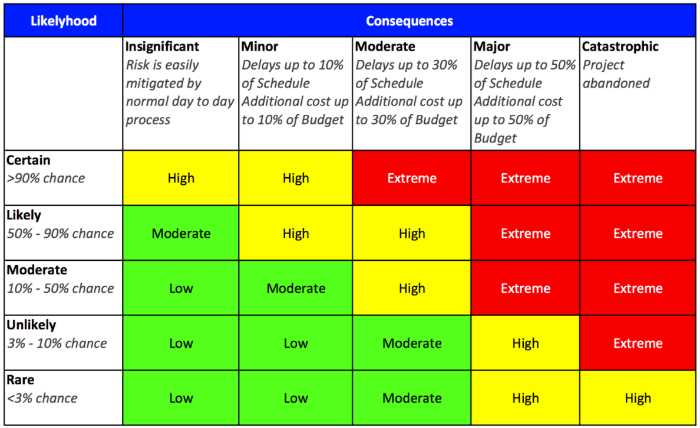

Do you like playing poker? I used to play Texas Holdem with my friends regularly. We took it easy; each person put 5 PLN into the pool, and the winner took everything. Yet, this staggering amount was enough to keep the players motivated. Of course, poker is a gamble. There is some randomness, but it is pure statistic applied in practice. If you want to play it well, it's not enough to bluff well or play with a good hand. You have to take risks. We have to analyze the probability that a given cards combination will appear on the table for every hand. When it turns out that the risk of loss is small enough, we enter. If it's too high, we fold. We can also check and see what will happen next.

**When working on design, I noticed that we often forget about risks and alternative solutions.** We are afraid to admit to others and ourselves that our solution is not perfect and that it could be made better. Our vision is so tunnelled that when we see the light, we're running towards it, forgetting that it may be a train coming from the other side.

Nothing irritates me more when someone comes to me with a solution and when I ask: _"What other alternatives did you consider?"_ I hear _"we did not evaluate others as this one is good enough."_. I react similarly when I hear _"we don't have time for that"_ to the suggestion of verifying another option. Why? Because it's usually just an excuse. It usually means that the _"solution"_ is not backed by analysis or experience. Usually, this is because someone is so focused on their way that they don't even want to check other possibilities. My way, or highway.

**Ignoring others' opinions, alternatives, and risks can end up badly.** The later the overlooked risk is fulfilled, the greater the cost is. If we use ADR (Architecture Decision Record - see my article: [How to successfully do documentation without a maintenance burden?](/pl/how_to_successfully_do_documentation_without_maintenance_burden/)), we should always describe the consequences of our decision. Even in the best decisions, the outcomes are seldom only positive. Moreover, we should accept that sometimes our proposals are rejected. It doesn't have to mean that they are wrong. They can be technically sound designs, but for various reasons (e.g. time, finances, team experience), they are not applicable at a given stage of the project. We gain essential knowledge if we precisely describe why we rejected a given decision. First of all, we have a clear message why we gave up on something. Secondly, we already have a subject that has been researched. It can help us return to it in a while and verify if our situation has changed. Maybe we should re-review it and accept it this time.

Similarly, we should describe precisely what stage of the project we are at and what decisions we make. **We should define the validity period for our decision.** For instance, we describe our assumptions as valid for a specific load, assuming that it's private and not public API. Why? We should not decide based on imaginary scenarios. We should base them on precise assumptions, considering we will have 100 requests per second. We can decide to design a solution that handles 1000 per second. If that comes without much additional effort, it's worth doing that to have a safety buffer. We could increase this solution to 10,000, but this would mean much more work. Having that, we chose a solution guaranteeing processing 1000 per second. And it's ok that we take the risk that if more than 1000 requests come, our server may fall because it is 10 times more than the assumed traffic. If it turns out that we got 10,000, then either:
- we made a mistake in the analysis,
- we ignored the increasing traffic and the validity of our solution,
- we have achieved spectacular success, and we have many more users than we could have imagined. This is a problem worth having.

Of course, we should think not only about risks related to technical design. Changes to the business domain or wrong problem definition can be a showstopper more often than a technical mishap. Read more in [Bring me problems, not solutions!](/pl/bring_me_problems_not_solutions/) and [When Agile is not enough](/pl/when_agile_is_not_enough/).

**The ["Risk Register"](https://monday.com/blog/project-management/risk-register/) can help us in such analysis.** Yes, it sounds pretty formalistic, it is popular in "stricter management methodologies", but who said that only agile methodologies can have reasonable ideas?

The risk register is a simple table. We write down all risks for our solution. We write the probability in the lines and the degree of risk in the columns. By multiplying these two data, we get a result that tells us how much we should focus on a given risk. If we find out that our risks are very probable and the consequences of their occurrence are severe, then it means that we have 2 and 7 in our hands, and it is better to fold. If the risk is unlikely with little consequence, we have two aces, and we can go all-in. Usually, however, it is somewhere in the middle. We should write down what we will do when the risk occurs (e.g. what we will do when we have 10,000 requests per second). 

Our math doesn't have to be super-precise, but rather a general plan that will allow us to act. Based on such an analysis, we can take actions that will reduce the likelihood or consequences of the risk occurring. The Risk Register should be continuously updated and evaluated. We should not expect it to be flawless. Once we see that we're close to the pessimistic scenario, we should take corrective actions or explore new ones.

Taking risks is ok as long as we are prepared for it. It's much easier if we have calculated the probability and the consequences that may await us. We should not be afraid of it or ashamed that our solution is not bulletproof. Nobody is. Even Achilles had a delicate heel. **If we accept that we may fail, our solutions will be much more resistant to error, and we will be better prepared for it.**

Cheers!

Oskar

p.s. **Ukraine is still under brutal Russian invasion. A lot of Ukrainian people are hurt, without shelter and need help.** You can help in various ways, for instance, directly helping refugees, spreading awareness, putting pressure on your local government or companies. You can also support Ukraine by donating e.g. to [Red Cross](https://www.icrc.org/en/donate/ukraine), [Ukraine humanitarian organisation](https://savelife.in.ua/en/donate/). You may also consider joining [Tech for Ukraine](https://techtotherescue.org/tech/tech-for-ukraine) initiative.
