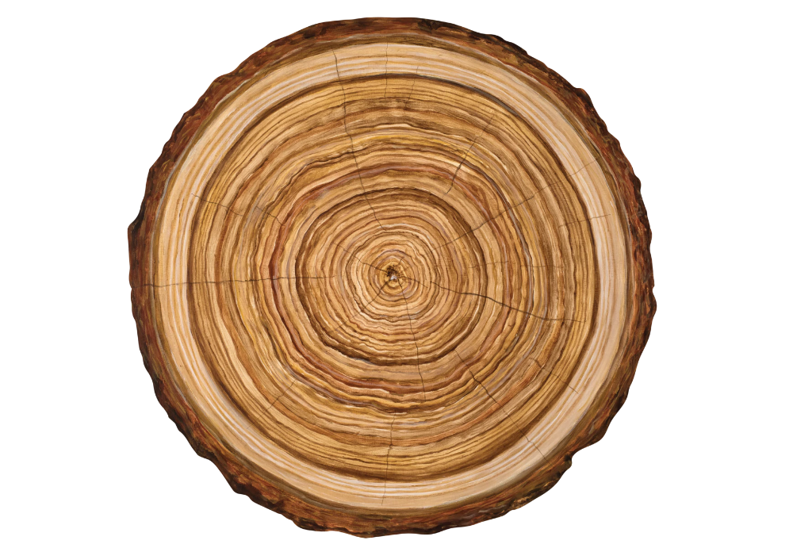

I've been asked recently at least a few times about _Temporal Tables_ and how they relate to Event Sourcing. Beware, and don't confuse it with _temporary tables_. They are not temporary, just time-related. They are a solution that can help you solve a few cases that Event Sourcing solves, but they're much different in the intended usage.

Temporal tables are automatically generated tables with the history of the state of the selected table. For example, you can tell the database that for "BankAccount" table should automatically generate a historical table. After each record modification (Insert, Update, Delete), this table will get a new record. This record will contain the current state. So we'll be getting a complete history of states for each record. Please do not mistake it with the delta, so information of what has changed. You won't know what has changed. You'll see just the series of states. 

That's nice for auditing and doing time travelling (so seeing the state of the specific record at a particular time). Usually, we have to generate such tables ourselves in the application logic, which is expensive both in terms of development and performance. With Temporal Tables, we're getting that out of the box. Tables and changes will be generated automatically.

Temporal Tables may sound similar to [Change Data Capture](https://en.wikipedia.org/wiki/Change_data_capture)? Indeed they are. We set them up for specific tables and get history. The difference is that we have much easier access to such tables through the application layer. We can, for example, create a query like this:

```sql
SELECT * FROM BankAccount AS OF SYSTEM TIME '2020-05-17 15:45:00' WHERE id = 3
```

Such a query will return the state of our record to that specific point in time. Therefore, we can go back in time and view the state of our records. So it's a bit of Event Sourcing.

But why just a bit? As you know, a single business operation can update multiple tables in the normalised relational database. We only get a history of the record state. That may be fine for basic audit purposes, but out of the box, it doesn't have business information and correlation to changes between tables. We can investigate changes for specific records with temporal tables, but we don't know the correlation and what caused them. To have a full audit, we should know what happened (i.e. the event) and what action (i.e. command, request) triggered the change. Only then we can assess whether someone who performed this operation was entitled to it. Temporal tables are just technical logs with a list of historical records. It's not keeping the business information. To get it, you'd need to correlate data from multiple temporal tables, make diffs and still guess what precisely has happened. Event stores usually can guarantee ordering in the context of the entire system, allowing to know the whole story.

What's more history of changes and audit log is just one piece of event sourcing. It's just an entry point. Event Sourcing enables Event-Driven Architecture. After having business events, we can use them to "glue" workflow steps and trigger other processes. We won't have it in temporal tables.

Nevertheless, temporal tables can be a pragmatic solution that will allow you to fulfil some scenarios, and it is undoubtedly less revolutionary than the introduction of Event Sourcing. It has already entered the _ISO SQL:2011_ standard; however, few databases have implemented it yet. MSSQL from version 2016, MariaDB, and Postgres has a plugin (but the last version was released in 2017).

More to read:
- MSSQL 2016 - https://docs.microsoft.com/en-us/sql/relational-databases/tables/temporal-tables?view=sql-server-ver15
- MariaDB - https://mariadb.com/kb/en/temporal-data-tables/
- https://wiki.postgresql.org/images/6/64/Fosdem20150130PostgresqlTemporal.pdf - Slides describing the general idea and, more specifically, how to introduce it in Postgres.
- https://pgxn.org/dist/temporal_tables/ - the mentioned Postgres plugin.
- https://www.youtube.com/watch?v=Pn4HjRlvQF - Dino Esposito's presentation on this topic.

Cheers!

Oskar

p.s. **Ukraine is still under brutal Russian invasion. A lot of Ukrainian people are hurt, without shelter and need help.** You can help in various ways, for instance, directly helping refugees, spreading awareness, putting pressure on your local government or companies. You can also support Ukraine by donating e.g. to [Red Cross](https://www.icrc.org/en/donate/ukraine), [Ukraine humanitarian organisation](https://savelife.in.ua/en/donate/). You may also consider joining [Tech for Ukraine](https://techtotherescue.org/tech/tech-for-ukraine) initiative.
