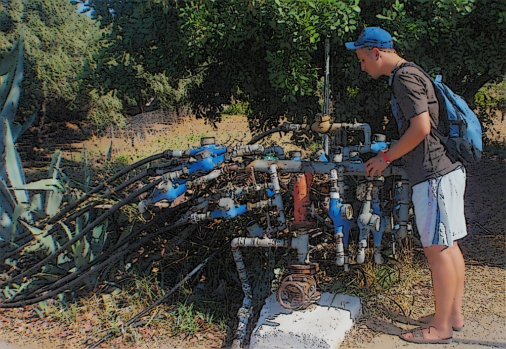

Today we will deal with event consumption. I'll also explain how I wrote the new version of the [MediatR](https://github.com/jbogard/MediatR) library. Curious? We'll get to that later on.

If you read my article [Integrating Marten with other systems](/en/integrating_Marten/), you should be already familiar with the concept of the subscriptions. If not, it works like the [Outbox Pattern](/en/outbox_inbox_patterns_and_delivery_guarantees_explained/). Stored events are then published asynchronously by a background process. We subscribe to incoming events notifications and consume them. This pattern also applies to other event-based systems, e.g .:
- [EventStoreDB Subscriptions](https://github.com/oskardudycz/EventSourcing.NetCore/blob/main/Core.EventStoreDB/Subscriptions/EventStoreDBSubscriptionToAll.cs),
- [Kafka Consumers](https://github.com/oskardudycz/EventSourcing.NetCore/blob/main/Core.Kafka/Consumers/KafkaConsumer.cs).

Okay, but what to do with those events? Typically, we update read models (more about it in [How to build event-driven projections with Entity Framework](https://event-driven.io/en/how_to_do_events_projections_with_entity_framework/)). We can also trigger a workflow. For example, the orders module can start processing the order by subscribing to a shopping cart confirmation event. After we start the process, we can store a follow-up _OrderIntiated_ event. The financial module can take it from there, and after getting the event, issue a proforma invoice. Then the payment and shipment processes can start accordingly.

A single event can often cause a chain reaction and trigger changes in many places.

How do we connect those workflows? It all depends on the guarantees we need in our system. Where I need the 100% delivery guarantee, I'm using an outbox pattern. If I can leave with the state being out of sync sometimes and [the risk is low](/en/the_risk_of_ignoring_risks/), then in-memory processing is acceptable. I often also join those two approaches.

Subscriptions are implementations of the outbox pattern. They have a built-in retry mechanism when the event handler fails. Therefore, usually, when I get an event from them, I send it to the internal, in-memory bus. Even if an exception is thrown, it will be retried anyway, so I lose nothing. I have to _only_ ensure that the service is idempotent.

The MediatR library is the basis for such implementations in .NET. It allows you to separate the logic related to the handling of the command or event, thus creating loosely related components. It all happens in memory.

MediatR broke into the world of .NET as the basis for the implementation of CQRS. I used it also. Some people love it; others hate it. It's indeed a straightforward tool to use and reduces boilerplate. The downside is that most people do not use its capabilities like pipelines and behaviours. Without them, it may be overkill, which will just blur the application flow. 
It might be an unnecessary overhead if we don't have more complex flows but just push events through it. It also forces _marker interfaces_ for message classes (_IRequest_ for the query or command, _INotification_ for events) and their handlers. It sometimes obscures the picture and makes it challenging to analyze the flow. And some magic related to dependency injection and reflection.

Some time ago, I was hooked by a colleague asking if MediatR could do more extensive event handling flows. It turned out that it couldn't. It can do this for command and query, but it's just broadcast for events.

We often need to make a more complex flow. For instance, having the _UserAdded_ event:

```csharp
public record UserAdded(
    string FirstName,
    string LastName,
    bool IsAdmin
);
```

We may want to create a pipeline that will at first filter admin users:

```csharp
public static bool IsAdmin(UserAdded @event) =>
    @event.IsAdmin;
```

Then map events to a dedicated _AdminAdded_ event:

```csharp
public record AdminAdded(
    string FirstName,
    string LastName
);

public static AdminAdded ToAdminAdded(UserAdded @event) =>
    new(@event.FirstName, @event.LastName);
```

Then handle mapped events storing information about new admins:

```csharp
public static void Handle(AdminAdded @event) =>
    GlobalAdmins.Add(@event);
```

And distribute global admins to all tenants:

```csharp
public static List<AdminGrantedInTenant> SendToTenants(UserAdded @event) =>
    TenantNames
        .Select(tenantName =>
            new AdminGrantedInTenant(@event.FirstName, @event.LastName, tenantName)
        )
        .ToList();

public record AdminGrantedInTenant(
    string FirstName,
    string LastName,
    string TenantName
);

public static void Handle(AdminGrantedInTenant @event) =>
    AdminsInTenants.Add(@event);
}
```

WithMediatR, doing something like this would be overwhelming. As an exercise, I decided to write my [EventBus](https://github.com/oskardudycz/EventSourcing.NetCore/blob/main/Sample/EventPipelines/EventPipelines/EventBus.cs), which would allow me to compose it as follows:

```csharp
serviceCollection
  .AddEventBus()
  .Filter<UserAdded>(AdminPipeline.IsAdmin)
  .Transform<UserAdded, AdminAdded>(AdminPipeline.ToAdminAdded)
  .Handle<AdminAdded>(AdminPipeline.Handle)
  .Transform<UserAdded, List<AdminGrantedInTenant>>(AdminPipeline.SendToTenants)
  .Handle<AdminGrantedInTenant>(AdminPipeline.Handle);
```

or without DI container:

```csharp
var builder = EventHandlersBuilder
  .Setup()
  .Filter<UserAdded>(AdminPipeline.IsAdmin)
  .Transform<UserAdded, AdminAdded>(AdminPipeline.ToAdminAdded)
  .Handle<AdminAdded>(AdminPipeline.Handle)
  .Transform<UserAdded, List<AdminGrantedInTenant>>(AdminPipeline.SendToTenants)
  .Handle<AdminGrantedInTenant>(AdminPipeline.Handle);

var eventBus = new EventBus(builder);
```

I have roughly achieved MedtiatR with superpowers for events. Additionally, the composition is sprinkled with syntactic sugar without the magic of reflection.

So far, it can:
- filter events,
- transform them,
- NOT requiring marker interfaces for events,
- NOT requiring marker interfaces for handlers,
- enables composition through regular functions,
- allows using interfaces and classes if you want to,
- can be used with Dependency Injection, but also without through builder,
- integrates with MediatR if you want to.

See the full sample in my [Event Sourcing in .NET](https://github.com/oskardudycz/EventSourcing.NetCore/blob/main/Sample/EventPipelines/EventPipelines/EventBus.cs) repository.

Cheers!

Oskar

p.s. if you liked this article, then check also similar:
- [How to register all CQRS handlers by convention](/en/how_to_register_all_mediatr_handlers_by_convention/)
- [CQRS is simpler than you think with .NET 6 and C# 10](/en/cqrs_is_simpler_than_you_think_with_net6/)

p.s.2. **Ukraine is still under brutal Russian invasion. A lot of Ukrainian people are hurt, without shelter and need help.** You can help in various ways, for instance, directly helping refugees, spreading awareness, putting pressure on your local government or companies. You can also support Ukraine by donating e.g. to [Red Cross](https://www.icrc.org/en/donate/ukraine), [Ukraine humanitarian organisation](https://savelife.in.ua/en/donate/) or [donate Ambulances for Ukraine](https://www.gofundme.com/f/help-to-save-the-lives-of-civilians-in-a-war-zone).
